# Token、Embedding 与 Transformer

> [!abstract] 本文回答什么
> 一个输入字符串怎样变成模型能够计算的向量，怎样经过 Decoder-only Transformer，最终得到下一个 token 的概率分布？

## 完整计算路径

```mermaid
flowchart LR
    A["输入字符串"] --> B["Tokenizer"]
    B --> C["Token IDs"]
    C --> D["Token Embedding"]
    D --> E["位置信息"]
    E --> F["Transformer Block × N"]
    F --> G["Final Norm"]
    G --> H["Vocabulary Projection"]
    H --> I["Logits"]
    I --> J["Softmax / Sampling"]
    J --> K["下一个 Token"]
```



模型在生成每个 token 时都重复这条路径。已经生成的 token 被追加到输入序列，模型再预测下一个位置。

## 1. Tokenizer：把字符串变成离散 ID

神经网络不能直接接收字符串。Tokenizer 使用固定词表把字符串切成 token，并将每个 token 映射为整数 ID：

$$
\text{Tokenizer}(x) = (t_1,t_2,\ldots,t_n), \qquad t_i \in \{1,\ldots,V\}
$$

- $x$ 是输入字符串。
- $n$ 是切分后的 token 数。
- $V$ 是词表大小。
- $t_i$ 只是词表索引，不是带语义的数字。

常见子词 tokenizer 会让高频字符串占较少 token，让罕见拼写、代码、数字串和噪声被拆得更细。模型看到的是 token 序列，不是人类自然划分的字或词。

> [!warning] Token 边界不是语义边界
> 一个 token 可能是一整个词、半个词、一个汉字、空格模式或代码片段。按 token 数切文档只解决长度问题，不保证事实、段落或权限边界完整。

对 Agent 的直接影响：context 限制、计费、延迟和 KV cache 都以 token 计；JSON、代码、OCR 噪声和多语言文本需要分别估算。

## 2. Embedding：把 ID 变成可学习向量

Embedding matrix 是一个可训练查找表：

$$
E \in \mathbb{R}^{V \times d}, \qquad x_i = E[t_i]
$$

- $V$ 是词表大小。
- $d$ 是模型隐藏维度。
- $E[t_i]$ 取出 token $t_i$ 对应的一行向量。
- $x_i \in \mathbb{R}^{d}$ 是送入网络的初始表示。

公式说明：token ID 本身没有“大小”意义；语义关系来自训练后 embedding 向量及后续层表示之间形成的几何结构。相似 token 的向量可能接近，但真正用于当前任务的含义会在每一层被 context 改写。

## 3. 位置：Attention 本身看不见顺序

如果不注入位置，attention 只看到一组向量，不能区分相同 token 的不同排列。位置机制使表示或 attention score 与 token 所在位置有关。

原始设计把位置向量直接加到 token embedding：

$$
h_i^{(0)} = x_i + p_i
$$

现代模型更常在 attention 的 query/key 上编码相对位置信息。具体演进见 [[02-modern-transformer-evolution#位置表示：从绝对位置到相对关系|位置表示的现代演进]]。

## 4. Decoder-only 与 Causal Mask

通用生成模型通常采用 Decoder-only 结构。第 $i$ 个位置只能读取位置 $1$ 到 $i$，不能读取未来 token：

$$
M_{ij}=\begin{cases}
0, & j \le i \\
-\infty, & j > i
\end{cases}
$$

把 $M$ 加到 attention score 后，未来位置经过 softmax 的概率变为 0。这称为 causal mask。

> [!info] 为什么要遮住未来
> 训练时整段文本可以并行送入模型，但每个位置必须只能用此前信息预测目标 token，否则模型会直接看到答案。推理时未来 token 本来就不存在。

## 5. Self-Attention：按当前需要读取其他位置

对输入表示矩阵 $X \in \mathbb{R}^{n \times d}$，先通过三个可训练线性变换得到：

$$
Q=XW_Q, \qquad K=XW_K, \qquad V=XW_V
$$

- $Q$（Query）：当前位置正在寻找什么信息。
- $K$（Key）：每个可见位置能以什么特征被匹配。
- $V$（Value）：匹配后实际聚合的内容表示。

Scaled Dot-Product Attention 为：

$$
\operatorname{Attention}(Q,K,V) = \operatorname{softmax}\left(\frac{QK^\top}{\sqrt{d_k}} + M\right)V
$$

准确直译这个公式：

1. $QK^\top$ 计算每个 query 与所有可见 key 的匹配分数。
2. 除以 $\sqrt{d_k}$，防止维度增大时点积幅度过大，使 softmax 过早饱和。
3. 加上 causal mask $M$，禁止读取未来位置。
4. softmax 把分数归一化为每一行和为 1 的权重。
5. 用这些权重对 $V$ 做加权求和，得到当前位置从 context 读取的表示。

Attention 能动态选择信息，但它不证明选择正确，也不保证长输入中的每项信息都被利用。

## 6. Multi-Head Attention：在多个投影空间读取信息

单个 attention 只在一组 $Q,K,V$ 投影中计算。Multi-Head Attention 并行计算多个 head：

$$
\operatorname{MHA}(X)=\operatorname{Concat}(head_1,\ldots,head_H)W_O
$$

$$
head_h=\operatorname{Attention}(XW_Q^{(h)},XW_K^{(h)},XW_V^{(h)})
$$

不同 head 可以形成不同的匹配与信息搬运方式，最后再组合。它增加表达能力，但 head 不是可独立调用的固定“语法专家”或“事实专家”。

## 7. FFN：对每个位置独立加工表示

Attention 在位置之间交换信息；FFN 对每个位置使用相同参数做非线性变换。原始形式是：

$$
\operatorname{FFN}(x)=W_2\sigma(W_1x+b_1)+b_2
$$

- $W_1$ 通常把隐藏维度 $d$ 扩展到更大的中间维度 $d_{ff}$。
- $\sigma$ 是非线性激活函数。
- $W_2$ 再投影回隐藏维度。

如果只有线性变换，多层仍可合并为一个线性变换；非线性使网络可以表示复杂函数。现代门控 FFN 和 MoE 见 [[02-modern-transformer-evolution#FFN：从普通前馈层到门控与 MoE|FFN 的现代演进]]。

## 8. 残差连接与归一化

一个简化的 Pre-Norm Transformer block 可以写成：

$$
u = h + \operatorname{Attention}(\operatorname{Norm}(h))
$$

$$
h' = u + \operatorname{FFN}(\operatorname{Norm}(u))
$$

- 残差连接让子层学习“在原表示上增加什么”，并为梯度提供直接路径。
- 归一化控制激活尺度，改善深层训练稳定性。
- 每层都重复 attention 的跨位置混合与 FFN 的逐位置加工。

堆叠 $N$ 层后，每个位置的表示已包含由多轮信息读取与变换形成的上下文特征。

## 9. 从隐藏表示到 Logits

最后一个位置的隐藏向量 $h_n$ 被投影到词表大小：

$$
z = W_{vocab}h_n + b, \qquad z \in \mathbb{R}^{V}
$$

$z_j$ 是 token $j$ 的 logit。Logit 是未归一化分数，不是概率。softmax 将其变成条件概率：

$$
p(t_{n+1}=j \mid t_{1:n})=\frac{e^{z_j}}{\sum_{k=1}^{V}e^{z_k}}
$$

公式说明：模型输出的是“在当前 context 下，下一个 token 为每个词表项的相对概率”。它没有直接输出事实真假、计划正确性或动作授权。

## 10. 自回归生成

完整序列的概率被分解为逐 token 条件概率的乘积：

$$
p(t_{1:T})=\prod_{i=1}^{T}p(t_i\mid t_{<i})
$$

每一步选择一个 token，追加到序列，再计算下一步。这个机制解释了：

- 输出天然是串行的，长输出有不可消除的逐 token 延迟。
- 早期生成错误会进入后续 context，并影响之后的预测。
- 模型优化的是合理延续的概率，不是外部世界的真实性。
- 对话、问答、写代码和工具调用都被统一表示为“生成特定 token 序列”。

## 11. 预训练目标的最小形式

训练时最常见目标是最小化目标 token 的负对数概率：

$$
\mathcal{L}_{NLL}=-\sum_{i=1}^{T}\log p_\theta(t_i\mid t_{<i})
$$

- $\theta$ 表示模型全部可训练参数。
- 如果模型给真实下一个 token 更高概率，loss 更小。
- 梯度下降反复更新参数，使模型更符合训练数据的序列分布。

为什么简单目标会形成复杂能力，见 [[04-from-data-to-base-model|从数据到基础模型]] 和 [[06-capabilities-and-their-origins|模型能力及其来源]]。

## 12. 原始主干与现代变化

截至 2026-07，通用生成模型的主干仍可用以下结构理解：

```text
Token / Modal Representations
→ 多层信息混合模块
→ 多层逐位置非线性模块
→ Vocabulary Projection
→ Autoregressive Generation
```

变化集中在：attention 怎样减少 KV 和长序列成本、FFN 怎样门控或稀疏激活、归一化与残差怎样稳定深层训练、位置怎样支持更长 context，以及部分层是否由状态空间或其他序列模块替代。核心自回归接口通常没有改变。

## 对 Agent 开发的直接含义

| 底层事实 | Agent 工程结论 |
|---|---|
| 模型处理 token，而不是语义对象 | chunking、tool schema 和数据边界必须由应用显式设计 |
| Attention 只在当前 context 内读取信息 | 最新、私有和任务状态必须在调用时提供或通过工具读取 |
| 输出是下一个 token 概率 | 流畅和具体不等于事实正确 |
| 生成是自回归过程 | 控制输出长度；重要任务使用短的可验证中间结果 |
| Tool call 也是 token 序列 | 参数必须经过 schema、权限和业务验证 |
| Context 中的错误会影响后续预测 | 工具结果、网页和检索材料必须带来源并作为不可信数据隔离 |

## 概念检查

- [ ] 能解释 token ID 与 embedding 向量的差别。
- [ ] 能逐项解释 attention 公式中的 $Q$、$K$、$V$、缩放和 mask。
- [ ] 能说明 attention 与 FFN 在 block 中分别负责什么。
- [ ] 能说明 logits 为什么不是概率。
- [ ] 能从自回归分解解释长输出延迟和错误累积。
- [ ] 不把“预测下一个 token”误解为“只会机械续写”。

## 继续阅读

- [[02-modern-transformer-evolution|现代 Transformer 的模块演进]]
- [[03-inference-context-and-efficiency|推理、Context 与效率]]
- [[04-from-data-to-base-model|从数据到基础模型]]
