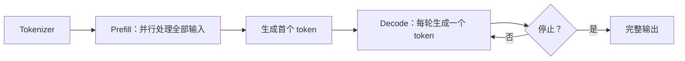

# 推理、Context 与效率

> [!abstract] 本文回答什么
> 训练完成的模型怎样处理一次请求？为什么输入阶段和生成阶段的瓶颈不同？Context、KV cache、采样、批处理、缓存、量化和推测解码分别改变了什么？

## 一次请求的三个阶段



1. **Tokenization**：把消息、工具定义、检索材料和历史变成 token。
2. **Prefill**：一次处理全部输入 token，建立各层 KV cache；并行度高，长输入时计算量大。
3. **Decode**：每轮只输入一个新 token，读取历史 KV 并生成下一个 token；计算规模较小但高度串行，常受内存带宽限制。

常见延迟指标：

- **TTFT（Time to First Token）**：从请求开始到首 token，受排队、输入长度和 prefill 影响。
- **TPOT（Time per Output Token）**：生成阶段每个 token 的时间。
- **End-to-End Latency**：TTFT 加全部输出 token 的 decode 时间。
- **Throughput**：服务在单位时间处理的输入或输出 token 数。

优化吞吐不一定降低单请求延迟；增加 batch 往往提高硬件利用率，却可能增加排队时间。

## KV Cache：避免重复计算历史表示

在 causal attention 中，新 token 的 query 要与所有历史 key/value 交互。历史 token 的 K/V 不会改变，因此可缓存起来。第 $t$ 步只计算新 token 的 $q_t,k_t,v_t$：

$$
y_t=\operatorname{softmax}\left(\frac{q_t[K_{1:t}]^\top}{\sqrt{d_k}}\right)V_{1:t}
$$

不使用 cache 时，每一步都要重新计算整个前缀；使用后只追加 $k_t,v_t$。代价是 cache 随序列长度、层数和并发增长。字节数可近似为：

$$
M_{KV}=2BLnH_{kv}d_hs
$$

- $B$：并发序列数。
- $L$：Transformer 层数。
- $n$：每个序列已缓存长度。
- $H_{kv}$：KV head 数。
- $d_h$：head 维度。
- $s$：每个元素的字节数。
- 2：key 与 value。

公式说明：长 context 与高并发会线性放大 KV 显存；GQA/MQA、低精度 cache、压缩或淘汰直接减少其中某些乘数。

## Context Window 到底是什么

Context window 是一次推理中模型能接收和生成的 token 总预算。它可能包含：

```text
系统指令 + 开发者指令 + 用户输入 + 对话历史
+ 工具定义 + 工具结果 + 检索材料 + 模型输出
```

它是有限的运行时工作区，不是：

- 模型训练后的参数知识；
- 自动跨请求保存的长期记忆；
- 可靠、均匀、可查询的数据库；
- 对所有位置同样有效的容量。

### 长 Context 的四个边界

1. **资源边界**：prefill attention、激活与 KV cache 随长度增长。
2. **位置边界**：位置编码和训练长度影响外推质量。
3. **利用边界**：模型可能忽略中间、低显著性或被噪声包围的信息。
4. **推理边界**：找到多个远距离事实并组合，比单点检索更难。

> [!warning] 最大窗口不是有效窗口
> “API 接受 $n$ 个 token”只证明输入格式被接受。检索召回、跨段关联、指令遵循和回答忠实度必须在目标长度和任务上分别评估。

## In-Context Learning 与 Memory

Context 中的任务说明和示例会改变条件概率：

$$
p(y\mid x) \longrightarrow p(y\mid x,\text{instructions},\text{examples})
$$

这称为 context conditioning 或 in-context learning。模型参数 $\theta$ 没有在调用中更新；示例只在当前输入可见时起作用。

可靠长期记忆需要外部流程：

```text
观察新信息
→ 判断是否值得保存
→ 结构化、去重、标注来源
→ 持久化
→ 在未来任务中检索
→ 重新放入 context
```

因此 memory 是应用功能，模型只参与抽取、检索选择或解释。

## Sampling：从概率分布选择输出

### Temperature

$$
p_i(T)=\frac{\exp(z_i/T)}{\sum_j\exp(z_j/T)}
$$

- $T<1$ 放大 logit 差距，分布更集中。
- $T>1$ 缩小差距，低概率 token 更容易被采样。
- 接近 0 时通常近似选择最大 logit，但并不创造事实保证或跨服务的位级确定性。

### Top-$k$ 与 Top-$p$

- Top-$k$ 只在概率最高的 $k$ 个 token 中采样。
- Top-$p$ 选择累计概率达到 $p$ 的最小 token 集合。

它们控制输出分布的尾部，不会修复模型没学到的知识、错误 context 或错误工具结果。

## 停止条件与输出预算

生成在遇到结束 token、stop sequence、最大输出长度或服务中断时停止。`max_tokens` 是预算上限，不是模型对任务完成度的理解。

Agent 中应区分：

- 模型生成停止；
- 当前步骤完成；
- 整个工作流完成；
- 外部动作成功。

四者需要不同的系统信号。

## Paged KV Cache 与 Continuous Batching

如果为每条请求预留最大连续 cache，会因实际长度不同产生内部和外部碎片。Paged KV cache 把逻辑序列映射到固定大小的物理块，使 cache 可以非连续分配和回收。

Continuous batching 不等待整个 batch 完成：完成的序列退出，新请求或新阶段插入。它提高硬件利用率，尤其适合每条请求输出长度不同的在线服务。

两者是 serving 机制，不改变模型权重或数学能力。它们主要影响并发、吞吐、排队和资源利用率。

## Prefix Cache 与 Prompt Cache

若多个请求共享完全相同的 token 前缀，可以复用已计算的 KV：

```text
相同系统指令 + 相同工具定义 + 相同文档前缀
→ 复用 prefill 结果
→ 只计算不同后缀
```

缓存命中通常要求 token 序列、模型版本及相关执行配置匹配。把动态内容放在共享前缀前部会降低命中率。缓存降低计算和 TTFT，但不会使旧信息自动更新。

## 量化：用更低精度表示数值

将浮点权重 $w$ 映射到低位整数 $q$ 的简化形式是：

$$
q=\operatorname{clip}\left(\operatorname{round}\left(\frac{w}{s}\right)+z\right)
$$

$$
\hat{w}=s(q-z)
$$

- $s$ 是缩放因子，$z$ 是零点。
- $\hat{w}$ 是计算时恢复的近似值。
- 位宽越低，存储与带宽越小，但量化误差通常越大。

可量化的对象包括权重、激活和 KV cache。它主要降低存储、带宽和成本；是否影响任务质量取决于位宽、校准、算子、模型和任务，不能仅凭“低比特”下结论。

## Speculative Decoding：一次验证多个候选 Token

自回归生成的瓶颈是目标模型每轮只确认一个 token。推测解码先由便宜的 draft 过程提出多个候选，再由目标模型并行验证。

若使用正确的接受/拒绝校正，可保持目标模型原分布不变。它加速的是采样过程，不是让目标模型获得新能力。收益取决于：

- draft 候选与目标模型的一致程度；
- 一次提出多少 token；
- 目标硬件与 batch；
- 验证开销；
- 输出分布的可预测性。

## Inference-Time Compute：用额外计算提高成功率

另一类“推理优化”不是提速，而是花更多计算：

- 生成多个候选再选择；
- 分步搜索、回溯或树搜索；
- 调用验证器检查答案；
- 对可验证问题执行代码或测试；
- 使用不同策略反复尝试。

若单次成功概率为 $p$，独立生成 $N$ 个候选且只要一个正确的理论概率是：

$$
P(\text{至少一个正确})=1-(1-p)^N
$$

但实际候选并不独立，而且系统还必须识别哪个正确。没有可靠 verifier 时，多采样可能只产生多个相似错误。

## 三类技术不要混淆

| 类别 | 例子 | 改变什么 |
|---|---|---|
| 模型架构 | GQA、MoE、局部 attention、状态空间层 | 模型的参数化计算 |
| 等价或近似执行优化 | fused attention、paged cache、batching、量化、推测解码 | 相同或近似模型的运行效率 |
| 推理时计算扩展 | 多候选、搜索、验证、工具执行 | 用更多运行时计算提高任务成功率 |

## Agent 的 Context 组织原则

1. 先定义任务真正需要的事实，再检索；不要把最大窗口填满当成目标。
2. 系统规则、用户请求、外部数据和 tool result 使用明确边界。
3. 对长工具返回先筛选和结构化，保留来源与可回查 ID。
4. 持久化真实 state；模型摘要只作为可丢弃的 context 压缩。
5. 对关键事实位于开头、中间、末尾、冲突位置的情况做 eval。
6. 同时测量质量、TTFT、TPOT、吞吐、token 与成本。

## 概念检查

- [ ] 能解释 prefill 与 decode 的不同瓶颈。
- [ ] 能从 KV cache 公式指出长 context、高并发和 KV head 的影响。
- [ ] 能区分 context、参数知识、memory 和 state。
- [ ] 能解释 temperature 为何不是“创造力按钮”或真实性控制。
- [ ] 能说明 prefix cache、continuous batching 和 speculative decoding 不会增加模型知识。
- [ ] 能解释为什么 inference-time scaling 需要可靠 verifier。

## 继续阅读

- [[04-from-data-to-base-model|从数据到基础模型]]
- [[07-limitations-and-failure-mechanisms|能力边界与失败机制]]
- [[08-using-assistant-models-in-agents|在 Agent 中正确使用 Assistant Model]]
