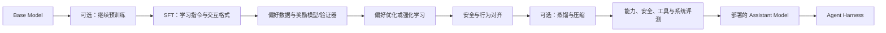

# 从基础模型到 Assistant Model

> [!abstract] 本文回答什么
> Base Model 怎样经过继续训练、指令微调、偏好与强化学习、安全训练、蒸馏和评测，变成 Agent API 中通常使用的 Assistant Model？每一步改变了什么，又不能保证什么？

## 先看完整流程



实际生产可能交错、重复或合并这些阶段。这个流程图表达的是各类训练信号的作用，不是所有团队都必须遵循的唯一配方。

## 1. 继续预训练：先改变知识和领域分布

在 Base Model 上继续使用 next-token objective 训练，可以让模型更多接触某种语言、领域、时段或更长序列。目标仍近似为：

$$
\mathcal{L}_{CPT}=-\sum_i\log p_\theta(t_i\mid t_{<i})
$$

它主要改变模型熟悉的数据分布和底层表示，不直接教会模型如何回答用户。风险包括：

- 领域数据覆盖过窄导致其他能力退化；
- 新旧知识冲突；
- 低质量数据被强化；
- 训练格式与真实使用格式不一致。

因此“补充知识”既可能通过继续预训练完成，也可能更适合在运行时通过 retrieval/tool 提供；两者改变的层次不同。

## 2. SFT：学习 Assistant 的输入输出行为

Supervised Fine-Tuning 使用示范样本：

```text
system / developer / user messages
→ 理想 assistant response 或 tool call
```

只对 assistant 目标 token 计算 loss 的简化形式为：

$$
\mathcal{L}_{SFT}=-\sum_{i\in\mathcal{A}}\log p_\theta(y_i\mid x,y_{<i})
$$

- $x$ 是指令、上下文和工具描述。
- $y$ 是理想 assistant 输出。
- $\mathcal{A}$ 是需要学习的 assistant token 位置。

SFT 让模型学会：

- 把不同消息角色当成不同条件；
- 直接回答而不是任意续写；
- 遵循常见指令和格式；
- 在示例覆盖范围内调用工具；
- 使用特定风格、拒绝方式或推理接口。

它本质上仍是模仿训练。如果示范存在偏差、格式捷径或错误事实，模型也会模仿。

## 3. 偏好数据：比较“哪个回答更好”

很多任务不存在唯一标准文本。偏好数据通常包含同一输入下的多个回答与相对选择：

$$
(x,y^+,y^-)
$$

$y^+$ 是更偏好的回答，$y^-$ 是较差回答。偏好可能由人类、规则、另一个模型、执行结果或可验证答案产生。

偏好数据编码的不只是“质量”，还可能混合：帮助性、安全性、简洁性、风格、事实引用、格式、任务成功率等。目标定义若含糊，训练后模型可能学会表面特征，例如更长、更自信或更像评分 rubric 的回答。

## 4. Reward Model：把偏好估计为分数

经典做法训练奖励模型 $r_\phi(x,y)$，让偏好回答得分更高。成对概率可写为：

$$
P(y^+\succ y^-\mid x)=\sigma\left(r_\phi(x,y^+)-r_\phi(x,y^-)\right)
$$

公式说明：奖励模型学习相对排序，不直接证明回答真实。它只是训练数据中偏好判断的可学习近似。覆盖不足或可被利用的 reward 会导致模型优化代理指标而不是实际目标，即 reward hacking。

## 5. RLHF：直接提高高奖励输出的概率

经典 RLHF 流程是：SFT 模型生成回答，Reward Model 评分，强化学习更新策略。一个抽象目标为：

$$
\max_\theta\;\mathbb{E}_{y\sim\pi_\theta(\cdot\mid x)}[r(x,y)]
-\beta D_{KL}\left(\pi_\theta(\cdot\mid x)\|\pi_{ref}(\cdot\mid x)\right)
$$

- 第一项提高高 reward 回答的概率。
- KL 项限制新策略不要偏离参考模型过远。
- $\beta$ 控制追求 reward 与保持原行为之间的权衡。

RLHF 可以优化难以写成固定示范的整体偏好，但训练复杂，且最终质量受 reward 的正确性与覆盖决定。

## 6. 直接偏好优化：不用显式在线 RL 也能学习偏好

一类方法直接提高 chosen 相对 rejected 的对数概率优势。DPO 的核心形式可写为：

$$
\mathcal{L}_{DPO}=-\log\sigma\left(\beta\left[\log\frac{\pi_\theta(y^+\mid x)}{\pi_{ref}(y^+\mid x)}-\log\frac{\pi_\theta(y^-\mid x)}{\pi_{ref}(y^-\mid x)}\right]\right)
$$

它使模型相对于参考策略更偏向 $y^+$，减少显式训练 reward model 和在线采样的管线复杂度。

其他偏好目标可能：

- 使用单个回答的“好/坏”反馈，而非严格成对样本；
- 省略显式参考模型并加入 margin；
- 改变长度归一化或参考约束；
- 混合 SFT 与偏好 loss。

> [!warning] 不要把算法缩写当作质量等级
> 偏好目标只是把训练信号转成参数更新的方法。数据如何产生、偏好定义、采样覆盖、安全目标和最终 eval 通常比方法名称更重要。

## 7. 可验证奖励：让结果反馈参与训练

数学、代码、结构化约束和部分工具任务可以使用自动 verifier：

```text
生成候选
→ 执行测试、计算答案或检查约束
→ 得到 reward
→ 提高成功轨迹的概率
```

组内相对方法会对同一问题采样多个回答，用组内平均 reward 构造相对优势。简化写法：

$$
A_i=\frac{r_i-\operatorname{mean}(r_1,\ldots,r_G)}{\operatorname{std}(r_1,\ldots,r_G)+\epsilon}
$$

高于组内平均的样本获得正优势，低于平均的获得负优势。可验证 reward 比主观偏好更明确，但仍只保证 verifier 检查的部分。测试不完整、规则有漏洞或只看最终答案，都会留下可钻的空子。

## 8. 过程监督与结果监督

- **结果监督**：只判断最终答案或任务是否成功。容易获得，但不能指出中间哪一步错。
- **过程监督**：对中间步骤、工具选择或状态转移提供反馈。信号更细，但标注和定义更困难。

对 Agent 来说，最终答案正确但使用了未授权工具、错误参数或不可复现轨迹，仍可能是系统失败。因此部署评测往往需要同时看结果与轨迹。

## 9. 安全与行为对齐

安全后训练通过示范、偏好、分类器、规则反馈、对抗数据和红队样本提高以下行为概率：

- 识别并拒绝不允许的请求；
- 对允许但敏感的请求给出安全边界；
- 保护隐私和凭据；
- 不服从数据中的恶意指令；
- 在高风险或证据不足时请求确认或人工处理。

它形成的是模型倾向，不是强制 policy：

- 攻击者可以改变措辞、语言和 context；
- 模型可能漏拒危险请求，也可能误拒正常请求；
- 长 context 会稀释信号；
- 工具权限在模型之外。

真正的访问控制、数据隔离和动作授权必须由 Agent 系统实施。

## 10. Tool-Use 与 Structured Output 训练

模型可以通过示范和反馈学习生成：

```json
{
  "name": "tool_name",
  "arguments": {"field": "value"}
}
```

训练可以提高工具选择、参数填充、结果解释和多步调用能力。约束解码还可以在生成时限制语法。它们仍不能保证：

- 工具存在且当前可用；
- 用户有权限；
- 参数符合业务规则；
- 工具返回真实或安全；
- 模型正确理解了执行结果。

这些是 [[08-using-assistant-models-in-agents|Agent Harness]] 的职责。

## 11. 蒸馏与压缩

较强 teacher 可以生成答案、偏好、推理轨迹或 soft probability targets，训练较小 student 模型。Soft target 蒸馏可写为：

$$
\mathcal{L}_{KD}=T^2,D_{KL}\left(p_{teacher}^{(T)}|p_{student}^{(T)}\right)
$$

其中温度 $T$ 让概率分布更平滑，student 学习 teacher 对非目标 token 的相对判断。蒸馏的目标是以更小模型、更低延迟或专门能力复现 teacher 的部分行为。

它不会无损复制全部能力，也可能继承 teacher 的错误和偏差。

## 12. 评测与发布门槛

后训练后至少需要评估：

| 维度 | 问题 |
|---|---|
| 通用能力 | 后训练是否损伤基础语言、知识、代码和推理能力？ |
| 指令遵循 | 是否正确理解角色、约束和输出要求？ |
| 工具使用 | 是否选择正确工具、填对参数并处理失败？ |
| 事实与校准 | 是否引用证据、承认未知、避免虚构？ |
| 安全 | 危险请求漏拒和正常请求误拒分别如何？ |
| 鲁棒性 | 改写、长 context、多语言和对抗输入下是否稳定？ |
| 效率 | 延迟、token、内存、吞吐和成本是否可接受？ |

发布还涉及模型快照、系统模板、tokenizer、推理参数、工具协议和安全过滤。开发者通过 API 使用的“模型”往往是这一整套部署配置，而不只是权重文件。

## 13. 最终得到的 Assistant Model

Assistant Model 是一个输出分布经过后训练重塑的生成模型。与 Base Model 相比，它通常更倾向于：

- 识别并服从消息中的任务；
- 直接回答、澄清或拒绝；
- 生成规定格式；
- 选择和调用工具；
- 使用更多推理 token 或自检行为；
- 表达帮助性与安全性。

它仍然是概率模型，没有自动获得：

- 真实世界的实时访问；
- 可验证的长期记忆；
- 工具执行权；
- 确定性的权限和业务规则；
- 对自己答案的可靠真实性判定。

> [!important] 没有天然的“Agent Model”
> Agent 常使用适合指令、推理和工具调用的 Assistant Model。真正让它成为 Agent 的，是外部 Harness 提供的观察、工具、状态、循环、权限、验证与停止条件。

## 对 Agent 开发的含义

1. 后训练提高行为概率，不构成系统保证。
2. 模型版本升级可能改变拒绝、格式、工具选择和推理习惯，必须回归测试。
3. 工具描述、消息格式和 schema 应与模型后训练接口相匹配。
4. 不应让安全对齐替代服务端 authorization 与 policy。
5. 模型声称“我不能”“我已经”“我记得”都是生成内容，需要按系统事实解释。

## 概念检查

- [ ] 能说清继续预训练与 SFT 的目标差别。
- [ ] 能解释偏好数据、Reward Model、RLHF 与直接偏好优化的关系。
- [ ] 能说明 verifier reward 只保证验证器覆盖的目标。
- [ ] 能解释安全对齐为什么不能替代权限系统。
- [ ] 能准确区分 Assistant Model、Agent Harness 和 Agent Application。

## 继续阅读

- [[06-capabilities-and-their-origins|模型能力及其来源]]
- [[07-limitations-and-failure-mechanisms|能力边界与失败机制]]
- [[08-using-assistant-models-in-agents|在 Agent 中正确使用 Assistant Model]]
