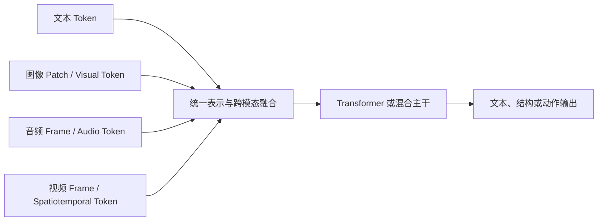

# 多模态大模型专项

> [!abstract] 本文回答什么
> 图像、音频和视频怎样变成模型可以处理的表示？多模态模型与前文的语言模型是什么关系？融合、训练和时序机制新增了哪些能力，也新增了哪些观察与证据边界？

## 统一认知：不是两类互不相关的模型

现代多模态模型仍可用“条件生成”理解：

$$
p(y\mid x_{text},x_{image},x_{audio},x_{video})
$$

差别在于非文本输入不能直接使用文本 tokenizer，必须先经过采样、切片、编码和对齐，变成主模型能够混合的表示。



多模态不是把文本、图像、音频和视频无损塞进模型。每种模态都先经过信息选择与压缩；模型只能基于实际传入的表示推理。

## 1. 图像：从像素到 Patch Token

给定高 $H$、宽 $W$、通道数 $C$ 的图像，将其切成 $P\times P$ patch，token 数近似为：

$$
N_{patch}=\frac{HW}{P^2}
$$

每个 patch 展平后线性投影：

$$
z_i=x_iW_E+b_E
$$

- patch 越小，空间细节更充分，但 visual token 和 attention 成本更高。
- patch 越大，成本更低，但小字、细小物体和局部关系更容易丢失。
- 实际系统可能使用卷积 stem、层级编码、动态分辨率或 token merging，而不固定为简单网格。

视觉编码器通过多层计算形成带上下文的视觉表示。它输出的不是自然语言含义，而是供后续对齐和融合使用的向量。

## 2. 图文对齐：让两种表示建立可比较关系

对比学习使用匹配图文对 $(v_i,t_i)$，提高正确配对相似度，降低错误配对。一个方向的 loss 可写为：

$$
\mathcal{L}_{v\to t}=-\frac{1}{N}\sum_i\log\frac{\exp(\operatorname{sim}(v_i,t_i)/\tau)}{\sum_j\exp(\operatorname{sim}(v_i,t_j)/\tau)}
$$

- $v_i$ 是图像表示，$t_i$ 是文本表示。
- $\operatorname{sim}$ 常为归一化向量的余弦相似度。
- $\tau$ 控制分布锐度。

公式说明：模型学习把匹配图文拉近、非匹配图文推远。这适合检索和通用视觉语义，但只学习到训练配对覆盖的概念关系，不等于精确 OCR、计数或空间推理。

## 3. 视觉表示怎样接入语言模型

### Projector

最直接方式是把视觉编码器输出投影到语言模型隐藏维度：

$$
Z_{visual}=f_{proj}(E_{vision}(I))
$$

再把 $Z_{visual}$ 当作一段特殊 token 与文本序列共同处理。Projector 可以是线性层或小型网络。

### Cross-Attention

语言 hidden state 作为 query，视觉表示作为 key/value：

$$
\operatorname{CrossAttn}(H,Z)=\operatorname{softmax}\left(\frac{(HW_Q)(ZW_K)^\top}{\sqrt{d_k}}\right)ZW_V
$$

这让语言层在需要时读取视觉特征，而不必把全部视觉 token 与文本完全拼接。

### Query / Resampler / Token Compression

使用固定或较少 query 从大量视觉特征中聚合信息：

$$
Z_{compact}=\operatorname{Attention}(Q_{learned},K_{visual},V_{visual})
$$

它控制送入主模型的 token 数，但压缩必然要求选择哪些视觉信息被保留。

## 4. Early、Intermediate 与 Late Fusion

| 路线 | 做法 | 优势 | 限制 |
|---|---|---|---|
| Early fusion | 各模态 token 尽早进入统一序列 | 深层跨模态交互 | 序列长、计算大、模态比例难平衡 |
| Intermediate fusion | 独立编码后在部分层 cross-attention 或融合 | 保留专用编码器并控制成本 | 接口和训练更复杂 |
| Late fusion | 各模态独立得到结果，最后组合 | 模块清楚、易替换和审计 | 难以进行细粒度联合推理 |

“原生多模态”通常表示训练和主干中更统一地处理模态，而不是保证所有原始信息无损共享。模块化管线在需要专门 OCR、ASR、检测、时序定位和可审计证据时仍然重要。

## 5. 多模态训练怎样进行

常见训练信号包括：

- 图文、音文或视频文本的对比学习；
- 基于视觉/音频条件的文本生成；
- 遮挡 patch、frame 或 token 的重建；
- 跨模态匹配和排序；
- 指令问答与多轮对话；
- 时间定位、检测、OCR、ASR 等专门任务；
- 偏好与安全后训练。

多阶段训练通常先建立模态表示与对齐，再学习统一生成和 Assistant 行为。训练数据的 caption 粒度、时间标注、语言覆盖和偏差会决定模型擅长描述什么。

## 6. 音频：语音、事件和声学特征不是一回事

波形通常被切成短帧并转换为频谱特征或 learned audio token。语音信息可通过 ASR 转成文本，也可由音频编码器直接表示。

需要区分：

- **ASR**：说了什么；
- **Speaker diarization**：谁在何时说；
- **Paralinguistic cues**：语速、语调、情绪等；
- **Audio event detection**：音乐、撞击、警报、环境声；
- **Source separation**：重叠声音来自什么源。

仅有字幕无法恢复环境声、停顿和说话人；仅有音频表示也不保证精确文字。可靠系统应按任务保留多种证据。

## 7. 视频：空间建模加时间建模

视频可视作帧序列 $I_1,\ldots,I_T$。如果每帧产生 $N_p$ 个 visual token，未压缩 token 数近似：

$$
N_{video}=T N_p
$$

原始视频帧数巨大，因此现实系统必须在以下位置压缩：

- 降低 FPS；
- 选择关键帧或镜头；
- 降低分辨率；
- 使用时空 patch；
- 合并相似 token；
- 分层处理 clip 与全局摘要；
- 先检索候选时间段再精读。

成本下降来自少观察或压缩，因此会影响快速事件、小物体、文字和精确时间。

## 8. 时间信息怎样进入模型

视频不仅需要帧内空间位置，也需要帧间时间顺序。常见路线包括：

- 空间 attention 与时间 attention 分解；
- 联合时空 attention；
- 3D patch 或 tubelet；
- 时间位置编码；
- 局部 clip 编码加全局记忆；
- 状态空间或递归压缩。

一个事件“杯子掉下去”需要顺序关系：杯子原来在桌上，随后运动，最后在地面。把若干静态帧独立 caption 后拼接，可能漏掉动作方向、因果和持续时间。

## 9. 采样决定可观察上限

若事件持续时间为 $\delta$，固定采样间隔为 $\Delta$，当 $\delta<\Delta$ 时，事件可能落在两次采样之间而完全不可见。

因此：

```text
模型没有报告事件
≠ 事件没有发生
可能是采样未观察到
```

视频任务必须区分：

- `not_observed`：采样没有覆盖到足够证据；
- `insufficient_evidence`：有候选，但画质、遮挡或冲突导致无法确认；
- `confirmed_negative`：在满足任务规定覆盖后，证据支持未发生。

## 10. 统一时间轴与证据定位

视频系统可能同时存在：

- 容器时间戳；
- presentation timestamp（PTS）；
- 帧号；
- clip 内相对时间；
- ASR word timestamp；
- OCR 与检测轨迹时间。

必须转换到统一时间基准，并保留原始映射。否则模型给出的“第 35 秒”可能因抽帧、剪辑或 variable frame rate 产生漂移。

可靠事件至少保存：

```json
{
  "source_id": "video-1",
  "start_ms": 35000,
  "end_ms": 38200,
  "modalities": ["frames", "asr"],
  "evidence_refs": ["frame-721", "asr-segment-18"],
  "status": "insufficient_evidence"
}
```

## 11. OCR、ASR 与画面是互补证据

| 模态 | 擅长 | 典型失败 |
|---|---|---|
| 画面 | 对象、场景、动作、空间关系 | 小物体、遮挡、低光、细文字 |
| OCR | 屏幕、标牌、字幕中的文字 | 模糊、旋转、花体、短暂出现 |
| ASR | 语音内容与时间 | 噪声、口音、重叠语音 |
| 音频事件 | 非语言声音 | 相似声源、背景混合 |
| 元数据 | 时间、编码、来源 | 缺失、错误或被篡改 |

多模态融合不应静默抹平冲突。字幕与语音不一致、画面与旁白矛盾时，应保留来源并按任务规则判断或升级。

## 12. 多模态特有的 Prompt Injection

图片文字、视频帧、音频转写和文档布局都可能包含面向模型的恶意指令。它们在语义上可被模型理解，但在权限上只是用户或外部数据。

防护原则与文本一致：

- 数据不能升级为系统指令；
- 最小化可用工具与可见敏感信息；
- 工具参数与权限使用可信 state；
- OCR/ASR 原文保留来源；
- 对间接注入建立专项 eval；
- 高风险动作经过独立门控。

## 13. 多模态能力边界

- **观察覆盖**：未采样、未裁剪、未解析的内容等于模型没看见。
- **分辨率**：视觉 token 预算限制小字和小物体。
- **计数**：重复帧、遮挡和跟踪断裂会导致重复或漏计。
- **时间定位**：描述正确不等于时间戳精确。
- **身份一致性**：跨镜头人物或对象匹配需要跟踪与证据。
- **因果判断**：时间先后和相关性不自动证明因果。
- **跨模态冲突**：模型可能选择更显著但不更可信的模态。
- **生成幻觉**：即使视觉证据不足，语言解码器仍可能补全常见场景。

## 14. 面向多模态 Agent 的可审计流程


模型负责综合“这些证据意味着什么”；程序负责时间换算、去重计数、权限、状态、证据引用和真实执行。

## 15. 评测不能只看最终文字

多模态 eval 至少追踪：

- 图像/片段级召回与误报；
- 时间定位误差；
- 计数误差；
- OCR/ASR 错误与跨模态冲突处理；
- 采样覆盖和 `not_observed` 使用；
- 证据可回查率；
- 模型结论被人工推翻率；
- 端到端延迟、visual token 和处理成本；
- 注入、权限和隐私风险。

版本化的不只是 prompt，还包括解码器、FPS、分辨率、切片、OCR/ASR、视觉编码器、时间换算和 tool schema。

## 概念检查

- [ ] 能解释 image patch 怎样变成 visual token。
- [ ] 能区分 projector、cross-attention 和 late fusion。
- [ ] 能说明视觉 token 压缩为何必然有信息取舍。
- [ ] 能区分 ASR 与音频事件理解。
- [ ] 能解释为什么视频没报告事件不等于事件未发生。
- [ ] 能为多模态结论保留统一时间轴和可回查证据。

## 相关笔记

- [[01-token-embedding-and-transformer|Token、Embedding 与 Transformer]]
- [[03-inference-context-and-efficiency|推理、Context 与效率]]
- [[07-limitations-and-failure-mechanisms|能力边界与失败机制]]
- [[08-using-assistant-models-in-agents|在 Agent 中正确使用 Assistant Model]]
