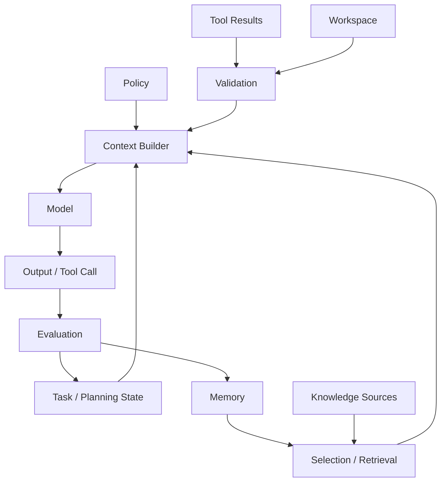

# Context Architecture

> [!important] 一句话核心
> Context Architecture 定义信息从哪里来、由谁信任、保存在哪里、怎样进入模型，以及输出之后如何更新系统；它是数据流和控制边界，不是一条超长 prompt。

## 架构要回答的六个问题

1. 当前任务依赖哪些上下文源？
2. 每个来源的可信度、权限和新鲜度怎样验证？
3. 哪些信息属于稳定规则、任务状态、证据或临时观察？
4. 哪些内容进入模型，哪些只留在程序或持久化存储？
5. 模型输出、tool result 和用户反馈怎样更新后续上下文？
6. 压缩、故障或切换窗口后，系统怎样恢复？

如果这些问题没有明确答案，系统通常会把“对话历史”误当成全部架构。

## 五层 Context Stack

| 层 | 内容 | 典型存储 | 进入模型的方式 |
|---|---|---|---|
| Policy / Instruction | 职责、安全、来源和授权边界 | 版本化配置 | 稳定高优先级指令 |
| Task / Planning | 目标、计划、进度、决定、完成条件 | State store / checkpoint | 当前步骤的最小状态投影 |
| Knowledge | 用户材料、memory、retrieval 文档 | 数据库、对象存储、向量索引 | 经过筛选的证据包 |
| Interaction | 对话、tool result、workspace observation | Event log / runtime | 当前步骤需要的历史与观察 |
| Presentation | 顺序、标签、引用、schema、token 分配 | Context builder | 最终请求消息或多模态输入 |

层之间的依赖方向应清楚：Presentation 可以读取其他层，但不能悄悄修改来源事实；模型可以提出状态更新建议，但可信 state 应由应用验证后写入。

## 数据流



这个图中的关键边界是：模型输入由 Context Builder 产生，持久化 state 和 memory 由验证后的系统流程更新。

## Context、State、Memory 与 Workspace

| 概念 | 定义 | 生命周期 | 常见误用 |
|---|---|---|---|
| Context | 当前一次推理可见的信息 | 单次调用或短期窗口 | 当作永久存储 |
| State | 继续当前任务所需的可信事实 | 任务级 | 只保存在自然语言聊天中 |
| Memory | 跨任务保存、未来按需检索的信息 | 长期 | 所有历史都永久写入 |
| Workspace | 当前环境中可观察和可操作的对象 | 随环境变化 | 依赖旧快照，不重新验证 |

Memory、State 和 Workspace 只有在当前任务被选中并组装后，才成为 Context。

## 信任与权限边界

来源可以按控制权分层：

- **可信控制面**：系统策略、经过审批的配置、授权状态。
- **可信数据面**：经过访问控制和版本验证的业务数据。
- **半可信观察**：tool 返回、workspace 文件、日志、检索材料。
- **不可信输入**：网页、用户上传内容、第三方文本、文档内指令。

不可信内容可以提供事实候选，但不能自动改变工具权限、任务目标或系统策略。边界标记只是表达角色，真正的安全还依赖程序权限、参数校验和隔离执行。

## Context Contract

上下文源最好输出稳定的 envelope，而不是裸文本：

```yaml
context_item:
  id: policy-refund-v4
  kind: evidence
  source: internal-policy
  version: 4
  observed_at: 2026-07-18T09:30:00+08:00
  trust: controlled
  sensitivity: internal
  task_scope: refund-review
  content: "..."
```

Context Builder 可以基于这些字段做权限过滤、去重、排序、过期检查和引用生成。字段设计详见 [[02-context-lifecycle|Context Lifecycle]]。

## 架构边界

### 模型应负责

- 理解语义、归纳证据、识别冲突和生成候选。
- 在明确标准下建议下一步或需要补充的上下文。
- 将非结构化观察转换为待验证的结构化候选。

### 程序应负责

- 权限、租户和敏感数据过滤。
- 版本、时间、checksum 和 schema 校验。
- Token 预算、缓存、去重、状态持久化和幂等。
- 高风险 tool 的执行授权与真实结果确认。

## 常见误区

> [!warning] “把所有东西放进 system”不是架构
> 高优先级消息适合稳定规则，不适合临时文档、频繁变化的状态或不可信数据。优先级混乱会放大过期信息和注入风险。

- **对话历史就是状态**：历史是事件记录，不是可验证的当前状态。
- **Memory 自动变成 Context**：未检索、未筛选的 memory 对当前模型不可见。
- **Tool 返回就是真相**：需要检查成功状态、对象、时间和来源。
- **一个 Context Builder 服务所有任务**：不同任务的来源、权限和预算不同，应共享原语而不是共享无边界的大模板。
- **模型直接修改可信状态**：应先产生候选更新，再由应用校验和提交。

## 检查表

- [ ] 每类上下文有明确 owner、存储位置和生命周期。
- [ ] Context、State、Memory、Workspace 的职责没有混淆。
- [ ] 不可信内容无法改变控制面规则或权限。
- [ ] Context Builder 的输入和输出有稳定契约。
- [ ] 模型建议与可信状态写入之间存在验证边界。
- [ ] 架构支持按任务选择材料，而不是全量注入。
- [ ] 发生压缩、中断或失败后可以从 state 恢复。
- [ ] 关键上下文事件可以审计但不过度记录敏感原文。

## 相关笔记

- [[00-overview|上下文工程总览]]
- [[02-context-lifecycle|Context Lifecycle]]
- [[05-context-assembly|Context Assembly]]
- [[11-memory-engineering|Memory Engineering]]
- [[14-planning-context|Planning Context]]
- [[prompt-engineering/10-context-and-instruction-architecture|上下文与指令架构]]

