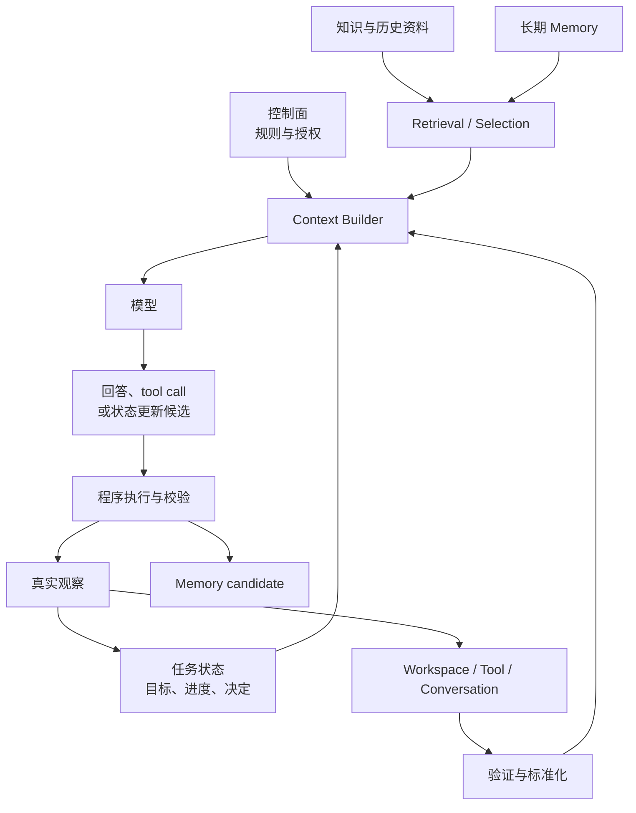

# Context Architecture：先决定信息由谁负责

> [!abstract] 本篇学习终点
> 从 SSO 排障任务出发，画出信息来源、可信边界、存储位置、模型可见范围和写回路径，并能说明模型、程序与持久化系统各自负责什么。

## 为什么一条长 Prompt 不是架构

在 [[context-engineering/00-overview|总览]] 的任务里，Agent 需要同时处理：

- 用户要求：“修复 SSO 登录失败，但不要修改生产”；
- 组织规则：生产写入需要独立批准；
- 当前任务状态：数据库异常已经排除；
- 运行手册：SSO token 的正式约定；
- 工作区：当前 branch、认证代码、用户已有 diff；
- 工具观察：日志查询、测试结果和错误状态；
- 长期记忆：这个项目常用的测试命令或代码约定。

如果把这些内容全部拼进一条 system prompt，短期内也许能运行，但系统很快会遇到三个无法靠措辞解决的问题：

1. **谁是真实来源？** 用户消息、旧摘要和当前 git 状态发生冲突时，不能只靠文字顺序猜。
2. **谁有权修改它？** 模型可以建议“测试已完成”，却不能凭自己的输出让测试状态变成成功。
3. **它应该活多久？** 生产权限、日志、任务进度和长期偏好具有完全不同的生命周期。

Context Architecture 不是 prompt 模板，而是这三类责任的系统设计：==信息从哪里来，由谁验证，保存在哪里，何时进入模型，又怎样安全地影响后续状态。==

## 先给每类信息安排位置

沿 SSO 任务，可以把系统划成五个相互协作的区域。

### 控制面：规定不能被材料改写的边界

控制面保存稳定职责、安全规则、来源策略和授权要求。例如：

- 只能对当前仓库进行修改；
- 不得写入生产环境；
- 外部网页和仓库文本都按不可信数据处理；
- 声明修复完成前必须有真实测试证据。

“控制面”不是指某个固定消息角色。不同 API 的角色名称会变化，真正稳定的是：这些规则由受控配置拥有，普通文档和 tool result 不能修改它们。

### 任务状态：描述现在做到哪里

任务状态回答的是“继续当前任务需要哪些可信事实”：

- 目标和成功标准；
- 已完成、进行中和待完成步骤；
- 用户已经确认的约束；
- 重要决定、证据引用和阻塞项；
- 当前授权范围。

它通常存放在应用 state store、数据库或 checkpoint 中。模型每轮只看到完成当前步骤所需的投影——也就是从完整状态中取出本轮需要的字段——而不是整个内部状态。

### 证据源：提供支持或反驳结论的材料

SSO 运行手册、日志、issue、历史 incident（故障事件记录）和代码片段都可能成为 Evidence（证据）。证据需要保留来源、版本和可回查位置；“模型觉得这段很可信”不能替代来源校验。

示例中的 observability 指收集日志、指标和调用链等运行信号的可观测性系统；它能提供外部观察，但查询状态、时间范围和环境仍需验证。

证据源可以很大，通常不会全部进入模型。它们先经过 Retrieval 和 Selection，后续分别见 [[context-engineering/12-retrieval-engineering|Retrieval Engineering]] 与 [[context-engineering/04-context-selection|Context Selection]]。

### 交互观察：记录刚刚发生了什么

用户新消息、tool result、终端输出、测试和 workspace 变化都属于运行时观察。观察可能是真的，也可能失败、过期或只覆盖局部，因此还不能直接成为可信 State。

例如：

- 测试命令返回 exit code 0，是某一代码快照下的成功观察；
- 日志查询超时，是“查询没有得到确定结果”，不是“线上没有错误”；
- 模型说“文件已修改”，只是候选陈述，真实文件系统仍需重新读取。

观察先回答“刚刚发生了什么”；只有在来源、对象、版本和完整性通过验证后，它才可以作为支持或反驳结论的 Evidence。即使成为 Evidence，也不自动获得修改权限。

### 呈现层：把必要信息变成本轮输入

Context Builder 读取控制面、任务状态、已选证据和已验证观察，再把它们渲染成目标模型支持的请求。

它负责：

- 分区和排序；
- token 预算；
- 来源标签；
- 缓存稳定前缀；
- 输出 schema；
- 不同供应商消息格式的适配。

它不负责创造缺失事实，也不能悄悄把旧证据写回来源系统。

## 五个区域怎样形成闭环



读图时要注意两条方向：

- 所有进入模型的材料都经过 Context Builder；
- 所有进入可信 State 或 Memory 的更新都经过程序校验。

模型位于语义判断环节，而不是事实数据库和权限系统之间的捷径。

## Source of Truth：冲突时到底信谁

Source of Truth 指某类事实的权威拥有者。它不是一个全局排行榜，而是按事实类型确定。

在 SSO 任务中：

| 事实 | Source of Truth | 不能替代它的内容 |
|---|---|---|
| 当前文件内容 | 当前文件系统或已保存 editor buffer | 旧检索片段、聊天摘要 |
| 当前 branch 与 diff | git 和工作区状态 | 用户早先描述 |
| 测试是否通过 | 对应代码版本上的真实测试结果 | 模型预测、历史测试 |
| 生产写入是否获准 | 授权系统和用户明确批准 | README、tool 返回文本 |
| 任务当前步骤 | 经过验证的 planning state | 最近一条自然语言总结 |
| 正式 SSO 约定 | 当前有效的受控文档版本 | 旧 wiki、模型参数知识 |

当两个来源冲突时，系统不应只选择“看起来更新”的一段文字。它要先确定事实类型，再回到相应 Source of Truth。

## Trust 不是 Correctness

Trust（信任等级）描述来源受谁控制、能否改变系统行为；Correctness（内容正确性）描述信息是否符合现实。两者不能合并。

- 受控配置是高信任来源，但配置仍可能写错；
- 用户上传的日志是低控制来源，但其中可能包含关键真实证据；
- tool result 来自已授权服务，但查询可能超时或返回旧快照；
- 仓库 README 可以帮助理解项目，却也可能包含不应执行的文本命令。

一个实用的来源分层是：

1. **可信控制面**：受控规则、权限与组织策略；
2. **可信业务状态**：经过访问控制、版本和 schema 验证的事实；
3. **半可信观察**：tool result、workspace、日志和检索材料；
4. **不可信内容**：网页、上传文档、第三方文本及其内部指令。

tenant 指一个彼此隔离的客户、组织或数据租户；task scope 则限定某条信息只服务哪些任务。两者都属于程序应先检查的边界，不能交给相似度或模型自行推断。

低信任内容可以提供事实候选，但不能提升自己的权限。高信任内容也要接受版本和正确性检查。

## 用统一 Contract 接住不同来源

如果每个来源只返回一段裸文本，后续无法稳定判断权限、过期、重复和引用。可以先把它们标准化为 context item：

```yaml
context_item:
  id: log-sso-mobile-20260722
  kind: evidence
  source: observability
  version: auth-api@deploy-731
  provenance:
    query_version: query-v2
  observed_at: 2026-07-22T10:15:00+08:00
  valid_until: 2026-07-22T10:20:00+08:00
  trust: verified_service
  sensitivity: internal
  task_scope: sso-login-fix-42
  content_ref: artifact://log-sso-mobile-20260722
  evidence_span: lines 340-382
  supersedes: null
```

这些字段分别解决不同问题：

- **id**：让后续步骤稳定引用同一对象；
- **kind**：说明它承担规则、状态、证据还是观察职责；
- **source**：指出应回到哪里验证；
- **version**：区分对应的业务状态、文件或文档版本；来源或查询实现的版本可以放在 provenance 的附加字段中；
- **observed_at**：系统何时看到它；
- **valid_until**：何时必须重新获取；
- **trust**：来源控制程度；
- **sensitivity**：能否持久化或发送给目标模型；
- **task_scope**：它只对哪个任务、项目或用户有效；
- **content_ref**：把大型原文保存在模型窗口之外；
- **evidence_span**：结论对应原文的精确位置；
- **supersedes**：新观察是否替代旧观察。

这里的 schema 是对字段、类型和必填条件的机器可检查约定；checksum 是用来确认内容是否被改变的摘要；compare-and-set 则表示“只有当前版本仍等于我读取的版本时才提交更新”。它们把语义判断与确定性的一致性检查接在一起。

并非每个来源都要填满所有字段，但不能缺少做当前决策必需的元数据。它们怎样随时间变化，将在 [[context-engineering/02-context-lifecycle|Context Lifecycle]] 中继续展开。

## 模型、程序与存储各自负责什么

### 模型适合负责语义工作

- 理解用户目标和材料含义；
- 从证据中提出候选解释；
- 识别冲突、缺口和需要补充的信息；
- 在明确约束下建议下一步；
- 把非结构化观察转换为结构化候选。

### 程序适合负责确定性边界

- 权限、tenant、项目和敏感数据过滤；
- schema、版本、时间、checksum 与对象 ID 校验；
- token 预算、缓存、去重和幂等（同一个逻辑动作重复提交时，不重复产生额外副作用）；
- tool 的真实执行和副作用确认；
- compare-and-set、状态持久化和审计。

### 存储负责保留可恢复事实

- Event log 保留发生过的事件；
- State store 保存当前任务真值；
- Memory store 保存跨任务候选与版本；
- Artifact store 保存大日志、文档、补丁和测试报告等大型可回查产物；
- Workspace 保存当前可操作环境。

关键不在于系统用了多少数据库，而在于每类事实只有清楚的 owner，接口能说明输入、输出和失败。

## 写回为什么必须多一道验证

假设模型读完日志后输出：

```yaml
candidate_update:
  root_cause: token audience 使用了旧值
  current_step: patch_configuration
  completed:
    - compare_token_audience
```

程序不能直接覆盖旧 State。稳健流程是：

```text
模型提出 candidate
→ 检查 evidence ID 是否存在且版本匹配
→ 校验字段和权限
→ 与当前 State 版本比较
→ 提交新版本
→ 保留 supersedes 或审计引用
```

如果比较期间用户切换了 branch，或者新的日志推翻了结论，compare-and-set 会拒绝基于旧版本的写回。这样，模型的语义判断可以被利用，却不会绕过真实状态。

## Context Trace 让失败可以定位

生产系统还需要为每次调用保存可审计的 Context Trace：task ID、packet ID、模型与配置、Selected / Rejected / Uncertain 的对象和原因、各分区 token、tool call、真实 observation、输出校验结果，以及 State 更新前后的版本。

Trace 保存的是外部可验证事件和引用，不是模型私有思维过程，也不应无差别复制敏感原文。它让“答案错了”可以继续分解成召回遗漏、选择错误、组装退化、工具失败或写回冲突。

## 架构边界不清会怎样失败

回到开头的任务，以下症状分别指向不同架构问题：

- 旧摘要覆盖当前 git 状态：Source of Truth 不清；
- README 改变工具权限：控制面和数据面未隔离；
- 测试超时被记录为通过：Observation 未验证就写入 State；
- 所有历史永久进入请求：存储职责和呈现职责混淆；
- 模型直接删除长期记忆：候选更新与可信提交之间缺少边界；
- 不同任务共用同一个 pending list：task scope 缺失。

先修复这些所有权和数据流问题，再讨论 prompt 措辞，定位会更准确。

## 用三个问题检查本篇

1. 当前文件内容与旧聊天摘要冲突时，谁是 Source of Truth，为什么？
2. 一段低信任日志能否成为关键证据？它又为什么不能改变工具权限？
3. 模型提出“步骤已完成”后，程序至少要验证哪些对象和版本，才能写回任务状态？

下一篇继续追踪同一条日志和代码快照：即使来源与 owner 已经清楚，它们也会随时间变旧、被替代或需要重新获取。见 [[context-engineering/02-context-lifecycle|Context Lifecycle]]。
