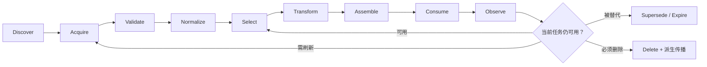

# Context Lifecycle：信息何时仍然有效

> [!abstract] 本篇学习终点
> 沿一条 SSO 错误日志和一份代码快照，解释它们怎样被发现、验证、选择、变换、使用、刷新和失效；看到任何 context item 时，都能判断它当前是否仍可用于决策。

## 架构清楚以后，时间开始制造问题

[[context-engineering/01-context-architecture|Context Architecture]] 已经确定日志来自 observability、代码来自 workspace、任务进度来自 state store。可是半小时后：

- 新部署改变了线上版本；
- 用户切换了 branch；
- 运行手册发布了 v4；
- 日志查询条件被修正；
- 生产读取权限被撤销；
- 旧摘要仍在对话里。

来源没有变，信息的有效性却变了。如果系统只保存 content，不保存它何时观察、对应哪个版本、何时应刷新，旧信息最终会以“看起来仍然合理”的形式污染模型输入。

Context Lifecycle 处理的不是存储时长本身，而是：==一条信息在什么阶段承担什么职责，什么时候还能支持当前结论，什么时候必须重新获取或退出当前上下文。==

## 追踪一条日志的完整旅程

当前步骤是比较成功与失败请求的 token audience。系统需要一段移动端 SSO 失败日志。

### 1. Discover：知道应该去哪里找

系统根据任务状态发现候选来源：

- observability 中的认证服务日志；
- 身份服务的运行手册；
- 当前仓库中的 token 校验代码；
- 历史 incident memory。

Discover 的输出是“来源候选”，不是日志内容。此时系统只知道 observability 可能有答案。

### 2. Acquire：获取某一时刻的观察

程序用明确查询条件读取日志：

```yaml
query:
  service: auth-api
  flow: sso
  client: mobile
  time_range: 2026-07-22T09:50:00+08:00/2026-07-22T10:10:00+08:00
```

Acquire 的输出是一份原始 observation。查询可能成功、失败、超时或只返回部分结果，所以“调用已经发生”不代表“证据已经取得”。

### 3. Validate：确认它能否用于当前任务

系统检查：

- 调用状态是否成功；
- 返回对象是否真的是 auth-api；
- tenant、环境和时间范围是否匹配；
- 当前用户是否有权读取；
- 数据是否完整、编码是否可解析；
- 结果对应哪个查询版本。

如果查询超时，生命周期在 Validate 阶段就不能继续到“有效证据”。系统应保存 retryable error 或 unknown observation，而不是生成“没有发现异常”的内容。

### 4. Normalize：把不同来源变成稳定结构

日志服务、文件系统和知识库返回不同格式。Normalize 统一时间、ID、版本、字段名和引用方式：

```yaml
context_item:
  id: log-sso-mobile-20260722
  kind: evidence
  source: observability
  version: auth-api@deploy-731
  provenance:
    query_version: query-v2
  event_time: 2026-07-22T10:03:14+08:00
  observed_at: 2026-07-22T10:15:00+08:00
  valid_until: 2026-07-22T10:20:00+08:00
  task_scope: sso-login-fix-42
  content_ref: artifact://log-sso-mobile-20260722
```

这里有两个容易混淆的时间：

- **event_time**：登录失败真正发生的时间；
- **observed_at**：系统读取到这份结果的时间。

一条十分钟前发生的错误，可以在刚刚才被观察到。判断查询是否新鲜时看 observed_at；判断错误是否属于 incident 时间段时看 event_time。

### 5. Select：当前步骤是否真的需要它

通过验证的材料仍可能无关。Selection 会比较当前子问题、来源、版本、独特信息和预算。

例如同一时间段有 500 行日志，只有包含 expected audience、actual audience 和 request ID 的片段直接服务当前比较。完整日志保留在 artifact store，选中的 span 进入后续流程。

Selection 的机制在 [[context-engineering/04-context-selection|Context Selection]] 详解。生命周期在这里强调的是：被拒绝不等于删除，可能只是不服务当前步骤。

### 6. Transform：把原始材料变成可使用形式

系统从原始日志中抽取：

- 失败 request ID；
- expected audience；
- actual audience；
- 对应行号；
- 未解析字段。

Transform 可以是抽取、摘要、分块、OCR（图像文字识别）、转码或结构化。它会改变信息表示，因此必须记录原始引用和方法版本。

### 7. Assemble 与 Consume：进入本轮推理

选中且变换后的日志片段与任务状态、约束和当前动作一起组成 context packet。模型读取它，提出根因候选或下一步 tool call。

Consume 只表示材料被某次推理使用，不表示模型结论已经正确，也不表示材料应该永久保留在后续每一轮。

### 8. Observe：记录结果是否真的有用

模型依据日志建议修改 audience 映射，程序修改本地文件并运行测试。新的 observation 可能是：

- 测试通过；
- 测试仍失败，但错误发生在另一层；
- 文件在运行测试前被用户修改；
- 工具没有返回确定状态。

Observe 把执行结果带回生命周期，为刷新、重新选择和状态更新提供依据。

### 9. Refresh、Expire 或 Delete：决定下一次还能否使用

如果新部署发生，旧日志仍可作为历史事件证据，却不能代表当前线上状态。系统可以：

- **Refresh**：重新查询当前状态；
- **Expire**：保留原始记录，但禁止它继续作为当前状态；
- **Supersede**：用新版本替代旧版本，并保留关系；
- **Delete**：因用户请求、合规或保留策略删除原文及派生副本。

Expire 与 Delete 不同。过期材料可能仍有审计价值，只是不再服务当前决策。

## 生命周期不是一条只能向前的直线



同一 context item 可能多次回到 Select：当前步骤变化后，原先无关的材料可能变得有用；也可能回到 Acquire，因为版本或权限变化要求重新读取。

## 最少需要哪些生命周期元数据

不同来源不必使用完全相同的 schema，但至少要回答：

1. **它是谁？** 稳定 ID 和 kind。
2. **从哪里来？** source、查询或文件路径。
3. **对应哪个版本？** 统一用 `version` 表示它对应的业务状态、文件或文档版本；查询实现版本可以作为 provenance 附加字段，workspace snapshot（某一时刻的工作区状态记录）则是另一类版本引用。
4. **何时发生、何时观察？** event time 与 observed time。
5. **对谁和什么任务有效？** user、tenant、project、task scope。
6. **何时需要重新检查？** valid until、事件失效或版本失效条件。
7. **能否进入模型或长期存储？** sensitivity 与权限。
8. **它替代了谁？** supersedes 关系。

没有这些字段，系统只能靠内容相似度猜“是不是同一条信息”，也无法解释为什么选用了旧值。

## Refresh 策略来自变化速度和错误代价

刷新不是越频繁越好。应同时看来源变化速度、读取成本和使用错误信息的代价。

| 策略 | SSO 任务中的例子 | 适用理由与代价 |
|---|---|---|
| 每次读取 | 当前 branch、权限、生产状态 | 错用代价高，但增加延迟 |
| TTL（固定有效时长） | 短期日志查询、临时服务健康状态 | 实现简单，有效时长内仍可能过期 |
| 事件失效 | 文件修改、部署完成、权限撤销 | 反应快，但依赖可靠事件 |
| 版本失效 | 运行手册、schema、配置 | 可精确判断，需要完整版本传播 |
| 手动复核 | 高风险长期 memory、组织政策 | 质量高，更新速度慢 |
| Append-only | 对话事件、审计日志 | 原始记录不改，但读取时要重建当前视图 |

“所有内容统一缓存五分钟”忽略了事实类型：代码文件修改后应立即失效，历史 incident 的事件事实则不会因为五分钟过去而消失。

## Transform 为什么必须被当成有损操作

原始日志可能写着：

> mobile 请求的 audience 为 api-v1；web 请求为 api-v2。仅 mobile 流量失败。数据库连接正常，但身份服务的配置版本尚未确认。

一个糟糕摘要可能变成：

> SSO 因 audience 错误而失败。

它丢掉了：

- 只影响 mobile 的适用范围；
- web 的对照证据；
- 数据库已排除这一否定信息；
- 身份服务配置版本尚未确认这一未知项。

因此，每次变换至少保留：

- 原始 source ID 与 evidence span；
- transform 方法和版本；
- 被省略或无法确认的字段；
- 数值、时间、否定条件、例外和单位；
- 需要时可重新获取原始内容的 content reference。

高风险任务不能只保留模型摘要并删除原始证据。摘要适合帮助阅读，不适合成为唯一真相。

## 状态写回也有生命周期

模型提出“数据库异常已排除”时，程序要检查这条结论依赖的测试或观察版本：

```text
candidate update
→ schema 与权限验证
→ evidence version 检查
→ 与当前 State 做 compare-and-set
→ 提交新 State 版本
→ 旧版本建立 supersedes 或审计引用
```

如果 candidate 基于 workspace snapshot A，而当前已经是 snapshot B，系统应拒绝或重新验证，而不是让旧结论覆盖新状态。

这个写回原则同时适用于 [[context-engineering/10-conversation-context|Conversation Context]]、[[context-engineering/11-memory-engineering|Memory Engineering]]、[[context-engineering/14-planning-context|Planning Context]] 和 [[context-engineering/15-workspace-context|Workspace Context]]。

## 怎样评估生命周期是否可靠

沿主线可以测量：

- **Freshness lag**：来源变化到 Context 更新之间的时间；
- **Stale-use rate**：请求使用过期信息的比例；
- **Invalidation coverage**：版本、权限或事件变化是否使全部派生副本失效；
- **Compression loss**：变换后关键约束、否定和证据的丢失率；
- **Provenance coverage（来源可追溯率）**：结论能否回到原始 source 与 span；
- **Refresh cost**：重新读取和变换的延迟与成本；
- **Recovery success**：中断后能否从正确版本继续。

缓存命中率不能替代这些指标。旧值被快速命中，仍然是一次高效的错误。

## 用三个问题检查本篇

1. 一条日志的 event time 与 observed time 分别回答什么问题？
2. 运行手册 v4 发布后，v3 应该 Expire、Supersede 还是 Delete？为什么可能不需要立刻删除？
3. 摘要保留了结论，却丢掉“仅 mobile 受影响”，这属于哪个阶段的什么失败？

下一篇会遇到新的约束：即使所有材料都有效，模型窗口也无法容纳全部日志、代码、历史和输出。见 [[context-engineering/03-context-window-management|Context Window Management]]。
