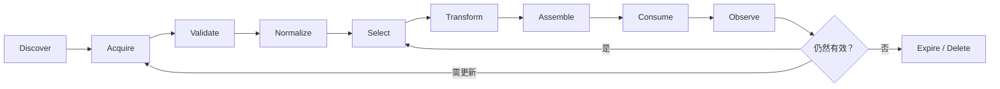

# Context Lifecycle

> [!important] 一句话核心
> 每段上下文都应经历可追踪的产生、验证、选择、使用、刷新和淘汰过程；没有生命周期的信息最终会以过期、重复或不可解释的形式污染模型输入。

## 生命周期阶段



各阶段的职责：

1. **Discover**：识别可能有用的来源。
2. **Acquire**：读取文档、memory、tool 或 workspace observation。
3. **Validate**：检查权限、版本、完整性、成功状态和来源。
4. **Normalize**：统一字段、时间、编码、ID 和格式。
5. **Select**：根据当前任务保留最有价值的内容。
6. **Transform**：摘要、抽取、分块、结构化或压缩。
7. **Assemble**：按照边界和预算形成最终 context packet。
8. **Consume**：模型或下游步骤使用材料。
9. **Observe**：记录质量、失败、引用、成本和使用结果。
10. **Refresh / Expire**：更新仍需使用的内容，淘汰过期内容。

## 最小元数据

```yaml
id: order-A1024-status
kind: tool_result
source: order-service
source_version: v3
observed_at: 2026-07-18T10:15:00+08:00
valid_until: 2026-07-18T10:20:00+08:00
trust: verified_service
sensitivity: customer-confidential
task_scope: order-support-1842
content_hash: sha256:...
supersedes: order-A1024-status@10:10
```

不需要所有来源都拥有完全相同的字段，但至少应回答：它是谁、从哪里来、何时观察、对哪个任务有效、多久后需要重查、能否对模型公开。

## Refresh 策略

| 策略 | 适用内容 | 风险 |
|---|---|---|
| 每次读取 | 余额、库存、权限、运行状态 | 延迟和调用成本高 |
| TTL | 新闻、价格、搜索结果、临时摘要 | TTL 内仍可能过期 |
| 事件失效 | 文件修改、状态迁移、权限撤销 | 依赖可靠事件链路 |
| 版本失效 | 政策、schema、代码、模型配置 | 需要完整版本传播 |
| 手动复核 | 高风险规则、长期 memory | 更新速度慢 |
| Append-only | 审计事件、对话原始记录 | 读取时仍需生成当前视图 |

刷新策略应由业务变化速度和错误代价决定，而不是只看存储成本。

## Transform 不是无损操作

摘要、抽取和分块都会改变信息。每次 transform 应保留：

- 原始来源引用。
- 使用的方法和版本。
- 不能确定或被省略的内容。
- 关键否定条件、数值、时间和例外。
- 必要时可回查的 evidence span。

高风险任务不应只保存模型生成的摘要并删除原始证据。

## 状态转换与写回

模型输出不应直接覆盖旧状态。更稳健的流程是：

```text
模型提出 candidate update
→ schema 与权限验证
→ 与当前版本做 compare-and-set
→ 提交新版本
→ 旧版本保留审计引用或按政策淘汰
```

这对 [[11-memory-engineering|Memory Engineering]]、[[14-planning-context|Planning Context]] 和 [[15-workspace-context|Workspace Context]] 都适用。

## 生命周期指标

| 指标 | 说明 |
|---|---|
| Freshness lag | 来源变化到 Context 更新的时间 |
| Stale-use rate | 使用过期信息的请求比例 |
| Duplicate ratio | 重复或高度相似内容占比 |
| Compression loss | 压缩后关键约束或证据缺失率 |
| Provenance coverage | 输出结论可追溯到来源的比例 |
| Refresh cost | 获取和变换上下文的延迟与成本 |
| Recovery success | 中断后从保存状态正确继续的比例 |

## 常见误区

> [!warning] 缓存命中不代表内容仍然正确
> Cache 只说明键或前缀匹配。来源已经变化、权限已经撤销或任务范围已经改变时，旧值仍应失效。

- **只记录 created_at**：没有 observed_at、valid_until 或版本，无法判断是否仍有效。
- **摘要永久有效**：摘要依赖当时目标和原文版本，任务变化后可能不再适用。
- **新结果直接覆盖旧结果**：并发任务可能丢失更新，也无法审计变化。
- **所有内容同一 TTL**：稳定政策和实时库存的变化速度完全不同。
- **删除原始来源**：高风险结论失去回查能力。
- **生命周期只考虑存储**：真正目标是控制模型使用信息的时机和范围。

## 检查表

- [ ] 每段上下文都有来源、时间、版本和任务范围。
- [ ] 获取后先验证，再进入选择和组装。
- [ ] 摘要、抽取和分块保留 provenance。
- [ ] 动态事实有明确刷新或失效策略。
- [ ] 权限变化可以使已有 context 和 cache 失效。
- [ ] 状态写回采用候选、验证、提交的流程。
- [ ] 过期和删除同时考虑质量、安全与合规。
- [ ] 监控 stale-use、压缩损失和恢复成功率。

## 相关笔记

- [[01-context-architecture|Context Architecture]]
- [[03-context-window-management|Context Window Management]]
- [[04-context-selection|Context Selection]]
- [[11-memory-engineering|Memory Engineering]]
- [[12-retrieval-engineering|Retrieval Engineering]]

