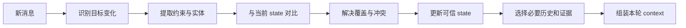

# Conversation Context

> [!important] 一句话核心
> 多轮对话管理不是无限追加消息，而是把事件历史转换为可验证的当前意图、任务状态、有效约束和必要证据，并在每轮变化后重新计算最小可用上下文。

## 对话中存在四类信息

| 类型 | 例子 | 是否应长期保留 |
|---|---|---|
| 当前请求 | “把结果改成表格” | 当前步骤有效 |
| 任务约束 | “不要修改生产数据” | 任务期间保留 |
| 决定与状态 | 已选择方案 B、测试尚未运行 | 写入可信 task state |
| 社交与冗余文本 | 寒暄、重复确认、已失效讨论 | 通常可删除或弱摘要 |

原始 message log 是事件来源，不是当前状态。新的明确用户指令可以更新目标或偏好，但不能自动越过安全、权限和系统边界。

## Event Log 与 Current View

推荐同时保留：

- **Append-only event log**：谁在何时说了什么，便于审计和重新计算。
- **Current view**：当前目标、约束、决定、未完成事项和授权的结构化视图。

```yaml
conversation_state:
  thread_id: copy-review-42
  objective: 生成三版产品发布文案
  user_constraints:
    - 不使用绝对化宣传
    - 每版不超过 120 字
  decisions:
    tone: 克制、技术感
  completed:
    - 提取产品事实
  pending:
    - 生成候选
    - 用户选择
  authorization:
    publish: false
```

Current view 应由应用验证后更新，不能只依赖模型自由摘要。

## 每轮处理流程



如果用户修正了事实，应保留修正关系，而不是让旧值和新值同时以相同权重进入 context。

## History 策略

| 策略 | 适用情况 | 风险 |
|---|---|---|
| Full History | 短对话、上下文很小 | 很快膨胀 |
| Sliding Window | 最近语义最重要的闲聊或协作 | 丢失早期约束 |
| Summary Buffer | 长对话、阶段性任务 | 摘要漂移和错误累积 |
| Retrieval from History | 历史很长、问题稀疏 | 检索漏掉关键修正 |
| Structured State + Evidence | 复杂 Agent 和可恢复任务 | 需要 schema 与更新逻辑 |

生产系统通常使用最后一种作为骨架，再按需附加最近消息和历史证据。

## Summary Buffer

摘要不应只写“我们讨论了什么”，而应保存继续任务所需的不变量：

```yaml
summary:
  objective: 分析登录失败
  confirmed_facts:
    - 失败仅发生在 SSO 用户
  rejected_hypotheses:
    - 数据库连接异常
  decisions:
    - 下一步检查 token audience
  open_questions:
    - 是否只影响移动端
  evidence_refs:
    - log-sso-20260718
```

每次重写摘要都应基于可信 state 和有引用的事件，而不是摘要的摘要无限递归。

## 指代、省略与修正

多轮对话常见难点：

- “它”“上一版”“那个文件”等指代。
- 用户省略已经共享的对象或条件。
- 新消息修正旧事实。
- 临时偏好被误存为长期偏好。
- 多个并行任务在同一 thread 中交错。

处理原则：优先使用稳定对象 ID；不确定指代影响结果时询问；修正建立 supersedes 关系；不同任务使用独立 state 或明确 task ID。

## Tool 与 Conversation

Tool call 和 tool result 是对话事件，但不应原样永久累积：

- 保留调用目的、参数来源和结果状态。
- 大 payload 外置，只注入必要字段和引用。
- 失败结果不能被后续摘要成“已完成”。
- 有副作用的动作保存真实外部状态和授权。

详见 [[13-tool-context|Tool Context]]。

## 隐私与保留

对话可能包含 PII、商业机密和临时敏感内容。系统需要定义：

- 原始消息保存多久。
- 哪些字段允许进入 memory。
- 哪些内容可以发送给目标模型或第三方 tool。
- 用户删除、导出和纠错如何传播到摘要、索引和 cache。
- 日志是否需要脱敏或只保存引用。

## 评估

- 早期约束保留率。
- 修正后的旧事实误用率。
- 指代解析准确率。
- 摘要中的事实、决定和 pending item 完整率。
- 多任务串线率。
- Token 增长速度与压缩频率。
- 中断后恢复成功率。
- 不应写入 memory 的信息泄漏率。

## 常见误区

> [!warning] 最近消息不一定最重要
> 用户最早给出的禁止事项、目标和授权可能仍然有效。Sliding Window 必须由结构化 state 补足。

- **全量历史永远最好**：成本、噪声和冲突会持续增长。
- **摘要替代原始事件**：高风险决定失去审计和纠错依据。
- **模型自己决定覆盖关系**：应用应明确新旧值、来源和 supersedes。
- **一次偏好自动写入长期 memory**：需要稳定性、用途和用户预期判断。
- **多个任务共享一个 pending list**：容易重复步骤和串线。
- **Tool 文本被当作用户指令**：来源和信任边界必须分开。

## 检查表

- [ ] 原始事件与当前 state 分开保存。
- [ ] 当前目标、约束、决定和 pending item 可结构化恢复。
- [ ] 新消息与旧状态的覆盖和冲突规则明确。
- [ ] 摘要保留来源、否定信息和未完成事项。
- [ ] 不同任务有稳定 task ID，避免对话串线。
- [ ] Tool 结果按状态和引用压缩，不原样无限累积。
- [ ] 对话数据的保留、删除和 memory 写入策略清楚。
- [ ] 长对话在真实任务上验证约束保留和恢复质量。

## 相关笔记

- [[03-context-window-management|Context Window Management]]
- [[05-context-assembly|Context Assembly]]
- [[11-memory-engineering|Memory Engineering]]
- [[13-tool-context|Tool Context]]
- [[14-planning-context|Planning Context]]

