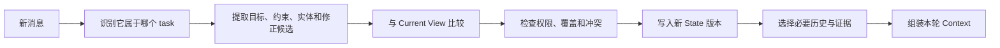

# Conversation Context：把消息历史变成当前任务

> [!abstract] 本篇学习终点
> 面对多轮消息、指代、修正和任务切换，区分“发生过什么”的 Event Log 与“现在什么为真”的 Current View，并能在每轮之后更新目标、约束、决定、未知项和必要历史。

## 多轮对话为什么不能只向后追加

SSO 排障开始时，用户说：

> 修复 SSO 用户登录失败，不要修改生产环境。

十轮之后，用户又补充：

> 我刚确认，普通网页端可以登录，只有 mobile 出问题。

再过一轮，用户修正：

> 我前面说错了，环境不是 staging-cn，是 staging-apac。

如果系统把全部消息原样追加，模型会同时看到：

- 早期未限定客户端的描述；
- 最新的 mobile 范围；
- 两个环境名称；
- 已经排除的旧猜测；
- 多次 tool call 和大段结果；
- 当前真正要做的 token audience 比较。

消息越多，不代表当前任务越清楚。对话管理的核心工作是：==把按时间发生的事件，转换为可验证的当前意图、任务状态、有效约束和必要证据。==

## 对话中不是所有文字都承担同一职责

沿主线可以先分四类：

### 当前请求

例如“比较 mobile 与 web 的 token audience”。它定义本轮要做什么，通常只对当前步骤有效。

### 任务约束

例如“不要修改生产环境”“最终给出测试证据”。只要任务没有结束或用户明确撤销，它们就应持续保留。

用户不能用普通消息撤销更高优先级的安全规则；本篇讨论的是用户有权修改的任务内约束。

### 决定与状态

例如：

- 只调查 mobile SSO；
- staging-apac 是当前目标环境；
- 数据库异常已经排除；
- focused test 尚未通过。

这些内容应写入可信 task state，而不是只留在自然语言消息中。

### 社交、探索和冗余文本

寒暄、重复确认、已经失效的猜测和无关分支通常不必原样进入每一轮。它们可以保留在 Event Log 中，需要时再检索。

分类不是为了永久删除消息，而是决定本轮如何使用它。

## Event Log 与 Current View

可靠系统通常同时保存两种表示。

### Event Log：发生过什么

Event Log 是 append-only（只追加新事件、不原地改写旧事件）的事件序列：

```yaml
events:
  - id: msg-101
    actor: user
    type: task_created
    content: 修复 SSO 登录失败，不要修改生产
  - id: msg-118
    actor: user
    type: scope_update
    content: 只有 mobile 出问题
  - id: msg-121
    actor: user
    type: correction
    content: 目标环境是 staging-apac
    supersedes: msg-115
  - id: tool-44
    actor: log_query
    type: observation
    status: success
    result_ref: artifact://log-sso-mobile-20260722
```

它保留审计和重建依据，却不会自动告诉模型哪些值仍然有效。

### Current View：现在什么为真

Current View 是经过验证的当前状态：

```yaml
conversation_state:
  task_id: sso-login-fix-42
  objective: 修复 SSO 用户登录失败
  scope:
    client: mobile
    environment: staging-apac
  constraints:
    - 不修改生产环境
    - 最终提供测试证据
  confirmed_facts:
    - web_login_works
    - database_issue_ruled_out
  current_step: compare_token_audience
  unknowns:
    - identity_service_runtime_config_version
  pending:
    - inspect_token_fixture
    - patch_minimal_code
    - run_focused_test
```

Current View 不要求模型重读全部历史，仍然可以通过 event ID 回查每个值从哪里来。

> [!important]
> Event Log 保存过去；Current View 服务现在。摘要可以帮助阅读，但可信当前状态必须能由来源、覆盖关系和程序校验支撑。

## 每一轮怎样更新 Current View

收到新消息后，可以按下面的顺序处理：



### 1. 先确定任务归属

同一 thread 里可能同时出现：

- 修复 SSO 登录；
- 顺便解释 OAuth；
- 为另一个仓库写文档。

如果这些请求共享一个 pending list，系统容易把另一个任务的步骤带入当前 Agent loop。复杂任务应使用稳定 task ID；无法确定归属时，先澄清而不是猜。

### 2. 提取候选，而不是直接改状态

“只有 mobile 出问题”可以生成：

```yaml
candidate_update:
  task_id: sso-login-fix-42
  field: scope.client
  value: mobile
  source_event: msg-118
  update_type: narrow_scope
```

它先是候选。程序检查用户是否在修改当前任务、字段是否允许、是否与已确认观察冲突，再提交 State。

### 3. 显式处理覆盖关系

“环境是 staging-apac”应建立 supersedes：

```yaml
state_update:
  field: scope.environment
  old_value: staging-cn
  new_value: staging-apac
  source_event: msg-121
  supersedes_event: msg-115
```

后续 Context 只把 staging-apac 当作当前值；旧值保留在 Event Log，用于解释历史 tool call 为什么查询了错误环境。

### 4. 冲突不能只靠“最新消息获胜”

最新用户消息通常能更新用户自己提供的任务细节，但不能自动覆盖：

- 更高优先级安全规则；
- 当前文件系统和真实外部状态；
- 用户无权修改的业务事实；
- 已验证且需要明确撤销流程的授权记录。

如果用户说“测试已经通过”，而当前测试输出失败，系统应记录用户陈述与 observation 冲突，回到测试 Source of Truth，而不是按消息时间更新为 passed。

## 指代和省略怎样落到稳定对象

多轮对话中常见：

- “改回上一版”；
- “测试那个文件”；
- “它只在移动端失败”；
- “用刚才的结果继续”。

处理时依次尝试：

1. 当前 task 和 current step 中的稳定对象 ID；
2. 最近明确提到且类型匹配的对象；
3. Current View 中唯一可满足指代的对象；
4. 无法唯一确定时请求澄清。

例如当前有 patch-v2 和 runbook-v4，“上一版”仍然不够明确。对象歧义会影响写操作时，不能为了流畅而猜。

## History 策略为什么需要组合

### Full History

短对话中最直接，但 token 会线性增长，旧值和新值容易同权出现。

### Sliding Window

保留最近若干消息，适合闲聊或局部协作。它会删除早期仍有效的“不要修改生产”，所以不能独立承担复杂任务状态。

### Summary Buffer

把较早历史压缩成摘要，能控制增长，但摘要可能漂移、漏掉否定或把猜测写成事实。

### Retrieval from History

从长历史中按问题召回相关事件，适合稀疏查询；风险是漏掉用户修正和早期约束。

### Structured State + Evidence

以 Current View 为骨架，附加最近消息和必要历史 evidence。它增加 schema 与更新逻辑，却最适合需要恢复、授权和多步骤执行的 Agent。

SSO 任务可以组合：

```text
Current View
+ 最近 4 条消息
+ 与当前 audience 问题相关的历史事件
+ 可回查的 Event Log 引用
```

组合的目标不是保存最多，而是让本轮理解足够且可纠错。

## Summary Buffer 应保存什么

摘要不应只写“我们讨论了登录问题”。一份可恢复摘要可以是：

```yaml
summary:
  task_id: sso-login-fix-42
  objective: 修复 mobile SSO 登录失败
  constraints:
    - 不修改生产环境
  confirmed_facts:
    - web 登录正常
    - 数据库异常已排除
  rejected_hypotheses:
    - database_connection_failure
  decisions:
    - 下一步比较 token audience
  corrections:
    - staging-cn 被 staging-apac 替代
  unknowns:
    - identity_service_runtime_config_version
  evidence_refs:
    - log-sso-mobile-20260722
    - runbook-sso-v4#audience
```

每次重写摘要应以可信 State 和原始事件为输入，而不是不断总结上一版摘要。否则一个早期错误会在多轮压缩中被不断强化。

## Tool 事件怎样进入对话

Tool call 和 result 是 Event Log 的一部分，但大 payload 不应永久复制进消息历史。

对一次日志查询，保留：

- 调用目的；
- 参数来源；
- 授权范围；
- status 与错误类型；
- observed_at；
- 关键字段；
- 完整 artifact reference。

失败结果不能在摘要中变成“步骤完成”。有副作用的工具还要保存真实外部状态和授权，详见 [[context-engineering/13-tool-context|Tool Context]]。

## 什么可以进入长期 Memory

Conversation State 为当前任务服务。任务结束时，不应把整段对话自动写成长期记忆。

候选可能包括：

- 用户明确且稳定的输出偏好；
- 项目长期使用的测试约定；
- 经验证、未来可复用的 SSO 配置知识；
- 一个可回查的 incident artifact。

不适合长期保存：

- 当前 branch；
- 临时环境名称；
- 一次 tool error；
- 未经确认的用户偏好推断；
- 本任务的完整 pending list。

具体写入门槛见 [[context-engineering/11-memory-engineering|Memory Engineering]]。

## 隐私、保留和删除也要传播

对话可能包含 PII（Personally Identifiable Information，可识别个人身份的信息）、token、内部日志和商业信息。系统需要定义：

- 原始消息保存多久；
- 哪些字段可以进入摘要、索引和 Memory；
- 哪些内容允许发送给目标模型或第三方工具；
- 日志是否保存原文、脱敏内容或仅保存引用；
- 用户删除或纠错怎样传播到摘要、向量索引、cache 和派生 artifact。

只删除 Event Log 中的一条消息，却保留摘要和 Memory 中的复制内容，不算完整删除。

## 怎样评估 Conversation Context

用真实多轮任务测量：

- 早期约束保留率；
- 用户修正后旧值误用率；
- 指代解析准确率与澄清率；
- Current View 中目标、决定、unknown 和 pending 的完整率；
- 多任务串线率；
- 摘要中的事实与原始事件一致率；
- token 增长和压缩频率；
- 中断后恢复成功率；
- 不应持久化信息的泄漏率。

只测最后一轮回答是否自然，无法发现状态已经悄悄漂移。

## 用三个问题检查本篇

1. 用户把环境从 staging-cn 修正为 staging-apac 后，为什么旧值还要留在 Event Log？
2. 用户说“测试通过”与真实测试失败冲突时，哪个来源决定 Current View？
3. 为什么 Summary Buffer 不应该以旧 Summary 为唯一输入反复重写？

下一篇回答任务结束后自然出现的问题：这次对话和排障产生了大量信息，究竟哪些值得跨任务保留。见 [[context-engineering/11-memory-engineering|Memory Engineering]]。
