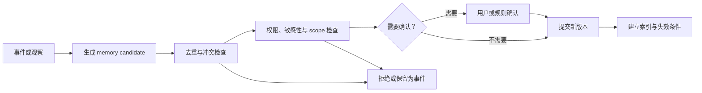

# Memory Engineering：决定什么值得跨任务留下

> [!abstract] 本篇学习终点
> 区分当前任务 State 与跨任务 Memory，沿 SSO 排障结束后的信息做写入判断、检索、更新、合并和删除，并能解释为什么“记住更多”会降低可靠性。

## 任务结束后，什么应该被记住

SSO 排障完成后，系统手里可能有：

- 用户本次要求不要修改生产；
- staging-apac 这个临时环境；
- 一次 audience 配置错误的日志；
- 当前 branch 的补丁和测试结果；
- 项目长期采用的 focused test 命令；
- 用户明确偏好用简体中文输出；
- 模型猜测用户喜欢短回答；
- 一次查询超时；
- 任务的完整 pending list。

如果把所有内容都写进长期 memory，下一次任务会被旧环境、错误猜测和敏感日志污染。Memory Engineering 的问题不是“怎样存更多历史”，而是：==哪些信息具有未来价值，应该以什么权限、作用域和失效条件跨任务使用。==

## Memory 不在当前 Context 里

[[context-engineering/10-conversation-context|Conversation Context]] 保存当前 thread 的 Event Log 和 Current View。Memory 位于模型调用之外，只有经过未来任务的检索、硬过滤、选择和组装后，才会重新成为 Context。

完整链路是：

```text
事件或观察
→ memory candidate
→ 写入判断与验证
→ 持久化
→ 未来任务触发检索
→ 权限与 scope 过滤
→ 选择与组装
→ 当前 Context
```

因此，大窗口不会自动产生长期记忆；把对话摘要放进数据库也不等于它可靠。

## 四类 Memory 解决不同的未来问题

下面是一种便于工程实现的分类，不是唯一学术标准。分类的价值在于让不同内容拥有不同的写入、检索和失效规则，而不是要求所有系统使用同一组英文标签。

### Episodic：发生过什么

例如“2026-07-22 的 mobile SSO incident 最终由 audience 映射错误引起”。它适合回查历史，但不应直接当作当前配置。

### Semantic：相对稳定的事实或偏好

例如“这个项目的 mobile SSO expected audience 来自受控配置”，或用户明确说“默认用简体中文”。它需要来源和确认时间，仍可能被新版本替代。

### Procedural：可复用的流程

例如“修改认证代码前先运行 focused SSO test，再运行完整回归”。流程应说明适用项目、版本和例外，而不是无条件适用于所有仓库。

### Artifact / Reference：可回查对象

例如补丁、测试报告、incident 文档和部署版本。它们的价值通常是提供稳定引用，不是把完整产物塞进每次 prompt。

不同类型可以有不同 schema、保留期和检索方式。把所有内容压成无来源的自然语言段落，会丢失这些差异。

## 写入前先过七道门

一个候选只有在满足以下问题后才适合进入 Memory：

1. **未来价值**：下次任务真的可能用到它吗？
2. **稳定性**：它是跨任务事实，还是这次临时状态？
3. **来源**：来自用户明确陈述、系统观察还是模型推断？
4. **置信度**：是否有一次以上的独立证据或需要用户确认？
5. **敏感性**：允许持久化、跨任务使用和发送给目标模型吗？
6. **作用域**：属于这个任务、项目、用户还是组织？
7. **失效条件**：何时刷新、覆盖、降权或删除？

沿 SSO 例子：

| 候选 | 写入判断 |
|---|---|
| “不要修改生产” | 当前任务约束，不自动成为长期 memory |
| staging-apac | 临时环境，通常不写入长期 memory |
| incident 报告 artifact | 可写为带 scope 的 reference |
| focused SSO test 命令 | 若项目长期适用，可成为 procedural candidate |
| 用户明确偏好简体中文 | 可写为 user-scoped semantic memory |
| 模型猜测用户喜欢短回答 | 仅是低置信 candidate，不能等同明确偏好 |
| 一次查询超时 | 一次性事件，保留在 incident log，不应作为通用经验 |

写入少并不是能力不足，而是避免未来每次任务都带着错误历史。

## Memory Contract 至少要保存什么

```yaml
memory:
  id: project-sso-focused-test-v2
  type: procedural
  subject: project-auth
  value:
    command: ./scripts/test-sso --focused
    purpose: 修改 SSO audience 相关代码后的第一轮验证
  source:
    kind: verified_artifact
    event_id: test-run-20260722-18
    artifact_ref: artifact://sso-test-report-18
  confidence: 0.92
  scope:
    project: auth-service
    environment: development
  created_at: 2026-07-22T11:20:00+08:00
  last_confirmed_at: 2026-07-22T11:20:00+08:00
  valid_until: 2026-10-22T11:20:00+08:00
  sensitivity: internal
  supersedes: project-sso-focused-test-v1
  status: active
```

字段的作用是：

- value 说“记住什么”；
- source 说“为什么可以记住”；
- confidence 区分确认与推断；
- scope 防止跨项目、跨用户或跨租户误用；
- last confirmed 和 valid until 支持刷新；
- sensitivity 控制传播；
- supersedes 表达版本关系；
- status 让删除、过期和降权可见。

示例中的 `confidence: 0.92` 只是系统用于排序和复核的操作性分数；除非它经过真实数据校准，否则不能把 0.92 解读为“这条记忆有 92% 概率正确”。高影响事实仍应回到来源或要求用户确认。

没有 provenance、scope 和 lifecycle 的 memory，未来无法判断是否仍该使用。

## 写入流程必须允许拒绝



“不写入”是正常结果，不是流程失败。对健康、财务、身份和长期行为偏好等高影响 memory，应提高确认门槛和删除能力。

## 读取 Memory 时，当前输入通常优先

未来任务触发检索时，Selection 需要同时看：

- 当前任务和对象；
- user、project、organization scope；
- 时间和版本；
- 来源权威性与 confidence；
- 语义相关性；
- 敏感数据授权；
- 与当前明确输入的冲突。

假设 Memory 里有“项目使用 api-v1”，而当前有效运行手册与用户输入都指出 api-v2。旧 Memory 只能作为待核对线索，不能覆盖当前明确且更权威的材料。

一种可解释的优先顺序是：

1. 当前高优先级规则与授权；
2. 当前用户对本任务的明确输入；
3. 当前版本的 Source of Truth；
4. 经过验证的 task state 和新观察；
5. 有 scope、来源和时效的旧 memory；
6. 未确认的模型推断。

具体优先级仍由业务规则决定，不能只靠向量相似度。

检索回来的 Memory 仍然是数据，不是控制指令。即使一条旧 memory 写着“以后允许直接发布生产”，它也不能改变当前 policy、tool authorization 或 State 的 owner；系统必须重新检查来源、权限和当前任务范围。否则攻击者或一次错误总结就可能把不可信内容长期写入，再在未来任务中反复触发，这类风险通常称为 memory poisoning（记忆污染）。

## 更新、合并和遗忘

### Refresh

事实仍然成立，但需要重新确认。例如项目脚本路径未变，只是重新运行测试并更新 confirmed time。

### Supersede

新版本替代旧版本。例如 expected audience 从 api-v1 更新为 api-v2。旧值保留关系，避免历史报告失去解释。

### Merge

多条 memory 表达同一稳定事实时合并，但不能丢失来源、例外和时间条件。

### Decay

长期未使用或证据变弱时降权。Decay 不等于立即删除，因为它可能仍有审计或回查价值。

### Delete

用户要求、合规、失效或无用途时删除。删除必须传播到：

- 主存储；
- 向量索引和关键词索引；
- 摘要和派生 memory；
- Prompt / Semantic Cache；
- 日志和备份中允许删除的副本。

“数据库记录消失”不是完整遗忘的完成条件。

## Consolidation 为什么容易自我强化

多次 episodic 事件可以产生 semantic candidate。例如连续几次任务都使用简体中文，系统可以提出“用户偏好简体中文”。

但如果流程是：

```text
一次模型猜测
→ 总结成 memory
→ 下一次检索到该 memory
→ 模型再次把它当证据
→ 再总结一次
```

最初的猜测会被自己的摘要循环放大，却没有新的独立证据。

Consolidation 应保留：

- 每个支持事件；
- 反例和冲突；
- 置信度变化；
- 用户确认或拒绝；
- 失效条件。

当前用户的明确请求应能轻易覆盖低置信长期偏好。

## Planning State 与 Memory 的边界

| 内容 | Planning State | Memory |
|---|---|---|
| 当前 task ID | 必须完整保存 | 通常不保存 |
| 当前 pending steps | 必须及时更新 | 不应自动保存 |
| 一次失败 payload | 保存引用和恢复信息 | 通常只保留可复用经验候选 |
| 项目长期测试流程 | 可从任务状态提取 | 可成为 procedural memory |
| 用户明确长期偏好 | 当前任务引用 | 可成为 user-scoped memory |
| 临时 branch | 当前 workspace 状态 | 任务结束后通常失效 |

任务结束后，从 planning state 提取少量可复用候选，而不是把 scratchpad 原样升级为长期记忆。见 [[context-engineering/14-planning-context|Planning Context]]。

## 评估 Memory 是否带来真实收益

需要同时测量：

- **Write precision**：写入内容中真正值得长期保留的比例；
- **Retrieval usefulness**：召回 memory 对当前任务质量的增益；
- **Stale memory rate**：过期或被替代的 memory 被使用的比例；
- **Contradiction rate**：memory 与当前明确输入冲突的比例；
- **Provenance coverage**：每条 memory 能否回到来源；
- **Forgetting completeness**：删除请求是否传播到索引、摘要和 cache；
- **Personalization lift**：使用 memory 相对不使用的真实提升；
- **Leakage rate**：不应跨 scope 的内容是否被带入任务。

命中率高但冲突率也高，说明系统在记住噪声，而不是获得可靠个性化。

## 用三个问题检查本篇

1. 为什么“本次不要修改生产”通常不应自动成为长期用户偏好？
2. 一个模型推断的输出偏好，和用户明确陈述的偏好在 source 与 confidence 上有什么不同？
3. 删除一条 memory 后，为什么还要检查摘要、向量索引和 cache？

下一篇回到主线中缺少外部资料的时刻：Agent 需要从运行手册和历史 incident 中检索可引用证据。见 [[context-engineering/12-retrieval-engineering|Retrieval Engineering]]。
