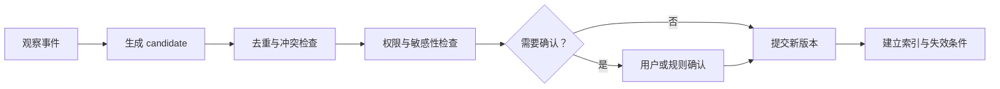

# Memory Engineering

> [!important] 一句话核心
> Memory Engineering 不是保存所有历史，而是决定什么值得跨任务持久化、怎样验证和更新、何时检索回当前 context，以及什么时候必须遗忘。

## Memory 与 Context

Memory 位于模型调用之外。一个信息只有经过检索、权限过滤、选择和组装后，才成为当前 context。

```text
事件或观察
→ memory candidate
→ 写入判断与验证
→ 持久化
→ 未来任务触发检索
→ 选择与组装
→ 当前 context
```

因此，模型拥有大窗口不等于系统拥有可靠长期记忆。

## 四类 Memory

| 类型 | 内容 | 示例 |
|---|---|---|
| Episodic | 发生过的事件和交互 | 用户上次否决了方案 A |
| Semantic | 相对稳定的事实和偏好 | 用户默认使用简体中文 |
| Procedural | 可复用流程与方法 | 发布前必须运行回归测试 |
| Artifact / Reference | 可回查对象和产物 | 设计文档、评测结果、代码版本 |

这些类型可以使用不同 schema、保留期和检索方式。不要把所有内容都压成无来源的自然语言段落。

## Memory 写入门槛

写入前至少判断：

1. **未来价值**：是否可能改善未来任务？
2. **稳定性**：是长期事实还是一次性要求？
3. **来源**：来自用户明确陈述、系统观察还是模型推断？
4. **置信度**：是否需要确认或多个证据？
5. **敏感性**：是否允许持久化和跨任务使用？
6. **作用域**：属于用户、项目、组织还是单一任务？
7. **失效条件**：何时刷新、覆盖或删除？

模型推断的偏好通常只应成为 candidate，不能与用户明确声明拥有同等权威。

## Memory Schema

```yaml
memory:
  id: preference-output-language
  type: semantic
  subject: user-42
  value: zh-CN
  source:
    kind: explicit_user_statement
    event_id: msg-1842
  confidence: 1.0
  scope: user
  created_at: 2026-07-18T10:00:00+08:00
  last_confirmed_at: 2026-07-18T10:00:00+08:00
  valid_until: null
  sensitivity: low
  supersedes: null
```

需要保留 value 之外的 provenance、scope 和 lifecycle，否则后续无法判断是否应该使用。

## 写入流程



对高影响 memory，例如健康、财务、身份或长期行为偏好，应提高确认和删除要求。

## 读取与检索

Memory retrieval 应结合：

- 当前任务和对象。
- user / project / organization scope。
- 时间和版本。
- 来源权威性与置信度。
- 语义相关性。
- 敏感数据授权。
- 与当前明确输入是否冲突。

当前用户消息通常比旧偏好更适用于本次请求。发生冲突时，应使用明确的优先级和更新流程，而不是让模型自行猜测。

## 更新、合并与遗忘

| 操作 | 适用情况 | 要求 |
|---|---|---|
| Refresh | 事实仍存在但需要重新确认 | 更新 confirmed time 和来源 |
| Supersede | 新值替代旧值 | 保留新旧关系和生效时间 |
| Merge | 多条 memory 表达同一稳定事实 | 不丢失来源和例外 |
| Decay | 长期未使用且置信下降 | 降权，不一定立即删除 |
| Delete | 用户要求、合规或已无用途 | 传播到索引、摘要和 cache |

遗忘是产品能力，不是存储清理的副作用。

## Memory Consolidation

多次 episode 可以产生更稳定的 semantic memory，但需要证据门槛。例如多次观察到用户选择简洁回答，可以形成“偏好简洁”的候选；在未明确确认前，应允许本轮请求轻易覆盖，并保留置信度和来源。

不要让模型通过“总结自己的总结”无限强化一个最初不可靠的推断。

## Memory 与 Planning State

- **Planning state** 服务当前任务，应完整、及时和可恢复。
- **Memory** 服务未来任务，应稀疏、稳定和可检索。

任务完成后，可以从 planning state 提取少量可复用决定或经验作为 memory candidate，但不应把完整 scratchpad 和临时错误永久保存。详见 [[14-planning-context|Planning Context]]。

## 评估

- Memory write precision：写入内容中真正值得长期保留的比例。
- Retrieval usefulness：召回 memory 对任务质量的贡献。
- Stale memory rate：过期或被覆盖的 memory 使用率。
- Contradiction rate：memory 与当前明确输入冲突的比例。
- Provenance coverage：memory 可追溯到来源的比例。
- Forgetting completeness：删除请求是否传播到全部副本和索引。
- Personalization lift：使用 memory 相对 baseline 的真实提升。

## 常见误区

> [!warning] “记住更多”不等于“更懂用户”
> 无筛选地持久化会积累错误推断、隐私风险和过时偏好，并在未来请求中产生难以解释的干扰。

- **所有对话都写入 memory**：事件日志和长期记忆职责不同。
- **没有来源的偏好**：无法区分明确声明与模型猜测。
- **旧 memory 覆盖当前请求**：本轮明确意图通常优先。
- **只会追加不会修改**：冲突和过期内容持续累积。
- **删除数据库记录就结束**：还需处理索引、缓存、摘要和派生数据。
- **用向量相似度决定权限**：授权和 scope 必须先做硬过滤。

## 检查表

- [ ] 只有具有未来价值的信息进入 memory candidate。
- [ ] 明确陈述、系统观察和模型推断被区分。
- [ ] 每条 memory 有来源、scope、时间、敏感性和失效条件。
- [ ] 写入前执行去重、冲突、权限和确认检查。
- [ ] 当前用户输入可以按规则覆盖旧 memory。
- [ ] 支持 refresh、supersede、merge、decay 和 delete。
- [ ] 删除传播到索引、摘要和 cache。
- [ ] 用任务质量和错误率评估 memory，而不是只统计命中次数。

## 相关笔记

- [[01-context-architecture|Context Architecture]]
- [[02-context-lifecycle|Context Lifecycle]]
- [[04-context-selection|Context Selection]]
- [[10-conversation-context|Conversation Context]]
- [[12-retrieval-engineering|Retrieval Engineering]]
- [[14-planning-context|Planning Context]]
- [[llm-basic/08-using-assistant-models-in-agents|在 Agent 中正确使用 Assistant Model]]

