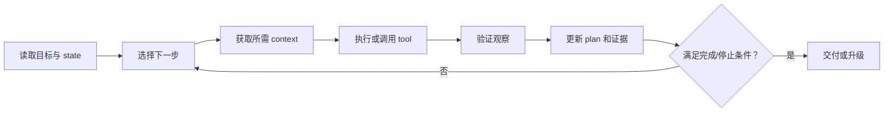

# Planning Context

> [!important] 一句话核心
> Planning Context 是可外部检查和恢复的任务控制面：它保存目标、步骤、决定、证据、错误、预算和完成条件，而不是保存模型不可验证的私有思维过程。

## Planning Context 解决什么

长任务会跨越多次模型调用、tool result、窗口压缩和人工反馈。如果只依赖最近对话，系统容易：

- 忘记原始目标或成功标准。
- 重复已经完成的动作。
- 丢失用户批准、禁止事项或失败记录。
- 在相同错误上反复重试。
- 把局部步骤完成误判为整个任务完成。

Planning Context 把继续任务所需的信息从易失 conversation 中提取为可信 state。

## 最小 Planning State

```yaml
plan:
  task_id: context-docs-20260718
  objective: 创建并验证 Context Engineering 文档专题
  success_criteria:
    - 十三篇目标文档存在
    - 十一类主题全部覆盖
    - frontmatter 与 wikilinks 验证通过
  current_phase: implementation
  completed:
    - 分析 roadmap
    - 用户批准目录设计
  in_progress:
    - 编写文档
  pending:
    - 验证链接
    - 最终审阅
  decisions:
    - 十一主题一类一篇
  blockers: []
  budgets:
    token: null
    time: null
  authorization:
    external_publish: false
```

它不需要记录每个语言模型内部推理 token，只需记录可验证的决定和外部状态。

## 目标层级

| 层级 | 问题 | 示例 |
|---|---|---|
| Objective | 最终为什么做？ | 修复登录失败 |
| Outcome | 完成后什么为真？ | SSO 用户能成功登录 |
| Phase | 当前处于哪一阶段？ | 诊断 root cause |
| Step | 下一项可执行动作是什么？ | 比较失败与成功 token |
| Check | 如何证明步骤完成？ | audience 差异已被证据确认 |

每层都应有可观察的完成条件。模糊的“继续调查”“优化结果”无法支持可靠停止。

## Plan 与执行循环



Plan 不是一次生成后永久不变。新证据、用户修正和失败会触发重新规划，但修改需要保留原因和版本。

## 决策与证据

重要决定应记录：

- 选择了什么。
- 为什么选择。
- 基于哪些 evidence ID。
- 排除了哪些替代方案。
- 哪些假设仍未验证。
- 什么事件会使决定失效。

这比只记录“已决定用方案 B”更容易在 context compaction 后恢复，也更容易审查。

## Checkpoint

在以下时机保存 checkpoint：

- 完成一个阶段。
- 即将压缩、清空或切换 context。
- 高成本或高风险动作之前和之后。
- 用户批准或修改目标之后。
- 外部系统返回不可重复结果之后。
- 发生需要改变策略的错误之后。

Checkpoint 应引用大型 artifact，而不是把全部输出复制进 state。

## Compaction 前的恢复包

```yaml
recovery:
  task_id: incident-1842
  objective: 找到支付失败 root cause
  current_step: validate_gateway_timeout
  completed_steps:
    - reproduce_failure
    - rule_out_database
  open_questions:
    - timeout 是否只发生在 region-a
  evidence_refs:
    - trace-9f2a
    - deploy-20260718
  last_error:
    code: LOG_QUERY_TIMEOUT
    attempts: 1
  next_action:
    tool: query_metrics
    rationale: 日志查询失败，改用聚合指标验证区域差异
```

恢复时重新验证 task ID、版本、权限和 workspace 当前状态。

## 并行与子任务隔离

只有互不依赖的子任务才并行。每个子任务应拥有：

- 局部 objective 和 success criteria。
- 只需要的 context slice。
- 明确的读写权限。
- 结构化结果和 evidence references。
- 合并阶段需要的冲突与未知项。

不要把父任务的完整 context 无差别复制给所有 worker；这增加成本、污染和敏感信息暴露。

## 错误与停止条件

记录每次失败的：

- 时间、步骤和输入版本。
- 错误类型及是否可恢复。
- 已尝试的方法和结果。
- 下一次必须改变的假设或策略。
- 剩余次数、时间和成本预算。

达到重复失败阈值、授权边界、预算上限或缺少必要输入时，应明确停止或向用户升级。

## Planning Artifact 与 Memory

- Planning artifact 为当前任务服务，应详细保存执行状态。
- 任务结束后，只将具有跨任务价值的决定、偏好或经验提取为 [[11-memory-engineering|memory candidate]]。
- 临时 scratch、失败 payload 和一次性计划不应自动成为长期 memory。

## 评估

- Goal retention：长任务中目标和约束是否保持。
- Duplicate action rate：重复执行已完成动作的比例。
- Recovery success：中断后是否从正确步骤继续。
- Plan completion accuracy：声明完成时是否满足全部标准。
- Replanning quality：新证据出现后是否合理更新计划。
- Error diversity：重试是否改变假设或方法。
- Context isolation：子任务是否只接收必要材料。
- State token cost：Planning Context 注入开销。

## 常见误区

> [!warning] Plan 不是内部思维过程的转录
> 系统需要的是可检查的目标、决定、状态和证据，不需要保存模型不可验证、冗长且可能误导的私有推理文本。

- **只有 todo list**：缺少成功标准、证据和停止条件。
- **计划生成后不再更新**：新信息出现后继续执行旧假设。
- **完成步骤等于完成目标**：必须逐条验证 outcome。
- **失败后从头重跑**：浪费已验证状态并可能重复副作用。
- **所有 worker 共享完整 context**：增加污染和权限风险。
- **把 planning state 当 memory**：临时任务细节不应永久保存。

## 检查表

- [ ] Objective、outcome、phase、step 和 check 层级清楚。
- [ ] 当前状态包含 completed、in-progress、pending 和 blockers。
- [ ] 重要决定引用 evidence，并记录失效条件。
- [ ] 压缩和中断前保存最小恢复包。
- [ ] 错误记录尝试次数，并要求下一次改变策略。
- [ ] 并行子任务具有独立 context、权限和结果契约。
- [ ] 完成声明逐项核对全部 success criteria。
- [ ] 任务结束后只提取少量长期 memory candidate。

## 相关笔记

- [[01-context-architecture|Context Architecture]]
- [[03-context-window-management|Context Window Management]]
- [[10-conversation-context|Conversation Context]]
- [[11-memory-engineering|Memory Engineering]]
- [[13-tool-context|Tool Context]]
- [[15-workspace-context|Workspace Context]]
- [[prompt-engineering/13-decomposition-and-agent-workflows|任务拆解与 Agent 工作流]]

