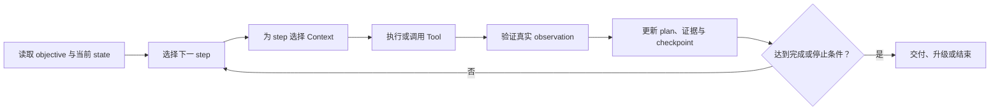

# Planning Context：让长任务能够继续、停止和恢复

> [!abstract] 本篇学习终点
> 为 SSO 排障建立一个可外部检查的 planning state，沿执行、失败、压缩和恢复的过程保存目标、步骤、决定、证据、预算和停止条件；同时理解它为什么不是模型私有思维过程的转录。

## 对话和工具都准备好以后，为什么仍会迷路

SSO 排障可能跨越：

1. 复现 mobile 登录失败；
2. 排除数据库连接问题；
3. 检索并核对 SSO 运行手册；
4. 查询 staging-apac 的运行时配置；
5. 找到最小代码修改点；
6. 运行 focused test 与完整回归（检查修改是否破坏相关已有行为）；
7. 输出补丁、证据和风险说明。

如果只依赖最近对话，Agent 很容易：

- 忘记最初的“不修改生产”；
- 重复已经完成的日志查询；
- 在同一个超时上无限重试；
- 把局部步骤完成当成整个任务完成；
- 压缩窗口后不知道下一个动作；
- 把模型提出的猜测写成已验证事实。

Planning Context 是任务的外部控制面：==保存继续任务所需的可验证状态，而不是保存模型不可检查的私有推理文本。==

模型可以提出计划、调整步骤或总结失败原因，但程序仍要校验字段、证据、授权和当前版本，再把候选写入 planning state。这样保存的是可检查的执行接口，不是模型内部逐字展开的思维过程。

## 先分清目标的五个层级

一个可执行计划不能只有“继续排查”。下面是一组实用层级，字段名可以变化，但从最终目的到可验证动作的依赖不能省略：

| 层级 | 要回答的问题 | SSO 例子 |
|---|---|---|
| Objective | 最终为什么做？ | 修复 SSO 用户登录失败 |
| Outcome | 完成后什么为真？ | mobile 请求按当前规则生成 token 并通过测试 |
| Phase | 当前处于哪一阶段？ | 验证根因 |
| Step | 下一项可执行动作是什么？ | 比较 expected 与 actual audience |
| Check | 如何证明这一步完成？ | 两个值和来源版本已确认 |

每层都需要可观察的完成条件。模糊目标会让模型生成看似合理却无法停止的行动。

## 最小 Planning State

```yaml
plan:
  task_id: sso-login-fix-42
  objective: 修复 SSO 用户登录失败
  outcome:
    - 根因由至少两项证据支持
    - 补丁只修改必要文件
    - focused test 与相关回归通过
    - 未执行生产写入
  current_phase: root_cause_validation
  current_step: inspect_runtime_audience
  completed:
    - reproduce_failure
    - rule_out_database
  in_progress:
    - compare_runbook_with_runtime_config
  pending:
    - locate_minimal_patch
    - run_focused_test
    - run_regression
  decisions:
    - id: decision-focus-mobile
      choice: 只调查 mobile SSO
      rationale: web 对照请求成功
      evidence_refs:
        - log-sso-mobile-20260722
        - log-sso-web-success-20260722
      invalidated_by:
        - 新证据显示 web 也失败
  unknowns:
    - identity_service_runtime_config_version
  blockers: []
  budgets:
    attempts_remaining: 2
    time_remaining_minutes: 30
    token_reserve: 4000
  authorization:
    production_write: false
  checkpoints:
    - id: checkpoint-after-reproduction
      artifact_ref: artifact://sso-reproduction-42
  version: 7
```

它不需要保存每一个内部推理 token，但需要保存决定、来源、版本、失败和下一步，以便别人或下一次模型检查。

## Plan 与执行循环



每次循环都要有“下一步为什么是它”的理由。新证据、用户修正、失败或预算变化可以触发 replanning（根据当前事实重新安排步骤）；计划不是一次生成后永久不变。

### 计划的输入不是完整历史

读取计划时，Context Builder 还要根据当前 step 选择：

- 当前目标与约束；
- 相关 evidence ID；
- 必要 tool 定义；
- workspace snapshot；
- 上一次失败和替代策略；
- 完成条件。

把整个父任务、所有日志和所有 tool payload 复制给每一步，会增加 token 和串线风险。

## 决策要和证据绑定

“采用方案 B”不是足够的决定记录。至少保存：

- 选择了什么；
- 为什么；
- 基于哪些 evidence ID；
- 排除了哪些替代方案；
- 哪些假设仍未验证；
- 什么事件会使决定失效。

例如：

```yaml
decision:
  id: use-config-mapping-patch
  choice: 修正 mobile audience 映射，不改 token 验证算法
  rationale: 运行时 actual audience 与规则不一致，验证代码本身通过 web 对照
  evidence_refs:
    - runbook-sso-v4#audience
    - log-sso-mobile-20260722
    - log-sso-web-success-20260722
  rejected:
    - database-retry-change
    - production-config-write
  assumptions:
    - staging 配置与生产配置可独立验证
  invalidated_by:
    - 运行时查询显示映射已正确
```

这样，窗口压缩后仍能判断为什么选择当前路径，而不是重新猜测。

## Checkpoint 是恢复接口，不是日志堆

应在以下时机保存 checkpoint：

- 完成一个阶段；
- 即将压缩、清空或切换窗口；
- 高成本或高风险动作前后；
- 用户批准或修改目标后；
- 外部系统返回不可重复结果后；
- 发生需要改变策略的错误后。

Checkpoint 应引用大型 artifact，而不是把全部输出复制进 planning state。

### 压缩前的最小恢复包

```yaml
recovery:
  task_id: sso-login-fix-42
  state_version: 7
  objective: 修复 SSO 用户登录失败
  current_phase: patch_validation
  current_step: run_focused_test
  completed_steps:
    - reproduce_failure
    - confirm_audience_mismatch
    - create_local_patch
  open_questions:
    - focused test 是否覆盖 staging-apac 的 client mapping
  evidence_refs:
    - runbook-sso-v4#audience
    - log-sso-mobile-20260722
    - patch-diff@snapshot-19
  last_error:
    code: TEST_FIXTURE_MISSING
    attempts: 1
    changed_strategy: 使用现有 integration fixture（集成测试所需的固定数据与环境），不再重试缺失文件
  next_action:
    tool: run_focused_test
    rationale: 验证补丁而非继续猜测根因
  authorization:
    production_write: false
  workspace_snapshot: snapshot-19
```

恢复时重新验证 task ID、State version、权限和当前 workspace。State version 表示规划记录本身是第几版；workspace snapshot 表示某一时刻的文件、branch、diff 与测试环境。两者变化原因不同，不能用同一个数字互相替代。也不能假设磁盘、branch 或外部服务仍与 checkpoint 创建时相同。

## 错误记录必须推动策略变化

每次失败至少记录：

- 时间、步骤和输入版本；
- error code 与是否可恢复；
- 已尝试方法和结果；
- 下一次必须改变的假设、参数、工具或数据源；
- 剩余次数、时间、token 和副作用预算；
- 何时停止或升级。

同一个 error code 重复出现时，检查是否真的改变了策略。重试次数增加不是 progress。

### 停止条件来自哪些边界

应在计划中明确：

- 重复失败阈值；
- 授权范围；
- 时间、token 和成本上限；
- 缺少不可替代的输入；
- 观察结果不确定且有副作用；
- 成功标准已经满足。

例如，identity config 写操作出现 unknown outcome 时，计划应转入“查询真实状态并请求批准”，而不是继续发送相同写请求。见 [[context-engineering/13-tool-context|Tool Context]]。

## 并行与子任务需要隔离

只有互不依赖的工作才适合并行。这里的 worker 是执行一个局部任务的模型或程序实例；context slice 是从父任务中切出的、完成该局部目标所必需的最小上下文。

- 一个 worker 读取 runbook；
- 一个 worker 分析本地代码；
- 一个 worker 汇总历史 incident。

每个子任务需要自己的：

- 局部 objective 和 success criteria；
- context slice；
- 读写权限；
- 输入与输出 schema；
- evidence references；
- 冲突、未知和失败结果。

父任务不能把完整对话、敏感日志和生产授权无差别复制给每个 worker。合并阶段要保留来源和冲突，不能用多数意见自动当作事实。

## 完成声明必须验证 Outcome

以下状态不是同一件事：

- patch file 已写入；
- focused test 通过；
- 相关回归通过；
- 根因有证据；
- 用户限制没有被违反；
- 任务所有 success criteria 满足。

Plan 应逐项检查 outcome：

```yaml
completion_check:
  task_id: sso-login-fix-42
  criteria:
    - id: evidence-backed-root-cause
      status: passed
      evidence_refs:
        - log-sso-mobile-20260722
        - runbook-sso-v4#audience
    - id: minimal-diff
      status: passed
      evidence_refs:
        - patch-diff@snapshot-19
    - id: focused-test
      status: passed
      evidence_refs:
        - test-report-22
    - id: no-production-write
      status: verified
      evidence_refs:
        - authorization-log-42
  result: complete
```

“完成了五个步骤”不能替代“最终结果满足四个标准”。

## Planning Artifact 与 Memory 不同

Planning artifact 为当前任务服务，应详细、及时且可恢复；Memory 为未来任务服务，应稀疏、稳定、带 scope。

任务结束后可以提取：

- 一条经验证的项目测试流程；
- 一个可回查的 incident artifact；
- 用户明确的长期输出偏好。

不应自动提取：

- 完整 scratchpad（执行过程中产生的临时草稿、尝试和未验证推断）；
- 临时 branch 和路径；
- 一次失败 payload；
- 未确认的推理；
- 当前 pending list。

提取流程见 [[context-engineering/11-memory-engineering|Memory Engineering]]。

## 怎样评估 Planning Context

- **Goal retention**：长任务中目标和约束保留率；
- **Duplicate action rate**：重复已完成动作的比例；
- **Recovery success**：中断后从正确步骤继续的比例；
- **Plan completion accuracy**：声明完成时实际满足标准的比例；
- **Replanning quality**：新证据出现后计划是否合理更新；
- **Error diversity**：重试是否改变方法和假设；
- **Context isolation**：子任务是否只收到必要材料；
- **State token cost**：恢复状态带来的输入开销；
- **Stop precision**：该停止时停止、该继续时不误停。

计划越长不代表越可靠；可验证接口、证据和停止条件才是关键。

## 用三个问题检查本篇

1. 为什么 planning state 需要保存 decision 的 evidence refs 和失效条件？
2. 窗口压缩前，恢复包至少要让下一次模型知道哪些字段？
3. 为什么“所有步骤都标记完成”仍不能直接声明整个任务完成？

下一篇把计划带回真实代码环境：文件、branch、diff、终端和测试都可能在计划之间变化。见 [[context-engineering/15-workspace-context|Workspace Context]]。
