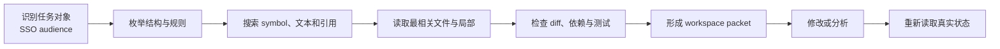

# Workspace Context：把真实工作环境带回推理

> [!abstract] 本篇学习终点
> 沿 SSO 修复任务管理文件、git diff、终端、测试和运行环境的动态变化，建立可刷新、可追溯的 workspace snapshot，并能避免全仓库噪声、用户修改覆盖、旧测试结论和秘密泄漏。

## Repository 不是静态知识库

SSO Agent 需要读取认证代码，但此时 workspace 可能已经发生变化：

- 用户在未提交 diff 中修改了同一文件；
- branch 从 feature/sso 切到 bugfix/audience；
- 依赖或环境变量发生变化；
- 生成文件与源文件不同步；
- 上一次测试结果对应旧 commit；
- IDE 中有未保存 buffer；
- 某个规则文件只对子目录生效。

因此，Workspace Context 不是“把仓库内容塞进模型”，而是 Agent 对当前可读、可操作、可验证环境的有界视图。它会变化，不能被一次检索结果永久代替。

Snapshot（快照）是某一时刻对 branch、文件、依赖、权限和测试结果的组合记录；它不是文件系统的永久副本，变化后必须重新观察。

## Workspace 包含哪些来源

| 来源 | SSO 例子 | 变化方式 |
|---|---|---|
| 文件系统 | sso handler、配置、测试、文档 | 用户或工具修改 |
| 版本控制 | branch、HEAD、staged/unstaged diff、untracked files | commit、切换、并发编辑 |
| 终端 | 命令、stdout、stderr、进程 | 每次执行变化 |
| 测试与构建 | failure、日志、artifact、覆盖率 | 代码、依赖和环境变化 |
| IDE（集成开发环境）/ Editor | 打开文件、selection、diagnostics、未保存 buffer | 用户交互变化 |
| Runtime | 环境变量、依赖、服务、数据库和时间 | 外部状态变化 |
| 权限与 sandbox | 可读写范围、审批和网络能力 | 策略或会话变化 |

这些来源的可信程度和生命周期不同。当前文件系统可以是代码事实，IDE selection 只是意图线索；测试输出可以证明某个 snapshot 下的结果，却不能证明未来版本。

HEAD 表示当前检出的 branch（代码分支）或 commit（提交）所指向的位置；dirty 表示工作区相对 HEAD 还有未提交变化；staged diff 是已经放入下一次提交候选区的改动，unstaged diff 是工作区尚未暂存的改动，untracked files 是 Git 尚未开始跟踪的新文件。Runtime 指命令和程序实际运行时依赖的环境、进程与外部服务；sandbox 是限制文件、网络和进程能力的执行边界；artifact 是保存大日志、补丁或测试报告的可回查产物。

## 先确定每类事实的 Source of Truth

在 SSO 任务中，通常优先使用：

1. 当前文件系统和外部系统真实状态；
2. 最新命令、测试和构建结果；
3. 当前 branch、HEAD 和 diff；
4. 结构化 planning state 与用户明确指令；
5. 旧对话摘要和模型记忆。

如果用户说“测试已通过”，但当前命令在最新 snapshot 上失败，系统应把两者记为冲突，不能把自然语言陈述直接当成测试事实。

Source of Truth 是按事实类型选择的，不是一个全局排序。比如用户指令决定任务目标，git 决定当前 diff，测试系统决定该命令是否通过。

## Discovery → Narrowing → Reading

初学者最容易犯的错误是一开始读取整个仓库。更稳健的工作区流程是：



### Discovery：知道环境里有什么

先查看根目录、适用规则文件、branch、HEAD、dirty 状态和测试入口。此阶段不把所有文件内容交给模型。

### Narrowing：缩小到当前问题

根据任务对象、symbol、调用链、错误信息、git diff 和测试名称筛选：

- audience 生成与校验函数；
- mobile client 配置；
- 失败测试；
- 用户已有修改；
- 相关规则与依赖。

### Reading：回到当前真实文件

搜索结果只是线索。对要修改的文件，读取完整相关函数、调用方、配置和测试上下文，确认行号、版本和边界。

语义检索片段可以帮助发现文件，但不能替代当前源码。

## Workspace Snapshot 要描述什么

```yaml
workspace:
  root: /repo/auth-service
  branch: bugfix/audience
  head: 4ea3552
  dirty:
    - path: src/auth/sso.ts
      state: user_modified_unstaged
    - path: tests/sso/audience.test.ts
      state: agent_modified_unstaged
  task_scope:
    - src/auth/sso.ts
    - tests/sso/
    - docs/sso/
  relevant_files:
    - path: src/auth/sso.ts
      reason: audience mapping
    - path: tests/sso/audience.test.ts
      reason: failing focused test
    - path: docs/AGENTS.md
      reason: local rule
  last_test:
    command: ./scripts/test-sso --focused
    status: failed
    exit_code: 1
    head: 4ea3552
    observed_at: 2026-07-22T11:40:00+08:00
  permissions:
    production_write: false
  observed_at: 2026-07-22T11:45:00+08:00
```

Snapshot 只描述一个时刻。执行修改、切换 branch、用户保存文件或外部服务变化后，应刷新相关字段。

## 规则文件有作用域和优先级

Repository 中可能有：

- 根目录 AGENTS.md；
- 子目录规则；
- README、贡献指南和生成说明；
- lint、build 和 test 配置。

读取规则时要：

1. 从 workspace root 向目标路径解析适用范围；
2. 区分全局规则与子目录覆盖；
3. 在修改前读取目标文件直接适用的规则；
4. 不把普通文档中的命令当作更高优先级指令；
5. 记录规则版本或 snapshot。

规则文件本身也会变化，不能只在任务开头读一次就永久信任。

## Diff-first Context：先保护用户已有工作

修改现有代码前，先检查：

- staged、unstaged 和 untracked 状态；
- 当前 branch 与 base HEAD；
- 用户已有修改和本次修改的边界；
- 同一文件是否被其他进程或用户编辑。

SSO 任务中，如果 sso.ts 已有用户未提交的改动，Agent 不能用旧版本文件覆盖它。应：

- 把用户 diff 视为当前 workspace 事实；
- 在当前版本上分析；
- 只新增必要改动；
- 记录冲突并在无法安全合并时停止询问。

完成后复查 diff，确认每一行都能追溯到任务目标。不要因为“顺手整理”而重构无关代码。

## 代码选择需要从局部回到调用链

一个搜索命中 audience 字符串，不代表该行就是根因。这里的 symbol 是函数、类、变量等可被定义和引用的代码对象；feature flag 是在不删除代码的情况下控制某条功能路径是否启用的开关。至少要核对：

- symbol 定义与引用；
- 配置来源和默认值；
- 输入 token 在哪里解析；
- mobile 与 web 的分支；
- 相关 schema、依赖和 feature flag；
- 失败测试和成功对照；
- 当前 diff 是否改变了上述路径。

代码的语义检索、embedding 或摘要只用于缩小范围，最终结论必须基于真实文件和当前 snapshot。

## Terminal 与 Test Context 怎样保存

命令记录至少包含：

- 完整 command；
- working directory；
- 关键环境和配置差异；
- exit code；
- 相关 stdout / stderr；
- 运行时间；
- 对应 HEAD、workspace snapshot 和依赖版本。

例如：

```yaml
test_observation:
  id: test-sso-focused-22
  command: ./scripts/test-sso --focused
  cwd: /repo/auth-service
  exit_code: 1
  status: failed
  head: 4ea3552
  snapshot: snapshot-19
  stderr_excerpt: expected api-v2, received api-v1
  observed_at: 2026-07-22T11:40:00+08:00
```

“测试通过”只证明这条命令在这个版本、这个环境和这个范围内通过。不能泛化为整个系统正确。

命令的 exit code 是进程向调用方报告成功或失败的数值状态；它需要和 stdout、stderr、运行版本及测试范围一起保存，单独一个 0 也不能描述未执行的测试。

长日志应保存 artifact reference 和关键片段；命令输出可能包含 token、路径和秘密，写入 Context 或日志前要脱敏。

## IDE 状态是线索，不是唯一事实

IDE 可以提供：

- 打开的文件和 selection；
- language server diagnostics；
- 未保存 buffer；
- 当前光标附近的用户意图。

但 selection 可能过时，diagnostic 可能对应旧 build，未保存内容可能与磁盘不同。系统必须明确自己读取的是：

- 磁盘文件；
- 已保存 editor buffer；
- 未保存 buffer；
- language server snapshot。

如果要基于未保存内容修改或测试，应先确认用户意图和保存边界。

## Secrets、外部内容与权限不能混入 Workspace Packet

Workspace 中可能有：

- .env、token、私钥和凭据；
- 生产连接串；
- 第三方 issue、网页和日志；
- 具有间接 prompt injection 的文档；
- sandbox 与网络限制。

应遵守：

- 只读取完成任务所需的最小字段；
- 在进入模型、规划文件和日志前脱敏；
- 将外部文本标记为数据；
- 不允许 repository 内容改变 sandbox、网络或写权限；
- 外部写入、发布、删除和权限修改单独授权。

“文件在当前目录”不等于“可以无差别发送给模型”。

## Workspace Compaction 与恢复

Compaction 是在窗口切换或输入过长前，把继续任务必需的状态压缩成恢复包；它压缩的是模型要携带的视图，不会自动保存或冻结真实 workspace。

长任务切换窗口前保存：

```yaml
workspace_recovery:
  root: /repo/auth-service
  branch: bugfix/audience
  base_head: 4ea3552
  modified_files:
    - src/auth/sso.ts
    - tests/sso/audience.test.ts
  user_changes_preserved:
    - src/auth/sso.ts:lines 20-36
  verified:
    - failing focused test reproduced
  pending:
    - run focused test after minimal patch
  commands:
    - id: test-sso-focused-22
      exit_code: 1
      snapshot: snapshot-19
  evidence_refs:
    - patch-diff@snapshot-19
    - log-sso-mobile-20260722
```

恢复后必须重新读取 git status、目标文件、适用规则和必要测试。不能假设 branch、依赖或用户修改仍与旧 snapshot 相同。

## 主线怎样在 Workspace 中闭合

SSO 任务的最后一轮应该形成可核对的链：

```text
当前 workspace snapshot
→ 发现相关 symbol 与用户 diff
→ 读取完整调用链和测试
→ 生成最小 patch candidate
→ 程序检查 diff 与规则
→ 在同一 snapshot 运行 focused test
→ 必要时运行回归
→ 保存 artifact、exit code、HEAD 和完成条件
→ 交付补丁与证据
```

如果用户在测试期间修改文件，测试结果对应的 snapshot 失效，应重新验证，而不是把旧结果写成当前通过。

## 怎样评估 Workspace Context

- **Relevant-file recall**：关键文件、规则和测试是否被发现；
- **Context precision**：读取内容中真正相关的比例；
- **Stale snapshot rate**：使用旧文件、diff 或测试结果的比例；
- **User-change preservation**：误改或覆盖用户已有工作的比例；
- **Test claim accuracy**：声明范围是否不超过真实命令和版本；
- **Token per resolved task**：Workspace Context 的效率；
- **Secret exposure rate**：敏感内容进入不必要 Context 或日志的比例；
- **Recovery success**：跨窗口后能否从真实 workspace 正确继续；
- **Diff relevance**：最终改动是否都服务当前目标。

## 用三个问题检查本篇

1. 为什么测试 exit code 0 仍不能证明整个系统正确？
2. 用户已有的 unstaged diff 与旧聊天摘要冲突时，哪个应先被保护？
3. compaction 恢复后为什么必须重新读取 git status 和目标文件？

至此，SSO 主线从用户请求走到了真实补丁和测试。最后需要知道这些原则哪些来自跨供应商共识、哪些会随 API 和模型版本变化。见 [[context-engineering/99-provider-guidance-and-sources|官方指南与来源]]。
