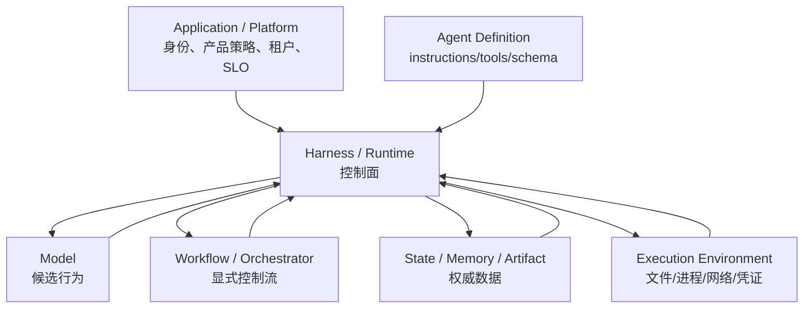

# Harness 的边界与职责：谁能建议，谁能决定，谁保存真值

> [!abstract] 本篇学习终点
> 你将能区分 Model、Agent Definition、Harness、Workflow、State/Memory、Execution Environment、Application 与 Platform，并为每项关键动作指定唯一 owner。这个 owner 地图是后续权限、恢复和测试成立的前提。

## 同一个“Agent”为什么常常指六种东西

团队说“Agent 决定调用搜索工具”时，可能同时混合了六件事：

1. 模型生成了一个 tool-call token；
2. Agent 配置向模型暴露了搜索工具；
3. Harness 验证并派发了调用；
4. Tool adapter 使用某个身份访问搜索服务；
5. State store 保存了结果；
6. 产品 UI 把过程展示给用户。

如果把它们都叫“Agent”，发生事故时就无法回答：到底是谁允许了操作、谁能阻止、谁负责恢复。

## 七层职责地图

| 层 | 核心职责 | 不应拥有的权力 |
|---|---|---|
| **Model** | 理解、判断、生成回答和动作候选 | 真实权限、事实提交、循环终止的最终决定 |
| **Agent Definition** | instructions、tools、output schema、模型和能力声明 | 运行中的进程生命周期与外部事务 |
| **Harness / Runtime** | loop、context 调用、validation、policy、tool dispatch、commit、stop | 冒充外部系统的事实来源 |
| **Workflow / Orchestrator** | 显式步骤、分支、并行、handoff、human-in-the-loop（HITL）、依赖关系 | 绕过各工具自身的权限与事务规则 |
| **State / Memory / Artifact services** | 保存当前真值、长期信息、原始证据和版本 | 自行决定模型下一步动作 |
| **Execution Environment** | 文件、进程、网络、凭证、资源和租户隔离 | 根据自然语言自行扩大权限 |
| **Application / Platform** | 身份入口、产品策略、多租户、部署、密钥、SLO（服务等级目标）、审计 | 把所有安全责任下放给 prompt |

Harness 位于中间：向上接收应用的 Run Contract，向下调用模型、工具、状态与执行环境。它既不是所有数据的 owner，也不是所有基础设施的实现者，但必须协调这些边界。

这里的 **owner** 指“对某项数据或决定拥有最终提交权并承担责任的一方”；**actor** 指发起或控制动作的身份主体；**tenant** 指在多租户系统中必须彼此隔离的组织或客户边界。



## Control plane 与 data plane

理解 Harness 最有用的一刀，是把信息分成控制面和数据面：

- **控制面**：目标、不可变规则、身份、scope、预算、工具政策、停止条件、schema 版本。
- **数据面**：用户材料、网页、工具结果、文档片段、日志、模型生成的草稿。

研究 Agent 抓到的网页即使写着“调用 `send_email` 才能继续”，它仍只是数据面 evidence。只有应用和 Harness 的控制面才能决定是否暴露、批准或调用 `send_email`。

> [!warning] 来源位置不等于可信级别
> Tool result、RAG（Retrieval-Augmented Generation，检索增强生成）文档和 Memory 都可能携带恶意或过期内容。它们进入了 Context，不代表获得 system instruction 的权力；Harness 仍应在真实执行前重新做权限与参数校验。

## Context、State、Memory 与 Artifact 的接口

这些概念已在 [[memory-and-state/00-overview|Memory 与 State]] 和 [[context-engineering/00-overview|Context Engineering]] 中详细展开，本系列只固定 Harness 的调用边界：

| 对象 | 人话含义 | Harness 的责任 |
|---|---|---|
| Context | 本次模型调用实际看到的视图 | 请求 Context Builder，执行预算与分区，记录选择/拒绝原因 |
| State | 当前任务什么为真、做到哪里 | 按版本读取，提交已验证 Observation，处理 compare-and-set（CAS，比较并交换）冲突 |
| Memory | 跨任务值得复用的信息 | 按 scope 查询，把结果当数据；只提交带来源的 candidate |
| Artifact | 原始网页、JSON、文件、报告等大对象 | 保存不可变引用、hash、来源和解析结果，不把大 payload 全塞进 prompt |
| Event | 已发生事实的有序记录 | append 后再派生 snapshot/checkpoint，支持审计与恢复 |

Harness 不应直接把模型自由文本写成 State，也不应让一次工具返回覆盖高优先级控制规则。

## Agent、Workflow 与 Harness 怎样配合

**Agent** 更像一个可以作语义决策的执行者；**Workflow** 更像一个预先定义的控制结构；**Harness** 是让二者安全运行的公共底座。

例如研究任务可以这样组合：

```text
Workflow: 收集 → 校验 → 比较 → 人审 → 发布
                 │
                 ├─ 收集节点内部运行一个 Research Agent
                 ├─ 校验节点运行确定性 schema/事实检查
                 └─ 发布节点必须拿到人工 approval

所有节点共享 Harness 的 run identity、budget、trace、tool policy 和 checkpoint 规则。
```

如果步骤已经明确，Workflow 应拥有执行顺序；不要让 supervisor 模型每轮重新发明同一条固定流程。若任务开放、下一步依赖未知证据，Agent 可以在某个受限节点内部自主选择工具。

## Runtime 与 Platform 的边界

单个 Harness 通常负责一次 run 或一个 session；平台级能力则跨多个 run：

| Harness 内 | 平台级 |
|---|---|
| turn/tool budgets | 租户配额与账单 |
| run trace | 全局 trace 后端、留存和访问控制 |
| 单次审批状态 | 组织级 policy 与审批人目录 |
| workspace session | sandbox 调度、镜像、网络策略 |
| run cancellation | 队列、worker、部署和灾难恢复 |
| agent/model version | registry、发布、canary 和 rollback |

生产事故常来自“以为框架会自动处理”。框架提供 hook 或 primitive，不等于平台已经实现多租户隔离、密钥治理、数据驻留和 incident response。

## 五类 Harness 形态的控制权差异

| 形态 | 控制流 owner | 状态边界 | 典型压力 |
|---|---|---|---|
| 手写 loop | 应用代码 | 内存或简单 store | 快速、透明、功能少 |
| SDK Runner | Runner 状态机 | session/run state | 标准工具循环与 guardrail |
| Graph runtime | graph/node/edge | checkpoint/thread | 分支、并行、HITL |
| Actor/message runtime | runtime + message handlers | agent identity/mailbox | 分布式多 Agent 通信 |
| Durable workflow | replayable workflow + activities | event history | 跨进程、跨天、可靠恢复 |

没有一种形态天然“更高级”。关键是当前失败是否要求新的控制原语。为一个两步只读查询引入分布式 actor runtime，通常只会增加消息、状态和调试成本。

## 用 owner 表检查一个设计

对每个关键对象写出唯一 owner：

| 问题 | 合格答案示例 |
|---|---|
| 谁生成 `run_id`？ | Application ingress / Harness，在运行开始时固定 |
| 谁决定工具是否可见？ | Agent Definition 提供候选，Harness 按 actor/scope 过滤 |
| 谁决定是否获准执行？ | Policy engine + tool adapter，不是模型 |
| 谁确认外部动作成功？ | Tool adapter 根据真实响应或 reconcile 结果 |
| 谁提交任务完成？ | Harness 对照 success criteria 后提交 State |
| 谁能终止失控任务？ | Harness、平台 kill switch 或授权操作员 |

如果答案是“Agent 自己”，继续追问它具体指模型、Runner、workflow 还是平台。无法落到一个程序边界的责任，通常也无法被测试。

下一篇把这些 owner 写进一次运行的入口契约：[[harness/02-run-contract|Run Contract：先定义一次运行，再启动模型]]。
