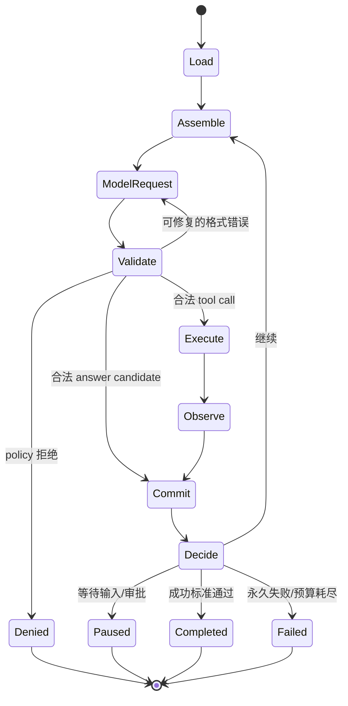

# 最小 Agent Loop：让 think → act → observe 成为受控状态机

> [!abstract] 本篇学习终点
> 你将能把一个 Agent turn 拆成读取、组装、模型候选、验证、工具执行、Observation、提交和停止八个阶段；能解释为什么工具执行与状态提交不能藏在模型调用里，以及取消、streaming 和重试为什么属于同一个 loop contract。

## ReAct 只描述了认知节奏，还没有给出生产运行时

常见简写是：

```text
Thought → Action → Observation → Thought → ...
```

它很好地说明了模型如何利用环境反馈，但没有回答 Action 如何授权、Observation 如何确认、崩溃后从哪里继续。工程上的最小 loop 应展开为：

```text
load → assemble → model → parse → validate
     → execute → observe → commit → decide
```

其中模型只拥有 `model` 阶段；其余阶段由 Harness 或下游确定性组件拥有。

## 一轮的完整状态机



### 1. Load：读取权威状态

按 `task_id` 和 `expected_version` 读取 State、未解决 tool effects、approval 和必要 artifact 引用。恢复时先处理 `unknown_after_crash`，不能直接重新向模型提问。

### 2. Assemble：构造本轮 Context

Context Builder 依据当前 step 选择控制规则、任务状态、Memory、证据和工具 schema。它输出的是本轮只读视图，不是权威数据库的完整复制。

### 3. Model request：生成候选

Model adapter 统一不同 provider 的输入输出、streaming、usage 和错误分类。返回值仍是 `answer_candidate`、`tool_call_candidate` 或 `handoff_candidate`。

### 4. Parse + Validate：先验证再执行

至少检查：

- 输出是否符合当前 schema；
- tool 名称和版本是否存在；
- 参数能否从 JSON 重建为真实类型；
- actor/scope 是否允许；
- State version 是否仍匹配；
- budget 和 deadline 是否允许新动作；
- 是否需要 approval；
- operation 是否已完成或处于 unknown。

只有格式错误且明确可修复时，才把结构化错误反馈给模型重试。权限拒绝不应靠模型“换个说法”绕过。

### 5. Execute：通过 adapter 产生真实副作用

Tool adapter 负责身份绑定、timeout、幂等键、rate limit、取消和底层异常映射。模型不能直接拿数据库连接、浏览器 token 或 Shell 进程句柄。

### 6. Observe：把结果分类

统一的 Observation 至少包含：

```json
{
  "status": "success | retryable_error | permanent_error | unknown",
  "operation_id": "vendor-report-43:fetch:vendor-a:v1",
  "tool_call_id": "call-004",
  "artifact_ref": "artifact://vendor-a/price-17",
  "observed_at": "2026-07-23T10:14:03+08:00",
  "error_code": null
}
```

Tool result 是环境观察，不是新的 system instruction。原始大结果放 Artifact，Context 中只保留状态、关键字段和引用。

### 7. Commit：把发生过的事实原子写入

推荐顺序：

```text
append observation event
→ 更新 tool-effect ledger
→ compare-and-set snapshot
→ 写 safe checkpoint
→ 完成 trace span
```

如果 CAS 冲突，重新读取并归并，不能直接覆盖并行 worker 的新状态。

### 8. Decide：Harness 决定下一状态

Harness 对照 success criteria、pending steps、errors、approval、budget 和 cancellation，返回 `continue / pause / stop`。模型说“DONE”只能作为信号之一。

## 最小伪代码

```python
def run(contract, services):
    state = services.state.load(contract.task_id)
    validate_ingress(contract, state)

    while True:
        check_cancelled(contract)
        check_budgets(contract, state)
        reconcile_unknown_effects(state, services.tools)

        packet = services.context.build(contract, state)
        candidate = services.model.generate(packet)
        action = validate_candidate(candidate, contract, state)

        if action.kind == "tool":
            observation = services.tools.execute(
                action,
                actor=contract.actor,
                idempotency_key=action.operation_id,
            )
        else:
            observation = validate_answer(action, contract.output)

        state = services.state.commit(
            expected_version=state.version,
            observation=observation,
        )

        decision = decide_next(contract, state)
        if decision.kind != "continue":
            return decision
```

这段伪代码刻意把每个边界暴露出来。把 `model.generate()` 写成一个会偷偷执行工具、修改 State 并自动 retry 的黑盒，会让权限、成本和恢复难以独立测试。

## Tool lifecycle 不能只有“调用成功/抛异常”

一次工具请求至少经历：

```text
discovered → selected → validated → approval_pending
→ started → completed | failed | unknown
→ result_validated → committed
```

工具发现、审批和 invocation 必须分离。恢复时已批准的 call 要保留 identity；已完成的 call 不能因重新 discovery 而重复执行；并发 sibling 中一个失败也不应自动抹掉其他已完成结果。

## Retry 放在哪一层

| 失败 | 处理位置 | 原因 |
|---|---|---|
| provider 短暂 429/5xx | Model adapter | 请求语义相同，可做有界退避 |
| 模型输出 JSON 不合法 | Validator → model retry | 给结构化错误，消耗 retry budget |
| tool 参数越权 | Policy gate | 直接拒绝，不自动改写权限 |
| 只读 API timeout | Tool adapter / scheduler | 可按策略重试，仍记录每次 attempt |
| 写操作响应丢失 | Reconciler | 状态 unknown，禁止盲重试 |
| State CAS 冲突 | Commit layer | 重读、归并或重新规划 |

Retry 必须有 owner、上限和幂等语义。多个层都“自动重试三次”会把一次动作放大成不可见的重试乘积。

## Cancellation 是一条贯穿全链的协议

用户取消后不能只停止向 UI 输出。Harness 要：

1. 停止创建新的 model/tool work；
2. 向进行中的请求传播 cancel signal；
3. 等待 tool、stream、background process 和 exporter 做有界清理；
4. 把已发生 Observation 提交或标为 unknown；
5. 保存 `cancelled` stop reason 和可恢复 checkpoint。

“立即返回”与“资源已安全清理”是两件事。对外可以迅速确认取消，对内仍要等待有界 cleanup 完成。

## Streaming 必须与非流式共享语义

Streaming 只是交付方式，不应形成另一套业务规则：

- turn 计数、guardrail、tool result、State commit 与 stop reason 应一致；
- partial text 可能已暴露，最终 output guard 无法事后撤回；
- 中途取消时要关闭 provider stream 并等待清理；
- 不要把尚未验证的 partial tool arguments 当成可执行请求。

因此高敏感输出应先完整验证再展示，或使用能逐块执行策略的专用流式过滤器，而不是依赖最终检查。

## 何时这个最小 loop 已经不够

出现以下压力时，才升级结构：

- 固定分支、并行和 HITL 变多：引入 graph/workflow；
- run 跨进程、跨天且外部依赖多：引入 durable workflow；
- 多个独立 actor 通过消息协同：引入 message/actor runtime；
- 文件、Shell、浏览器和多租户成为主风险：引入平台级 sandbox 与 policy。

下一篇先处理 loop 每轮都会面对的第一类风险：[[harness/04-context-and-policy|Context、结构化输出与 Policy Gate]]。
