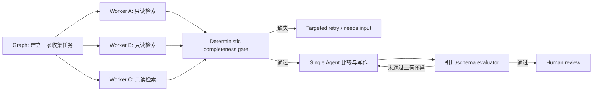

# 编排模式：什么时候让模型决定，什么时候把路径写进代码

> [!abstract] 本篇学习终点
> 你将能根据控制流是否已知、步骤是否可并行、失败是否要隔离、状态是否要持久化来选择单 Agent loop、deterministic workflow、graph、handoff、supervisor-worker、evaluator-optimizer 或 event-driven runtime，并理解多 Agent 引入的真实成本。

## 先问：不确定性到底在哪里

研究 Agent 的“查哪一个关键词”可能需要模型判断，但“三家供应商都收集完后再比较”是确定的。如果把整条流程都交给模型，它每轮都要重新发现固定依赖；如果把所有细节写死，又无法适应网页内容差异。

比较稳的组合是：

```text
确定性 Workflow：收集三家 → 完整性检查 → 比较 → 人审 → 交付
                         │
                         └─ 每个“收集”节点内部运行受限 Agent loop
```

原则是：**已知控制流写进代码，未知语义判断交给模型。**

## 八种常见模式

### 1. 单 Agent + 多 Tool

一个 bounded loop 依据 Observation 选择下一工具。适合开放但规模有限的任务，是默认起点。

优点：上下文连续、调试简单、成本低。缺点：固定依赖不够显式，长任务容易膨胀。

### 2. ReAct

模型交错产生 reasoning/action，并用 Observation 更新下一步。Harness 负责 action validation、tool execution、budget 和 stop。

ReAct 是 loop 内的决策策略，不等于完整 Harness；它不自动提供权限、恢复或事务。

### 3. Plan-and-execute

先生成结构化 plan，再逐步执行并在证据变化时重规划。Plan 是候选工作列表，不是已完成事实。

适合依赖关系较清楚的长任务。需要防止过度规划、计划过期和“把 todo 勾选当成真实成功”。

### 4. Deterministic workflow

顺序、并行、循环、条件分支由代码或图定义，不由模型临时决定。适合合规流程、固定数据管线和可预测的 HITL。

Google ADK 的 sequential/parallel/loop workflow 和各框架的 Flow/graph 都属于这一类。

### 5. Router / Handoff

- **Router** 选择一个已知分支，控制权通常仍在上层 runtime。
- **Handoff** 把后续对话或任务控制权交给另一个 Agent，并携带最小必要上下文。

Handoff 需要明确谁能接管、共享哪些 State、budget 如何继承、失败后回到哪里。

### 6. Supervisor–worker / Orchestrator–worker

Supervisor 拆任务，worker 在隔离上下文中执行，最后汇总。适合可独立 fan-out 的来源检索。

Worker task 必须自包含：目标、输入、scope、输出 schema、budget 和完成标准。不要把完整父 Context 无差别复制给每个 worker。

### 7. Evaluator–optimizer

生成器产出候选，评审器按 rubric 返回具体缺陷，再迭代到质量门或预算上限。适合标准清晰但一次生成不稳定的任务。

Evaluator 不应拥有无限循环权；同一个模型自评也可能共享盲点，应使用确定性检查、独立模型或人工抽样校准。

### 8. Event-driven actor/message runtime

多个 Agent 以异步消息通信，runtime 管 identity、mailbox、delivery 和 lifecycle。适合分布式、长期存活或跨组织的 Agent 网络。

它带来重复消息、乱序、背压、消息 schema、权限传播和分布式 trace 等新问题，不是小型多 Agent 的默认选择。

## Graph 与动态工作流

**Graph workflow** 适合拓扑和消息类型相对稳定：节点、边、条件、fan-out/fan-in 都可观察和 checkpoint。

**Dynamic/scripted workflow** 让模型生成一段受沙箱限制的编排代码，在一次 tool call 内调用多个子 Agent。它可以减少父 Agent 的往返与 Context 污染，但必须有：

- sandbox 和静态/运行时校验；
- `max_agent_calls`；
- 子 Agent token/resource budget；
- 并发上限；
- 失败后复用已完成结果的机制；
- 禁止无限递归或任意系统 API。

只有“编排本身”成为主要复杂度时才值得使用。偶尔委派一次任务，普通 `delegate_task` 更清楚。

## 搜索型推理放在 Harness 的哪里

Tree of Thoughts、Graph of Thoughts、LATS 等方法把多个候选 thought/trajectory 展开、评分、合并或回溯。工程上应把它们看成 **有预算的搜索策略**：

- 节点/分支数、深度和 token 有硬上限；
- evaluator 的分数不是事实，需要环境验证；
- 已执行外部副作用不能像纯 thought 一样任意回溯；
- 搜索树/图应进入 trace，而不是隐藏在一次黑盒调用中。

如果直接 baseline 已满足质量，不要为“更像 Agent”而增加搜索。

## 模式选择矩阵

| 任务压力 | 首选模式 |
|---|---|
| 下一步开放、工具少、单上下文足够 | 单 Agent + 多 Tool |
| 先拆解能明显降低漏步 | Plan-and-execute |
| 步骤与依赖固定、需要精确控制 | Deterministic workflow |
| 固定类别分流 | Router |
| 专家要接管后续对话 | Handoff |
| 多个独立子问题可并行 | Supervisor–worker |
| 有明确 rubric，需要迭代改进 | Evaluator–optimizer |
| 固定拓扑、checkpoint、HITL、类型路由 | Graph runtime |
| 大量动态 fan-out/chaining 且需减少往返 | Sandboxed dynamic workflow |
| 跨进程 Agent 以消息长期协作 | Actor/message runtime |
| 跨天、可靠重放和外部事务协调 | Durable workflow |

## 多 Agent 的成本账单

多 Agent 会增加：

- 每个 worker 的 instructions、tool schema 和上下文 token；
- 上下文切割导致的信息丢失；
- 消息格式与版本管理；
- 权限委派和身份追踪；
- 并发、取消、部分失败与重复结果；
- 轨迹评测与 trace 拼接难度。

因此先问：这个角色真的需要独立 context、tools、policy 或生命周期吗？如果只是固定函数或一次专门检查，用普通代码/tool 往往更合适。

## 一个研究任务的推荐组合



控制流由 graph 拥有，worker 只读且隔离，写作 Agent 不负责发布，人工审批是持久节点。这比一个“全能 supervisor”更容易测试。

下一篇解决编排一旦跨进程和故障后最棘手的问题：[[harness/07-durable-runtime|持久运行时、重试与恢复]]。
