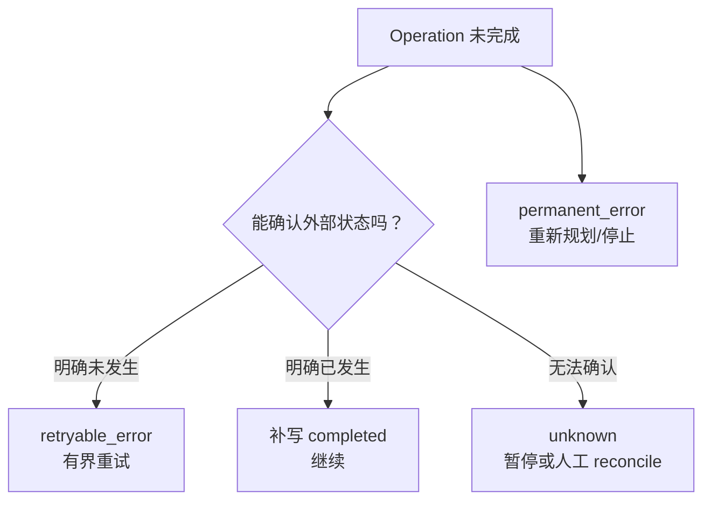

# Durable Runtime：崩溃、重试、取消和恢复怎样不重复做错事

> [!abstract] 本篇学习终点
> 你将能区分 Event、Snapshot、Checkpoint 与 Tool-effect ledger；能为 retryable、permanent、unknown 建立不同恢复路径；能解释 Temporal replay、LangGraph interrupt/resume 和 provider-valid snapshot 的共同原则，并设计 HITL、取消与版本迁移边界。

## 最危险的崩溃点：外部动作之后，状态提交之前

研究 Agent 登录供应商后台并保存了导出任务，外部系统已创建 job；就在响应返回前，worker 崩溃：

```text
Harness        Supplier API        State Store
   | POST create job |                 |
   |---------------->|                 |
   |   job created   |                 |
   X process crash                     |
   |                                   |
```

重启后 State 里没有“成功”，但这不代表外部动作没发生。盲目重试可能创建第二个 job。Durability 的核心不是“多存几个聊天消息”，而是让每个副作用边界可识别、可确认、可恢复。

## 四类持久对象

| 对象 | 保存什么 | 用途 |
|---|---|---|
| Event | 已发生事实的 append-only 记录 | 审计、重建、因果顺序 |
| Snapshot | 某时刻 State 的物化视图 | 快速读取，不必重放全部事件 |
| Checkpoint | 可安全恢复的控制边界 | pause/resume、分支、回滚到已知点 |
| Tool-effect ledger | 外部调用 started/completed/failed/unknown | 幂等、reconcile、避免重复副作用 |

Snapshot 不一定可直接恢复模型会话。例如 message history 里存在 tool call 却没有 matching tool result，provider 可能拒绝。可继续的 checkpoint 应保证协议结构和业务状态都完整。

## Safe boundary 而不是任意指令位置

一个安全恢复点通常位于：

- 一组 tool calls 全部得到 terminal Observation 后；
- Event 与 Snapshot 已原子提交后；
- approval request 已持久化后；
- model response 已完整验证后；
- workspace/artifact 引用已可用后。

中途 crash 可以留下 event trail，但不能假装存在完整 snapshot。恢复应退回最近 safe boundary，再结合 effect ledger 处理边界之后可能发生的动作。

## 失败分类决定恢复算法



- **Retryable**：明确没有成功，且相同语义重复执行安全。
- **Permanent**：权限、参数或业务条件固定失败，重试不会改变结果。
- **Unknown**：可能已成功，不能自动当失败。

错误分类应由最了解协议的 adapter 完成，不应让上层只根据异常类名猜测。

## Idempotency 不是“所有请求都重试”

真正的幂等需要：

1. 同一业务效果使用稳定 idempotency key；
2. 外部系统或 adapter 保存 key→result 映射；
3. 重试返回原结果或确认最终状态；
4. 不同业务意图生成新 key；
5. ledger 记录每次 attempt 与外部 ID。

若供应商 API 不支持幂等键，应优先设计查询/reconcile 接口，或把写操作放到人工审批后的单一 worker 中。

## Replay 的共同原则

Temporal 的 Workflow 使用 Event History 重放代码，要求相同 history 下做相同决定；网络、数据库、LLM 和文件 I/O 放在 Activity 中，重放时复用已记录结果，而不是再次执行外部工作。

这个原则可以推广到 Agent Harness：

```text
可重放控制逻辑：分支、计数、状态归约、stop 判断
不可直接重放的外部活动：LLM、HTTP、数据库写、文件/浏览器操作
```

即使不用 Temporal，也应把“决定做什么”和“真的对外做了什么”分离。

## Graph resume 为什么会重跑 node

LangGraph 等 graph runtime 在 interrupt 后恢复时，通常从 node 起点重新执行，而不是从 Python 某一行继续。因此 node 内副作用必须：

- 放在 interrupt 之前已提交的安全边界；或
- 本身幂等；或
- 拆成独立 task/node 并记录结果；或
- 在恢复时先检查是否已经发生。

把“发消息→interrupt 等人确认”写在同一 node 且没有幂等保护，恢复就可能再次发消息。

## HITL 是 durable pause

Human-in-the-loop 不只是同步弹窗。完整流程是：

```text
生成 approval request
→ 持久化 tool/version/args hash/scope/expiry
→ stop_reason = approval_required
→ 释放 worker 资源
→ 外部人 approve/edit/reject
→ 使用同一 task/thread identity 恢复
→ 重新验证 policy、版本和 expiry
→ 执行或结束
```

恢复必须使用稳定 `task_id/thread_id`。用户编辑参数后应生成新 candidate 或使原 approval 失效。

## Cancellation 与 cleanup

取消过程需要记录边界：

- 已调度但未开始：撤销即可；
- 正在模型 stream：关闭 stream，等待 provider/client cleanup；
- 正在只读工具：尝试取消，结果超时则按协议分类；
- 正在外部写：可能进入 unknown，必须 reconcile；
- 后台进程：终止整个 process group，清理临时资源；
- 并发 siblings：等待每个 sibling 进入 terminal/unknown 状态。

Harness 只有在 cleanup 结束后才能声明 run 已安全停止。对用户的 UI acknowledgment 可以更早，但内部状态必须真实。

## Timeout 要分层

| 层 | 示例 |
|---|---|
| connect timeout | 建立网络连接的上限 |
| request/tool timeout | 单次外部活动上限 |
| model turn timeout | 一次推理/stream 上限 |
| step/node timeout | 一个 workflow step 上限 |
| run deadline | 整个任务截止时间 |
| approval expiry | 人审决定有效期 |

外层 timeout 不应只把内层线程遗留在后台。每层都要传播 cancellation，并把未确认副作用标成 unknown。

## State 与代码版本迁移

Checkpoint 至少绑定：

- state schema version；
- agent/tool/policy/workflow version；
- provider message format；
- workspace/artifact snapshot identity；
- approval 与 credential binding。

部署新版本时有三种策略：旧 run 继续旧代码、显式迁移 checkpoint、拒绝不兼容恢复并人工处理。静默用新逻辑重放旧 history 最危险，因为分支可能改变。

## 恢复测试不是只测“重启后能跑”

至少在这些点注入 crash：

1. tool `started` 前；
2. 外部动作后、ledger terminal 前；
3. event append 后、snapshot CAS 前；
4. approval 持久化前后；
5. streaming 中途；
6. 并行 sibling 部分完成时；
7. cancellation 与 timeout 竞争时。

验证恢复后没有重复副作用、预算不重复扣减、已完成结果不丢失、未知状态不被误报成功。

下一篇把 durability 放进真实执行环境：[[harness/08-workspace-and-isolation|Workspace、文件、Shell、网络与租户隔离]]。
