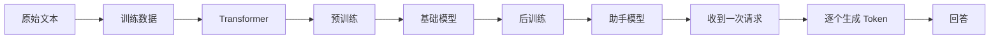

# LLM 原理教程导读

> [!abstract] 目的
>建立一套能够解释“大模型从哪里来、内部怎样工作、为什么有这些能力和边界”的完整认知。

## 先看全貌

我们每天接触的是聊天窗口或 API，但它们只是整条链的最后几步：

后面的章节会沿着这条链依次前进。

## 阅读路线

### 第一部分：一个基础模型怎样产生

1. [[01-what-an-llm-really-does|大模型究竟在做什么]]
2. [[02-from-text-to-training-data|文本怎样变成训练数据]]
3. [[03-transformer-and-modern-architecture|Transformer 与现代大模型架构]]
4. [[04-how-a-base-model-is-created|基础模型怎样产生]]

### 第二部分：基础模型怎样成为我们使用的模型

5. [[05-from-base-model-to-assistant|基础模型怎样成为助手模型]]

### 第三部分：模型收到请求后怎样回答

6. [[06-how-inference-produces-an-answer|一次推理怎样生成回答]]
7. [[07-openai-api-request-anatomy|OpenAI API 请求由什么组成]]
8. [[08-openai-api-parameters-and-effects|OpenAI API 参数究竟改变什么]]

### 第四部分：怎样正确使用模型

9. [[09-llm-capabilities-boundaries-and-agents|模型能力、边界与 Agent]]

### 专题

10. [[10-video-understanding-models|多模态视频理解模型原理]]

## 公式应该怎样读

本教程会保留少量公式，因为公式可以精确表达几个量之间的关系。但==公式本身不是学习目标==。

每个公式都会紧接着回答三件事：

- 每个符号代表什么；
- 计算机实际上做了什么；
- 这个关系对理解模型意味着什么。

例如，你会看到下一个 Token 的概率：

$$
p(t_{next}mid t_1,t_2,ldots,t_n)
$$

它不要求你进行计算。它只是在说：==模型根据前面已经看到的 Token，为下一个可能出现的 Token 分配概率。==

## 贯穿教程的例子

我们会反复使用一个短句：

> 北京今天下雨，出门要带……

它会依次帮助我们理解：

- 文字怎样被切成 Token；
- Token 怎样变成向量；
- “下雨”怎样影响模型对“伞”的预测；
- 训练怎样提高正确续写的概率；
- 推理时为什么可能生成“伞”，也可能生成其他词；
- Temperature 等 API 参数怎样改变选择结果。

使用同一个例子，可以把不同章节拼成一条连续的因果链。

> [!important] 最重要的学习方法
> 不要把术语定义背下来。每遇到一个概念，都问三个问题：
> 1. 它为了解决什么问题？
> 2. 它保存或改变了什么信息？
> 3. 如果没有它，会发生什么？

## 参考资料

- [Attention Is All You Need](https://arxiv.org/abs/1706.03762)
- [On the Opportunities and Risks of Foundation Models](https://arxiv.org/abs/2108.07258)
- [Generative AI for Beginners](https://github.com/microsoft/generative-ai-for-beginners)
