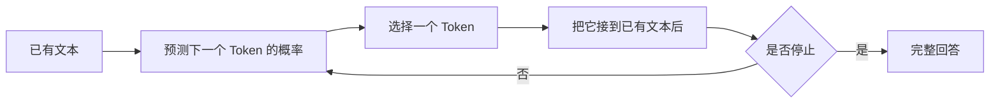

# 大模型究竟在做什么

> [!abstract] 本章只回答一个问题
> 当我们说“大语言模型”时，这个模型最基本的工作究竟是什么？

## 前置知识

不需要任何机器学习基础。只需要知道，计算机最终只能对数字执行计算。

## 先从一个填空开始

看到下面这句话时，你大概会想到“伞”：

> 北京今天下雨，出门要带____。

你之所以能做出这个判断，是因为你知道词语之间的常见关系，也能利用当前句子提供的条件。语言模型做的第一件事与此相似：==根据已经出现的内容，预测接下来最可能出现什么。==

不过，模型不会直接在“词”上操作。它会先把文本切成称为 **Token** 的小片段，再预测下一个 Token。我们将在下一章解释 Token 怎样产生。现在只需要把它暂时理解成“模型处理文本时使用的片段”。

## 语言模型是什么

“语言模型”中的“模型”，可以先理解成一个通过大量例子学到规律的计算系统。

给它一段已经出现的 Token：

```text
北京 / 今天 / 下雨 / ， / 出门 / 要 / 带
```

它会为词表中的每个候选 Token 给出一个分数。例如，下面只是为了帮助理解而虚构的数字：

| 候选 Token | 模型给出的概率 |
|---|---:|
| 伞 | 62% |
| 外套 | 12% |
| 手机 | 7% |
| 其他所有 Token | 19% |

模型可以选择“伞”，把它接到原句后面，然后再次预测：

```text
北京今天下雨，出门要带伞 ____
```

下一次可能预测“。”，也可能继续生成“，注意安全”。不断重复这个过程，就得到一段完整回答。

那模型什么时候知道回答完整了？严格来说，它并没有一个独立的“回答是否完整”判断器。训练时，文本样本的结尾通常会有一个专门的结束标记；经过训练和助手对齐后，当上下文看起来像是一个回答已经说完的位置，模型就可能给这个结束 Token 较高概率。生成这个 Token 后，推理程序便停止循环。

因此，这仍然是“预测下一个 Token”的循环，只不过候选 Token 里也包含“结束”。模型实际上是在预测：下一个 Token 是普通文字，还是表示结束的 Token。它可能过早结束，也可能没有结束好，所以还需要其他停止条件：

- 模型生成了专门表示结束的 Token（通常称为 **结束 Token** 或 **EOS**）；
- 生成了调用方指定的停止序列；
- 达到了最大输出 Token 数或上下文长度上限；
- 外部系统因为工具调用完成、安全策略、超时或错误而终止生成。

生成“。”不一定会停止；句号只是普通 Token。实际服务通常会在每次生成 Token 后检查这些条件。



## “预测下一个 Token”为什么能回答问题

这通常是初学者最大的疑问：续写文本听起来很简单，为什么最后会出现问答、翻译、写代码和推理能力？

关键在于，训练数据里不只有普通句子，还包含大量不同结构：
- 问题后面跟着回答；
- 标题后面跟着正文；
- 代码注释后面跟着实现；
- 论点后面跟着论证；
- 多语言句子彼此对应；
- 数学问题后面跟着解题过程；
- 对话中的上一句话后面跟着下一句话。

为了持续预测好下一个 Token，模型必须学会利用语法、语义、上下文关系、常见事实以及不同文本结构。它并不是先单独学习“翻译功能”，再单独安装“问答功能”。这些能力大多来自同一个目标：在许多不同上下文中，把后续内容预测得更准确。

> [!important] 一个关键区分
> “训练目标是预测下一个 Token”不等于“模型只会做简单文字接龙”。训练目标描述的是模型用什么信号学习，不是它最终只能完成哪一种任务。

## 用一句公式准确表达

下一个 Token 的预测可以写成：

$$
p(t_{next} \mid t_1,t_2,...,t_n)
$$

你不需要计算它。符号的含义是：

- $t_1$ 到 $t_n$ 是模型已经看到的 Token；
- $t_{next}$ 是下一个候选 Token；
- 竖线可以读成“在已经知道右边这些内容的条件下”；
- $p$ 表示模型为不同候选分配的概率。

所以整条公式只是在说：

> 在已经看到前面这些 Token 的条件下，下一个 Token 分别有多大可能出现？

## “大”体现在哪里

大型语言模型的“大”通常同时涉及三个方面：

1. **参数很多**：模型内部有大量训练得到的数值，用来共同决定输出。
2. **训练数据多**：模型从大量文本、代码或其他数据中学习统计规律。
3. **训练计算多**：得到这些参数需要执行大量计算。

参数到底是什么、训练怎样改变参数，会在 [[04-how-a-base-model-is-created|基础模型怎样产生]] 中系统解释。现在只需把参数理解成模型在训练中逐渐调整的内部数值。

## 模型不是在搜索训练原文

如果模型回答“法国的首都是巴黎”，不意味着它刚刚从内部数据库查出一条记录。更准确的理解是：训练让某些输入模式与某些输出模式之间形成了很强的统计关系。

参数不像数据库记录：

- 没有清晰的事实 ID；
- 不保存每个答案的原始出处；
- 不能可靠地逐条修改或删除某个事实；
- 多个来源的规律会共同压缩进许多数值中。

因此，模型能够生成正确事实，却也可能把相似模式组合成一个流畅但错误的答案。

## 模型真的“理解”了吗

“理解”这个词很容易引发无休止的争论。对学习原理更有帮助的做法，是拆成可观察的问题：

- 模型能否根据上下文区分一个词的不同含义？
- 能否把规则应用到没见过的例子？
- 能否把多个条件组合起来？
- 输入稍微变化后，能力是否仍然稳定？
- 能否说明答案来自什么证据？

模型内部确实形成了能够表示语义、关系和结构的数值状态，但这些状态并不等同于人的体验、自我意识或世界经验。说“模型完全不理解”会忽略它真实表现出的抽象能力；说“模型像人一样理解”又会掩盖它的失败机制。

本教程采用更实用的表述：==模型学习了可用于预测的内部表示和计算规律。==

## 训练和使用是两件不同的事

这是后面所有章节的基础。

### 训练阶段

模型看到训练样本，进行预测，把预测和正确后续比较，再调整内部参数。这个过程会反复进行很多次。

```text
样本 → 预测 → 计算误差 → 调整参数
```

### 推理阶段

训练结束后，参数通常固定。用户输入一段文本，模型使用已有参数进行计算并生成回答。正常 API 调用不会因为你问了一个问题，就立刻把这个问题写进模型权重。

```text
用户输入 → 使用固定参数计算 → 生成回答
```

> [!warning] 常见误解
> 模型在一段对话中记住了你前面说的话，通常是因为聊天系统把历史内容再次放进了当前输入，而不是模型在对话过程中重新训练了参数。

## 模型、助手和应用不是同一个东西

现在只做最小区分：

- **语言模型**：根据输入计算下一个 Token 的概率。
- **助手模型**：经过额外处理，更倾向于遵循指令、回答问题和拒绝某些请求。
- **聊天应用**：在模型之外管理界面、历史记录、文件和其他功能。

基础模型怎样变成助手模型，会在第五章解释。

## 本章建立的最小模型

到这里，你只需要记住下面这条链：

```text
文本被表示成 Token
→ 模型读取已有 Token
→ 为下一个 Token 分配概率
→ 选择一个 Token
→ 把它加入文本
→ 重复直到结束
```

这条描述还隐藏着两个重要问题：

1. 文字怎样变成模型可以计算的数字？
2. 模型怎样综合前面所有 Token 的信息？

下一章先回答第一个问题。

## 参考资料

- [A Neural Probabilistic Language Model](https://www.jmlr.org/papers/v3/bengio03a.html)
- [Language Models are Few-Shot Learners](https://arxiv.org/abs/2005.14165)
- [On the Opportunities and Risks of Foundation Models](https://arxiv.org/abs/2108.07258)
