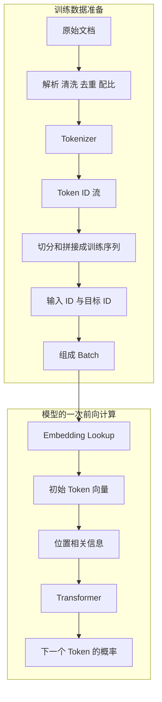

# 文本怎样变成训练数据

> [!abstract] 本章只回答一个问题
> 人写出的文字，怎样一步步变成模型能够读取和学习的数字？

## 前置知识

在 [[01-what-an-llm-really-does|上一章]]，我们知道模型根据已经看到的 Token 预测下一个 Token。本章把这件事拆开：训练语料怎样变成一批批预测题，Token 怎样取得 ID，模型又怎样把 ID 查成可学习的向量。

一个整数 ID 本身不携带语义。语义来自训练后得到的一整套参数，其中包括 Embedding Table；而同一个词在不同句子里的具体含义，还要等 Transformer 结合上下文后才会出现。

## 为什么不能直接把文字送进神经网络

计算机可以保存字符串，但神经网络的核心操作是矩阵乘法、加法等数值计算。因此，在“人类文字”和“模型计算”之间，需要两条相连、但不能混为一谈的链路：



- 数据准备决定模型看见哪些文本，以及每一题的输入和答案。
- Tokenizer 决定文字怎样切分，并用固定词表把片段映射成 ID。
- Embedding Lookup 是模型前向计算的第一步：从可训练参数表中取出 ID 对应的一行向量。

## 第一步：把文字切成 Token

假设输入是：

> 北京今天下雨，出门要带伞。

为了便于理解，我们先假设它被切成：

```text
[北京] [今天] [下雨] [，] [出门] [要] [带] [伞] [。]
```

真实 Tokenizer 不一定这样切。它可能把一个词切成多个片段，也可能把常见的多个字符合成一个 Token。英文空格、代码缩进、数字和标点也可能成为 Token 的一部分。

### 为什么不用“一个字一个 Token”

全部按单字切分，词表会比较小，但序列会更长，模型需要自己组合更多字符。

### 为什么不用“一个词一个 Token”

世界上可能出现的词、名字、拼写和组合太多。固定词表不可能提前包含所有完整词。

### 子词切分的折中

现代文本模型通常使用子词或字节级切分：
- 常见片段可以使用一个 Token；
- 少见词可以拆成多个已知片段；
- 新名字、代码和拼写仍然可以被表示；
- 词表大小和序列长度保持在可管理范围。

> [!important] Token 不是“词”的技术叫法
> 一个 Token 可能是一个汉字、一个词的一部分、标点、空格模式、代码片段或字节。模型的长度、费用和上下文窗口通常按 Token 计算，而不是按人类看到的字数计算。

## 第二步：Token 变成 ID

Tokenizer 还有一个固定词表。可以把它想成一张编号表：

| Token | Token ID |
|---|---:|
| 北京 | 15432 |
| 今天 | 8921 |
| 下雨 | 23781 |
| 伞 | 6843 |

于是文本会变成类似：

```text
[15432, 8921, 23781, ...]
```

ID 只是编号。`23781` 比 `8921` 大，不意味着“下雨”比“今天”更重要，也不意味着两者的含义相差 `14860`。

### 词表、Token 和 ID 各自负责什么

词表（Vocabulary）不是“所有单词的字典”，而是一张 **Token -> Token ID** 的固定映射。对中文，它可能收录单个汉字、常见词片段和标点；对英文，它常收录带前导空格的子词；还会有表示文本结束、填充或对话边界的特殊 Token。

因此，Tokenizer 的职责是把字符序列映射到已知 Token，再映射到 ID；它不理解当前句子的含义。训练一个模型时，词表和 ID 的对应关系通常先确定并保持不变。若随意把 ID 15432 改指另一个 Token，Embedding Table 中第 15432 行仍是旧 Token 训练出的参数，模型就会被破坏。

> [!note] 一个模型需要匹配的 Tokenizer
> 权重文件与 Tokenizer 是一对。即使两个模型的词表大小相同，也不能假定相同 ID 表示相同 Token，更不能混用它们的 Embedding Table。

## 第三步：ID 变成向量

神经网络需要的不只是编号，而是一组能被连续调整的数值。Embedding 层为词表中的每个 Token 保存一个向量。

为了演示，假设向量只有四个数：

```text
“下雨” → [0.21, -0.48, 0.73, 0.16]
“晴天” → [0.18, -0.41, 0.69, 0.08]
“桌子” → [-0.62, 0.30, -0.11, 0.55]
```

真实模型的向量通常有更多维。单个维度通常也不能简单翻译成“天气程度”或“名词程度”。含义分布在许多维度和后续层的组合中。

Embedding 查表可以写成：

$$
x_i=E[t_i]
$$

这条公式只表示：

- $t_i$ 是第 $i$ 个 Token 的编号；
- $E$ 是一张可学习的向量表；
- $E[t_i]$ 表示取出编号 $t_i$ 对应的那一行；
- $x_i$ 是最终取出的向量。

==它本质上是查表，不是把 Token ID 当成数字做算术。==

### 整张 Embedding Table 和一次查表的结果

设词表大小为 `V`，模型内部统一使用 `d_model` 维向量，那么 Embedding Table 是一个形状为 `(V, d_model)` 的参数矩阵：有 `V` 行，每行对应一个 Token ID；每行有 `d_model` 个浮点数。

假设只有 5 个 Token，每个向量只有 3 维：

| Token ID | E 中对应的一行 |
|---:|---|
| 0 | `[0.10, 0.20, 0.30]` |
| 1 | `[0.50, 0.60, 0.70]` |
| 2 | `[0.90, 1.00, 1.10]` |
| 3 | `[2.00, 2.10, 2.20]` |
| 4 | `[3.00, 3.10, 3.20]` |

这里表的形状是 `(5, 3)`；输入 ID 为 `2` 时，查表只得到第三行 `[0.90, 1.00, 1.10]`，即一个长度为 3 的向量。它不会把整张表送进 Transformer。

因此，当你看到 `(100000, 4096)` 或口语中的 “100000 x 4096 Embedding Table” 时，首先是在描述 **10 万行、每行 4096 列的矩阵形状**，不是说一次 Lookup 会返回 100000 x 4096 个数。只有在计算参数量时，才把两个维度相乘：这张输入表有 `100000 * 4096 = 409,600,000` 个可训练数值。

> [!important] 我们日常所说的 xxx B模型
> `V * d_model` 只计算输入 Embedding Table。模型标称的 7B、32B 等参数量，还包括每一层 Attention 和 FFN 的大矩阵、归一化参数，以及可能独立的输出层；通常 Transformer 层占大头。

### 哪些东西固定，哪些东西会学习

要区分三个时间点：

| 对象 | 训练开始前 | 训练中 | 正常推理时 |
|---|---|---|---|
| Tokenizer 和 Token -> ID 映射 | 先训练或选定 | 通常保持不变 | 固定 |
| Embedding Table 的数值 | 随机或由旧模型加载 | 与其他参数一起被更新 | 固定 |
| 一次输入得到的 Hidden State | 不存在 | 每次前向计算临时产生 | 每次请求重新计算 |

预训练时，模型用预测误差做反向传播。某个 Token 出现在输入中时，损失的梯度会更新它被查到的那一行，也会更新 Attention、FFN 等后续参数。全量微调也可以继续更新 Embedding Table；参数高效微调常冻结它而只训练额外模块，但这是训练方案的选择，不是规律。

推理时，加载的权重不会自动改变。因此，同一个 Token ID 总会查到同一个初始向量；不同上下文造成的差异来自后续计算，而不是 Embedding Table 临时改写了这一行。

## 向量为什么会包含有用信息

刚开始训练时，Embedding Table 和其他权重接近随机数，没有我们关心的语义。模型不断尝试根据前文预测下一个 Token；预测错得越多，Loss 越高。反向传播会寻找一组能降低 Loss 的参数改动，其中就包括每个 Token 的初始向量。

如果两个 Token 经常处在相似的预测环境中，它们的初始向量可能在某些方向上变得相近；但这不是训练目标直接要求的，也不是由 Embedding Table 单独完成的。Embedding、Attention、FFN 和输出层是一起被优化的。经过大量训练，模型内部才形成有助于预测的几何关系。

单个维度通常不能翻译成“天气程度”或“名词程度”。向量的意义分布在许多维度和后续层的组合中；而且不同模型分别训练出的向量，不在同一坐标系，不能把它们直接放在一起比较距离。

## 初始 Embedding、Hidden State 和输出不是一回事

“苹果”可能指水果，也可能出现在公司或产品语境中。查表得到的初始 Token Embedding 只由 Token ID 决定；加上位置相关信息后，它才成为模型第一层的输入。这个起点还没有知道附近出现了“吃了”还是“发布了”。

Transformer 内部会为 **每个位置、每一层** 保存一个当前向量，叫 Hidden State（隐藏状态）。它叫“隐藏”并不是指模型刻意保密，而是指它是网络内部的中间数值，既不是原始 Token，也不是最终展示给用户的文字。对长度为 `T` 的序列，一层通常处理一个形状近似为 `(T, d_model)` 的状态矩阵：每个位置各有一个 `d_model` 维状态。

可以把它看成一次逐层改写：

```text
Token ID
-> Token Embedding
-> 加入位置信息，得到第 0 层状态
-> 第 1 个 Transformer Block，得到第 1 层 Hidden State
-> ...
-> 最后一层 Hidden State
-> 输出层，得到所有候选 Token 的 Logits
```

在自回归 LLM 中，某位置只能读取自己和此前位置的信息。每一层的 Attention 和 FFN 都会根据这些可见上下文改写状态，于是：

```text
“吃了一个苹果”中的苹果
“发布了新款苹果设备”中的苹果
```

虽然“苹果”的初始 Token Embedding 相同，两个位置最后的 Hidden State 会不同。最后一个位置的 Hidden State 再经过输出层，才会变成词表中每个候选 Token 的分数（Logits）。下一章会展开“怎样读取上下文”和“怎样从状态算出 Logits”。

在不同论文和代码中，加入位置后的第一层输入有时也会被称作第 0 层 Hidden State。为了避免混淆，本章把“查表的原始一行”明确叫作 **Token Embedding**，把经过 Transformer Block 后的中间结果叫作 **Hidden State**。

我们可以这样区分：

| 名称 | 粒度 | 如何得到 | 是否随本次上下文改变 |
|---|---|---|
| Token Embedding | 一个 Token | 从 E 中按 ID 查一行 | 否 |
| 第 0 层输入状态 | 一个位置 | Token Embedding 加入位置相关信息 | 位置会影响，词义尚未充分结合上下文 |
| Hidden State | 一个位置、每一层各一份 | Transformer Block 反复更新 | 是 |
| Logits | 一个位置、覆盖整个词表 | 最后 Hidden State 经过输出层 | 是 |

Transformer 正是负责让每个位置结合上下文、不断更新 Hidden State 的计算结构。

## 位置也必须被表示

下面两句话包含相同的词，却不是同一个意思：

```text
狗追猫
猫追狗
```

如果模型只收到一组向量，却不知道它们的先后位置，就无法区分这两个序列。因此，模型还必须注入位置信息。原始 Transformer 会把位置向量加到 Token Embedding 上；现代模型也常把位置信息作用在 Attention 的计算中。

本章只需要记住：==模型读取的不只是“有哪些 Token”，还必须知道“它们出现在哪里”。==具体方式下一章再讲。

## 训练样本怎样从一段文本产生

原始文档不是天然的一条训练样本。一篇网页可能很长，一本书可能远超上下文上限；反过来，多个很短的文档又可以放进同一条序列。数据管线通常先在文档边界加入结束标记，再得到连续的 Token ID 流，然后按最大长度切分或拼接。

假设其中一条训练序列已经变成 Token：

```text
[北京] [今天] [下雨] [，] [出门] [要] [带] [伞] [。]
```

把它写成 ID 序列 `[t0, t1, ..., tL]` 后，自回归训练只是把同一段数据错开一位：

```text
输入 x:  [t0, t1, ..., t(L-1)]
目标 y:  [t1, t2, ..., tL]
```

也就是说，位置 0 看到 `t0` 后要预测 `t1`；位置 1 看到 `t0, t1` 后要预测 `t2`。用前面的例子展开，就是：

| 模型看到的内容 | 应该预测的下一个 Token |
|---|---|
| 北京 | 今天 |
| 北京 今天 | 下雨 |
| 北京 今天 下雨 | ， |
| 北京 今天 下雨，出门要带 | 伞 |
| 北京 今天 下雨，出门要带伞 | 。 |

实际训练会一次并行计算这一整行所有位置，而不是像表格一样逐行运行。因果 Mask 保证每个位置只能读取左侧 Token；Loss 则把每个位置的预测与右移后的目标比较。这里的表格只是在说明：==训练答案就藏在原始文本的下一个位置中，因此不需要人工给每个句子标注答案。==这称为自监督学习。

### 文档、序列、样本和 Batch

这些词经常都被称作“数据”，但层级不同：

| 名称 | 是什么 | 例子 |
|---|---|---|
| 原始文档 | 收集到的一个内容单位 | 一篇网页、一段代码、一本书的一节 |
| Token 流 | 文档 Tokenize 后的 ID 序列 | `[15432, 8921, ...]` |
| 训练序列 / 样本 | 长度受限的一段 ID，以及右移一位的目标 | `x` 和 `y` 各含 L 个 ID |
| Batch | 同时送入设备的多条训练样本 | `B` 条长度为 `L` 的序列 |

短序列可以用特殊结束标记隔开后一起 Packing，减少空位；需要对齐长度时可用 Padding，并用 Loss Mask 忽略填充位置。这些步骤改变了“怎样组织题目”，不改变自回归目标本身。

> [!important] 预训练不会先把整篇文档做成一个 Embedding 再训练
> 常规自回归预训练保存和读取的是文本或 Token ID。每个 Batch 进入模型后，才由当前的 Embedding Table 为每个 ID Lookup 初始向量。文档级向量、向量数据库和检索是另一套用途，后面会单列说明。

## 数据准备为什么会影响模型

训练文本不是原样全部倒进模型。通常还会经历：

1. 解析：从网页、文档和代码文件中提取有效内容；
2. 规范化和清洗：减少乱码、导航模板、重复页、垃圾内容、隐私或其他不应进入训练集的内容；
3. 去重：既处理完全相同的文档，也尽量处理近似副本，避免某些内容被重复放大；
4. 质量和来源筛选：识别语言、领域、格式、质量与许可条件；
5. 划分评测集：避免评测题或其近似副本重新进入训练集，造成虚高结果；
6. 配比和采样：决定不同语言、领域和质量层级在训练中被看见的频率；
7. Tokenize、加入边界标记并 Packing：构造长度受限的训练序列、目标和 Mask。

模型学习的是最终被选择和加权后的数据分布，而不是未经处理的“整个互联网”。数据中缺少什么、重复什么、哪些内容权重更高，都会影响模型最后更容易生成什么。

## Tokenizer 本身通常也需要学习

在训练大模型之前，通常先从代表性数据中统计哪些文本片段值得进入词表。常见目标是在词表大小有限的情况下，让常见内容使用较少 Token，同时仍能表示任何输入。

Tokenizer 确定后，大模型训练期间一般保持不变。否则，同一个 Token ID 的含义不断变化，模型难以稳定学习。

## 常见误解

> [!warning] Token 越长，语义越完整
> 不一定。Token 切分主要服务于压缩和可表示性，不保证每个 Token 都是完整概念。

> [!warning] Embedding 中每一维都有明确的人类含义
> 通常不能这样解释。语义分布在许多维度和多层计算中。

> [!warning] 相似词的 Embedding 一定非常接近
> 初始向量可能呈现一些相似性，但真正用于当前句子的表示还会被上下文重写。

> [!warning] Token ID 就是模型理解的意义
> ID 只是查找 Embedding 的索引，编号本身没有语义大小关系。

> [!warning] Embedding Table 就是向量数据库
> 不是。Embedding Table 是模型权重中的一张参数矩阵，按 Token ID 取行；向量数据库保存的是外部文档 Chunk 的文本 Embedding，并按相似度检索。

> [!warning] 同一个 Token 在不同句子里会查到不同的 Embedding
> 不会。正常推理时，同一个 ID 查到的初始 Token Embedding 恒定；改变的是经过上下文计算后的 Hidden State。

> [!warning] 7B 参数就是词表大小乘 Embedding 维度
> 这只是一张输入 Embedding Table 的参数量。7B 指整个模型所有可训练参数的总和。

## 本章完整链路

```text
训练数据：
原始文档
-> 解析、清洗、去重、筛选和配比
-> Tokenizer 切分
-> 固定词表映射成 Token ID
-> 边界标记、切分或 Packing
-> 右移一位得到输入 x 与目标 y
-> 组成 Batch

模型前向：
Batch 中的 Token ID
-> 从 Embedding Table 查出初始 Token Embedding
-> 加入位置相关信息
-> 得到第 0 层输入状态
-> Transformer 逐层更新 Hidden State
-> 最后一层状态变成 Logits
-> 与目标 y 计算 Loss，并在训练时更新参数

```

现在还差一个关键环节：每个位置怎样读取前面其他位置的信息、怎样更新 Hidden State，以及最后怎样从它得到 Logits？下一章进入 Transformer。

## 参考资料

- [Neural Machine Translation of Rare Words with Subword Units](https://arxiv.org/abs/1508.07909)
- [SentencePiece: A simple and language independent subword tokenizer](https://arxiv.org/abs/1808.06226)
- [Attention Is All You Need](https://arxiv.org/abs/1706.03762)
- [Sentence-BERT: Sentence Embeddings using Siamese BERT-Networks](https://arxiv.org/abs/1908.10084)
- [Dense Passage Retrieval for Open-Domain Question Answering](https://arxiv.org/abs/2004.04906)
