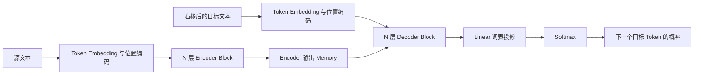
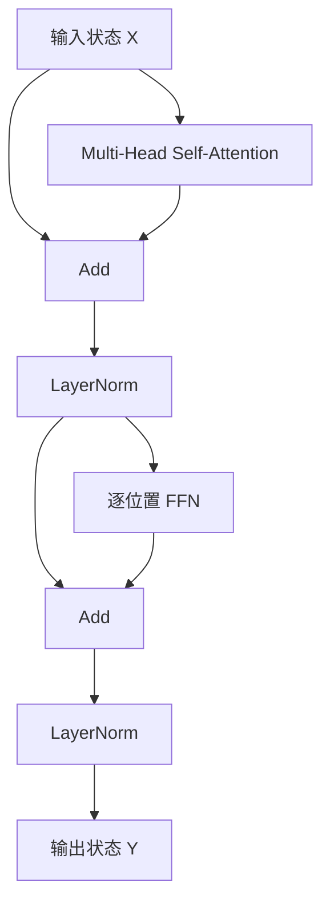
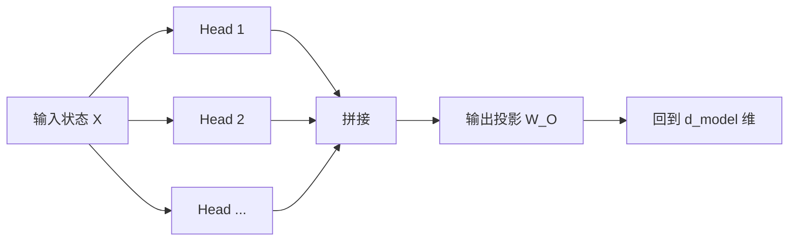
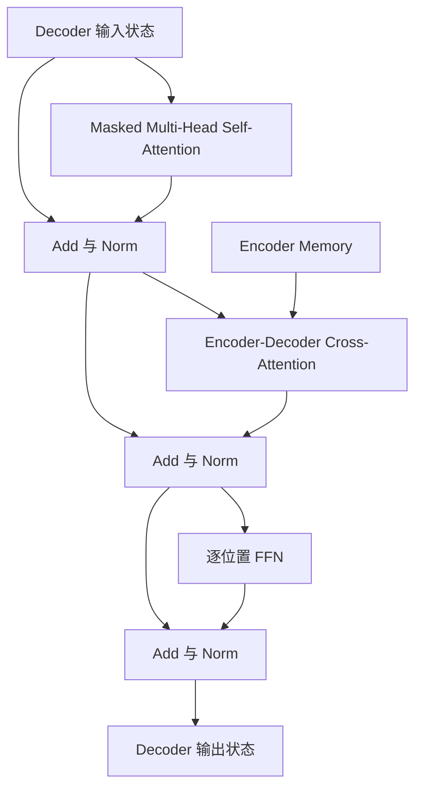

# Transformer 架构与基本原理

> [!abstract] 本章目标
> 理解原始 Transformer 的基本架构和工作原理，以及它为什么能够解决序列理解与生成问题。

## 前置知识

[[02-from-text-to-training-data|上一章]]已经把文字变成了一串带位置信息的初始向量。每个位置此时只知道“我是什么 Token、我在哪里”，还没有充分结合句子中其他位置的信息。

本章从 2017 年论文《Attention Is All You Need》出发，先看完整的 Encoder-Decoder 架构，再逐层解释 Self-Attention、FFN、残差连接和归一化如何协作。理解这套原始结构后，下一章再讨论 GPT、Llama、Qwen 等现代 LLM 怎样在此基础上形成 Decoder-only 架构。

## 1. 原始 Transformer 要解决什么问题

原始 Transformer 主要为序列到序列任务设计，例如把英文翻译成中文：

```text
源序列：I love China .
目标序列：我 爱 中国 。
```

要完成翻译，模型不能只把每个词单独替换成另一个词。它必须解决三类问题：

1. 同一个词的含义会受整句上下文影响；
2. 输入与输出的长度、语序可能不同，不能按位置一一替换；
3. 生成下一个目标 Token 时，既要参考完整源句，也要参考已经生成的目标前缀。

原始 Transformer 用 Attention 建立任意位置之间的动态联系，用 FFN 加工每个位置收集到的信息，再通过残差连接和归一化把这些计算稳定地堆叠成深层网络。在这个整体方案中，Encoder 和 Decoder 分别承担两个阶段：

1. **Encoder 编码输入**：让英文中每个位置结合整句上下文，形成可供后续读取的表示；
2. **Decoder 生成输出**：读取已经生成的中文前缀，同时读取 Encoder 的英文表示，逐个预测下一个中文 Token。

因此，原始论文中的两个大方框不是两个连续的“普通层”，而是两组各自重复多次的网络：



图中的 `N 层` 表示同一种 Block 重复多次。完整 Transformer、一个 Encoder Block 和一个 Decoder Block 是三个不同层级：

```text
完整 Transformer
├── Encoder Stack
│   └── N × Encoder Block
└── Decoder Stack
    └── N × Decoder Block
```

> [!important] Encoder 的输出不是一句翻译
> Encoder 为源序列的每个位置产生一个上下文化向量。整组向量常被称为 Encoder Memory，Decoder 在生成每个目标 Token 时都可以读取它。

## 2. 一层 Encoder 到底做什么

一层 Encoder Block 的结构是：



一层虽然只有两个主要计算子层，却完成两种不同工作：

- **Self-Attention 在位置之间传递信息**：每个位置按当前需要读取其他位置；
- **FFN 在每个位置内部加工信息**：对 Attention 收集后的向量做非线性变换。

残差连接和归一化包围这两个子层，让许多 Block 能够稳定叠加。输入和输出都保持为“序列长度 × 隐藏维度”的一组向量，因此上一层输出可以直接成为下一层输入。

接下来先讲整套架构中最关键的机制：Self-Attention。

## 3. Self-Attention 解决什么问题

假设 Encoder 正在处理：

> 小明把书放在桌上，因为**它**很重。

Embedding Lookup 后，“它”所在位置只有自己的初始向量。单看这个 Token，模型不知道“它”更可能指书还是桌子。它必须结合其他位置，才能形成适合当前句子的表示。

### 如果没有 Self-Attention

FFN 是逐位置运行的：每个位置使用同一套参数，但不会读取其他位置。如果整层只有 FFN，那么“小明”“书”“桌子”“它”四个位置会各算各的，“它”的表示无法根据前文改变。

一种朴素方案是把所有位置直接求和或平均后交给每个位置，但这样也有问题：

- 不管当前更新“它”还是“桌子”，读到的都是同一份平均信息；
- 所有 Token 得到固定贡献，无法根据当前问题动态选择；
- 词序和位置关系很容易被冲淡。

Self-Attention 因此要完成更具体的事情：

> **序列中的每个位置都根据自己的当前状态，计算应该从哪些位置读取多少信息，再把读到的信息汇总成一个新的向量。**

“Self”表示 Query、Key、Value 都来自同一条序列，不表示一个 Token 只关注自己。Encoder 的 Self-Attention 可以读取源序列中的所有位置。

## 4. 为什么要把读取过程拆成 Q、K、V

先只追踪“它”这一个位置。模型需要解决三个不同问题：

1. “它”当前想寻找什么线索？
2. 每个候选位置凭什么与这个需求匹配？
3. 某个位置匹配后，究竟要传递什么内容？

Attention 把三种角色分别表示为：

- **Query（Q）**：当前位置发出的查询，表示“我想找什么”；
- **Key（K）**：每个位置用于参与匹配的特征，表示“我可以怎样被找到”；
- **Value（V）**：匹配后实际传递的内容，表示“选中我后，我提供什么”。

每个位置的当前状态都会通过三组不同的可训练投影，分别产生 Q、K、V：

$$
Q=XW_Q,\qquad K=XW_K,\qquad V=XW_V
$$

这里的 $X$ 是整条序列当前所有位置的状态矩阵，所以每个位置同时拥有自己的 Query、Key 和 Value。三套投影的意义不是把数据复制三次，而是允许模型分别学习“如何查询”“如何被匹配”和“传递什么”。

> [!question] 为什么 Key 和 Value 不直接使用同一个向量？
> 用于判断相关性的特征不一定就是最终应该传递的内容。类似图书检索中，书名和标签帮助匹配，但真正取回的是书的正文。分开投影让这两种角色可以独立学习。

## 5. 一个位置怎样完成一次 Attention

仍以“它”所在位置为例。一次单头 Attention 可以按以下步骤理解。

### 第一步：Query 与所有 Key 比较

“它”的 Query 分别与“小明”“书”“放在”“桌上”“它”“很重”等位置的 Key 做点积，得到一组匹配分数：

```text
“它”的 Query
├── 与“小明”的 Key 比较 -> 一个分数
├── 与“书”的 Key 比较   -> 一个分数
├── 与“桌上”的 Key 比较 -> 一个分数
└── 与“很重”的 Key 比较 -> 一个分数
```

点积高不等于两个词在词典里相似，而表示在当前训练出的查询空间中，这个候选位置更符合当前位置的读取需求。

### 第二步：缩放并变成权重

Key 维度较大时，点积绝对值容易变大，使 Softmax 过于接近“只选一个位置”，梯度也会变得不稳定。因此先除以 $\sqrt{d_k}$，再用 Softmax 把分数变成非负且总和为 1 的权重。

这些权重回答的是：“对更新当前这个位置而言，各候选位置这一次分别贡献多少？”它们不是每个词永久不变的重要度。

### 第三步：按权重汇总 Value

模型用刚才的权重对所有 Value 做加权求和。若“书”的权重较高，它的 Value 对结果贡献就更大；其他位置通常仍可能贡献一部分。最后得到的是一个新的数值向量，不是把“书”这个词复制过来。

完整公式只是把这三个动作压缩在一起：

$$
\operatorname{Attention}(Q,K,V)
=\operatorname{softmax}\left(\frac{QK^\top}{\sqrt{d_k}}\right)V
$$

1. $QK^\top$：每个 Query 与所有 Key 比较；
2. 除以 $\sqrt{d_k}$：控制分数尺度；
3. $Softmax$：变成相对权重；
4. 乘以 $V$：为每个位置汇总其他位置提供的内容。

因为每个位置都有自己的 Query，上述过程会对所有位置分别发生。输入和输出形状保持一致：

```text
输入：T 个位置 × d_model 维状态
输出：T 个位置 × d_model 维状态
```

但输出中每个位置已经混合了与自己相关的上下文信息。

> [!warning] Attention 输出不是 Attention 权重
> 权重只是“从各位置取多少”的中间结果。真正输出的是所有 Value 按这些权重混合后得到的新向量。

## 6. 为什么需要 Multi-Head Attention

单个 Attention Head 只有一套 Q、K、V 投影，只在一个表示子空间中计算匹配。语言中的关系却可能同时涉及局部搭配、指代、句法和远距离条件。

Multi-Head Attention 为同一组输入并行使用多套投影：



每个 Head 都独立完成 Q/K/V 匹配和 Value 汇总。所有 Head 的结果拼接后，再通过 $W_O$ 混合并投影回模型隐藏维度。

这样设计的作用是让模型能够并行学习多种读取方式，而不要求所有关系都挤在同一套匹配规则中。但不要把某个 Head 固定解释成“语法 Head”或“指代 Head”：这些用途由训练形成，可能重叠，也不一定能被人类稳定命名。

## 7. FFN 为什么不可缺少

Attention 完成的是**位置之间的信息交换**。它回答“当前位置应该从哪里取信息，并取回怎样的混合结果”。但交换完信息后，模型还需要在每个位置内部对结果进行加工。

FFN（Feed-Forward Network）对每个位置独立应用同一组参数：

$$
\operatorname{FFN}(x)=W_2\,\sigma(W_1x+b_1)+b_2
$$

它通常先把向量投影到更宽的中间维度，经过非线性激活，再投影回 $d_{model}$。可以把职责概括成：

```text
Attention：跨位置收集信息
FFN：在当前位置内识别、组合和变换这些信息
```

### 如果没有 FFN

模型仍能通过 Attention 按内容动态混合不同位置的 Value，但缺少专门在单个位置内部扩展、筛选和重组特征的非线性模块，整体表达能力与参数容量都会受到明显限制。

FFN 中的非线性激活函数很关键：如果连续的 FFN 只包含线性矩阵乘法，它们最终可以合并成一次线性变换，单纯叠深无法获得同等级的逐位置加工能力。Attention 自身因为 Softmax 和输入相关权重并非纯线性；准确地说，FFN 为它补充了另一类强大的非线性特征变换。

> [!note] “逐位置”不等于每个位置使用不同网络
> 同一层中的所有位置共享同一套 FFN 参数，只是各自输入不同的向量，彼此在 FFN 内不交换信息。

## 8. 为什么需要残差连接和归一化

Attention 和 FFN 都会产生新的计算结果，但如果每个子层都完全覆盖原状态，深层网络容易丢失已有信息，也更难训练。

### 残差连接：保留原状态，只学习增量

残差连接把子层结果加回原输入：

$$
y=x+F(x)
$$

它提供两条并行路径：一条让原信息直接通过，另一条让子层补充或修正信息。若某个子层暂时没有学到有用变换，原状态仍有路径向后传递；反向传播时，梯度也能通过加法路径更直接地穿过许多层。

如果没有残差连接，几十层甚至上百层网络中的每一层都必须完整重建并传递已有信息，深层训练更容易出现梯度难以传播和性能退化。

### 归一化：让数值尺度保持可控

多层变换和残差相加会不断改变向量的数值尺度。LayerNorm 根据单个位置向量内部的统计量重新调整尺度，使后续子层在较稳定的数值范围内工作。

归一化不会把不同 Token 变成相同向量，也不会负责在位置之间传递信息。没有合适的归一化时，深层网络的数值和梯度更容易不稳定，训练对初始化和学习率也更加敏感。

至此，一层 Encoder 的分工已经闭合：

```text
Self-Attention：位置之间交换信息
FFN：每个位置内部进行非线性加工
Residual：保留原状态并提供直接通路
LayerNorm：稳定每层处理的数值尺度
```

## 9. Decoder 为什么比 Encoder 多一个 Attention

翻译时，Decoder 既要读取已经生成的目标语言前缀，也要读取 Encoder 对源句的表示。因此原始 Decoder Block 有三个主要子层：



### Masked Self-Attention：只能读取已经生成的内容

训练时整条正确目标序列已经存在，但位置“爱”不能直接看见后面的“中国”，否则模型只需抄答案。Causal Mask 会在 Softmax 前屏蔽未来位置：

```text
目标位置 0：只能看位置 0
目标位置 1：可以看位置 0、1
目标位置 2：可以看位置 0、1、2
```

被屏蔽位置的 Attention 权重变为 0，因此训练时可以并行计算所有位置，同时保持从左到右生成的约束。

### Cross-Attention：生成时读取源句

Cross-Attention 的 Q 来自 Decoder 当前状态，K 和 V 来自 Encoder Memory：

```text
Query：我当前要生成的中文位置需要什么源句信息？
Key：英文各位置可以怎样被匹配？
Value：英文各位置实际提供什么内容？
```

没有 Cross-Attention，原始 Decoder 只知道已经生成的中文前缀，却没有通道读取待翻译的英文，自然无法让输出稳定地受源句约束。

### FFN、残差与归一化继续承担相同职责

Decoder 在两次跨位置读取之后，仍使用 FFN 逐位置加工，并用残差与归一化稳定深层堆叠。多层 Decoder 的最后状态经过词表投影和 Softmax，得到下一个目标 Token 的概率。

## 10. 原始 Transformer 的完整闭环

```text
源序列
-> N 层 Encoder：双向 Self-Attention + FFN
-> Encoder Memory

右移后的目标序列
-> N 层 Decoder：Causal Self-Attention + Cross-Attention + FFN
-> Linear 词表投影
-> Softmax
-> 下一个目标 Token 的概率
```

Encoder 和 Decoder 中的每个 Block 都在反复更新各位置的 Hidden State。Encoder 负责把源句加工成上下文化表示；Decoder 负责在源句条件下自回归生成目标句。

## 常见误解

> [!warning] Transformer 就是 Attention
> Attention 只负责位置之间的信息交换。完整 Transformer 还需要 FFN 加工每个位置的信息、残差连接保留原状态、归一化稳定计算，以及 Encoder/Decoder 的整体数据流。

> [!warning] Attention 会选出唯一一个最重要的词
> Attention 通常为多个位置分配不同权重，再混合它们的 Value；而且每个位置、每层、每个 Head 的权重都可能不同。

> [!warning] Attention 权重就是模型的完整解释
> 权重只描述某个 Head 在某一层中的一次信息混合。结果还会经过输出投影、残差、FFN 和后续多层计算。

> [!warning] FFN 在不同 Token 之间传递信息
> FFN 逐位置独立运行；跨位置传递由 Attention 负责。

## 理解检查

1. 原始 Transformer 要解决的序列到序列问题，为什么不能靠逐词替换完成？
2. Encoder 和 Decoder 分别接收什么，又分别输出什么？
3. Self-Attention 解决了初始 Token 向量的什么问题？
4. Q、K、V 为什么要承担不同角色？一次 Attention 最终输出的是什么？
5. Attention 和 FFN 分别负责哪种信息处理？
6. 残差连接和归一化为什么对深层网络重要？
7. 原始 Decoder 中的 Masked Self-Attention 和 Cross-Attention 分别读取什么？

## 参考资料

- [Attention Is All You Need](https://arxiv.org/abs/1706.03762)

## 下一章

继续阅读 [[04-modern-llm-architecture|现代 LLM 架构与基本原理]]，看看现代生成式 LLM 怎样把 Transformer 的核心机制用于统一的下一个 Token 预测。
