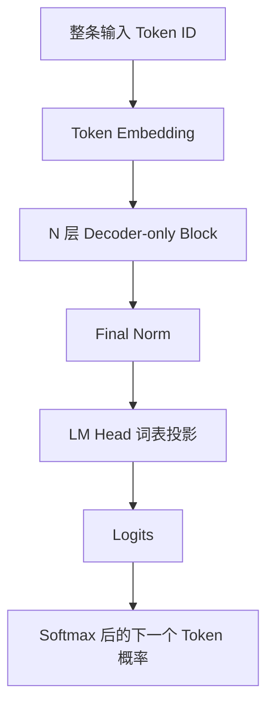
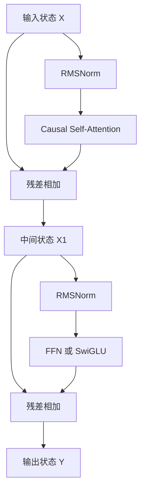

# 现代 LLM 架构与基本原理

> [!abstract] 本章目标
> 理解现代生成式 LLM 的整体架构和基本原理，以及它怎样利用上下文逐步生成文本。

## 前置知识

[[03-transformer-architecture|上一章]]已经说明，原始 Transformer 通过 Attention 在位置之间交换信息，通过 FFN 加工每个位置的信息，并用残差连接与归一化把这些计算稳定地堆叠起来。

现代 GPT、Llama、Qwen 等自回归 LLM 沿用了这套核心机制，但任务已经从“读取一个源序列，再生成目标序列”变成“把所有可见文字放进同一条序列，持续预测下一个 Token”。本章先建立 Decoder-only 的完整主线，再把 RoPE、RMSNorm、SwiGLU、GQA、MoE 等改进放回它们实际修改的部件中。

## 1. 现代 LLM 的核心任务与架构选择

原始 Transformer 面向“一个源序列映射成另一个目标序列”。通用生成式 LLM 则把当前能看到的所有文字组织成同一条序列：

```text
[系统指令] [用户问题] [历史消息] [助手回答前缀]
```

它的统一任务始终是：根据左侧已经出现的 Token 预测下一个 Token。系统指令和用户问题本身就是生成回答的条件，不需要先由一个独立 Encoder 处理。

Decoder-only 是当前通用文本生成 LLM 的主流架构，但“现代 LLM”不等于所有模型都只能是 Decoder-only；编码模型、Encoder-Decoder 模型和多模态混合结构仍然存在。本章重点讨论 GPT、Llama、Qwen 这类自回归文本 LLM。

对这类模型而言，Decoder-only 架构：

- 保留 **Causal Self-Attention**，让每个位置读取自己和左侧上下文；
- 保留 **FFN、残差连接和归一化**；
- 去掉独立 Encoder；
- 因为没有 Encoder Memory，也去掉 Cross-Attention。

它与原论文 Decoder 有血缘关系，但不是把原论文右半边原样截下来。现代模型还改变了归一化位置、位置编码、FFN 和 Attention Head 的组织方式。

## 2. 一个现代 Decoder-only LLM 的全貌



每个 Block 接收整条序列当前的状态矩阵，再输出同样形状的新状态矩阵。现代 LLM 常见的 Pre-Norm Block 是：



对应关系可以写成：

```text
X1 = X + CausalSelfAttention(RMSNorm(X))
Y  = X1 + FFN(RMSNorm(X1))
```

与原始 Transformer 的主要区别之一是：Norm 从子层和残差相加之后移到了子层之前。Pre-Norm 为残差主干提供了更直接的路径，通常更利于非常深的模型稳定训练。

> [!important] 现代 LLM 的一层仍然围绕两个核心动作
> Causal Self-Attention 负责在可见位置之间交换信息，FFN 负责逐位置加工；RMSNorm 和残差连接让这两个动作能够稳定重复很多层。后面的技术都是在替换或优化这些具体部件。

## 3. RoPE：把位置关系放进 Q/K 匹配

原始 Transformer 把绝对位置编码直接加到 Token Embedding 上。许多现代 LLM 改用 RoPE，在 Attention 中按位置旋转 Q 和 K。

这样，同一内容出现在不同位置时，其 Q/K 匹配会随相对距离变化。RoPE 主要影响“位置之间怎样计算相关性”，通常不旋转用于传递内容的 V。

如果完全没有位置信息，Attention 只看到一组内容向量，无法可靠区分“狗追猫”和“猫追狗”。RoPE 不是可选装饰，而是现代模型向 Attention 注入顺序的常见方式。

支持更长的位置范围也不等于模型能同样可靠地使用窗口内所有内容；位置外推、训练长度和 Attention 模式都会影响实际长上下文能力。

## 4. RMSNorm：更简洁的尺度控制

原始 Transformer 使用 LayerNorm。许多现代 LLM 使用 RMSNorm，只根据向量的均方根调整尺度，不执行完整的均值中心化。

它仍然解决相同的核心问题：让进入 Attention 或 FFN 的状态保持在较稳定的数值范围。选择 RMSNorm 通常是稳定性、效果与计算简洁性的工程取舍，不代表模型因此获得新的知识来源。

## 5. SwiGLU：现代 FFN 怎样加工信息

许多现代 LLM 用门控 FFN 替代原始的简单两层 FFN。SwiGLU 会从输入产生两路中间结果：一路形成候选特征，另一路像门一样控制这些特征通过多少，再投影回隐藏维度。

它仍是逐位置计算，不负责读取其他 Token；改变的是当前位置内部的非线性加工方式。相比简单激活，门控允许模型根据当前状态更有选择地保留或抑制中间特征。

## 6. GQA 与 MQA：减少生成时的 K/V 成本

标准 Multi-Head Attention 中，每个 Query Head 都有对应的 K/V Head。自回归生成时，历史位置的 K 和 V 会保存在 KV Cache 中，避免每生成一个 Token 都重新计算全部历史。

随着上下文变长，K/V 的缓存与读取会占用大量显存和内存带宽：

- **MHA**：Query Head 与 K/V Head 数量相同；
- **GQA**：多组 Query Head 共享较少的 K/V Head；
- **MQA**：所有 Query Head 共享一组 K/V Head。

它们没有取消 Attention，也没有让模型看不到历史；主要是在尽量保留多组 Query 读取方式的同时，减少需要保存和读取的 K/V。

## 7. MoE：把 Dense FFN 换成按需选择的多个 FFN

普通 Dense 模型中，每个 Token 都经过同一套 FFN 参数。Mixture-of-Experts 把这一子层替换为多个 Expert，并由 Router 为每个 Token 选择少数几个 Expert：

```text
某个位置的状态
-> Router 计算路由分数
-> 选择少量 FFN Expert
-> 汇总 Expert 输出
-> 回到残差主干
```

这样可以增加模型的总参数容量，同时避免每个 Token 都使用全部 Expert 参数。由此必须区分：

- **总参数量**：所有 Expert 和其他模块的参数总和；
- **每 Token 激活参数量**：处理一个 Token 时实际使用的参数量。

Expert 是训练形成的数值模块，不应直接解释成稳定的人格、学科或职业。MoE 还会引入路由均衡和跨设备通信等复杂问题。

## 8. FlashAttention 与稀疏 Attention：不要混淆两类优化

标准全局 Attention 需要让每个位置与可见位置比较，长序列下计算和中间数据规模增长很快。不同技术可能优化不同问题。

### FlashAttention：更高效地算同一个 Attention

FlashAttention 通过分块计算和减少显存读写，避免显式保存完整的巨大 Attention 中间矩阵。它在允许的数值误差范围内计算同类结果，主要改变实现效率，不改变“哪些位置可以互相连接”的模型规则。

### 局部或稀疏 Attention：减少实际连接

局部窗口、滑动窗口或其他稀疏模式只计算部分位置对，因此真正改变了信息通路。它能降低长序列成本，但被跳过的位置不能在这一层直接交换信息，可能需要跨层传播或额外全局机制。

判断一种技术时，应先问：它是在更快地计算同一个函数，还是改变了模型允许建立的连接？

## 9. 从输入到下一个 Token 的完整链路

把现代 Decoder-only LLM 串起来：

```text
输入 Token ID
-> Token Embedding
-> N 层 Decoder-only Block
   -> RMSNorm
   -> RoPE + Causal MHA/GQA
   -> Residual
   -> RMSNorm
   -> SwiGLU FFN 或 MoE
   -> Residual
-> Final Norm
-> LM Head 投影到词表
-> Logits
-> Softmax 得到下一个 Token 概率
```

每层都为每个位置产生新的 Hidden State。对预测下一个 Token 而言，最后一个可见位置的最终 Hidden State 汇总了模型通过多层 Causal Attention 和 FFN 形成的信息，再由 LM Head 转成词表中每个候选 Token 的分数。

这条链路描述一次前向计算。参数怎样从随机值训练出来，属于下一章 [[05-how-a-base-model-is-created|基础模型怎样产生]]。推理时如何缓存历史 K/V、逐个选择并追加 Token，则会在后面的推理章节展开。

## 常见误解

> [!warning] 现代 LLM 就等于所有 Transformer
> 不是。Decoder-only 是当前通用文本生成 LLM 的主流选择；Encoder-only、Encoder-Decoder 和其他混合结构仍然存在。

> [!warning] Decoder-only 是把原始 Decoder 原样截下来
> 它去掉了独立 Encoder 和 Cross-Attention，同时通常采用 Pre-Norm、RoPE、RMSNorm、SwiGLU、GQA 等新的部件组织方式。

> [!warning] FlashAttention 是一种新的 Attention 关系
> 它主要优化同类 Attention 的计算与内存访问；局部或稀疏 Attention 才会改变允许计算的位置连接。

> [!warning] MoE 的每个 Expert 都代表一个明确领域
> Expert 的分工由训练自动形成，可能重叠且难以解释。MoE 的核心是按 Token 稀疏激活容量。

## 理解检查

1. 为什么现代自回归 LLM 可以把系统指令、用户问题和回答前缀放进同一条序列？
2. 一个 Decoder-only Block 中，Causal Self-Attention、FFN、残差连接和归一化分别做什么？
3. Causal Mask 为什么既能防止训练时偷看答案，又不妨碍并行处理训练序列？
4. RoPE、RMSNorm、SwiGLU 和 GQA 分别改动了哪个部件？
5. MoE 的总参数量与每 Token 激活参数量为什么不同？
6. FlashAttention 与局部或稀疏 Attention 优化的是同一件事吗？
7. 最后一个位置的 Hidden State 怎样变成下一个 Token 的概率？

## 参考资料

- [RoFormer: Enhanced Transformer with Rotary Position Embedding](https://arxiv.org/abs/2104.09864)
- [GQA: Training Generalized Multi-Query Transformer Models from Multi-Head Checkpoints](https://arxiv.org/abs/2305.13245)
- [GLU Variants Improve Transformer](https://arxiv.org/abs/2002.05202)
- [Switch Transformers](https://arxiv.org/abs/2101.03961)
- [FlashAttention](https://arxiv.org/abs/2205.14135)

## 下一章

继续阅读 [[05-how-a-base-model-is-created|基础模型怎样产生]]，看看训练怎样把随机参数变成有用权重。
