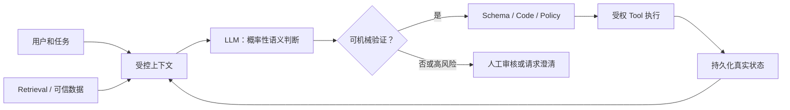

# 面向 Agent 开发的 LLM 基础认知

> [!important] 一句话核心
> LLM 是在给定上下文条件下生成最可能后续 token 的概率模型；擅长语义理解、归纳和生成，但不是可靠的数据库、计算器、状态机或执行器。
   Agent 的可靠性来自LLM以外的上下文、工具、代码、状态、权限和评估。

## 目标

开发 Agent 时，最危险的两种误解是：
+ 把模型当成人
+ 把模型当成确定性 API。
前者会过度相信它“理解、记住、知道或已经做了”；后者会忽略同一输入下输出会变化、上下文会退化、工具参数会错、模型版本会回归。

正确的工作模型是：**LLM 负责概率性的语义判断；系统负责事实、确定性、外部动作、长期状态和风险控制。**

| 需求               | 优先交给                      | 不能只依赖模型的原因                   |
| ---------------- | ------------------------- | ---------------------------- |
| 理解意图、归纳材料、生成候选方案 | LLM                       | 这是它的优势，但结果仍需按任务风险验证          |
| 最新或私有事实          | Retrieval / 数据库 / 实时 tool | 参数中的知识有截止时间，且不能按来源检索         |
| 计算、排序、去重、权限判断    | Code / schema / policy    | 概率生成不提供确定性保证                 |
| 外部写入和不可逆动作       | Tool + 服务器端授权             | 模型的 tool call 只是请求，不是执行证明    |
| 跨轮任务进度和关键决策      | 持久化 state                 | context window 不是可靠、可查询的长期记忆 |
| 高风险或证据不充分判断      | 人工审核                      | 模型置信表达通常未校准，也可能编造依据          |

## 从模型到 Agent

图中的边界比 prompt 更重要：不可信文档、用户输入、tool 返回值，以及视频中的 OCR 文字、字幕和 ASR 转写都只是数据；它们不能自行改变系统规则或获得写权限。详见 [[prompt-engineering/10-context-and-instruction-architecture|上下文与指令架构]] 和 [[prompt-engineering/12-tools-state-and-authorization|工具、状态与授权边界]]。

## 阅读路径

### 文本大模型

1. [[01-transformer-and-token-flow|Transformer、token 与信息流]]：模型如何把文本和位置变成可计算表示；Decoder-only 与 RoPE 为什么成为主流。
2. [[02-training-alignment-and-behavior|训练、对齐与行为]]：预训练、SFT 和偏好优化为何使模型“像助手”，又为何不构成保证。
3. [[03-context-memory-and-long-inputs|上下文窗口、记忆与长输入]]：context、参数、state、retrieval 的边界，以及长上下文的退化。
4. [[04-inference-and-modern-architecture|推理与现代架构]]：采样、KV cache、GQA/MQA、MoE 与推测解码如何影响成本和延迟。
5. [[05-text-capabilities-limits-and-verification|文本能力边界与验证]]：推理、幻觉、结构化输出和工具使用应如何进入可靠系统。

### 视频理解

1. [[10-multimodal-video-input-and-fusion|视频输入与多模态融合]]：帧、音轨、字幕、OCR 如何变成模型的输入。
2. [[11-video-temporal-reasoning-and-long-video|时序建模、推理与长视频]]：采样、压缩、定位、计数和长视频的根本限制。
3. [[12-video-agent-reliability-and-architecture|视频 Agent 的可靠性与架构]]：如何把视频理解做成有证据、可验证、可人工复核的系统。

最后阅读 [[20-agent-design-decision-guide|Agent 设计决策指南]]，把模型知识转成架构选择；可变技术和产品信息在 [[99-technology-map-and-sources|技术地图与来源]] 中集中维护。

## 四个必须建立的直觉

### 1. 生成合理文本，不等于掌握可靠事实

模型从训练分布和当前上下文生成高概率延续。它可以在没有足够证据时给出流畅、细节丰富的回答；因此“不要幻觉”不是事实策略。事实任务必须规定允许证据、缺失值、引用和冲突处理。

### 2. 大 context，不等于大记忆

context 是本次调用提供的有限工作区；模型参数是训练中压缩得到的统计规律；应用 state 是系统持久化的可查询记录。这三者不能互相替代。

### 3. 会调用工具，不等于已经执行

模型选择工具和填参数本身也是预测。程序必须验证参数、权限与幂等性，执行后读取真实结果，模型才可据此继续。

### 4. 输出像推理，不等于过程或结论都正确

模型可完成不少多步语义与符号任务，但会受问题表述、上下文、模型版本和采样影响。应要求可检查的依据、阶段产物或程序验证，而不是把解释文字当证明。

## 最小检查表

- [ ] 能说清当前任务中模型只负责哪一个语义判断。
- [ ] 已区分模型知识、当前 context、retrieval 结果和持久化 state。
- [ ] 每一个事实、计算、外部动作和高风险结论都有模型之外的验证或失败路径。
- [ ] 生产评估固定了模型/版本、prompt、工具、参数、测试输入和评分方式。
- [ ] 视频任务已定义可用模态、统一时间基准，以及 `not_observed`、`insufficient_evidence` 和 `confirmed_negative` 的行为。

## 相关笔记

- [[20-agent-design-decision-guide|Agent 设计决策指南]]
- [[prompt-engineering/00-overview|提示词工程总览]]
- [[prompt-engineering/03-choose-the-right-lever|选择正确的工程杠杆]]
- [[building-effective-agents|Building Effective Agents]]
