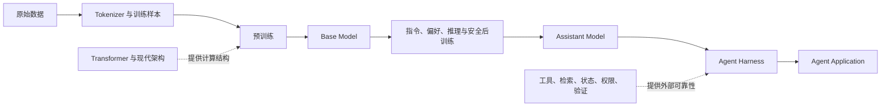

# 面向 Agent 开发的 LLM 基础

> [!abstract] 这套笔记要建立的认知
> 先理解现代大模型内部怎样计算，再理解一个基础模型怎样经过后训练成为 Assistant Model，最后解释它的能力为什么出现、为什么必然存在边界，以及 Agent 系统应当怎样正确使用它。

## 学习目标

读完后，你应能准确回答五个问题：

1. 一个 token 从输入到生成下一个 token，经历了哪些计算？
2. 原始 Transformer 的哪些部分仍然是主干，哪些部分已被优化、替换或绕开？
3. Agent API 背后的 Assistant Model 是怎样从数据、预训练和后训练得到的？
4. 语言、知识、推理、指令遵循和工具调用能力分别从哪里来，又会在哪里失效？
5. 设计 Agent 时，模型、工具、代码、状态、权限和人工应当怎样分工？

这不是模型训练实操教程，也不比较具体产品。公式用于准确表达计算关系，不做数学推导。动态技术以截至 2026-07 的技术路线为边界；具体产品规格不属于本系列。

## 整体认知链



这条链上有三个不能混淆的层次：

| 层次 | 它是什么 | 它不是什么 |
|---|---|---|
| 模型架构 | 把 token 和其他模态表示转换为下一个 token 概率的参数化计算图 | 一个会自行访问世界、保存状态和执行动作的应用 |
| Assistant Model | 经过后训练、倾向于遵循指令和使用工具的模型 | Agent、权限系统、数据库或确定性程序 |
| Agent Application | 模型与 context、tools、state、policy、validation、runtime 的组合 | 只靠一段复杂 prompt 驱动的聊天模型 |

## 阅读路径

### 第一部分：现代大模型的底层架构

1. [[01-token-embedding-and-transformer|Token、Embedding 与 Transformer]]：从输入字符串到下一个 token 概率的完整计算路径。
2. [[02-modern-transformer-evolution|现代 Transformer 的模块演进]]：逐模块解释原始设计、现代优化与替代路线。
3. [[03-inference-context-and-efficiency|推理、Context 与效率]]：prefill、decode、KV cache、长上下文、量化、批处理与推测解码。

### 第二部分：Agent 使用的模型是怎么来的

4. [[04-from-data-to-base-model|从数据到基础模型]]：数据处理、训练目标、参数更新、scaling 与 Base Model。
5. [[05-from-base-model-to-assistant-model|从基础模型到 Assistant Model]]：继续预训练、SFT、偏好优化、强化学习、安全后训练、蒸馏和评测。

### 第三部分：模型的能力、特点与边界

6. [[06-capabilities-and-their-origins|模型能力及其来源]]：语言、知识、in-context learning、推理、代码与工具使用为何会出现。
7. [[07-limitations-and-failure-mechanisms|能力边界与失败机制]]：幻觉、知识限制、上下文退化、推理错误、提示敏感与不确定性。

### 第四部分：在 Agent 中正确使用模型

8. [[08-using-assistant-models-in-agents|在 Agent 中正确使用 Assistant Model]]：模型的正确角色、工具与状态边界、循环控制、权限、验证和评估。

### 专项与索引

9. [[09-multimodal-language-models|多模态大模型专项]]：图像、音频、视频怎样进入同一模型，以及它们新增的观察与证据边界。
10. [[99-technology-map-and-sources|技术地图与一手来源]]：稳定概念、演进路线及来源索引。

## 贯穿全文的五个区分

### 参数知识、Context、Memory 与 State

| 概念 | 存在位置 | 主要作用 |
|---|---|---|
| 参数知识 | 模型权重 | 保存训练数据中学到的统计规律 |
| Context | 单次模型调用输入 | 为当前预测提供指令、材料、示例和历史 |
| Memory | 应用的存储与检索层 | 跨调用保存并按需重新提供信息 |
| State | 数据库、工作流或外部系统 | 记录任务真实进度和已经发生的动作 |

> [!warning] Context 不是可靠长期记忆
> 模型只能使用本次调用可见的信息。即使聊天系统把历史重新拼入 context，也不等于模型拥有可查询、可更新、无冲突的持久状态。

### 能力、行为倾向与系统保证

- **能力**：模型在合适条件下可以完成某类任务。
- **行为倾向**：后训练提高了某种输出出现的概率，例如遵循指令、拒绝危险请求或调用工具。
- **系统保证**：由 schema、code、policy、authorization、transaction 和验证器强制成立的约束。

模型“通常会”不等于系统“保证会”。Agent 可靠性必须来自三者的正确组合。

### 模型输出、工具请求与执行事实

```text
模型自然语言     = 候选内容
模型 tool call   = 候选动作请求
工具返回结果      = 外部执行事实
持久化状态回读    = 系统当前事实
```

### 结构正确与语义正确

结构化输出可以保证字段存在、类型有效、枚举合法，却不能保证字段中的事实真实、数字正确或动作得到授权。语法约束与业务验证是两层不同的问题。

### 模型能力与推理系统效率

Flash/分块 attention、continuous batching、prefix cache、paged KV cache 等主要让相同模型运行得更快或更省资源；训练数据、模型容量、后训练和推理时搜索更直接影响模型能完成什么。两类技术不能混为“模型变聪明”。

## 推荐学习方法

每篇笔记都按同一组问题阅读：

1. 输入和输出分别是什么？
2. 关键公式描述了哪一步计算？
3. 这项技术解决的是表达能力、训练稳定性、显存、带宽、延迟还是可靠性？
4. 它改变模型本身，还是只改变运行方式？
5. 它对 Agent 的设计边界有什么影响？

> [!tip] 不要背技术名词
> 先找问题，再看技术改变了哪一步。只记住“某技术更快”没有用；应能说出它减少的是注意力中间矩阵、KV cache、激活参数、内存搬运还是串行解码轮次。

## 完成标准

- [ ] 能画出 Decoder-only Transformer 从 token 到 logits 的计算图。
- [ ] 能解释 MHA、GQA/MQA、门控 FFN、MoE、RoPE、RMSNorm 各自改变了什么。
- [ ] 能区分架构优化、推理服务优化和推理时计算扩展。
- [ ] 能讲清 Base Model 到 Assistant Model 的完整生产链及每个节点的作用。
- [ ] 能把主要能力对应到预训练、后训练、context 或外部工具。
- [ ] 能从生成目标解释幻觉，而不是把它当成偶发 bug。
- [ ] 能说明为什么 Assistant Model 不是 Agent，以及哪些职责必须留在模型之外。
