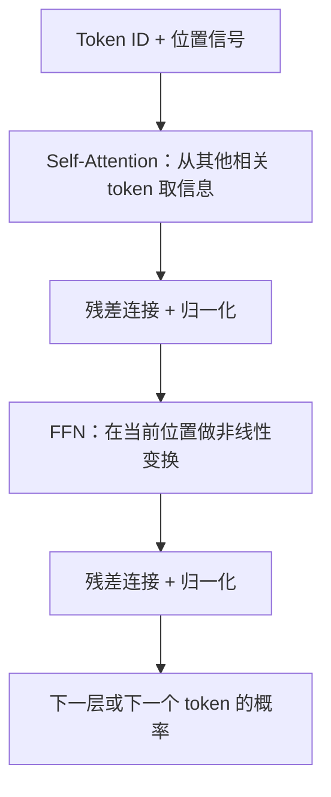

# Transformer、Token 与信息流

> [!important] 一句话核心
> Transformer 让每个 token 按当前任务从前文选择相关信息；Decoder-only LLM 将这个过程限制为“只能看过去”，逐 token 预测后续。它能关联远处信息，却不保证每段信息都被同等利用或正确理解。

## 从文本到 token

模型不直接处理“字”或“词”，而是处理 tokenizer 切分出的 token ID。BPE、SentencePiece 等方案会把常见字串编码为较少 token，把罕见拼写、代码、表格、不同语言或乱码拆得更细。

这直接影响 Agent：

- context 限制、输入成本和延迟以 token 计，不以字符或文件数计。
- 相同字数的中英文、JSON、代码和 OCR 噪声可能占用非常不同的预算。
- 长 tool 返回值应先筛选、结构化或摘要；不要因“文本看起来不长”就原样塞入。

> [!warning] token 不是语义单位
> 一个 token 可能是词的一部分、标点、空格模式或代码片段。以 token 边界切分文档不等于以事实、段落或权限边界切分；chunking 仍需保留语义和来源。

## Transformer 的最小计算图

每个 token 先变为向量，再经过重复的 Transformer block。无需手推公式，只需把它理解为两种互补操作：

- **Self-Attention**：当前位置根据当前表示，给可见 token 分配不同权重并聚合信息。它解释了代词指代、跨句约束、代码变量关联和“在材料中找答案”为何可能发生。
- **Multi-Head Attention（MHA）**：并行使用多组注意力投影，使不同 head 可学习不同关系模式。不要把某个 head 拟人化为稳定的“语法 head”或“事实 head”；整体行为来自所有层和所有 head 的组合。
- **FFN（前馈网络）**：在每个位置独立地变换已混合的表示，提供大量非线性容量。可把 attention 看作“找和搬运信息”，FFN 看作“在当前位置加工表示”的简化直觉。
- **残差连接与归一化**：帮助深层网络保留和稳定信息流。对 Agent 开发不是可配置接口，但它们是模型能堆叠很多层的原因之一。

## 为什么主流文本 LLM 多是 Decoder-only

Encoder-only 模型可双向读取完整输入，适合表征、检索或分类；encoder-decoder 模型显式区分输入编码和输出解码；**Decoder-only** 模型用一个因果遮罩：每个位置只可注意到自身及之前 token，然后持续预测下一个 token。

这种统一训练目标让同一架构既能续写、问答、翻译、写代码，也能在对话中学习当前任务模式。代价是输出必须自回归地产生：生成第 n 个 token 前通常需要已有前 n-1 个 token，因此长输出带来固有的串行延迟。

## 位置：为什么需要 RoPE

仅有 attention 时，token 的排列顺序并不天然可见。“狗咬人”和“人咬狗”有相同 token 集合，却应有不同意义。位置编码为 token 表示加入顺序信息。

**RoPE（Rotary Position Embedding）**通过随位置旋转 query/key 的部分向量，使 attention 分数带有相对距离与顺序信息。它广泛用于现代 Decoder-only 模型，因为实现简洁并适合相对位置关系。

> [!warning] RoPE 不等于无限上下文
> 模型在训练或后训练中实际见过的长度、位置扩展方法、数据分布与运行时资源都会影响长输入表现。即使 API 接受更长 token 序列，也必须在目标任务上测试检索、定位和跨段推理质量。

## 对 Agent 的直接含义

| 架构事实 | 工程结论 |
|---|---|
| attention 会在可见 token 间选择信息 | 将关键约束、证据和最终任务显式分段、靠近可见位置；不要依赖模型从嘈杂长材料中自动找全内容 |
| attention 成本和激活资源随序列增长显著上升 | 先 retrieval、去重和压缩，再扩大 context；测量真实 token、首 token 延迟和任务质量 |
| tokenization 与语言/格式相关 | 为代码、表格、OCR 和多语言输入单独做 token 预算与样本测试 |
| Decoder-only 自回归输出 | 用短结构化中间产物、流式 UI、缓存和拆分任务管理用户可感知延迟 |
| 位置信号不保证长度外推 | 对长文档/长视频将“给模型完整输入”视作 baseline，而非可靠方案 |

## 常见误解

- **“attention 就是模型在理解。”** attention 是可学习的信息混合机制，不是理解正确性的证明。
- **“多头等于多位独立专家。”** head 不是可独立调用或稳定解释的专家系统。
- **“context window 足够大，所以不会漏。”** 容量、注意力分配、位置、噪声和任务难度共同决定实际可用性。
- **“token 数相同就成本/质量相同。”** 模态、内容结构、模型、缓存命中和输出长度都会改变实际结果。

## 最小检查表

- [ ] 已用目标模型的 tokenizer 或真实 API 估计输入、输出和 tool 返回的 token 预算。
- [ ] 长输入任务含有关键事实位于开头、中间、末尾及相互冲突位置的 eval。
- [ ] 关键来源、用户数据和系统指令有清晰分隔，且不可信内容被当作数据。
- [ ] 没有因 API 支持长 context 就跳过 retrieval、证据追踪和失败测试。

## 相关笔记

- [[03-context-memory-and-long-inputs|上下文、记忆与长输入]]
- [[04-inference-and-modern-architecture|推理与现代架构]]
- [[prompt-engineering/10-context-and-instruction-architecture|上下文与指令架构]]
