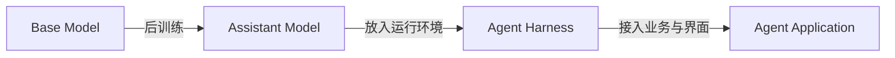
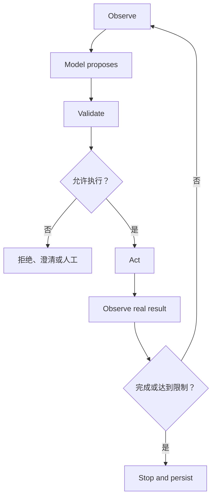

# 在 Agent 中正确使用 Assistant Model

> [!important] 核心认知
> Assistant Model 是经过后训练、擅长语义理解和生成的概率决策组件。它不是 Agent 本身，也不是数据库、状态机、权限系统、执行器或验证器。Agent 的可靠性来自模型与 context、tools、state、code、policy、validation 和 human oversight 的共同设计。

## 1. 先区分四个对象



| 对象 | 核心职责 | 不负责什么 |
|---|---|---|
| Base Model | 从训练分布学习通用序列规律 | 稳定服从指令 |
| Assistant Model | 理解指令、生成回答、提出工具调用 | 真实执行、持久状态、权限保证 |
| Agent Harness | 构建 context、执行工具、保存状态、控制循环、验证和审计 | 业务产品本身 |
| Agent Application | 面向用户完成业务目标 | 不能把全部可靠性委托给模型 |

不存在一条训练操作能直接把模型变成完整 Agent。Assistant Model 提供“在当前观察下建议下一步”的能力，Harness 提供它与真实环境交互的身体和约束。

## 2. 十个需要纠正的错误认知

| 错误认知 | 正确认知 |
|---|---|
| 模型理解规则，所以一定遵守 | 指令遵循是后训练提高的概率，不是强制约束 |
| 回答具体且自信，所以知道事实 | 表达质量与事实可靠性没有必然关系 |
| 模型说“已执行”，操作就成功 | 只有工具返回和外部状态能证明执行 |
| Context 足够大，所以不会遗漏 | 能放入不等于能正确定位、关联和使用 |
| 对话历史就是长期记忆 | 历史只是重新放入 context 的数据；真实记忆需持久化 |
| Structured Output 保证答案正确 | 它主要保证结构，不保证事实、计算和业务语义 |
| Tool Calling 解决幻觉 | 模型仍可能选错工具、填错参数、误读结果 |
| 模型能自检，所以不需要验证 | 自检与原回答共享盲区，强验证应独立 |
| Temperature 为 0 就是确定性程序 | 输出更集中，但模型和运行环境仍可能变化 |
| 更强模型可以替代系统设计 | 能力越强，可承担的语义任务越多；权限与状态边界仍不变 |

## 3. 把模型放在正确的职责位置

### 适合交给模型

- 理解自然语言意图和隐含语义；
- 归纳、分类、转换非结构化材料；
- 生成候选计划、草稿或解释；
- 在工具描述之间进行语义匹配；
- 解释带来源的检索和工具结果；
- 处理很难用固定规则穷举的软判断；
- 在低风险范围内决定下一步观察。

### 不应只交给模型

- 用户身份、角色和权限判断；
- 精确金额、计数、排序、日期和约束计算；
- 最新、私有、可追溯事实的存储与查询；
- 跨轮任务的真实状态；
- 幂等、事务、锁和一致性；
- 不可逆动作的最终授权；
- 法规、业务规则和安全 policy 的强制执行；
- 对自身答案的最终真实性证明。

> [!tip] 一条实用分工线
> 模型负责“这段材料在语义上意味着什么、下一步候选是什么”；确定性系统负责“事实是什么、允许做什么、是否执行成功、状态现在是什么”。

## 4. 模型输出是候选决策

正确的运行模型是：


模型产生的候选可以很好，但不能跳过后续节点。风险越高，候选与执行之间需要越强的门控。

## 5. Tool Call 不是执行

严格区分：

```text
自然语言输出  = 候选内容
Tool Call     = 带名字和参数的执行请求
Tool Result   = 外部系统返回的观察
State Readback= 系统当前事实
```

模型生成 `cancel_order(order_id=123)`，只说明它提出了这个调用。Harness 仍需：

1. 验证 tool name 和参数 schema；
2. 从可信 state 获取用户和资源身份；
3. 检查权限、业务规则和当前状态；
4. 对高影响动作显示预览并获得确认；
5. 使用幂等键执行；
6. 读取工具真实返回；
7. 必要时再次查询外部状态；
8. 持久化结果，随后才让模型总结。

模型不能根据 tool description 给自己授权。

## 6. Prompt、Context、Memory、State 与 Parameters

| 层 | 定义 | 正确用途 | 常见误用 |
|---|---|---|---|
| Parameters | 训练后的权重 | 通用模式与能力 | 当实时数据库 |
| Prompt | 当前任务说明 | 定义目标、约束和输出 | 当强制 policy |
| Context | 本次调用可见材料 | 当前证据与工作区 | 当长期存储 |
| Memory | 应用保存并检索的信息 | 跨任务偏好与历史知识 | 无筛选地保存模型总结 |
| State | 任务和外部世界真实记录 | 进度、审批、执行结果 | 只存在聊天文字中 |

### State 应存事实，不存角色表演

应存：

```json
{
  "task_id": "task-123",
  "status": "awaiting_confirmation",
  "completed_steps": ["lookup_order"],
  "proposed_action": {"type": "cancel_order", "order_id": "123"},
  "tool_results": [{"tool": "lookup_order", "result_id": "r-456"}]
}
```

不应只存：“我已经查过订单，现在正准备取消。”后者是自然语言叙述，可能遗漏 ID、来源和真实状态。

## 7. Context 构建是一项系统职责

每次调用只提供完成当前决策所需的信息：

```text
稳定系统规则
+ 当前任务与允许动作
+ 必要真实 state
+ 经权限过滤的检索材料
+ 与本步骤相关的工具定义
+ 最近且必要的观察
```

Context 构建需要：

- 来源与时间标注；
- 用户数据、外部数据和指令的明确分区；
- 去重和冲突保留；
- 长工具结果的筛选与结构化；
- token 预算；
- 对模型摘要的可丢弃定位；
- 对 prompt injection 的数据边界。

不要默认“把所有历史都塞进去”比选择性 context 更可靠。

## 8. Tool 设计原则

### 语义清楚

- 一个 tool 表达一个清楚动作；
- 名称体现意图，避免多个工具描述高度重叠；
- 参数有明确类型、枚举、单位和描述；
- 把资源 ID 与自然语言名称分开；
- 不要求模型生成可由程序计算的字段。

### 安全和一致性

- tool description 帮助选择，不承担授权；
- 服务端重新验证身份、权限和业务条件；
- 写操作提供 dry-run、预览或 confirmation token；
- 使用 idempotency key 防止重复执行；
- 真实敏感参数来自可信 state，而不是外部网页文本；
- 所有执行记录可审计。

### 结果可处理

工具应返回明确状态和机器可读原因：

```json
{
  "status": "permission_denied",
  "result": null,
  "error_code": "ORDER_NOT_OWNED",
  "retryable": false
}
```

避免只返回一大段模糊文本让模型猜测成功与否。外部文本仍应作为不可信数据，不能改变系统 policy。

## 9. Agent Loop 的控制权在 Harness



Harness 至少控制：

- 最大迭代次数；
- wall-clock timeout；
- 输入、输出和总 token/API 预算；
- 允许的工具集合；
- 重试、退避和熔断；
- 重复动作检测；
- 工作流完成条件；
- 人工接管条件；
- checkpoint 与恢复；
- 审计和 trace。

模型可以建议继续或结束，但不能是唯一停止机制。

## 10. 把失败状态设计成正式接口

Agent 不应只有 `success` 和一段自由文本。常见状态包括：

| 状态 | 含义 | 后续 |
|---|---|---|
| `success` | 目标已由外部结果证明完成 | 保存结果并结束 |
| `not_found` | 查询覆盖内没有对应记录 | 修改查询或告知用户 |
| `not_observed` | 输入/采样没有覆盖所需信息 | 获取更多观察 |
| `insufficient_evidence` | 有候选但证据不足 | 补证据或人工 |
| `conflicting_evidence` | 可信来源相互冲突 | 保留冲突并升级 |
| `invalid_input` | 输入不满足任务前提 | 请求修正 |
| `permission_denied` | 身份或 policy 不允许 | 停止，不能让模型绕过 |
| `tool_failure` | 外部依赖失败 | 按 retryable 策略处理 |
| `requires_confirmation` | 高影响动作等待用户确认 | 暂停并持久化 |
| `requires_human_review` | 风险或歧义超过自动阈值 | 进入有责任人的队列 |

允许明确失败能降低模型在证据不足时被迫生成确定答案的概率。

## 11. 确定性工作流与开放 Agent Loop

按复杂度逐级增加：

1. **单次模型调用**：输入明确、输出可验证。
2. **模型 + tool**：需要最新事实、计算或动作。
3. **固定工作流**：步骤可以预先定义，模型只在个别节点做语义判断。
4. **受控 Agent loop**：路径无法预设，但环境能提供可靠反馈。
5. **多 Agent**：只有在 context 隔离、并行专业化或独立责任确实有价值时采用。

每增加一层，都会增加延迟、成本、状态、错误累积和调试难度。模型更强不等于系统应更开放。

## 12. 高风险动作怎样门控

风险由“发生概率 × 影响”决定。对于付款、删除、发布、权限变更、发送消息等动作：

```text
模型提出候选
→ 程序生成可读预览
→ 检查用户、资源、范围和 policy
→ 获得明确确认或人工审批
→ 使用短期授权 token 执行
→ 回读真实结果并审计
```

确认应绑定具体动作和参数，不能用一条早先的泛化“可以帮我操作”授权后续未知动作。

## 13. Validation 应分层

从便宜到强：

1. **Syntax**：JSON、类型、枚举、必填字段。
2. **Semantic**：字段间关系、单位、日期范围、资源存在。
3. **Policy**：身份、权限、额度、审批与风险。
4. **Execution**：工具是否真实成功、是否幂等。
5. **Outcome**：外部状态是否达到目标。
6. **Human review**：开放判断或高影响责任。

模型可以参与 semantic review，却不能成为每层唯一验证器。

## 14. Agent Eval 要看结果和轨迹

最终回答看起来好，不代表 Agent 工作正确。评测至少包含：

| 维度 | 指标示例 |
|---|---|
| 任务结果 | 成功率、部分完成率、用户修正率 |
| 事实与证据 | 来源覆盖、引用一致、未知状态正确率 |
| 工具选择 | 正确工具率、漏调用、冗余调用 |
| 参数 | schema 有效率、业务字段正确率 |
| 轨迹 | 步骤顺序、重复循环、无效观察 |
| 安全 | 越权、误拒、注入成功率、确认遵守率 |
| 状态 | checkpoint 可恢复、外部状态一致性 |
| 效率 | TTFT、总延迟、token、调用数、成本 |
| 人工 | 升级率、推翻率、队列等待时间 |

模型、prompt、tool schema、retrieval、policy 或 runtime 任一变化，都可能导致回归。评测记录必须固定版本和原始 trace。

## 15. 十条最终原则

1. 把 Assistant Model 当作概率性语义组件。
2. 把模型输出当作候选，而不是事实或授权。
3. 最新、私有、可引用事实来自可信数据和工具。
4. 动作成功只由真实执行结果证明。
5. 任务状态持久化在模型之外。
6. 权限和 policy 由确定性系统强制执行。
7. 计算、结构和业务约束由代码与 validator 检查。
8. 把证据不足、冲突和工具失败设计为正式状态。
9. 高风险决策使用确认、独立门控或人工。
10. 同时评估结果、轨迹、安全、状态、延迟和成本。

## 设计前检查表

- [ ] 已明确模型只负责哪些语义判断。
- [ ] 已区分 parameters、prompt、context、memory 和 state。
- [ ] 每个 tool 的权限、幂等性和失败状态由程序控制。
- [ ] 不可信文本无法直接决定敏感工具参数或 policy。
- [ ] 循环有预算、超时、停止和人工接管条件。
- [ ] 关键事实、计算、外部动作和高风险结论有独立验证。
- [ ] Eval 同时覆盖正常、边界、对抗和依赖失败样本。

## 相关笔记

- [[05-from-base-model-to-assistant-model|从基础模型到 Assistant Model]]
- [[07-limitations-and-failure-mechanisms|能力边界与失败机制]]
- [[prompt-engineering/10-context-and-instruction-architecture|上下文与指令架构]]
- [[prompt-engineering/12-tools-state-and-authorization|工具、状态与授权边界]]
- [[building-effective-agents|Building Effective Agents]]

