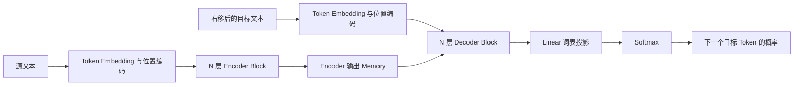
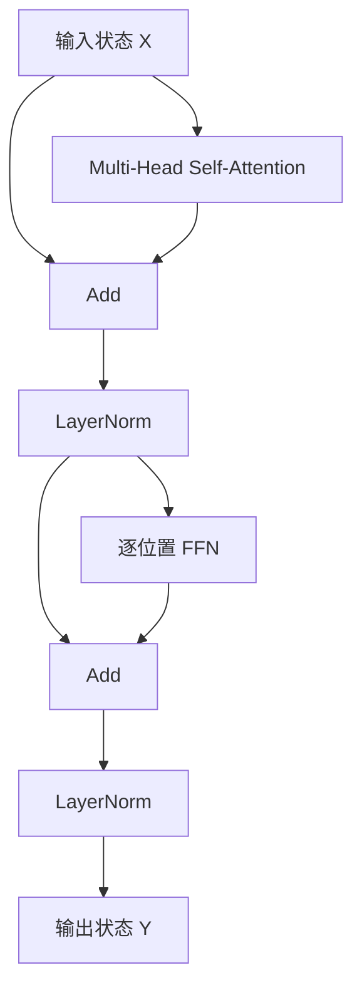
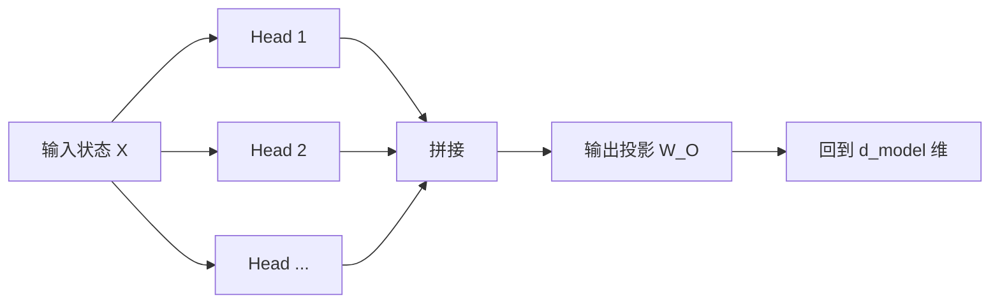
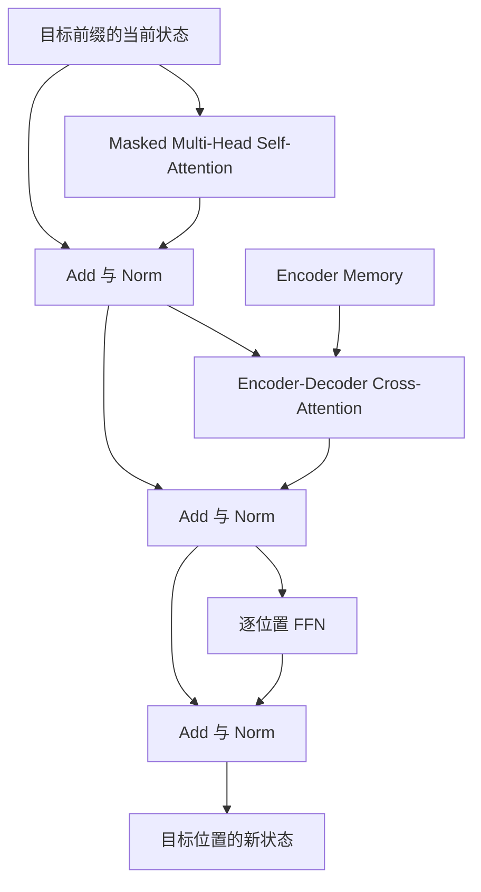

# Transformer 架构与基本原理

> [!abstract] 本章目标
> 理解原始 Transformer 的基本架构和工作原理，以及它为什么能够解决序列理解与生成问题。

## 前置知识

[[02-from-text-to-training-data|上一章]]已经把文字变成了一串带位置信息的初始向量。每个位置此时只知道“我是什么 Token、我在哪里”，还没有充分结合句子中其他位置的信息。

本章从 2017 年论文《Attention Is All You Need》出发，先看完整的 Encoder-Decoder 架构，再逐层解释 Self-Attention、FFN、残差连接和归一化如何协作。理解这套原始结构后，下一章再讨论 GPT、Llama、Qwen 等现代 LLM 怎样在此基础上形成 Decoder-only 架构。

## 1. 原始 Transformer 要解决什么问题

原始 Transformer 主要为序列到序列任务设计，例如把英文翻译成中文：

```text
源序列：I love China .
目标序列：我 爱 中国 。
```

要完成翻译，模型不能只把每个词单独替换成另一个词。它必须解决三类问题：

1. 同一个词的含义会受整句上下文影响；
2. 输入与输出的长度、语序可能不同，不能按位置一一替换；
3. 生成下一个目标 Token 时，需要同时回答两个问题：**原文要求表达什么**，以及**译文到目前为止已经说了什么**。

原始 Transformer 用 Attention 建立任意位置之间的动态联系，用 FFN 加工每个位置收集到的信息，再通过残差连接和归一化把这些计算稳定地堆叠成深层网络。在这个整体方案中，Encoder 和 Decoder 分别承担两个阶段：

1. **Encoder 编码输入**：让英文中每个位置结合整句上下文，形成可供后续读取的表示；
2. **Decoder 生成输出**：读取已经生成的中文前缀，同时读取 Encoder 的英文表示，逐个预测下一个中文 Token。

因此，原始论文中的两个大方框不是两个连续的“普通层”，而是两组各自重复多次的网络：



图中的 `N 层` 表示同一种 Block 重复多次。完整 Transformer、一个 Encoder Block 和一个 Decoder Block 是三个不同层级：

```text
完整 Transformer
├── Encoder Stack
│   └── N × Encoder Block
└── Decoder Stack
    └── N × Decoder Block
```

> [!note] `N × Encoder Block`
> `N` 表示把 N 个结构相同的 Encoder Block 依次堆叠起来。第 1 层接收 Token Embedding 与位置编码形成的初始状态，第 2 层接收第 1 层的输出，依次传递，直到第 N 层：
>
> ```text
> 初始状态 X⁽⁰⁾ -> 第 1 层 -> X⁽¹⁾ -> 第 2 层 -> ... -> 第 N 层 -> X⁽ᴺ⁾
> ```
>
> 更准确地说，这不是同一个 Block 循环运行 N 次，而是 N 个结构相同、参数通常各自独立的 Block。每层输入和输出的形状不变，但 Hidden State 会在 Attention 和 FFN 中不断结合、加工上下文；最终的 `X⁽ᴺ⁾` 就是交给 Decoder 读取的 Encoder Memory。

> [!important] Encoder 的输出不是一句翻译
> Encoder 为源序列的每个位置产生一个上下文化向量。整组向量常被称为 Encoder Memory，Decoder 在生成每个目标 Token 时都可以读取它。

## 2. 一层 Encoder 到底做什么

一层 Encoder Block 的结构是：



一层虽然只有两个主要计算子层，却完成两种不同工作：

- **Self-Attention 在位置之间传递信息**：每个位置按当前需要读取其他位置；
- **FFN 在每个位置内部加工信息**：对 Attention 收集后的向量做非线性变换。

残差连接和归一化包围这两个子层，让许多 Block 能够稳定叠加。输入和输出都保持为“序列长度 × 隐藏维度”的一组向量，因此上一层输出可以直接成为下一层输入。

接下来先讲整套架构中最关键的机制：Self-Attention。

## 3. Self-Attention 解决什么问题

### 从孤立的 Token 到理解整句话

进入第一层 Encoder 之前，句子中的每个位置已经有一个初始向量。这个向量包含两类基本信息：当前位置是什么 Token，以及它在句子中的位置。但此时每个位置主要表示自己，还没有真正结合其他 Token。

问题在于，语言的含义通常不是由单个词独立决定的。例如 Encoder 正在处理：

> 小明把书放在桌上，因为**它**很重。

只看“它”自己的 Token，无法判断它指的是“书”还是“桌子”；还要结合“小明把书放在桌上”和“很重”等信息。类似地，“重”也要结合它修饰的对象，“放”则要联系谁在放、放什么、放在哪里。

因此，Encoder 面临的核心问题是：

> **怎样让句子中的每个位置都能结合其他位置的信息，形成适合当前语境的新表示？**

==这个从“只表示 Token 自身”到“表示 Token 在当前句子中的含义”的过程，叫作**上下文化**==。Self-Attention 就是 Transformer 用来完成上下文化的核心机制。

### Self-Attention 做了什么

Self-Attention 接收整条序列的当前状态，同时为每个位置产生一个新的状态。对其中任意一个位置，它都完成三件事：

1. **确定当前需要什么信息**：例如“它”需要寻找可能被指代的对象；
2. **比较整条序列中的位置**：判断“书”“桌上”“很重”等位置与当前需求有多大关系；
3. **按相关程度汇总信息**：从多个位置取回不同份量的信息，形成“它”的新向量。

可以先把这个过程理解成：

```text
“它”的当前状态
-> 查看句子中所有位置
-> 判断每个位置此刻对理解“它”有多大帮助
-> 按不同权重汇总这些位置提供的信息
-> 得到结合上下文后的“它”的新状态
```

同样的过程不只发生在“它”上，而是同时发生在句子中的每个位置上。每个位置都有自己的需求，所以读取其他位置的方式也不同：

- “它”可能重点读取“书”和“很重”；
- “放”可能重点读取“小明”“书”和“桌上”；
- “重”可能重点读取“它”以及它所指向的对象。

因此，Self-Attention 不是为整句话计算一份固定摘要，也不是找出全句唯一“最重要”的词。它为**每个位置**分别计算“这一次应该从其他位置读取什么”。

用矩阵形状表示，Self-Attention 前后的 Token 数量和向量维度不变：

```text
输入：T 个位置 × d_model 维当前状态
       ↓ 每个位置按需读取整条序列
输出：T 个位置 × d_model 维上下文化状态
```

变化的不是位置数量，而是每个位置向量中包含的信息。输入中的“它”主要表示这个 Token 本身；输出中的“它”已经混入了当前句子里与它相关的信息。

> [!important] Self-Attention 的核心作用
> 它在 Token 位置之间建立动态的信息通路，让每个位置都能根据当前需要读取其他位置。没有这一步，模型看到的只是一串彼此孤立的 Token；有了这一步，模型才有可能表示指代、修饰、搭配、语序和远距离依赖等上下文关系。

### 为什么叫 Self-Attention

这里的“Self”表示：用于发出需求、参与匹配和提供信息的状态，都来自**同一条输入序列**。在这个例子中，“它”读取的“小明”“书”“桌上”和“很重”都来自当前源句。

“Self”并不表示一个 Token 只关注自己。恰恰相反，Encoder 的 Self-Attention 允许每个位置读取源序列中的所有位置，包括自己。

### 为什么要重复多层 Self-Attention

一层 Self-Attention 完成一次按需的信息交换，但复杂关系往往需要分几步形成。第一层可能先建立局部搭配和直接联系；下一层再基于这些已经上下文化的状态，组合出更复杂或跨度更远的关系。

因此，第 2 个 Encoder Block 读取的不是最初那组孤立向量，而是第 1 个 Block 已经更新过的 Hidden State。随着 N 层 Encoder 依次堆叠，每个位置的表示被反复结合和加工，最终形成 Decoder 可以读取的 Encoder Memory。

### 如果没有 Self-Attention

如果完全没有任何让位置之间交换信息的机制，每个 Token 就只能沿着自己的位置独立计算。“它”的向量无法读取“书”或“很重”，“放”的向量也无法知道动作涉及谁、什么物体和什么地点。无论网络堆叠多少层，各位置仍然无法根据整句上下文改变自己的表示。

后面会讲到的 FFN 只负责在一个位置的向量内部加工特征，本身不会把“书”的信息送到“它”的位置。因此，在标准 Transformer Block 中，两类计算缺一不可：Self-Attention 负责**跨位置交换信息**，FFN 负责**在每个位置内部加工信息**。

一种朴素方案是把所有位置直接求和或平均后交给每个位置，但这样也有问题：

- 不管当前更新“它”还是“桌子”，读到的都是同一份平均信息；
- 所有 Token 得到固定贡献，无法根据当前问题动态选择；
- 词序和位置关系很容易被冲淡。

Self-Attention 的关键价值就在这里：它不是把同一份全句摘要交给所有位置，而是让不同位置根据自己的当前状态，动态决定应该从哪里读取多少信息。下一节的 Q、K、V，就是这套“提出需求、判断相关性、取回内容”的具体实现。

## 4. 为什么要把读取过程拆成 Q、K、V

先只追踪“它”这一个位置。模型需要解决三个不同问题：

1. “它”当前想寻找什么线索？
2. 每个候选位置凭什么与这个需求匹配？
3. 某个位置匹配后，究竟要传递什么内容？

Attention 把三种角色分别表示为：

- **Query（Q）**：当前位置发出的查询，表示“我想找什么”；
- **Key（K）**：每个位置用于参与匹配的特征，表示“我可以怎样被找到”；
- **Value（V）**：匹配后实际传递的内容，表示“选中我后，我提供什么”。

每个位置的当前状态都会通过三组不同的可训练投影，分别产生 Q、K、V：

$$
Q=XW_Q,\qquad K=XW_K,\qquad V=XW_V
$$

这里的 $X$ 是整条序列当前所有位置的状态矩阵，所以每个位置同时拥有自己的 Query、Key 和 Value。三套投影的意义不是把数据复制三次，而是允许模型分别学习“如何查询”“如何被匹配”和“传递什么”。

> [!question] 为什么 Key 和 Value 不直接使用同一个向量？
> 用于判断相关性的特征不一定就是最终应该传递的内容。类似图书检索中，书名和标签帮助匹配，但真正取回的是书的正文。分开投影让这两种角色可以独立学习。

## 5. 一个位置怎样完成一次 Attention

仍以“它”所在位置为例。一次单头 Attention 可以按以下步骤理解。

### 第一步：Query 与所有 Key 比较

“它”的 Query 分别与“小明”“书”“放在”“桌上”“它”“很重”等位置的 Key 做点积，得到一组匹配分数：

```text
“它”的 Query
├── 与“小明”的 Key 比较 -> 一个分数
├── 与“书”的 Key 比较   -> 一个分数
├── 与“桌上”的 Key 比较 -> 一个分数
└── 与“很重”的 Key 比较 -> 一个分数
```

点积高不等于两个词在词典里相似，而表示在当前训练出的查询空间中，这个候选位置更符合当前位置的读取需求。

### 第二步：缩放并变成权重

Key 维度较大时，点积绝对值容易变大，使 Softmax 过于接近“只选一个位置”，梯度也会变得不稳定。因此先除以 $\sqrt{d_k}$，再用 Softmax 把分数变成非负且总和为 1 的权重。

这些权重回答的是：“对更新当前这个位置而言，各候选位置这一次分别贡献多少？”它们不是每个词永久不变的重要度。

### 第三步：按权重汇总 Value

模型用刚才的权重对所有 Value 做加权求和。若“书”的权重较高，它的 Value 对结果贡献就更大；其他位置通常仍可能贡献一部分。最后得到的是一个新的数值向量，不是把“书”这个词复制过来。

完整公式只是把这三个动作压缩在一起：

$$
\operatorname{Attention}(Q,K,V)
=\operatorname{softmax}\left(\frac{QK^\top}{\sqrt{d_k}}\right)V
$$

1. $QK^\top$：每个 Query 与所有 Key 比较；
2. 除以 $\sqrt{d_k}$：控制分数尺度；
3. $Softmax$：变成相对权重；
4. 乘以 $V$：为每个位置汇总其他位置提供的内容。

因为每个位置都有自己的 Query，上述过程会对所有位置分别发生。输入和输出形状保持一致：

```text
输入：T 个位置 × d_model 维状态
输出：T 个位置 × d_model 维状态
```

但输出中每个位置已经混合了与自己相关的上下文信息。

> [!warning] Attention 输出不是 Attention 权重
> 权重只是“从各位置取多少”的中间结果。真正输出的是所有 Value 按这些权重混合后得到的新向量。

## 6. 为什么需要 Multi-Head Attention

### 一个 Head 到底是什么

上一节描述的“一套 Q、K、V 投影，加上一次 Attention 计算”，就是一个 **Attention Head**。对于第 $i$ 个 Head，它有自己的一套可训练参数：

$$
Q_i=XW_Q^{(i)},\qquad K_i=XW_K^{(i)},\qquad V_i=XW_V^{(i)}
$$

再独立计算一套 Attention 权重和汇总结果：

$$
head_i=\operatorname{Attention}(Q_i,K_i,V_i)
$$

因此，一个 Head 可以理解为一套完整的“读取方式”：它用自己的 $W_Q$ 决定各位置怎样提出需求，用自己的 $W_K$ 决定各位置怎样参与匹配，再用自己的 $W_V$ 决定匹配后提供什么信息。

### 为什么一套读取方式不够

语言中的关系可能同时涉及动作执行者、动作对象、地点、指代、修饰、局部搭配和远距离条件。如果只有一个 Head，所有这些关系都必须挤在同一套 Q、K、V 投影和同一套 Attention 权重中。

仍以这句话为例：

> 小明把书放在桌上，因为**它**很重。

模型可能需要同时建立多种联系：

- “放”与“小明”之间的动作执行者关系；
- “放”与“书”之间的动作对象关系；
- “放”与“桌上”之间的地点关系；
- “它”与“书”之间的指代关系；
- “重”与“它”或“书”之间的修饰关系。

Multi-Head Attention 的做法，是让同一组输入 $X$ 同时进入多个 Head。每个 Head 使用不同的 $W_Q$、$W_K$、$W_V$，所以会产生不同的 Q、K、V，以及不同的 Attention 权重矩阵：

```text
同一组输入状态 X
├── 第 1 套 W_Q、W_K、W_V -> Head 1 -> 一套读取结果
├── 第 2 套 W_Q、W_K、W_V -> Head 2 -> 另一套读取结果
├── 第 3 套 W_Q、W_K、W_V -> Head 3 -> 又一套读取结果
└── ...
```

也就是说，多头并不是把同一套 Attention 重复计算多次，而是用多套不同参数并行学习多种匹配和信息提取方式。

Multi-Head Attention 为同一组输入并行使用多套投影：



### 多个 Head 的结果怎样合并

每个 Head 通常只处理隐藏维度的一部分。例如，若 $d_{model}=512$ 且使用 8 个 Head，每个 Head 常处理 64 维。这样可以让多个 Head 并行采用不同读取方式，又不必让总输出维度扩大 8 倍。

所有 Head 的结果会先拼接，再通过输出矩阵 $W_O$ 混合并投影回 $d_{model}$ 维：

$$
\operatorname{MultiHead}(X)
=\operatorname{Concat}(head_1,\ldots,head_h)W_O
$$

因此，Multi-Head Attention 的完整过程是：

```text
同一组输入 X
-> 多套 W_Q、W_K、W_V
-> 多套 Attention 权重与 Value 汇总结果
-> 拼接所有 Head
-> 通过 W_O 混合
-> 得到每个位置更丰富的上下文状态
```

> [!important] 多头的核心
> 多个 Head 的核心确实是多套不同的 $W_Q$、$W_K$、$W_V$。但参数不同还会进一步导致每个 Head 产生不同的 Attention 权重和信息汇总结果；最后再由 $W_O$ 把这些读取结果组合起来。

### 不要把每个 Head 当成预设的问题

上面的动作执行者、对象、地点和指代可以帮助理解“多种读取方式”，但不能据此认为设计者预先规定：

```text
Head 1 固定寻找动作执行者
Head 2 固定寻找动作对象
Head 3 固定寻找指代对象
```

每个 Head 的用途由训练形成，没有人工指定的固定语义。不同 Head 的分工可能重叠；同一个关系也可能由多个 Head 和多层网络共同表示；有些 Head 学到的数值模式甚至很难被人类命名。

更准确的理解是：**单个 Head 让每个位置按照一种学到的方式读取整条序列；多个 Head 让每个位置同时使用多套不同的方式读取整条序列，再把结果合并。**

## 7. FFN 的意义

### 术语理解

在解释 FFN 的计算过程前，先明确后面会反复使用的四个术语。

#### 特征与特征变换

**特征**是模型从输入中提取或形成的、可供后续计算使用的数值信息。例如，“它”位置的 Hidden State 中，可能包含与代词、前文对象、修饰关系和指代可能性有关的数值模式。

特征不是人工写入的标签，也不应简单理解成“某一维固定表示某个概念”。一个概念通常分散在多个维度中，同一个维度也可能参与表示多种概念。

**特征变换**是把当前向量中的数值信息重新组合和调节，形成更适合后续计算的新表示。在 FFN 中，$W_1x+b_1$ 先用多种方式组合 $x$ 的各个维度，产生候选特征；激活函数调节这些特征的响应；$W_2$ 再把它们组合成新的 Hidden State。

特征变换不会把向量直接翻译成“它一定指书”这样的文字结论，而是改变内部数值表示，让后续网络层更容易继续利用这种关系。

#### 激活与非线性筛选

**激活**是指某个中间特征对当前输入产生了多强的数值响应。以 ReLU 为例，响应为正的特征继续传递，数值越大通常表示此次影响越强；响应为负的特征变为 0，表示它此次不参与后续计算。激活不是启动某个模块，也不是激活某个参数。

**非线性筛选**是指激活函数不按一套统一的线性比例处理所有数值，而是根据输入采用不同规则。ReLU 对正数保留、对负数归零，使不同输入形成不同的特征响应组合。

这里筛选的是中间数值，不是筛选 Token，也不是判断信息正确与否。更一般地说，激活函数会以非线性方式调节各个中间特征的响应强度。

### Attention 收集完信息之后，还缺什么

经过 Multi-Head Attention 后，每个位置已经从其他位置取回了与自己相关的信息。例如“它”的状态可能混入了“书”和“很重”的信息，“放”的状态可能混入了“小明”“书”和“桌上”的信息。

但 Attention 的主要工作是**决定从哪里读取信息，并把多个位置提供的 Value 按权重混合起来**。得到这份混合结果后，模型还需要进一步加工：

- 对“它”而言，取回的信息能否组合成“它更可能指书”这样的内部特征？
- 对“放”而言，取回的执行者、对象和地点信息应该怎样组合？
- 当前向量中哪些特征应该增强，哪些应该抑制？

这就是 FFN（Feed-Forward Network，前馈神经网络）的职责：

> **Attention 负责让不同位置交换信息；FFN 负责在每个位置内部，对已经收集到的信息进行非线性识别、组合和变换。**

可以先把两者的配合理解成：

```text
Attention：把与当前位置相关的材料取回来
FFN：在当前位置内部加工这些材料
```

### FFN 怎样处理一个位置

原始 Transformer 的 FFN 由两次线性变换和中间的非线性激活组成：

$$
\operatorname{FFN}(x)=W_2\,\sigma(W_1x+b_1)+b_2
$$

这里的 $x$ 是**某一个位置**经过 Attention、残差相加和 LayerNorm 后的状态向量。整条公式可以按三步阅读。

#### 第一步：用 $W_1$ 扩展并重新组合特征

$$
z=W_1x+b_1
$$

$W_1$ 是可训练的权重矩阵，$b_1$ 是偏置。它们把输入向量中的各个数值重新组合，产生一组中间特征。中间维度 $d_{ff}$ 通常大于模型隐藏维度 $d_{model}$：

```text
x：d_model 维
  ↓ W_1x + b_1
z：d_ff 维，通常更宽
```

例如原始 Transformer 的 $d_{model}=512$、$d_{ff}=2048$。这不是简单复制向量，而是把 512 维输入映射成 2048 个不同的特征组合。更宽的中间空间为模型提供更多检测和组合特征的容量。

> [!note] $W_1$ 中没有人工写好的语言规则
> 设计者不会把某一行指定为“检测指代关系”。这些数值从随机状态开始，在训练中逐渐调整；某些中间特征可能对特定模式敏感，但通常不能逐个赋予稳定的人类语义。

#### 第二步：用 $\sigma$ 进行非线性筛选

$$
a=\sigma(z)
$$

$\sigma$ 是激活函数。原始 Transformer 使用 ReLU；它不在 Token 之间传递信息，而是根据当前输入改变各个中间特征的响应。

ReLU（Rectified Linear Unit，修正线性单元）的规则很简单：

$$
\operatorname{ReLU}(z)=\max(0,z)
$$

也就是正数保持不变，负数变成 0。例如 `[-2, 0.5, 3, -1]` 经过 ReLU 后得到 `[0, 0.5, 3, 0]`。可以把它粗略理解为一组数值开关：对当前输入响应为正的中间特征继续向后传递，响应为负的暂时关闭。这里的正负只是数值规则，不表示某个特征“正确”或“错误”。

直观上，同一套 FFN 面对不同位置时，会因为输入 $x$ 不同而产生不同响应：与“它”相关的状态可能激活一组特征，与“放”相关的状态则激活另一组特征。这样，网络才能根据当前内容有选择地保留、抑制和组合信息。

非线性非常关键。如果去掉 $\sigma$，两次线性变换可以合并：

$$
W_2(W_1x+b_1)+b_2=W'x+b'
$$

也就是说，再多的纯线性层最终仍等价于一次线性变换，无法形成同等级的条件化特征加工能力。激活函数打破了这种可合并性，使 FFN 能对不同输入产生更丰富的响应。

#### 第三步：用 $W_2$ 汇总并投影回原维度

$$
y=W_2a+b_2
$$

$W_2$ 和 $b_2$ 也是可训练参数。它们把中间特征重新组合，并从较宽的 $d_{ff}$ 维投影回 $d_{model}$ 维：

```text
d_model 维输入 x
-> W_1 扩展并重组为 d_ff 维
-> 激活函数进行非线性筛选
-> W_2 汇总并投影回 d_model 维
-> 得到 FFN 输出 y
```

回到 $d_{model}$ 维很重要，因为 FFN 的输出还要与原状态做残差相加，并作为下一层 Encoder Block 的输入；两者必须具有相同形状。

> [!important] 公式表达的完整意义
> $W_1$ 把当前位置的状态展开成更多候选特征，$\sigma$ 根据当前输入产生非线性响应，$W_2$ 再把有用的中间特征组合回模型状态。FFN 不是保存一张明确的规则表，而是用训练得到的参数实现可学习的逐位置特征变换。

### “逐位置运行”是什么意思

假设序列有多个位置，FFN 会分别处理每个位置的状态：

```text
“小明”的状态 -> 同一个 FFN -> “小明”的加工结果
“放”的状态   -> 同一个 FFN -> “放”的加工结果
“书”的状态   -> 同一个 FFN -> “书”的加工结果
“它”的状态   -> 同一个 FFN -> “它”的加工结果
```

“逐位置”包含两个容易混淆的含义：

1. **同一层的所有位置共享同一套 $W_1$、$b_1$、$W_2$、$b_2$**，不是每个 Token 配一套网络；
2. **各位置在 FFN 内部互不读取**，“它”的 FFN 计算不能直接访问“书”的状态。

这并不意味着 FFN 不知道上下文。它接收的 $x$ 已经经过 Attention，其中已经混入与当前位置相关的上下文信息。因此，FFN 虽然只处理“它”当前位置的向量，却能加工 Attention 此前带回的“书”“很重”等信息。

### Attention 和 FFN 为什么要配合

两者不是重复完成同一件事，而是构成一次“通信后计算”的配合：

```text
Self-Attention
-> 不同位置按需交换信息
-> 每个位置得到一份上下文化状态

FFN
-> 不再读取其他位置
-> 在每个位置内部识别、筛选和重组刚收集的信息
```

一层 Encoder Block 先让位置之间交换信息，再让每个位置独立加工；下一层又可以基于加工后的新状态进行新一轮信息交换。N 层堆叠后，复杂关系便能逐步形成。

### 如果没有 FFN 会怎样

模型仍然可以通过 Attention 在位置之间传递和混合 Value，但每层缺少专门用于逐位置特征扩展、非线性筛选和重新组合的模块。它更擅长“从哪里取信息”，却缺少足够强的“取回以后怎样加工”的能力，模型的表达能力和参数容量都会明显受限。

需要准确地区分：Attention 本身包含 Softmax 和依赖输入的权重，并不是纯线性的；所以“没有 FFN”不等于整个 Transformer 立刻变成线性模型。更准确地说，FFN 为 Attention 补充了另一类计算能力：容量较大的、逐位置的非线性特征变换。

因此，一层 Encoder 的两个核心子层可以浓缩为：

```text
Attention：决定每个位置从哪里取回什么信息
FFN：决定每个位置怎样加工已经取回的信息
```

## 8. 残差连接和归一化

Attention 和 FFN 都会产生新的计算结果，但如果每个子层都完全覆盖原状态，深层网络容易丢失已有信息，也更难训练。

### 残差连接：保留原状态，只学习增量

残差连接把子层结果加回原输入：

$$
y=x+F(x)
$$

它提供两条并行路径：一条让原信息直接通过，另一条让子层补充或修正信息。若某个子层暂时没有学到有用变换，原状态仍有路径向后传递；反向传播时，梯度也能通过加法路径更直接地穿过许多层。

如果没有残差连接，几十层甚至上百层网络中的每一层都必须完整重建并传递已有信息，深层训练更容易出现梯度难以传播和性能退化。

### 归一化：让数值尺度保持可控

多层变换和残差相加会不断改变向量的数值尺度。LayerNorm 根据单个位置向量内部的统计量重新调整尺度，使后续子层在较稳定的数值范围内工作。

归一化不会把不同 Token 变成相同向量，也不会负责在位置之间传递信息。没有合适的归一化时，深层网络的数值和梯度更容易不稳定，训练对初始化和学习率也更加敏感。

至此，一层 Encoder 的分工已经闭合：

```text
Self-Attention：位置之间交换信息
FFN：每个位置内部进行非线性加工
Residual：保留原状态并提供直接通路
LayerNorm：稳定每层处理的数值尺度
```

## 9. Decoder 的整体原理

前面已经知道，Encoder 的任务是读取完整源句，并把它变成一组上下文化的 Encoder Memory。但 Encoder 不负责直接生成译文。**Decoder 才是根据源句内容，从左到右逐个生成目标 Token 的部分。**

### Decoder 的目的和意义

仍以英译中为例：

```text
源序列：I love China .
目标序列：我 爱 中国 。
```

Decoder 要解决的不是“把某个英文词替换成某个中文词”，而是：

> **在完整源句的约束下，根据已经生成的目标前缀，预测下一个目标 Token。**

例如已经生成“我 爱”时，Decoder 既要知道中文接下来怎样表达才连贯，也要知道原句中还有 `China` 的含义需要表达。它的意义就是把两条信息流结合起来：

1. **目标侧信息**：译文已经生成了什么；
2. **源侧信息**：原文完整表达了什么。

只有目标侧信息，模型也许能续写出流畅中文，却不一定忠于原文；只有源侧信息，模型知道原文内容，却不知道译文已经生成到哪里，也无法按正确顺序继续写。

### Decoder 接收什么输入

Decoder 同时接收两类输入，但来源不同。

#### 输入一：目标序列前缀

目标前缀先经过 Token Embedding 与位置编码，形成 Decoder 的初始状态。

生成时，目标前缀就是当前已经生成的内容：

```text
第 1 步输入：[开始标记]
第 2 步输入：[开始标记, 我]
第 3 步输入：[开始标记, 我, 爱]
第 4 步输入：[开始标记, 我, 爱, 中国]
```

训练时，正确目标句已经存在，因此会把目标序列右移一位作为输入：

```text
Decoder 输入：[开始标记, 我, 爱, 中国]
预测目标：   [我,       爱, 中国, 。]
```

虽然训练时能一次放入多个位置，但 Causal Mask 会阻止每个位置读取右侧未来答案，所以它仍然学习“根据已有前缀预测下一个 Token”。

#### 输入二：Encoder Memory

Encoder 已经把源句 `I love China .` 加工成一组向量：

```text
I      -> h_I
love   -> h_love
China  -> h_China
.      -> h_period
```

整组向量记作：

$$
M=[h_I,h_{love},h_{China},h_{period}]
$$

这就是 Encoder Memory。它不是一句译文，也不是压缩成一个向量的全文摘要，而是保留了每个源位置的上下文化表示。生成整句译文期间，Decoder 会反复读取同一份 Memory，每一步的读取重点可以不同。

### Decoder 最终产出什么

一个 Decoder Block 的直接输出仍然是**每个目标位置的新 Hidden State**，不是文字，也不是 Token ID。N 层 Decoder Block 依次堆叠后，最后一层产生目标序列的最终状态：

```text
目标前缀的初始状态
-> 第 1 个 Decoder Block
-> 第 2 个 Decoder Block
-> ...
-> 第 N 个 Decoder Block
-> 每个目标位置的最终 Hidden State
```

最终 Hidden State 不会直接变成一个 Token，也不能直接送入 Softmax。它要先经过 Linear 词表投影，从 $d_{model}$ 维转换成 $vocab\_size$ 维。投影结果中的每个数分别对应词表中一个候选 Token，这些尚未归一化的分数称为 Logits。

仍以目标前缀“我 爱”为例，假设为了简化，词表中只考虑“中国”和“美国”两个候选 Token：

```text
“我 爱”所在位置的最终 Hidden State
-> Linear 词表投影
-> Logits：中国 3.2，美国 1.0
-> Softmax
-> 概率：中国 0.90，美国 0.10
```

Softmax 输出的不是单独一个“中国”，而是**整个词表的概率分布**，所有候选 Token 的概率总和为 1。真实词表可能包含数万或数十万个 Token，因此每次前向计算都会为整个词表产生一组 Logits。

随后还需要一个解码步骤，才会从概率分布中确定一个具体 Token：可以直接选择概率最高的 Token，也可以按照概率采样。若这一步选中“中国”，模型才会把“中国”追加到“我 爱”之后，再继续预测下一个 Token。

> [!note] 这里的 Softmax 与 Attention 中的 Softmax
> 两者是同一个数学函数，但处理对象和目的不同。Attention 中的 Softmax 把位置匹配分数变成“从各位置读取多少”的权重；输出层的 Softmax 把词表 Logits 变成“各 Token 成为下一个输出的概率”。Softmax 本身没有可训练参数。

完整流程是：

```text
最终 Hidden State
-> Linear 投影到整个词表
-> 得到每个候选 Token 的 Logit
-> Softmax 得到整个词表的概率分布
-> 解码策略选择或采样一个 Token
-> 将所选 Token 追加到目标前缀
-> 再次运行 Decoder，继续预测
```

因此要区分三个层级：

```text
一个 Decoder Block 的输出：更新后的目标位置 Hidden State
N 层 Decoder 的输出：最终目标位置 Hidden State
Linear 的输出：词表中各候选 Token 的 Logit
Softmax 的输出：整个词表的概率分布
解码步骤的输出：一个被选中的具体 Token
```

### Decoder 的总体原理

Decoder 每一层都依次完成三类计算：

1. **Masked Self-Attention**：读取目标前缀，理解译文已经生成到哪里；
2. **Cross-Attention**：根据当前目标状态，读取 Encoder Memory 中此刻需要的源句信息；
3. **FFN**：在每个目标位置内部，加工刚刚汇集的信息。

残差连接和 LayerNorm 则让这些计算可以稳定地堆叠多层。



可以把一层 Decoder 概括成：

```text
先看译文前缀：我已经说了什么？
-> 再查完整原文：此刻还需要取回什么？
-> 最后逐位置加工：怎样把两类信息组合成新的目标状态？
```

这就是 Decoder 比 Encoder 多一个 Attention 的根本原因：Encoder 只处理一条源序列，所以一次 Self-Attention 就能在源位置之间交换信息；Decoder 同时面对目标前缀和源句 Memory，需要一次 Masked Self-Attention 处理目标侧关系，再用一次 Cross-Attention 连接目标侧与源侧。

### Masked Self-Attention：理解已经生成的目标前缀

Masked Self-Attention 的 Q、K、V 都来自 Decoder 当前的目标序列状态，因此它仍属于 Self-Attention。但它不能读取未来目标位置：

```text
目标位置 0：只能看位置 0
目标位置 1：可以看位置 0、1
目标位置 2：可以看位置 0、1、2
```

生成时，未来 Token 本来就不存在。训练时，完整正确目标序列虽然已经放入计算，但 Causal Mask 会在 Softmax 前屏蔽未来位置，使对应 Attention 权重变为 0，防止模型偷看答案。

经过这个子层后，每个目标位置形成一份只包含自己和左侧前缀的状态。例如“我 爱”之后的位置，可以知道当前译文前缀是“我 爱”，但还需要通过 Cross-Attention 查询原文，才能确定接下来应该表达什么源句内容。

### Cross-Attention：Decoder 怎样读取 Encoder 的结果

#### Q 来自 Decoder，K 和 V 来自 Encoder

Cross-Attention 连接目标侧和源侧：

- **Query 来自 Decoder**：表示当前目标位置根据已生成前缀，正在寻找什么源句信息；
- **Key 来自 Encoder Memory**：让每个源位置可以与这个需求进行匹配；
- **Value 来自 Encoder Memory**：某个源位置匹配后，实际向 Decoder 提供什么内容。

公式可以写成：

$$
Q=D W_Q,\qquad K=M W_K,\qquad V=M W_V
$$

$$
\operatorname{CrossAttention}(D,M)
=\operatorname{softmax}\left(\frac{QK^\top}{\sqrt{d_k}}\right)V
$$

其中 $D$ 是经过 Masked Self-Attention 后的目标序列状态，$M$ 是 Encoder Memory。Self-Attention 的 Q、K、V 来自同一组状态；Cross-Attention 的 Q 与 K/V 来自两组不同状态，所以称为“Cross”。

> [!important] Q 来自哪一侧，决定“谁在读取谁”
> Decoder 提供 Q，Encoder 提供 K 和 V，表示 Decoder 根据当前生成需要去读取 Encoder。不是 Encoder 反过来读取 Decoder，也不是两边的向量直接相加。

#### 以生成“中国”为例

假设 Decoder 已经生成“我 爱”，一次 Cross-Attention 可以按以下步骤理解：

1. Masked Self-Attention 根据“我 爱”形成当前目标状态；
2. 目标状态产生 Query，表达“接下来需要什么原文信息”；
3. Query 分别与 `I`、`love`、`China`、标点等源位置的 Key 比较；
4. Softmax 把匹配分数变成权重，此时 `China` 可能获得较高权重；
5. Decoder 按权重汇总所有源位置的 Value，得到针对当前目标位置的源句信息；
6. Cross-Attention 结果通过残差连接加入当前目标状态，再由 FFN 加工；
7. 经过全部 Decoder 层和词表投影后，“中国”的 Logit 可能因此升高。

完整协作过程是：

```text
目标前缀“我 爱”
-> Masked Self-Attention
-> 知道译文已经生成到哪里
-> 形成当前查询需求

Encoder Memory：I / love / China / .
-> 提供各源位置的 Key 和 Value

Decoder Query 与所有源 Key 比较
-> 对源位置分配权重
-> 汇总源 Value
-> 把当前需要的原文信息融入 Decoder 状态
-> 经过 FFN、后续 Decoder 层和词表投影
-> 得到下一个目标 Token 的概率
```

#### 每一步读取同一份 Memory，但重点可能不同

如果目标前缀只有开始标记，Decoder 可能更多读取 `I`，从而生成“我”；前缀变成“我”后，可能更多读取 `love`，生成“爱”；前缀变成“我 爱”后，可能更多读取 `China`，生成“中国”。

这只是帮助理解的简化示意。Cross-Attention 并不机械地把一个英文 Token 对齐到一个中文 Token：

- 每个目标位置通常会混合多个源位置的 Value；
- 一个目标词可能需要多个源词共同决定；
- 不同语言的长度和语序可能不同；
- 多个 Head 和多层 Decoder 可以形成不同的读取与对齐方式。

所以，Encoder Memory 可以粗略理解成一份保留多位置结构的“源句资料”，Decoder 根据当前生成进度反复查询它。Cross-Attention 不是复制原词，而是把当前需要的源句数值信息融入目标位置的 Hidden State。

### 训练时与生成时怎样运行

#### 生成时：逐个追加 Token

```text
Encoder：源句只编码一次，得到固定的 Memory
Decoder：输入当前目标前缀，预测一个 Token
追加这个 Token，再次运行 Decoder
重复直到生成结束标记
```

#### 训练时：并行计算多个目标位置

训练时，右移后的正确目标序列一次进入 Decoder。Causal Mask 保证每个目标位置只能看到自己和左侧前缀，而 Cross-Attention 允许所有目标位置读取完整 Encoder Memory：

```text
目标侧：只能读取当前位置及其左侧
源侧：可以读取完整 Encoder Memory
```

因此，训练时的并行计算和生成时的逐步运行形式不同，但学习目标相同：根据目标前缀和完整源句预测下一个目标 Token。

### 如果没有 Cross-Attention

没有 Cross-Attention，原始 Decoder 仍可能根据目标前缀生成一段流畅中文，但它没有通道读取待翻译的英文。输出便无法可靠地受源句约束，容易遗漏、重复或凭空生成内容。

一句话总结 Encoder 与 Decoder 的配合：

> **Encoder 把完整源句加工成可查询的 Memory；Decoder 先从目标前缀理解“已经生成了什么”，再通过 Cross-Attention 查询“原文此刻还需要表达什么”，最终把两类信息转成下一个目标 Token 的概率。**

### FFN、残差与归一化继续承担相同职责

Decoder 在两次 Attention 之后，使用 FFN 逐位置加工已经汇集的信息，并用残差连接和 LayerNorm 稳定深层堆叠。多层 Decoder 的最终状态经过词表投影和 Softmax，得到下一个目标 Token 的概率。

## 10. 原始 Transformer 的完整闭环

```text
源序列
-> N 层 Encoder：双向 Self-Attention + FFN
-> Encoder Memory

右移后的目标序列
-> N 层 Decoder：Causal Self-Attention + Cross-Attention + FFN
-> Linear 词表投影
-> Softmax
-> 下一个目标 Token 的概率
```

Encoder 和 Decoder 中的每个 Block 都在反复更新各位置的 Hidden State。Encoder 负责把源句加工成上下文化表示；Decoder 负责在源句条件下自回归生成目标句。

## 常见误解

> [!warning] Transformer 就是 Attention
> Attention 只负责位置之间的信息交换。完整 Transformer 还需要 FFN 加工每个位置的信息、残差连接保留原状态、归一化稳定计算，以及 Encoder/Decoder 的整体数据流。

> [!warning] Attention 会选出唯一一个最重要的词
> Attention 通常为多个位置分配不同权重，再混合它们的 Value；而且每个位置、每层、每个 Head 的权重都可能不同。

> [!warning] Attention 权重就是模型的完整解释
> 权重只描述某个 Head 在某一层中的一次信息混合。结果还会经过输出投影、残差、FFN 和后续多层计算。

> [!warning] FFN 在不同 Token 之间传递信息
> FFN 逐位置独立运行；跨位置传递由 Attention 负责。

## 参考资料

- [Attention Is All You Need](https://arxiv.org/abs/1706.03762)

