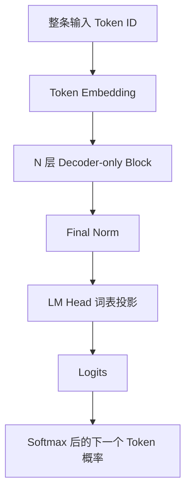
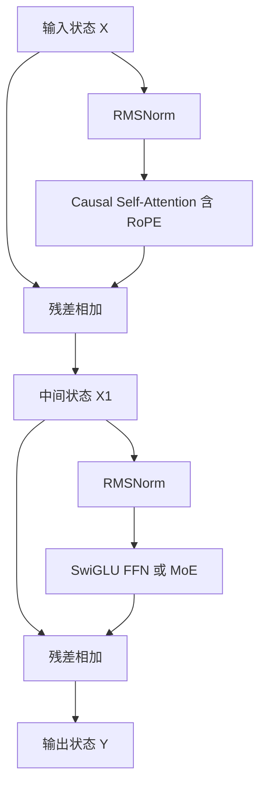

# 现代 LLM 架构与基本原理

> [!abstract] 本章目标
> 从一条聊天上下文出发，理解现代 Decoder-only LLM 接收什么、怎样逐层处理、最终产出什么，以及常见现代技术分别改动了主干中的哪个部件、解决什么问题。

## 前置知识

[[03-transformer-architecture|上一章]]已经说明，原始 Transformer 为翻译等序列到序列任务设计：Encoder 把完整源句变成 Memory，Decoder 一边读取目标前缀，一边通过 Cross-Attention 查询这份 Memory，逐个预测目标 Token。

现代 GPT、Llama、Qwen 等通用生成式 LLM 仍然使用 Attention、FFN、残差连接和归一化，但它们面对的核心任务已经改变。理解现代架构，

先回答：**现代 LLM 为什么可以只保留一条 Decoder-only 主干，这条主干怎样完成一次下一个 Token 预测？**

本章会沿同一条数据流前进：

```text
聊天中的所有可见文字
-> 组成一条 Token 序列
-> 进入 N 层 Decoder-only Block
-> 最后一个位置形成最终 Hidden State
-> LM Head 产生整个词表的 Logits
-> 选出一个 Token 并追加回序列
```

在主线建立之后，再把现代改进放回它们实际修改的位置。

## 1. 为什么现代生成式 LLM 采用 Decoder-only



### 任务从“两条序列”变成“一条序列续写”

原始翻译任务天然有两条不同序列：

```text
源序列：I love China .
目标序列：我 爱 中国 。
```

因此原始 Transformer 用 Encoder 处理源序列，用 Decoder 生成目标序列，再用 Cross-Attention 连接两侧。

通用聊天模型可以把所有可见信息组织成同一条序列：

```text
[系统指令] 你是一个简洁的助手。
[用户] 北京今天下雨，出门要带什么？
[助手] 出门要带
```

对模型而言，系统指令、用户问题、历史消息和助手已经生成的前缀，最终都会按模板转换成一串 Token。它不需要先把“问题”单独编码成一份 Memory，再从另一条序列生成答案；它可以统一学习：

> **根据左侧所有可见 Token，预测下一个 Token。**

例如当前序列末尾是“出门要带”，模型要综合左侧的“北京”“今天”“下雨”和整段对话，预测下一个 Token 更可能是“伞”。

### Decoder-only 保留什么，去掉什么

现代 Decoder-only LLM 保留原始 Transformer 中适合自回归生成的核心机制：

- **Causal Self-Attention**：每个位置只能读取自己和左侧上下文；
- **FFN**：逐位置加工 Attention 汇集的信息；
- **残差连接与归一化**：让很多层能够稳定堆叠；
- **词表投影**：把最终 Hidden State 转成整个词表的 Logits。

同时去掉：

- 独立 Encoder；
- Encoder Memory；
- 用来读取 Encoder Memory 的 Cross-Attention。

原因不是 Encoder 或 Cross-Attention 没有价值，而是对“把所有条件放进同一条序列并持续续写”的任务，它们不再是必需的。

> [!important] Decoder-only 不等于原论文 Decoder 的简单截取
> 它继承了“只看左侧并自回归生成”的基本思想，但通常采用 Pre-Norm、RMSNorm、RoPE、SwiGLU、GQA 等新的部件组织方式。因此，应把它看成围绕同一生成目标重新组织过的 Transformer 主干。

### Decoder-only 接收什么，产出什么

输入是一条 Token ID 序列。经过 Token Embedding 后，每个位置得到初始状态；经过 N 层 Decoder-only Block 后，每个位置得到最终 Hidden State。

预测下一个 Token 时，关键是最后一个可见位置的最终状态。它经过 Final Norm 和 LM Head 后，变成整个词表的 Logits：

```text
最后一个位置的最终 Hidden State
-> Final Norm
-> LM Head 投影到 vocab_size 维
-> 每个候选 Token 的 Logit
-> 解码策略选择或采样一个 Token
```

选中的 Token 会追加回原序列，模型再执行下一轮预测。因此，聊天回答并不是一次性写出来的，而是这条循环不断重复的结果。

## 2. 一次预测怎样穿过整个模型

继续追踪下面的输入：

> 北京今天下雨，出门要带……

假设模型当前要预测省略号位置之后的下一个 Token。

### 第一步：Token Embedding 产生初始状态

Tokenizer 先把文本切成 Token 并转换为 Token ID，Embedding Table 再把每个 ID 查成一个 $d_{model}$ 维向量：

```text
Token ID 序列
-> Token Embedding
-> T 个位置 × d_model 维初始状态 X⁽⁰⁾
```

这些初始状态主要表示“每个位置是什么 Token”。位置顺序还必须进入 Attention 的匹配过程，许多现代 LLM 会通过后面要讲的 RoPE 完成这件事。

### 第二步：N 层 Decoder-only Block 反复更新状态

第 1 层接收 $X^{(0)}$，输出 $X^{(1)}$；第 2 层接收 $X^{(1)}$，继续输出 $X^{(2)}$，直到第 N 层：

```text
X⁽⁰⁾ -> Block 1 -> X⁽¹⁾ -> Block 2 -> ... -> Block N -> X⁽ᴺ⁾
```

每层的输入和输出形状都保持为 $T \times d_{model}$，但每个位置包含的信息不断变化。对最后一个位置而言：

- Causal Self-Attention 可以把“下雨”等左侧信息带到当前位置；
- FFN 可以在当前位置内部识别、组合和变换这些信息；
- 多层重复后，当前位置逐渐形成对整段可见上下文的综合表示。

### 第三步：最后一个位置产生词表 Logits

最后一层输出 $X^{(N)}$ 后，模型取最后一个可见位置的状态 $h_{last}$，经过 Final Norm 和 LM Head：

$$
\operatorname{logits}=\operatorname{LMHead}(\operatorname{FinalNorm}(h_{last}))
$$

LM Head 把 $d_{model}$ 维状态投影成 $vocab\_size$ 维分数。此时“伞”的 Logit 可能较高，但输出仍是整个词表的分数，不是单独一个“伞”。解码策略从这些 Logits 或对应概率中选出一个 Token，再追加到序列末尾。

完整循环是：

```text
“北京今天下雨，出门要带”
-> 模型产生整个词表的 Logits
-> 选出“伞”
-> 新序列变成“北京今天下雨，出门要带伞”
-> 再预测下一个 Token
```

> [!note] 训练和生成使用同一条因果规则
> 训练时，模型可以并行计算一句话中多个位置的预测，但 Causal Mask 保证每个位置只能读取左侧；生成时，未来 Token 尚不存在，因此模型逐个追加。两种运行方式都在学习或执行“根据左侧预测下一个 Token”。


## 3. 一层 Decoder-only Block 到底做什么

理解了整条模型，再放大其中一层。现代 LLM 常见的是 Pre-Norm Block：



对应数据流是：

```text
X1 = X + CausalSelfAttention(RMSNorm(X))
Y  = X1 + FFN(RMSNorm(X1))
```

这层仍然只围绕上一章的两种核心计算：

1. **Attention 在可见位置之间交换信息**；
2. **FFN 在每个位置内部加工信息**。

现代技术没有改变这条主线，而是在不同位置替换部件：

```text
进入子层前的数值稳定          -> Pre-Norm、RMSNorm
Attention 如何感知顺序         -> RoPE
Attention 如何组织 Query/K/V Head -> MHA、GQA、MQA
FFN 如何进行非线性特征变换      -> SwiGLU
FFN 是否让所有 Token 使用同一参数 -> Dense FFN、MoE
Attention 函数怎样更高效地实现    -> FlashAttention
一层允许哪些位置直接连接          -> 全局、局部或稀疏 Attention
```

后面的内容会严格沿着这层的数据流展开，而不是把这些名词当成互不相关的功能列表。

## 4. 进入子层之前：为什么采用 Pre-Norm 与 RMSNorm

### 深层堆叠先遇到什么问题

现代 LLM 往往堆叠几十层甚至更多层。每层都要经过 Attention、FFN 和残差相加，状态的数值尺度会不断变化。如果进入子层的数值尺度波动过大，深层网络会更难稳定训练。

原始 Transformer 常用 Post-Norm：

```text
x -> 子层 F(x) -> 与 x 相加 -> LayerNorm
```

许多现代 LLM 改用 Pre-Norm：

```text
x -> Norm -> 子层 F(Norm(x)) -> 与原 x 相加
```

也就是：

$$
y=x+F(\operatorname{Norm}(x))
$$

Norm 先把送入 Attention 或 FFN 的状态调整到较稳定的尺度；原始 $x$ 则沿残差主干直接向后传递。这样，残差路径更直接，通常更利于非常深的模型训练。

### RMSNorm 做了什么

许多现代 LLM 用 RMSNorm 替代 LayerNorm。对一个位置的向量 $x$，RMSNorm 会根据均方根调整整体尺度：

$$
\operatorname{RMS}(x)=\sqrt{\frac{1}{d}\sum_{i=1}^{d}x_i^2+\epsilon}
$$

$$
\operatorname{RMSNorm}(x)=g\odot\frac{x}{\operatorname{RMS}(x)}
$$

不要求读者计算这个公式。它表达的是：

1. 先估计当前向量整体有多大；
2. 用这个尺度重新调整向量；
3. 再用可训练参数 $g$ 调节各维度。

RMSNorm 与 LayerNorm 解决的是同一类问题：让进入子层的状态保持在较稳定的数值范围。主要区别是 RMSNorm 不执行完整的均值中心化，计算更简洁。

> [!warning] 归一化不会理解语言
> RMSNorm 不负责发现“下雨”和“伞”的关系，也不会引入新知识。它只稳定数值尺度，让 Attention 和 FFN 更容易工作。

## 5. Attention 子层：怎样看左侧、感知顺序

### 第一个问题：为什么必须使用 Causal Mask

现代生成式 LLM 的目标是根据左侧预测右侧。如果训练时“带”所在位置能直接看到未来答案“伞”，模型就可以抄答案，而不是学习如何从“下雨”等前文推断。

因此 Causal Self-Attention 对每个位置规定可见范围：

```text
位置 0：只能看位置 0
位置 1：可以看位置 0、1
位置 2：可以看位置 0、1、2
...
最后位置：可以看全部左侧和自己
```

这与原始 Decoder 的 Masked Self-Attention 是同一条因果约束。区别在于，Decoder-only 没有另一个 Encoder 可查：系统指令、用户问题和历史消息也都在左侧序列中，所以 Causal Self-Attention 同时承担“读取条件”和“读取生成前缀”的工作。

如果去掉 Causal Mask，训练目标会泄漏未来 Token，模型也不再对应从左到右生成的概率分解。

### 第二个问题：只有内容，没有顺序会怎样

Attention 通过 Q 与 K 的匹配决定位置之间的关系。但如果完全没有位置信息，它只知道序列中有哪些内容，无法可靠区分：

```text
狗追猫
猫追狗
```

两句话包含相同 Token，顺序却改变了谁追谁。现代 LLM 因此必须让位置参与 Attention 匹配。

### RoPE 怎样把位置放进 Q/K

许多现代 LLM 使用 RoPE（Rotary Position Embedding）。它不再像原始 Transformer 那样把一个位置向量直接加到 Token Embedding 上，而是在每个 Attention Head 中，根据位置旋转 Q 和 K：

```text
当前位置状态
-> 投影得到 Q、K、V
-> 按各自位置旋转 Q 和 K
-> 用旋转后的 Q/K 计算匹配分数
-> 按权重汇总 V
```

可以把“旋转”理解成一种保持向量长度、改变方向的数值变换。不同位置采用不同旋转角度，因此 Q 与 K 的点积会包含位置关系；相同内容出现在不同距离时，匹配结果也会变化。

RoPE 通常作用于 Q 和 K，因为它要影响“位置之间如何匹配”；V 负责传递内容，通常不旋转。

> [!important] RoPE 解决的是 Attention 不认识顺序的问题
> 它不会直接让模型理解句子，也不等于长上下文能力本身。实际长上下文效果还取决于训练长度、位置外推方法、Attention 模式和模型是否学会利用远处信息。

### 第三个问题：为什么现代 Attention 常用 GQA 或 MQA

#### 先明确：一个 Head 中什么可以独立

上一章把一个 Attention Head 理解为一套 Q、K、V 读取方式。标准 Multi-Head Attention（MHA）中，如果有 8 个 Head，逻辑上就有：

```text
Head 1：Q1 与 K1 比较，再汇总 V1
Head 2：Q2 与 K2 比较，再汇总 V2
...
Head 8：Q8 与 K8 比较，再汇总 V8
```

每个 Query Head 都使用自己的 Query 表示去“提出一种读取需求”，并配有对应的 K/V Head。这里的 Head 是逻辑划分；实际实现通常用几个大矩阵一次产生全部 Q、K、V，不一定真的保存为 8 组三个独立矩阵。

#### K/V Head 到底是什么

一个 **K/V Head** 不是某一个 Token 的 K 和 V，而是使用一套 K/V 投影，为当前序列的**所有位置**分别产生 Key 和 Value：

```text
K/V Head 1
├── “北京” -> K1(北京)、V1(北京)
├── “今天” -> K1(今天)、V1(今天)
├── “下雨” -> K1(下雨)、V1(下雨)
└── ...
```

其中，Key 用于和 Query 比较，决定某个历史位置与当前读取需求有多匹配；Value 是匹配后该位置实际提供的内容。相互对应的一组 K 和 V，通常合称一个 K/V Head。

Query Head 则为当前位置产生 Query，并使用某个 K/V Head：

```text
当前 Query
-> 与这个 K/V Head 中所有历史位置的 Key 比较
-> 得到对各历史位置的 Attention 权重
-> 按权重汇总同一 K/V Head 中的 Value
-> 得到这个 Query Head 的输出
```

#### 为什么 K/V 会成为生成成本

自回归生成时，模型每次只新增一个 Token，但新 Token 仍要读取全部历史。例如已经生成：

> 北京今天下雨，出门要带

下一步预测“伞”时，新位置的 Query 要与所有历史位置的 Key 比较，并汇总这些位置的 Value。历史 Token 的 K 和 V 不会因为增加一个新 Token 而改变，所以没有必要每轮重新计算。推理系统会把每一层、每个历史位置的 K/V 保存为 **KV Cache**：

```text
历史位置：直接读取缓存中的 K/V
新增位置：只计算这个 Token 的 Q/K/V
新增 Query：匹配缓存中的全部 Key，并汇总 Value
```

随着上下文变长，KV Cache 要保存的数据近似随以下因素增长：

```text
层数 × 历史 Token 数 × K/V Head 数 × 每个 Head 的维度
```

因此，K/V Head 越多，需要保存和从显存读取的 K/V 就越多。自回归生成常受显存容量与内存带宽限制，这正是 GQA/MQA 要解决的问题。

#### GQA/MQA 到底共享什么

关键不是“所有 Head 共用同一套 $W_Q$、$W_K$、$W_V$”，而是：

> **保留多个 Query Head，但减少 K/V Head 的数量，让多个 Query Head 共享同一组 K/V。**

也就是说，不同 Query Head 仍然可以产生不同的 Query，保留多种“我想怎样读取”的方式；共享发生在 K 和 V 一侧。

“共享一个 K/V Head”具体表示：多个 Query Head 使用由**同一套 K/V 投影**产生的 Key 和 Value。可以把它类比成多个人查询同一套资料库：资料的索引与内容相同，但每个人提出的问题不同，所以关注重点和得到的结果仍可以不同。

假设有 8 个 Query Head：

```text
MHA：8 个 Query Head，8 组 K/V Head

Q1 -> K1/V1    Q2 -> K2/V2    ...    Q8 -> K8/V8
```

GQA（Grouped-Query Attention）把 Query Head 分组。例如只保留 2 组 K/V：

```text
Q1、Q2、Q3、Q4 -> 共享 K1/V1
Q5、Q6、Q7、Q8 -> 共享 K2/V2
```

MQA（Multi-Query Attention）更进一步，只保留 1 组 K/V：

```text
Q1、Q2、Q3、Q4、Q5、Q6、Q7、Q8 -> 全部共享 K1/V1
```

因此，更准确的对比是：

| 方式  | Query Head |         K/V Head | 直观含义                    |
| --- | ---------: | ---------------: | ----------------------- |
| MHA |    多个，彼此不同 | 与 Query Head 同样多 | 每种查询方式有自己的 K/V          |
| GQA |    多个，彼此不同 |               较少 | 一组 Query Head 共享一组 K/V  |
| MQA |    多个，彼此不同 |              1 组 | 所有 Query Head 共享同一组 K/V |

> [!important] 不是共享 $W_Q$
> GQA/MQA 通常仍为不同 Query Head 产生不同的 Q。减少的是 K/V Head，也就是 K/V 投影输出和需要缓存的 K/V 组数。工程实现可能把各 Head 的投影合并在大矩阵中，但逻辑关系不变。

#### 共享后 Attention 怎样计算

共享 K/V 不代表多个 Query Head 得到相同结果。以 GQA 的前四个 Query Head 为例，它们虽然读取同一组 K/V，但各自的 Query 不同：

```text
Q1 与同一组 K 比较 -> 权重 A -> 汇总同一组 V -> 结果 1
Q2 与同一组 K 比较 -> 权重 B -> 汇总同一组 V -> 结果 2
Q3 与同一组 K 比较 -> 权重 C -> 汇总同一组 V -> 结果 3
Q4 与同一组 K 比较 -> 权重 D -> 汇总同一组 V -> 结果 4
```

因为 Q 不同，$QK^\top$ 产生的 Attention 权重仍可以不同。共享的是“历史位置怎样提供 K/V”，不是“所有 Head 用同一套权重读取”。

#### 为什么这样能减少成本

假设 8 个 Query Head 的维度相同：

```text
MHA：每层、每个历史 Token 要缓存 8 组 K + 8 组 V
GQA：如果有 2 个 K/V Head，只缓存 2 组 K + 2 组 V
MQA：只缓存 1 组 K + 1 组 V
```

Query 不需要为所有历史位置长期缓存；生成当前 Token 时计算当前 Query 即可。因此减少 K/V Head 能直接降低 KV Cache 占用和读取带宽，同时保留多个 Query Head 的多种读取需求。

#### 代价与不变项

共享越多，K/V 表示的多样性越少，可能影响模型质量。因此：

- MHA 保留最完整的 K/V 多样性，但缓存最大；
- MQA 缓存最小，但共享最强；
- GQA 位于两者之间，是效果与推理成本的折中。

GQA/MQA 没有改变以下事情：

- Causal Mask 仍然限制每个位置只能读取左侧；
- 每个 Query 仍会与所有可见历史位置的 Key 比较；
- Attention 仍会按权重汇总 Value；
- 它们不会删除历史 Token，也不会缩短上下文。

一句话总结：

> **MHA 为每个 Query Head 配一组 K/V；GQA 让一组 Query Head 共享 K/V；MQA 让所有 Query Head 共享一组 K/V。这样保留多种 Query 读取方式，同时减少生成时必须缓存和读取的 K/V。**

## 6. FFN 子层：为什么现代模型常用 SwiGLU

Attention 已经把左侧相关信息带到当前位置，接下来仍需要 FFN 在当前位置内部进行非线性特征变换。原始 Transformer 的简单 FFN 可以概括为：

$$
\operatorname{FFN}(x)=W_2\,\sigma(W_1x+b_1)+b_2
$$

它先产生候选特征，再通过激活函数调节响应，最后投影回隐藏维度。

### 从固定激活到可学习的门控

许多现代 LLM 使用 SwiGLU。它会从同一个输入产生两路中间结果：

1. **内容分支**：产生候选特征；
2. **门控分支**：根据当前输入决定每个候选特征通过多少。

简化公式可以写成：

$$
\operatorname{SwiGLU}(x)
=W_2\left(\operatorname{SiLU}(xW_g)\odot(xW_u)\right)
$$

其中：

- $xW_u$ 产生候选特征；
- $\operatorname{SiLU}(xW_g)$ 产生门控值；
- $\odot$ 表示对应位置逐元素相乘；
- $W_2$ 把门控后的中间特征投影回 $d_{model}$。

对“北京今天下雨，出门要带”最后一个位置而言，内容分支会形成许多候选中间特征，门控分支则根据当前上下文调节哪些特征通过以及通过多强。它不是一个人工规则开关，而是训练得到的连续数值门。

SwiGLU 没有改变 FFN 的基本职责：它仍然逐位置运行，不读取其他 Token。改变的是当前位置内部进行非线性特征变换的方式。

### 如果没有门控会怎样

模型仍可以使用 ReLU 或 GELU FFN 正常工作。SwiGLU 不是 Decoder-only 的必要条件，而是许多现代模型采用的常见改进；它通常能在一定计算预算下提供更灵活的特征选择和较好的效果。

## 7. 残差主干怎样把 N 层串起来

一层输出 $Y$ 会直接成为下一层输入。对每个子层，现代 Pre-Norm Block 都保留两条路径：

```text
原状态 --------------------┐
                            + -> 新状态
RMSNorm -> Attention/FFN ---┘
```

因此每层不需要彻底重写状态，只需要学习应该补充什么增量。沿残差主干，原有信息和梯度都有更直接的传递路径；Attention 和 FFN 则在每层持续加入新的上下文关系和特征变换结果。

多层协作可以粗略理解为：

```text
较浅层：建立局部搭配和直接联系
中间层：组合更复杂的上下文关系
较深层：形成更适合当前预测目标的表示
```

这不是对每一层职责的硬编码。具体功能由训练形成，也可能分布在多个层中。重点是：第 N 层不是重新读取原始 Embedding，而是在前 N-1 层已经加工过的 Hidden State 上继续计算。

## 8. 模型变大后，怎样增加容量而不让每个 Token 使用全部参数

到这里，一个 Dense Decoder-only LLM 的主干已经闭合：每个 Token 在每层都会经过同一套 Attention 和 FFN 参数。如果继续扩大 FFN，可以增加模型容量，但每个 Token 的计算量也会一起增长。

### MoE 把一个 Dense FFN 换成多个 Expert

Mixture-of-Experts（MoE）通常替换的是部分或全部 Block 中的 FFN 子层。它准备多个 FFN Expert，再由 Router 为每个 Token 选择少数几个：

```text
某个位置的状态
-> Router 计算路由分数
-> 选择少量 FFN Expert
-> 各 Expert 进行逐位置特征变换
-> 按路由权重汇总输出
-> 回到残差主干
```

这样可以增加模型总参数容量，同时避免每个 Token 计算所有 Expert。必须区分：

- **总参数量**：全部 Expert、Attention 和其他模块的参数总和；
- **每 Token 激活参数量**：处理一个 Token 时实际参与计算的参数量。

例如模型有许多 Expert，但每个 Token 只路由到其中 2 个，那么总参数量可以很大，而单 Token 只激活其中一部分。

### MoE 带来的代价

MoE 不是“免费增加参数”。它会带来新的问题：

- Router 可能过度选择少数 Expert，需要负载均衡；
- Expert 分布在不同设备时会增加通信成本；
- 路由和批处理让训练、部署更复杂；
- 稀疏激活减少的是每 Token 计算，不等于所有场景都同比加速。

> [!warning] Expert 不是固定领域专家
> Expert 是训练形成的数值模块，不应直接解释成“数学专家”“编程专家”或某种人格。分工可能重叠，也未必能被人类稳定命名。


## 9. 把所有部件重新串成一次预测

现在把“北京今天下雨，出门要带”送入一个常见的现代 Decoder-only LLM：

```text
输入 Token ID
-> Token Embedding：得到每个位置的初始状态

-> N 层 Decoder-only Block，每层依次执行
   -> RMSNorm：稳定进入 Attention 的数值尺度
   -> Q/K/V 投影
   -> RoPE：让 Q/K 匹配包含位置信息
   -> Causal MHA/GQA：从左侧按需汇集信息
   -> Residual：把 Attention 增量加回原状态
   -> RMSNorm：稳定进入 FFN 的数值尺度
   -> SwiGLU FFN 或 MoE：逐位置进行非线性特征变换
   -> Residual：把 FFN 增量加回状态

-> Final Norm
-> 取最后一个位置的最终 Hidden State
-> LM Head 投影到整个词表
-> 得到 Logits
-> 解码策略选出一个 Token，例如“伞”
-> 追加“伞”，进入下一轮预测
```

沿这条链可以看出，各技术不是互相独立的知识点：

| 技术 | 在链路中的位置 | 解决的问题 |
|---|---|---|
| Causal Mask | Attention 的可见范围 | 防止读取未来 Token，保持自回归目标 |
| RoPE | Q/K 匹配之前 | 让 Attention 感知顺序和相对位置 |
| GQA/MQA | Q/K/V Head 组织 | 减少生成时 K/V 缓存与读取成本 |
| Pre-Norm、RMSNorm | Attention/FFN 之前 | 稳定深层网络中的数值尺度与训练 |
| SwiGLU | FFN 内部 | 用门控方式进行逐位置非线性特征变换 |
| MoE | 替换 Dense FFN | 增加总参数容量，限制每 Token 激活计算 |
| FlashAttention | Attention 的实现 | 减少中间数据和显存读写 |
| 局部/稀疏 Attention | Attention 连接规则 | 减少实际计算的位置对 |

> [!important] 不要把这张表当成固定配方
> Decoder-only、Causal Attention、FFN、残差和归一化构成现代自回归 LLM 的常见主干；RoPE、RMSNorm、SwiGLU、GQA、MoE、FlashAttention 等是常见选择或优化，不是每个现代模型都必须全部采用。判断一个具体模型时，应查看它的实际架构配置。

## 常见误解

> [!warning] Decoder-only 仍然需要独立 Encoder 才能理解用户问题
> 不需要。用户问题和其他条件已经作为左侧 Token 放入同一条序列，Causal Self-Attention 可以读取它们。

> [!warning] Decoder-only 是把原始 Decoder 原样截下来
> 它去掉独立 Encoder 和 Cross-Attention，并通常重新组织归一化、位置编码、FFN 和 Attention Head。

> [!warning] RoPE 为模型直接提供语义
> RoPE 主要让 Q/K 匹配包含位置信息；语义关系仍由模型在训练中通过参数学习。

> [!warning] GQA 或 MQA 会让模型看不到部分历史 Token
> 它们共享的是 K/V Head，不是删除历史位置。局部或稀疏 Attention 才会改变可直接读取的位置。

> [!warning] MoE 的每个 Expert 都代表一个明确领域
> Expert 的分工由训练形成，可能重叠且难以解释。MoE 的核心是按 Token 稀疏激活模型容量。


## 参考资料

- [Attention Is All You Need](https://arxiv.org/abs/1706.03762)
- [RoFormer: Enhanced Transformer with Rotary Position Embedding](https://arxiv.org/abs/2104.09864)
- [Root Mean Square Layer Normalization](https://arxiv.org/abs/1910.07467)
- [GLU Variants Improve Transformer](https://arxiv.org/abs/2002.05202)
- [GQA: Training Generalized Multi-Query Transformer Models from Multi-Head Checkpoints](https://arxiv.org/abs/2305.13245)
- [Switch Transformers](https://arxiv.org/abs/2101.03961)
