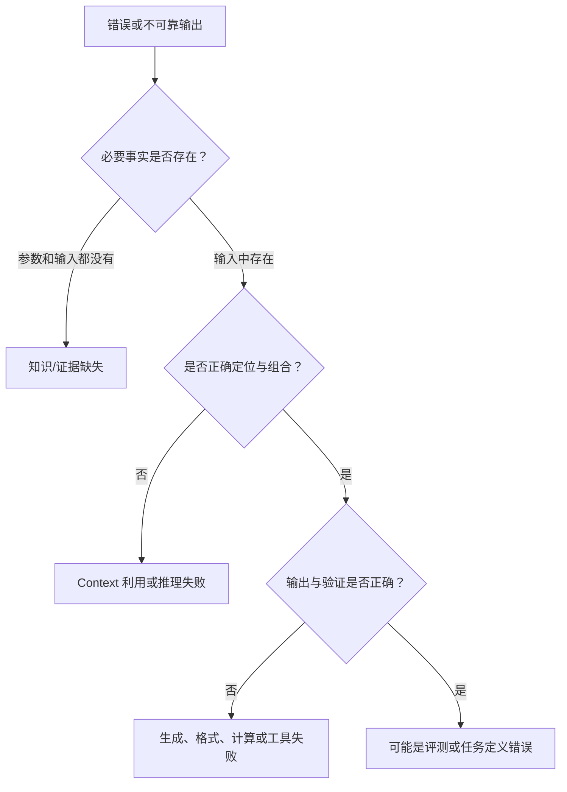

# 能力边界与失败机制

> [!abstract] 本文回答什么
> 模型为什么会幻觉、忽略 context、推理出错、受提示影响、错误调用工具并表现出不可靠置信度？这些现象哪些来自生成目标，哪些来自数据、context、解码或外部系统？

## 不要把所有错误都叫“幻觉”

一个错误回答可能来自不同层：



只有区分根因，才能选择 retrieval、重组 context、改进 prompt、增加 verifier、修改 tool schema 或修复系统。

## 1. 幻觉是生成目标的自然结果

模型在每一步都必须对下一个 token 给出分布：

$$
p(t_i\mid t_{<i},c)
$$

这个目标要求生成“在当前 context 和训练分布下像合理后续的 token”，没有内置变量表示“此句已由外部世界验证”。当证据不足时，模型仍可能组合高概率的实体、格式和关系，产生流畅但错误的内容。

后训练可以提高承认未知、引用来源或调用搜索工具的概率，却无法从生成目标中推出事实保证。

### 常见的四种“幻觉”根因

| 表现 | 根因 | 合适手段 |
|---|---|---|
| 编造不存在的事实 | 参数或输入无证据，模型仍生成 | retrieval、允许 unknown、引用验证 |
| 有证据却答错 | context 定位、冲突解析或推理失败 | 重组输入、分步验证、任务 eval |
| 引用真实来源但内容对不上 | 生成了形式正确的引用 | 来源 ID 由程序绑定、逐句校验 |
| 声称完成外部动作 | 把常见交互话术当作输出 | 真实 tool result 与 state 回读 |

## 2. 参数知识没有数据库性质

参数中的事实模式没有稳定的：

- 记录 ID；
- 原始来源；
- 时间版本；
- 冲突规则；
- 精确删除和更新接口。

即使模型能说出正确事实，也未必能说明它来自哪条训练记录。要求模型“回忆来源”可能得到另一段合理生成。最新、私有、需引用或会变化的事实应来自外部数据源。

## 3. Context 容纳不等于可靠使用

Attention 允许 token 连接，但不保证任务所需信息获得足够权重。失败受以下因素影响：

- 信息位置；
- 与问题的词面和语义匹配；
- 重复、冲突与干扰内容；
- 指令和证据之间的距离；
- 需要组合的事实数量；
- 模型训练时见过的长度与任务分布。

Lost-in-the-middle 类现象说明：相关信息放在长输入中间时，利用率可能低于开头或结尾。具体模式随模型和任务变化，不能把“重要内容放头尾”当成万能修复。

> [!tip] 长 Context 的正确 baseline
> 先把完整材料作为基线，再与 retrieval、分层摘要和结构化索引比较。评价答案正确率、证据召回、冲突处理、延迟和成本，而不是只比较最大 token 数。

## 4. Prompt Sensitivity 来自条件分布变化

模型不是把输入编译成唯一程序。措辞、示例、顺序和格式改变 context，也就改变输出分布。敏感性来源包括：

- 任务存在多个合理解释；
- 后训练中相似模式相互竞争；
- 示例带来标签、长度或风格偏差；
- 关键规则被长输入稀释；
- 分布外格式没有稳定映射。

更明确的任务契约可以减少歧义，但不能把神经生成变成形式验证过的规则执行器。

## 5. 指令冲突与 Prompt Injection

模型看到的 system、user、tool result、网页和文档最终都以表示进入 context。消息角色和分隔符帮助它学习优先级，但外部数据仍可能包含看起来像指令的文本。

Prompt injection 的根本矛盾是：模型既要理解数据中的语言，又要判断哪些语言没有控制权。仅靠一句“忽略恶意指令”不能提供确定性隔离。

防护需要：

- 在消息和数据结构上保持边界；
- 最小化模型可见数据与可用工具；
- 工具权限由服务端执行；
- 对敏感参数使用可信来源；
- 高影响动作要求确认或人工；
- 记录并评测间接注入样本。

## 6. 推理错误为何累积

自回归分解为：

$$
p(t_{1:T})=\prod_{i=1}^{T}p(t_i\mid t_{<i})
$$

早期错误进入 $t_{<i}$，可能让后续在错误前提下继续保持局部连贯。复杂任务还可能需要：

- 正确理解题意；
- 检索多个事实；
- 选择正确操作序列；
- 精确计算；
- 在最终输出中无误转写。

任一环节失败都会使最终结果失败。简单把回答写得更长，会增加计算机会，也会增加出错位置。可靠性需要分解、状态化和外部验证。

## 7. 自我检查不是独立验证

让同一模型评价自己的答案可能有效，因为第二次 context 和任务不同，也可能发现明显矛盾。但两次输出共享参数、训练偏差和未知盲区，错误高度相关。

独立性从弱到强大致为：

```text
同一次回答里的“请检查”
< 独立采样的审阅调用
< 不同任务提示或模型的交叉检查
< 基于来源的事实校验
< 代码、测试、数据库约束或形式验证
```

最终选择哪个层级取决于错误影响和可验证性。

## 8. 置信表达通常没有校准

模型说“我很确定”也是生成 token。语言上的信心受写作风格和后训练影响，不等于真实正确概率。

校准要求在固定任务分布上比较预测置信与实际正确率，例如：所有声称 80% 的样本是否约有 80% 正确。开放式自然语言任务很难直接获得这种保证。

Agent 不应根据模型自述信心直接执行高风险动作。应使用证据完整性、验证器结果、数据覆盖、规则阈值和人工审核。

## 9. 结构化输出只解决语法层

Schema 可以限制：

- JSON 是否可解析；
- 字段是否存在；
- 类型和枚举是否合法；
- 某些字符串或数值范围。

Schema 不能证明：

- 日期、金额或实体来自真实来源；
- 字段之间符合业务规则；
- 用户有权限执行动作；
- 缺失证据时模型选择了正确状态；
- 工具调用最终成功。

正确流程是“语法验证 → 业务验证 → 权限验证 → 执行 → 结果回读”。

## 10. Tool Use 引入新的失败面

模型可能：

- 选错工具；
- 忘记调用工具而直接回答；
- 填错参数或使用过期 ID；
- 重复执行非幂等动作；
- 把工具错误信息当正常结果；
- 被 tool result 中的文本注入；
- 正确执行后错误总结。

因此 tool calling 把“纯生成错误”转化为“模型 + 接口 + 外部系统”的组合可靠性问题。工具越多，描述重叠和选择困难通常越大。

## 11. 分布外输入与脆弱泛化

训练和评测覆盖的是有限分布。真实使用中的新语言混合、异常文件、极长输入、新工具组合、恶意数据和罕见业务状态可能超出覆盖。

模型仍会生成看似正常的输出，这使 out-of-distribution 失败比显式报错更危险。系统必须支持 `invalid_input`、`unsupported`、`insufficient_evidence` 和人工升级，而不是强迫每次都给答案。

## 12. 非确定性从哪里来

即使 temperature 接近 0，输出仍可能随以下因素变化：

- 模型或服务快照更新；
- 浮点与并行归约差异；
- 动态 batching 或 kernel；
- context 中时间、工具结果或顺序变化；
- 相同最高分附近的细小数值差异。

Agent 应追求“在允许变化下仍满足约束和任务指标”，而不是假设自然语言输出逐字可重复。

## 13. 模型能力的真正边界不是固定列表

边界由任务分布和系统条件共同决定：

$$
P(\text{success})=f(\text{model},\text{task},\text{context},\text{tools},\text{verification},\text{budget})
$$

因此“模型会不会做 X”应改写为：在什么输入、工具、时间与风险约束下，成功率、失败类型和成本分别是多少？

## 失败诊断表

| 观察 | 优先检查 | 不要先做什么 |
|---|---|---|
| 编造最新事实 | 是否检索、来源是否有效 | 先加更强角色提示 |
| 输入里有答案却遗漏 | chunk、位置、冲突、长度 eval | 盲目继续加 context |
| 数学或计数错 | 是否交给代码/SQL/专用工具 | 要求“更认真” |
| JSON 合法但业务错 | 业务 validator 与来源绑定 | 只调整 schema 文案 |
| 重复调用工具 | state、幂等、循环停止条件 | 让模型自行记住 |
| 声称已经执行 | 是否有真实 tool result | 相信自然语言确认 |
| 安全规则偶发失效 | 权限、数据边界与攻击 eval | 只追加拒绝提示 |
