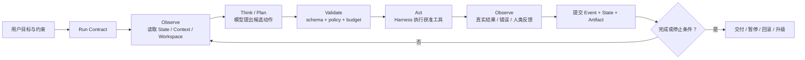

# Loop Engineering：让 Agent 能观察、行动、验证并安全停止

> [!abstract] 学习终点
> 读完本系列，你应能从一个真实任务出发，画出 Agent 的状态、工具、计划和反馈怎样形成闭环；能写出一个由 Harness 控制的最小 Loop；能解释 ReAct、计划、反思、搜索、协同和 Skills 各自改变了哪一段数据流；还能为每个选择写出停止条件、权限边界、恢复策略和评测指标。

## 先看一个“会写补丁，却不该直接交付”的 Agent

用户给代码 Agent 一个任务：

> `payments` 服务里有一个偶发失败的测试。找出不稳定原因，提交最小补丁，运行相关测试；不要修改生产环境，不要扩大改动范围。如果外部命令结果不确定，先停下来等待确认。

这个任务不是“让模型输出一段 Python”那么简单。Agent 需要：

- 记住目标、约束、当前分支和已经验证过的事实；
- 读取文件、运行测试、查看日志、比较多次结果；
- 形成计划，并在测试反馈不支持计划时重排步骤；
- 把模型提出的动作交给程序校验，而不是让模型直接执行任意命令；
- 在补丁写入前后保存 checkpoint，发生错误时知道能否重试或回滚；
- 让人类在高风险动作前审批，并保留可审计的轨迹。

如果只调用一次模型，得到的可能是一个看起来合理的补丁；但“看起来合理”不是“测试通过、范围正确、没有重复副作用”。Loop Engineering 研究的是围绕模型调用的执行闭环。

## Agent 的一个可操作定义

在本系列中，Agent 不是某个品牌的 SDK 对象，而是一个带有四类持久语义的执行系统：

| 组成 | 它回答的问题 | flaky-test 例子 |
|---|---|---|
| **State（状态）** | 现在什么事实为真？ | 已复现 3 次；当前在比较时间依赖；补丁尚未提交 |
| **Tools（工具）** | 系统允许做什么？ | 读取文件、运行指定测试、生成 diff、申请人工审批 |
| **Plan（计划）** | 接下来准备完成哪些可验证步骤？ | 复现 → 定位共享状态 → 修改 → 验证 → review |
| **Feedback（反馈）** | 行动后世界实际发生了什么？ | 测试通过、命令超时、diff 超出范围、用户拒绝 |

模型可以根据这些信息提出下一步，但它不是四类信息的唯一所有者。权威状态由程序提交，工具由 Harness 授权和执行，反馈来自真实环境或明确的评估器。

## 最小闭环：observe → think/plan → act → observe



循环中的两个 `observe` 不是同一件事：第一次观察是为本轮决策组装输入；第二次观察是动作产生的外部事实。把模型的计划当成事实，会跳过中间的验证边界。

## Harness 在哪里

Harness 是包围模型调用的确定性运行时。它负责把 prompt、工具、状态、日志、评测、人审、checkpoint 和回滚组合为可执行系统：

```text
输入与权限范围
  → 读取当前 State / Memory / Workspace
  → 组装有预算的 Context
  → 调用模型适配器
  → 解析并验证候选输出
  → 授权、执行、分类工具结果
  → 记录 observation、event、trace 和成本
  → 原子提交 State / checkpoint
  → continue / retry / pause / handoff / rollback / stop
```

模型没有以下最终权力：

1. 不能自行扩大工具权限；
2. 不能把网页或日志中的指令提升为系统策略；
3. 不能把未经验证的结论写成当前事实；
4. 不能绕过最大步数、超时、预算或人工门；
5. 不能凭“记忆”替代 checkpoint 和幂等记录。

> [!important] 先固定控制权，再谈推理能力
> ReAct、ToT 或多 Agent 只是在 Loop 中增加新的候选生成、评估或路由结构。它们不能替代权限、状态版本、真实反馈和停止条件。

## 本系列和已有笔记的分工

- [[context-engineering/00-overview|Context Engineering]] 解释哪些信息应在本轮进入 Context，以及如何选择、压缩和组装；本系列解释 Harness 何时调用这条管线、预算不足时怎样阻断或降级。
- [[memory-and-state/00-overview|Memory 与 State]] 解释 State、Memory、Event、Artifact 的语义、存储和恢复；本系列只定义 Harness 读写它们的时机、版本检查和提交边界。
- [[prompt-engineering/00-overview|Prompt Engineering]] 解释任务契约、结构化输出和工具授权；本系列把这些约束落成 Parser、Policy Gate、预算和 stop reason。
- [[llm-basics/31-llm-capabilities-boundaries-and-agents|LLM 能力边界与 Agent]] 解释为什么运行时必须拥有循环控制权；本系列继续说明这份控制权怎样实现为可测试接口。

## 推荐阅读顺序

| 顺序 | 笔记 | 读完应能回答 |
|---:|---|---|
| 1 | [[loop-engineering/01-goals-state-and-contracts\|目标、状态与契约]] | 什么算完成？哪些事实可信？ |
| 2 | [[loop-engineering/02-agent-loop\|最小 Agent Loop]] | 一轮输入、候选动作、工具结果和状态提交怎样连接？ |
| 3 | [[loop-engineering/03-harness-engineering\|Harness Engineering]] | 谁控制权限、预算、日志、人审、checkpoint 和停止？ |
| 4 | [[loop-engineering/04-reasoning-patterns\|推理范式]] | 什么时候用 ReAct、计划或反思？它们改变了什么？ |
| 5 | [[loop-engineering/05-search-reasoning\|搜索型推理]] | ToT、GoT、LATS 为什么昂贵，如何限制分支？ |
| 6 | [[loop-engineering/06-collaboration-patterns\|协同模式]] | Router、Supervisor、Worker 和 Handoff 如何共享责任？ |
| 7 | [[loop-engineering/07-workflow-vs-autonomy\|工作流与自主性]] | 什么时候不该做成 Autonomous Agent？ |
| 8 | [[loop-engineering/08-skills-and-capability-loading\|Skills 与能力加载]] | 能力包如何发现、加载、授权和版本化？ |
| 9 | [[loop-engineering/09-reliability-security-recovery\|可靠性、安全与恢复]] | 超时、未知结果、注入和崩溃怎样处理？ |
| 10 | [[loop-engineering/10-evaluation-observability\|评测与可观测性]] | 如何证明 Loop 真的变好，而不是只变长？ |
| 11 | [[loop-engineering/11-reference-loop\|最小参考实现]] | 如何运行并修改一个无外部依赖的 Harness？ |
| 12 | [[loop-engineering/99-sources\|资料与来源]] | 哪些结论来自论文、官方文档或本教程推导？ |

## 一个贯穿到底的完成标准

当 flaky-test Agent 宣称“已修复”时，系统应能回答：

1. 任务目标和“不改生产、最小 diff”的约束来自哪条输入事件？
2. 哪些测试结果是实际运行得到的，命令、环境和时间是什么？
3. 当前 State 的版本是多少，哪些 plan item 已提交，哪些仍是模型候选？
4. 补丁是否只触碰允许的文件，是否经过 review 和回归测试？
5. 如果进程在工具调用后崩溃，恢复从哪个 checkpoint 继续，怎样避免重复写入或重复外部副作用？
6. 如果结果未知或风险超过阈值，系统会暂停、回滚还是升级给人？

能回答这些问题，才算把 Agent 从“会生成文本”提升为“可审计的执行系统”。

> [!tip] 读者练习
> 在进入下一篇前，尝试为“运行测试”写出四个字段：输入、允许的副作用、成功 observation、未知结果。若只能写出一句自然语言说明，说明工具契约还不够清楚。

下一篇先把“目标、状态、事件、记忆和完成”拆开：[[loop-engineering/01-goals-state-and-contracts|目标、状态与任务契约]]。
