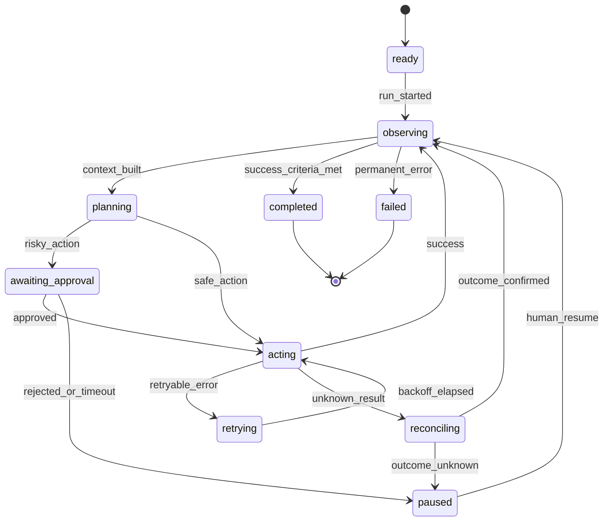
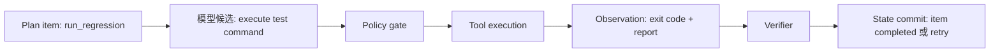

# 目标、状态与任务契约：先定义 Agent 何时可以停止

## 为什么“修复测试”不是一个足够的目标

如果只把用户请求写成 `修复 flaky test`，模型可以在很多互相冲突的方向上行动：重写测试、屏蔽失败、升级依赖、修改生产配置，甚至删除不稳定的断言。系统无法判断哪个结果算成功，也无法判断何时停止。

一个可执行目标至少要同时包含：

- **Objective**：想改变什么；
- **Success criteria**：哪些可观察条件必须成立；
- **Constraints**：哪些动作和范围禁止；
- **Scope**：允许访问的仓库、分支、环境和工具；
- **Budget**：步数、时间、Token、费用和风险额度；
- **Escalation policy**：遇到未知结果或高风险动作时交给谁。

```yaml
run_contract:
  run_id: flaky-payments-42
  objective: 找出 payments/test_retry.py 的偶发失败原因并提交最小补丁
  success_criteria:
    - 连续 20 次定向测试通过
    - 根因由日志或可复现实验证据支持
    - diff 只修改允许的源码与测试辅助文件
    - 未修改生产环境或发布配置
    - 变更经过人工或规则 review
  constraints:
    forbidden:
      - deploy_production
      - delete_test
      - rotate_credentials
    allowed_paths:
      - payments/
    allowed_branch: fix/flaky-test-42
  budget:
    max_steps: 24
    max_wall_time_seconds: 900
    max_model_calls: 16
  escalation:
    unknown_tool_result: human_review
    destructive_action: require_approval
```

契约不是给模型看的长篇愿望清单。它是 Harness 用来拒绝动作、计算完成度和生成 stop reason 的可验证输入。

## State、Event、Context、Memory 和 Artifact 的边界

这些词经常被统称为“记忆”，但它们承担的职责不同：

| 对象 | 问题 | flaky-test 例子 | 谁能写入 |
|---|---|---|---|
| **State** | 现在什么为真？ | `current_step=verify`, `patch_applied=true` | 通过 schema、版本和业务规则的程序提交 |
| **Event** | 发生过什么？ | 测试命令返回码为 1 | 事件记录器/工具适配器追加 |
| **Context** | 本轮模型看到了什么？ | 当前目标、最近测试输出和允许工具 | Context Builder 投影 |
| **Memory** | 未来任务可能复用什么？ | 项目约定“定向测试需运行 20 次” | 经过来源、scope 和生命周期检查的 memory policy |
| **Artifact** | 原始大对象在哪里？ | 完整日志、diff、测试报告 | 工具/对象存储；State 只保存引用 |
| **Trace** | 运行时怎样决策和花费？ | span、模型版本、工具状态、延迟 | 观测管线 |

`Context` 是一次调用的视图，不是事实本身；`State` 也不应被向量相似度或模型自由文本直接替代。关于这些边界的更完整存储讨论见 [[memory-and-state/01-boundaries|Memory 与 State 边界]]。

## 用状态机表示任务进度

状态不是一串聊天消息。它至少需要版本、当前步骤、计划项、证据引用、错误分类和审批状态。



状态转换必须由 observation 驱动，而不是由模型一句“完成了”驱动。例如，`patch_applied=true` 只能在文件 hash、diff 范围和写入结果都核对后提交。

## 最小 State schema

下面的 schema 只表达教程需要的语义；真实系统可以用 SQL、事件日志或图运行时保存它：

```yaml
state:
  run_id: flaky-payments-42
  version: 7
  status: acting
  current_step: run_regression
  plan:
    - id: reproduce
      status: completed
      evidence: [obs-001, obs-002]
    - id: locate_shared_state
      status: completed
      evidence: [obs-004]
    - id: apply_minimal_patch
      status: completed
      artifact: diff-003
    - id: run_regression
      status: in_progress
  constraints_hash: sha256:...
  workspace:
    repo: payments
    branch: fix/flaky-test-42
    base_commit: abc123
    changed_paths: [payments/retry.py]
  observations:
    - id: obs-005
      kind: test_result
      status: success
      source: pytest
      artifact: report-005
  pending_approval: null
  budget:
    steps_used: 9
    model_calls: 6
  stop_reason: null
```

### 计划项和动作候选不是一回事

`plan` 表示系统承认的工作分解；`ActionProposal` 表示模型本轮提出的候选。后者只有在执行并验证后，才可能把某个 plan item 从 `in_progress` 改成 `completed`。



## 完成条件要可验证

一个好的完成条件包含对象、测量方式和阈值：

| 模糊说法 | 可执行改写 |
|---|---|
| 测试稳定了 | 定向测试在固定环境连续 20 次通过，且每次命令、commit 和返回码被记录 |
| 补丁很小 | `git diff --stat` 与允许路径规则均通过，改动文件数不超过 3 个 |
| 找到了根因 | 根因假设链接到至少一条复现 observation，并能解释失败与成功样本的差异 |
| 可以交付 | review gate 通过，未触发禁止动作，所有必需 artifact 已存在 |

如果没有阈值，Agent 可能在第一次偶然通过后停止；如果只有阈值没有证据，系统又无法知道结果属于哪个版本。

## 目标会变化，状态不能悄悄漂移

用户可能在第 6 轮补充“不能改测试，只能改实现”。这种变化应记录为新的输入事件，并重新计算受影响的 plan item：

```text
user_constraint_updated
→ 校验新约束是否与已提交副作用冲突
→ 标记旧候选为 stale，而不是覆写历史
→ 重新组装 Context 和剩余预算
→ 如果无法安全继续，暂停并请求人类决定
```

把最新消息直接追加到 prompt，不会自动撤销已执行的工具，也不会解决“旧计划仍在 State 中”的冲突。

## 契约设计的四步

1. **写完成证明**：先写出交付时需要哪些证据，再倒推步骤。
2. **列不可逆动作**：部署、删除、发送消息、写入共享分支等动作先标注审批门。
3. **定义未知结果**：网络超时、进程被杀、外部 API 返回不完整时，状态进入 `unknown` 而不是 `failed` 或 `success`。
4. **给每个状态字段指定 owner**：模型只能提议，工具报告 observation，Verifier 才能提交可信 State。

> [!warning] 不要把“模型说完成”当成完成事件
> 这句话可以作为候选解释，不能作为 `success_criteria_met` 的证据。完成检测必须读取真实测试结果、diff、权限和版本。

## 自测

为以下三个信息选择正确的落点：

1. “用户要求不得修改生产环境” → Run Contract / policy；
2. “第 4 次定向测试通过” → Event + Observation，验证后投影到 State；
3. “完整 pytest 输出和 HTML 报告” → Artifact，State 只保存引用。

如果把它们全部放进一个向量记忆或一条长 prompt，后续 Loop 会失去权限、时序或证据边界。

下一篇把这份契约放进一轮真正的执行：[[loop-engineering/02-agent-loop|最小 Agent Loop：从观察到停止]]。
