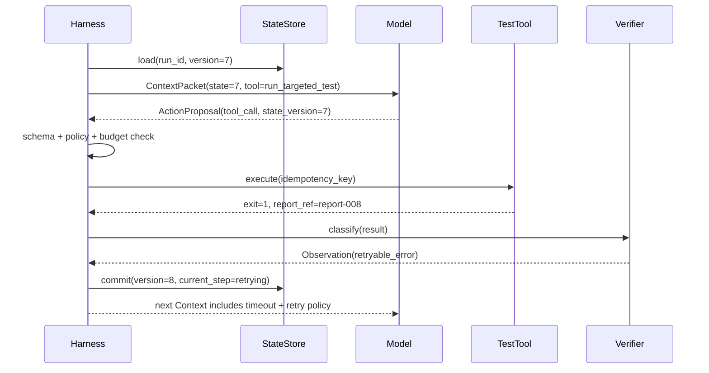

# 最小 Agent Loop：observe、think、act 与反馈如何闭合

## 一轮 Loop 不是四个口号

`observe → think/plan → act → observe` 描述的是数据流，而不是让模型在 prompt 里自行扮演四个角色。每一步都有输入、输出和 owner：

| 阶段 | 输入 | 输出 | 主要 owner |
|---|---|---|---|
| Observe（观察） | Run Contract、State、最近事件、workspace 快照 | 有来源和预算的 Context Packet | Context Builder / Harness |
| Think/Plan（思考/计划） | Context Packet、可用工具 schema | `ActionProposal` 或 `PlanProposal` | Model Adapter（候选） |
| Validate（验证，隐藏在 act 前） | 候选、State 版本、policy、预算 | 获准/拒绝/需审批 | Harness |
| Act（行动） | 已授权 proposal、幂等键 | Tool invocation 与原始结果 | Tool Runtime |
| Observe（反馈观察） | 工具结果、文件变化、测试、人工输入 | `Observation`：成功/失败/未知 | Tool Adapter + Verifier |
| Commit/Stop（提交/停止） | observation、完成条件、预算 | 新 State、Event、Trace、stop reason | Harness / State owner |

把 `Validate` 省略，会让“模型输出工具调用”直接变成副作用；把 `Commit/Stop` 省略，会让循环不知道什么时候结束。

## Context Packet：本轮只放需要的信息

模型不应该每轮接收完整 event log。Harness 根据当前子问题构造最小 packet，并保留可回查的 ID：

```yaml
context_packet:
  run:
    id: flaky-payments-42
    objective: 找出偶发测试失败原因并提交最小补丁
    constraints:
      - 不修改生产环境
      - 只允许 payments/ 路径
  state:
    version: 7
    current_step: run_regression
    completed_plan_items: [reproduce, locate_shared_state, apply_minimal_patch]
  evidence:
    - id: obs-004
      kind: test_failure
      source: pytest
      artifact_ref: report-004
      excerpt: "expected retry delay <= 1s, got 1.8s"
  tools:
    - name: run_targeted_test
      purpose: 在隔离 workspace 运行固定测试命令
      side_effect: none
      timeout_seconds: 60
  action:
    instruction: 运行回归测试并报告返回码、失败次数和 artifact 引用
    output_schema: action_proposal_v1
```

`tools` 不是“模型拥有的函数列表”，而是本轮经过 scope、权限和预算筛选后的能力视图。详情见 [[loop-engineering/03-harness-engineering|Harness Engineering]]。

## 模型输出：候选动作的最小 schema

建议把自然语言解释与可执行动作分开：

```json
{
  "kind": "tool_call",
  "tool": "run_targeted_test",
  "arguments": {
    "command_id": "payments_flaky_regression"
  },
  "reason": "补丁已应用，必须用固定命令验证 20 次",
  "expected_observation": "返回每次运行的退出码和报告引用",
  "state_version": 7
}
```

Harness 至少检查：

1. `kind`、工具名和参数是否符合 schema；
2. `state_version` 是否仍是当前版本，防止旧候选覆盖新事实；
3. 命令是否来自白名单，而不是任意 shell 字符串；
4. 工具是否属于当前 scope，副作用是否需要审批；
5. 预算、超时和并发额度是否还足够；
6. `expected_observation` 只是预期，不得替代真实结果。

## 最小控制伪代码

```python
def run_loop(run_id: str) -> StopReason:
    while True:
        state = state_store.load(run_id)
        stop = should_stop(state)
        if stop is not None:
            return stop

        context = context_builder.build(state)
        proposal = model.propose(context)

        decision = policy.validate(proposal, state)
        if decision.requires_human:
            checkpoint(state, reason="approval_required")
            return StopReason.PAUSED_FOR_HUMAN
        if not decision.allowed:
            record_rejection(proposal, decision.reason)
            state = advance_after_rejection(state)
            state_store.commit(state)
            continue

        idem_key = make_idempotency_key(state, proposal)
        result = tools.execute(proposal, idem_key)
        observation = verifier.classify(result)
        state = reducer.apply(state, observation)
        trace.record(proposal, result, state)
        state_store.compare_and_commit(expected=state.version, new_state=state)
```

完整可运行版本见 [[loop-engineering/11-reference-loop|参考实现]]。伪代码刻意把 `model.propose` 放在 `policy.validate` 之前，强调模型只产生候选。

## Observation 必须保留失败的形状

工具返回值不能只有一段字符串：

```yaml
observation:
  id: obs-008
  tool: run_targeted_test
  status: retryable_error
  error_class: timeout
  started_at: 2026-07-23T09:12:00+08:00
  finished_at: 2026-07-23T09:13:00+08:00
  attempt: 1
  idempotency_key: flaky-payments-42:run_regression:1
  artifact_ref: partial-report-008
  retry_after_seconds: 4
```

四类结果的后续路径不同：

| 结果 | 意义 | 下一步 |
|---|---|---|
| `success` | 已得到并验证结果 | 更新 State，可能进入下一 plan item |
| `retryable_error` | 重新执行可能成功，且副作用可控 | 退避、限次重试或降级 |
| `permanent_error` | 当前输入/权限/代码使重试无意义 | 修正候选、暂停或失败交付 |
| `unknown` | 不知道副作用是否发生 | 先 reconcile，不能盲目重试 |

例如测试进程超时通常是 `retryable_error`；发送外部消息后网络断开则可能是 `unknown`，因为消息是否已送达不确定。

## Stop reason 是一等输出

Loop 的结果不应只有“有答案/没答案”。建议至少区分：

```text
COMPLETED_SUCCESS_CRITERIA
PAUSED_FOR_HUMAN
PAUSED_UNKNOWN_SIDE_EFFECT
STOPPED_BUDGET_EXCEEDED
STOPPED_TIMEOUT
FAILED_PERMANENT_TOOL_ERROR
FAILED_POLICY_REJECTION
ROLLED_BACK_TO_CHECKPOINT
```

Stop reason 会进入 State、trace 和用户界面，帮助评测“系统为什么停”，也避免把预算耗尽误报成任务成功。

## 一次实际轨迹



注意最后一步不是“把工具原文直接拼回 prompt”。Harness 先分类、截取、关联 artifact、更新 State，再把当前需要的片段投影进下一轮。

## 常见错误与诊断位置

| 症状 | 更可能的 Loop 问题 | 先检查 |
|---|---|---|
| Agent 重复运行同一写操作 | 没有幂等键或 unknown 状态 | Tool adapter、reconcile 记录 |
| 测试通过一次就宣布完成 | 完成条件没有阈值/证据 | Run Contract、stop detector |
| 模型不断换工具 | 工具说明/错误反馈不清晰 | ACI、tool trace、policy rejection |
| 长对话后忘记限制 | 约束没有进入权威 State | Context Builder、State projection |
| 工具输出中的恶意指令被执行 | 数据与控制指令没有分区 | Parser、policy、来源标记 |
| 崩溃后重复写补丁 | 没有 checkpoint/CAS/replay | StateStore、idempotency ledger |

## 练习：手动运行一轮

给定 `current_step=run_regression`、`state.version=7`、工具超时、最大重试次数为 2：

1. 模型提出什么候选？
2. Harness 需要记录哪些字段？
3. State 的 `status`、`attempt` 和 `stop_reason` 怎样变化？
4. 第二次仍超时后，为什么不能继续无限重试？

如果答案只涉及“让模型再想一次”，说明你还没有把反馈变成可执行状态。

下一篇把这个循环扩展成有预算、有日志、有审批、有回滚的运行时：[[loop-engineering/03-harness-engineering|Harness Engineering：Loop 的控制面]]。
