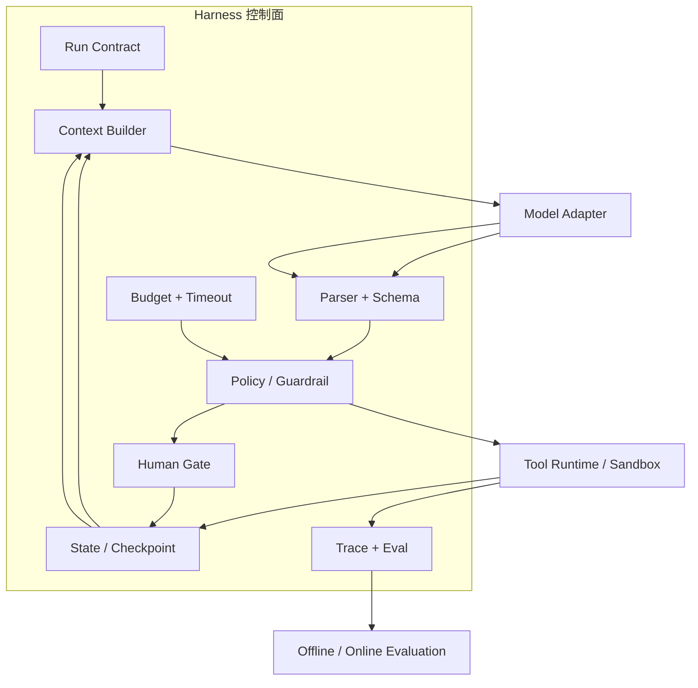

# Harness Engineering：把 Agent Loop 包装成可运行系统

## Harness 不是一条更长的 Prompt

模型擅长从 Context 生成候选计划、解释和工具调用；它不天然拥有：

- 当前事实的权威版本；
- 文件、数据库或网络副作用的授权；
- 超时、预算、并发和取消的强制执行；
- 进程崩溃后的恢复位置；
- 哪条 observation 证明任务已经完成。

Harness 把这些确定性职责放在模型外部。可以把它看成 Agent 的运行身体：模型提出动作，Harness 决定动作是否能发生、结果怎样进入下一轮，以及何时停止。



## 七类职责如何配合

| Harness 职责 | 需要固定的接口 | flaky-test 中的例子 | 失败时谁决定 |
|---|---|---|---|
| 循环控制 | `max_steps`、deadline、取消、stop reason | 24 步仍未找到稳定根因 | Harness 强制停止 |
| 工具路由 | registry、参数 schema、scope、权限 | 只暴露固定测试命令，不暴露任意 shell | Policy owner |
| 状态与检查点 | version、CAS、checkpoint、replay | 写补丁前保存 workspace 快照 | State owner |
| Context 管理 | 选择、压缩、版本、敏感信息过滤 | 只把相关日志片段送给模型 | Context owner |
| 恢复与副作用 | retry class、幂等键、reconcile | 测试超时可重试，发布动作需审批 | Tool/Workflow owner |
| 观测与评测 | trace/span、事件、成本、轨迹评分 | 记录模型选了什么工具、为什么被拒绝 | Observability owner |
| 人审与治理 | approval、pause/resume、审计、回滚 | diff 超过范围时等待 review | Human/policy owner |

这些职责可以由手写代码、图运行时、SDK 或平台提供，但语义不能因为换框架而消失。

## Prompt、Tool、State、Log、Eval、HITL、Rollback 的接口地图

### Prompt / Context

Prompt 是本轮 Context 的一种表达，不是权威状态。Harness 应保存 prompt template 版本、渲染输入的 ID、模型版本和输出 schema；出现回归时才能重放同一条件。

### Tool

工具定义是 Agent-Computer Interface（ACI，人和模型与计算机交互的接口）。一个可靠工具说明至少包含：用途、参数类型、允许范围、返回状态、错误分类、副作用、超时和示例。接口应让错误难以发生：例如使用 `command_id` 白名单，而不是接受任意 shell 字符串。

### State / Memory

State 保存当前任务真值；Memory 只提供跨任务候选。Harness 读取它们，验证版本和 scope，再把必要字段投影进 Context。详细语义见 [[memory-and-state/02-state-model|State 数据模型]] 和 [[context-engineering/05-context-assembly|Context 组装]]。

### Log / Trace

自然语言日志适合人读，结构化 trace 适合查询和评测。每个 span 至少记录 `run_id`、`parent_id`、组件版本、开始/结束时间、状态、成本、输入输出引用和敏感数据处理策略。不要把所有原始 prompt 默认写进生产日志；先做脱敏和访问控制。

### Eval

最终答案只是一个指标。Harness 还要评估工具选择、状态迁移、恢复、成本、延迟和安全违规。评测结果不应直接改变线上 State，除非有明确的发布门和版本策略。

### Human-in-the-loop

人审是一个可恢复状态，不是 `input()` 调用：

```yaml
approval:
  id: approval-17
  run_id: flaky-payments-42
  requested_action: apply_patch
  risk: medium
  evidence_refs: [diff-003, report-004]
  expires_at: 2026-07-23T10:00:00+08:00
  status: pending
```

暂停后必须保存足以恢复的 State，用户的批准/拒绝要成为事件，不能只存在于界面状态。

### Rollback

回滚不是“把模型再问一次”。它需要 checkpoint、workspace/artifact 版本和副作用账本。对于已经发送的外部消息，代码回退无法撤回消息；此时应使用补偿动作或人工处理，并在 State 中保留不可逆事实。

## 预算、超时和终止条件

建议把预算拆成可解释的维度：

```yaml
budget:
  max_steps: 24
  max_model_calls: 16
  max_tool_calls: 40
  deadline: 2026-07-23T10:15:00+08:00
  max_cost_usd: 1.50
  max_parallel_workers: 3
  max_risk_score: 2
```

每次循环前后都检查预算；只在循环结束时检查会留下超预算的单次工具调用。预算耗尽的 stop reason 要与成功、失败和人工暂停分开。

## 产品范式参考的证据边界

截至本系列资料核验日，公开资料可以确认：

- [Claude Code](https://code.claude.com/docs/en/overview) 是可在工作区中使用工具完成编码任务的产品形态；Anthropic 的 [Building effective agents](https://www.anthropic.com/engineering/building-effective-agents) 公开讨论了工作流、自主 Agent、检查点、护栏和工具接口设计。
- [Codex CLI](https://github.com/openai/codex) 的公开仓库将其描述为本地运行的 coding agent，并公开安装和运行入口；这证明了“模型 + workspace + 工具 + 运行时”这一产品形态，但不证明其内部所有实现细节。
- Cursor Agent 等 coding agent 产品展示了工作区、工具和人类批准结合的范式；其内部控制面属于厂商实现，教程只抽象共同的 contract，不复刻未公开 API。

> [!warning] 不要从产品 UI 反推内部协议
> “有终端按钮”“能恢复会话”只能说明用户可见能力。教程中的 State、CAS、幂等、回滚和 trace 是通用工程契约；某个产品是否用同样的数据库或状态机，需要官方资料才能确认。

## 2026 年 Harness 研究快照

截至 2026-07，新的预印本开始把 Harness 本身作为研究变量，而不是把 Agent 质量全部归因于基础模型：

- [Don't Blame the Large Language Model: How Agent Harness Evolution Shapes Coding Agent Quality](https://arxiv.org/abs/2607.03691) 研究 coding-agent harness 演进与效果/效率变化；
- [What makes a harness a harness](https://arxiv.org/abs/2606.10106) 讨论“产品、执行中间层、评测脚手架”都被称为 harness 所造成的术语混淆；
- [Code as Agent Harness](https://arxiv.org/abs/2605.18747) 将代码视为推理、行动、环境建模和执行验证的运行基底；
- [Natural-Language Agent Harnesses](https://arxiv.org/abs/2603.25723) 探索把可复用 harness 逻辑表达为可执行的自然语言对象。

这些工作说明“模型相同，Harness 不同，系统行为也会不同”值得单独研究；但它们仍是较新的预印本。本文的规范性建议仍建立在可验证的 contract、权限、状态、反馈和恢复原则上，不把单篇新结果当成行业定论。

## Harness 的演进阶梯

| 阶段 | 适合的问题 | 新增能力 | 何时升级 |
|---|---|---|---|
| 手写单 Loop | 短任务、低风险、可同步等待 | parser、tool registry、stop 条件 | 需要持久化或分支 |
| 有状态图/Workflow | 多步骤、条件分支、可暂停 | checkpoint、节点契约、重放 | 任务跨进程/跨小时 |
| SDK Runtime | 需要统一 handoff、guardrail、session、trace | 供应商适配和生态集成 | 团队接受其抽象和版本策略 |
| 平台级 Harness | 多租户、治理、审计、规模化 | 权限、队列、指标、发布门 | 运维与合规成本超过手写代码 |

升级不是默认更好。每增加一层，都会增加配置、版本、调试和故障传播面；应先用评测证明收益。

## 常见反模式

1. **万能 Agent**：把所有工具和所有知识一次性暴露，导致选择空间、权限和 Context 都膨胀。
2. **隐式状态**：只保存聊天历史，不保存 plan item、版本和副作用账本。
3. **成功即停止**：一次命令返回 0 就宣布整体目标完成，忽略回归、diff 和约束。
4. **自动重试一切**：把 unknown 当失败重跑，可能重复发送或写入。
5. **只记录最终答案**：无法解释模型为何选错工具，也无法评估轨迹。
6. **把 Skill 当权限**：加载一组说明后就允许它调用所有工具，绕过 policy gate。

## 实现前检查表

- [ ] 每个 run 有稳定 ID、scope、预算、状态版本和 stop reason。
- [ ] 模型输出经过 schema、policy、权限和版本检查。
- [ ] 工具结果有 success/retryable/permanent/unknown 分类。
- [ ] 有 checkpoint、幂等键和未知结果 reconcile 方案。
- [ ] 日志能关联 prompt/tool/state/observation/成本，但敏感内容已脱敏。
- [ ] 高风险动作有可恢复的人审门。
- [ ] 轨迹评测能比较“更复杂的模式”是否值得其成本。

下一篇开始比较这些控制流上常见的推理范式：[[loop-engineering/04-reasoning-patterns|ReAct、计划、反思与 Reflexion]]。
