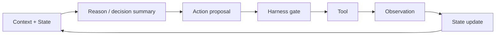
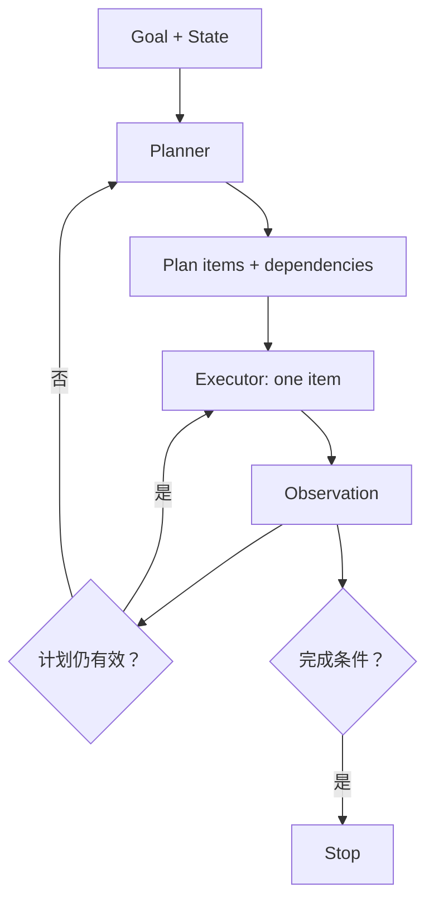
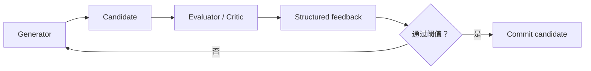

# 推理范式：ReAct、计划、反思与 Reflexion 怎样服务 Loop

## 先分清：Prompt 技巧、Workflow 和 Runtime 不是一层

“让模型先思考”“先列计划”“再反思一次”看起来都像 prompt 文案，但只要方法需要多次模型调用、外部工具、持久状态或停止条件，就已经进入 Workflow/Harness 层。

| 层 | 控制对象 | 例子 | 需要外部 State 吗 |
|---|---|---|---|
| Prompt | 单次调用的指令和格式 | 要求先给简短计划再回答 | 不一定 |
| Sampling | 生成多个候选并聚合 | self-consistency | 候选集合通常需要 |
| Workflow | 多次调用、阶段、反馈、重试 | Plan-and-Execute、Reflection | 需要 |
| Search | 分支、评分、剪枝、回溯 | ToT、LATS | 必须显式保存 frontier |
| Runtime | 权限、工具、预算、恢复、停止 | Harness | 必须 |

本篇讨论线性或小规模循环；分支搜索见 [[loop-engineering/05-search-reasoning|ToT、GoT 与 LATS]]。

> [!important] 不需要保存或展示模型的私有长篇思维链
> 工程系统需要的是可验证的计划、动作理由、证据引用、候选比较和状态变化。可以要求模型输出简短决策摘要和结构化 proposal，而不是依赖不可审计的隐含推理。

## ReAct：让推理与行动交错

[ReAct](https://arxiv.org/abs/2210.03629) 的核心是让 reasoning 与 task-specific action 交错：当前推理指导下一次环境交互，新的 observation 又纠正后续推理。

### 它解决什么问题

纯 Chain-of-Thought 只能依赖调用时已有的信息，遇到未知事实容易继续猜；纯动作序列又可能缺少目标跟踪和异常处理。ReAct 把外部反馈插进轨迹：

```text
简短决策摘要
→ Action: 运行 flaky test 20 次
→ Observation: 第 7、13 次失败，均在同一时钟边界
→ 更新假设：问题可能来自共享 fake clock
→ Action: 搜索 fixture 的生命周期
→ Observation: fixture 为 session scope
→ 提出最小修复候选
```

### 输入、输出和 State 变化

- 输入：当前目标、State、相关证据、可用工具及最近 observation；
- 输出：一个工具调用或最终回答候选；
- State：追加 observation，更新当前假设、已验证事实和下一步；
- 终止：成功标准满足、工具无可用路径、风险门、预算或最大步数。



### 什么时候使用

- 步骤无法完全预先确定；
- 每次工具结果能显著改变下一步；
- 工具调用可验证、可限制；
- 任务不需要大规模并行搜索。

### 代价和边界

- 局部贪心：每轮只选一个下一步，早期错误假设可能拖长轨迹；
- 轨迹膨胀：工具输出和理由不断积累，需要压缩与证据引用；
- 重复动作：若 State 没有记录尝试和结果，模型可能循环；
- 安全：ReAct 不提供权限、幂等和终止保障，这些仍由 Harness 实现。

## Plan-and-Execute：把“决定做什么”和“执行一步”分开

Plan-and-Execute 是一种通用工程模式：Planner 生成或更新计划，Executor 每次只执行一个有契约的步骤，结果交给 Replanner 或 Stop Detector。



### 它解决什么问题

长任务只用 ReAct，Agent 容易丢失整体依赖、反复探索或过早修改。显式计划让系统可以：

- 为每个步骤定义输入、输出和完成条件；
- 并行执行独立步骤；
- 在用户修改目标后定位受影响部分；
- 记录 `pending / in_progress / completed / blocked / stale`。

### 关键 State

```yaml
plan_item:
  id: locate_shared_clock
  objective: 判断 flaky failure 是否来自共享 fake clock
  depends_on: [reproduce_failure]
  status: in_progress
  allowed_tools: [search_code, read_file, run_targeted_test]
  success_evidence:
    - fixture scope 有源码位置
    - 失败时间与共享状态变化有关联
  retry_limit: 2
```

计划不是预测未来的真理。Observation 推翻假设时，旧 plan item 应标为 `stale` 或 `superseded`，而不是悄悄覆盖历史。

### 什么时候使用

- 任务有 3 个以上有依赖的阶段；
- 每个阶段能写出可验证输出；
- 需要暂停、恢复、并行或人工 review；
- 总体目标比单次工具反馈更稳定。

### 代价和边界

- 初始计划可能错误或过细；
- Planner/Executor 来回调用增加延迟；
- 如果执行器能任意修改计划，角色分离就失去意义；
- 需要定义何时重规划，避免每次 observation 都推翻全部步骤。

## Plan-and-Solve：论文中的“先规划，再求解”

[Plan-and-Solve Prompting](https://arxiv.org/abs/2305.04091) 针对 Zero-shot Chain-of-Thought 的漏步、计算错误和语义误解，先让模型把问题拆成子任务，再按计划求解；PS+ 进一步强调抽取变量和中间计算。

它与工程中的 Plan-and-Execute 相似，但范围不同：

| 维度 | Plan-and-Solve 论文方法 | 通用 Plan-and-Execute Workflow |
|---|---|---|
| 原始目标 | 改善单个推理问题的零样本推理 | 驱动有工具、有状态的长任务 |
| 反馈 | 主要来自子问题推理 | 工具、环境、人类、评估器 |
| State | 可在一次/少量调用文本中表达 | 需要外部持久化、版本和恢复 |
| 副作用 | 通常没有真实外部写入 | 可能有文件、API、消息等副作用 |

工程上可以借用“先拆解、再逐项求解”的思想，但不能因此声称实现了论文的所有设置或收益。

## Reflection / Self-Critique：增加一个评估—修订回路

Reflection 是一类通用模式：生成器先给候选，评估器按明确标准找出缺陷，生成器根据反馈修订。



### 它解决什么问题

第一次生成容易遗漏约束、证据或格式。对于“看到具体反馈后能明确改进”的任务，评估—修订比盲目多采样更有效。

### 反馈必须结构化

```yaml
evaluation:
  candidate_id: diff-003
  rubric_version: patch-review-v2
  checks:
    minimal_scope: pass
    root_cause_supported: pass
    regression_coverage: fail
    forbidden_paths: pass
  feedback:
    - 缺少针对并发执行的回归测试
  score: 0.75
  decision: revise
```

### Self-Critique 的限制

同一个模型自评可能共享同一盲点，并且“更有说服力”不等于“更正确”。因此：

- 能用编译器、测试、schema、静态分析验证时，优先使用外部验证器；
- LLM evaluator 应有 rubric、证据引用和校准集；
- 设置最大修订轮数；
- 评估结果先作为 observation，不直接覆盖事实 State。

## Reflexion：把反思写入 episodic memory

[Reflexion](https://arxiv.org/abs/2303.11366) 不通过梯度更新模型权重，而是根据任务反馈生成语言反思，并把反思保存在 episodic memory buffer 中，用于后续试验。

```text
Trial 1 action trajectory
→ environment/test feedback
→ verbal reflection: 哪个假设/动作失败，下一次怎样改变
→ episodic memory
→ Trial 2 context includes selected reflection
```

### 与普通 Reflection 的区别

| Reflection | Reflexion |
|---|---|
| 对当前候选进行评估和修订 | 跨 trial 保存语言反思，影响后续决策 |
| 反馈可以只服务本轮 | 明确需要 episodic memory |
| 不必形成长期经验 | 反思文本需要检索、选择和淘汰 |

### 在 flaky-test 场景中的 State

```yaml
episode:
  trial_id: 2
  outcome: failed
  evidence_refs: [report-011, diff-004]
  reflection: >-
    我把一次通过误当作稳定；下一试验必须固定随机种子并运行 20 次，
    且在应用补丁前保存基线失败率。
  scope: flaky-payments-42
  expires_after_trials: 3
```

反思文本仍是候选经验。它可能过拟合单次失败、包含错误归因或污染未来 Context，因此要带 scope、证据、创建时间和淘汰规则。

## 五种模式的选择表

| 当前失败形态 | 优先模式 | 不要先做什么 |
|---|---|---|
| 需要边查边决定下一步 | ReAct | 先生成一份不可变的长计划 |
| 长任务丢依赖、重复步骤 | Plan-and-Execute | 继续堆聊天历史 |
| 单个推理问题经常漏步骤 | Plan-and-Solve 风格拆解 | 把它包装成多 Agent 平台 |
| 初稿可被明确 rubric 改进 | Reflection / evaluator-optimizer | 无限自我批评 |
| 多次试验重复同一错误 | Reflexion 风格 episodic memory | 把所有反思永久写入长期记忆 |

## 同一个 Loop 中怎样组合

组合应由失败压力引出，而不是堆名词：

```text
Run Contract
→ Planner 生成 4 个 plan items
→ Executor 在每个 item 内使用 ReAct 与工具交互
→ 测试/规则 Evaluator 评估候选补丁
→ 若 trial 失败，生成有证据的 Reflexion episode
→ Replanner 只重写受影响步骤
→ Harness 根据完成条件、预算和风险停止
```

每增加一个回路，都要新增状态、预算和终止条件。若没有对应 schema 和 trace，它只是 prompt 中的角色扮演。

> [!success] 自测
> “先计划”并不能自动解决工具超时；“反思”也不能确认文件是否真的写入。前者改变候选步骤结构，后者产生评估反馈；真实副作用和恢复仍属于 Harness。

下一篇讨论需要同时探索多个候选分支时的搜索结构：[[loop-engineering/05-search-reasoning|Tree of Thoughts、Graph of Thoughts 与 LATS]]。
