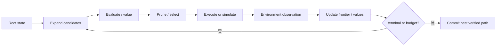
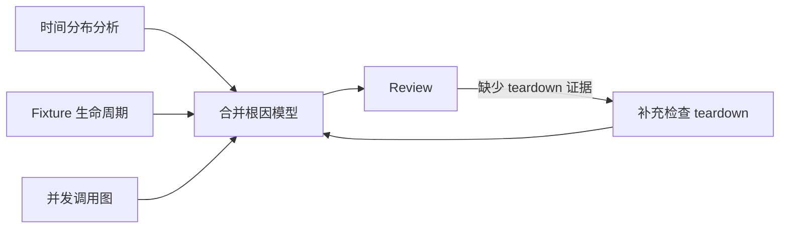

# 搜索型推理：Tree of Thoughts、Graph of Thoughts 与 LATS

## 为什么线性 Loop 有时不够

ReAct 每轮通常选择一个动作继续。如果早期有多个都合理的根因假设，立刻押注一个分支可能导致局部最优：

```text
假设 A：共享 fake clock
假设 B：并发重试顺序
假设 C：随机种子泄漏
```

搜索型推理不急着提交一个答案，而是显式维护多个候选状态，分配预算进行扩展、评分、剪枝和回溯。新增的不只是 prompt，而是一个搜索控制器。

## 通用搜索 Loop



搜索中的“节点”必须有稳定 ID、父子关系、状态快照/增量、得分依据和资源消耗。否则无法回溯，也无法知道不同分支是否共享了不该共享的副作用。

## Tree of Thoughts（ToT）

[Tree of Thoughts](https://arxiv.org/abs/2305.10601) 把中间的 coherent units of text（论文称 thoughts）视为搜索节点，让模型生成多个候选、评估候选，并通过 BFS/DFS 等策略前瞻或回溯。

### 它解决什么问题

适合需要探索、策略前瞻、早期决定影响很大的问题。论文在 Game of 24、创意写作和迷你填字等任务展示了这种推理时搜索。

### 最小 State

```yaml
search_node:
  id: node-B2
  parent_id: node-B
  depth: 2
  hypothesis: 并发重试顺序导致共享计数器竞态
  evidence_refs: [report-017]
  status: frontier
  value:
    score: 0.72
    evaluator: root-cause-rubric-v1
  cost:
    model_calls: 2
    tool_calls: 1
  terminal: false
```

### 数据流变化

线性 Loop 的 `current_step` 变成 frontier；`ActionProposal` 变成一组候选扩展；Stop Detector 还要检查搜索宽度、深度和总预算。

### 代价和边界

- 分支数近似按 (b^d) 增长，其中 (b) 是每层候选数，(d) 是深度；
- 自评模型可能把语言流畅度当正确性；
- 有真实副作用的动作不能在每个分支随意执行，应优先使用只读工具、模拟、隔离 workspace 或延迟提交；
- 搜索得到“最佳候选”后仍需真实验证。

## Graph of Thoughts（GoT）

[Graph of Thoughts](https://arxiv.org/abs/2308.09687) 将 thought 组织为任意图，而不是只能有一个父节点的树。节点之间可以依赖、合并、聚合、反馈或循环改进。

### 为什么需要图

有些任务不是独立分支竞争，而是多个部分互相组合：

- 分支 A 分析失败时间分布；
- 分支 B 分析 fixture 生命周期；
- 分支 C 分析并发调用图；
- 聚合节点把三份证据合成根因模型；
- review 节点指出缺口，再把反馈边连回 B。



### State 变化

需要显式保存节点和边：

```yaml
edge:
  from: review-1
  to: fixture-check-2
  type: feedback
  payload_ref: feedback-003
  status: active
```

相比 ToT，GoT 能复用和合并候选，但调度、环检测、版本合并和审计更复杂。业务流程若只是顺序或条件分支，用普通 DAG/状态图更清晰；不要为了“图”而把简单流程复杂化。

## LATS：把推理、行动、计划与 MCTS 结合

[Language Agent Tree Search（LATS）](https://arxiv.org/abs/2310.04406) 把 Monte Carlo Tree Search（MCTS，蒙特卡洛树搜索）引入语言 Agent，结合模型生成的动作、value function、自反思和环境反馈进行探索。

### MCTS 的四个阶段

1. **Selection**：在已有树中选择值得继续探索的节点；
2. **Expansion**：生成新的动作/思路候选；
3. **Simulation / Evaluation**：执行环境动作或估计结果；
4. **Backpropagation**：把奖励/反馈沿祖先节点更新。

一种常见选择思想是平衡利用与探索：

$$
\text{UCB}_i = \bar{Q}_i + c\sqrt{\frac{\ln N_{parent}}{N_i}}
$$

其中：

- \(\bar{Q}_i\) 是节点历史平均价值；
- \(N_i\) 是该节点访问次数；
- \(N_{parent}\) 是父节点访问次数；
- \(c\) 控制探索强度。

LATS 的具体实现并不等于只套一个 UCB 公式；论文还使用语言模型生成/评估、环境反馈和 reflection。工程实现应明确哪些分数来自真实环境，哪些只是模型估计。

### 搜索 State

```yaml
mcts_node:
  id: n-17
  parent_id: n-4
  visits: 6
  total_value: 4.1
  mean_value: 0.683
  action: inspect_fixture_teardown
  observation_ref: obs-029
  reflection_ref: reflection-006
  terminal: false
```

### 为什么昂贵

每次搜索迭代可能包括多个模型调用、工具调用和评估。粗略成本可以写为：

$$
C_{total} = \sum_{n \in explored} (C_{generate,n} + C_{evaluate,n} + C_{tool,n})
$$

如果分支工具会修改文件，必须为每个分支建立隔离 workspace；否则一个分支的副作用会污染其他分支，使搜索分数失真。

## 三种方法的工程比较

| 维度 | ToT | GoT | LATS |
|---|---|---|---|
| 结构 | 树 | 任意图 | MCTS 搜索树 |
| 主要动作 | 生成、评估、剪枝、回溯 | 生成、依赖、合并、反馈 | selection、expansion、evaluation、backpropagation |
| 反馈 | 自评或外部 verifier | 节点/图级评估 | 环境奖励 + value + reflection |
| 适合 | 多路径解题、早期选择关键 | 可合并的子结果与反馈网络 | 可交互环境中的高价值搜索 |
| 主要风险 | 分支爆炸、自评分偏差 | 环与合并语义复杂 | 成本高、环境副作用难隔离 |

## 什么时候值得升级到搜索

只有同时满足多数条件时才考虑：

- 单路径策略在评测中确实经常陷入局部最优；
- 候选可以被可靠评分，最好有测试、规则或环境奖励；
- 分支执行能隔离或模拟，不会污染真实系统；
- 任务价值足以覆盖多倍模型/工具成本；
- 有明确宽度、深度、时间和费用预算；
- 最终路径仍经过真实验证和权限门。

对于普通 CRUD、固定审批、简单客服分流，用确定性 Workflow 更可靠。搜索结构不是“高级 Agent”的必选项。

### 近期降本方向

2026 年的预印本 [GATS: Graph-Augmented Tree Search](https://arxiv.org/abs/2607.08894) 探索用分层 world model 与系统化树搜索减少规划阶段的 LLM 调用。它代表一个重要工程方向：不要默认每个 search node 都必须再调用一次模型；可以缓存、使用显式状态转移模型、规则 verifier 或更便宜的 value 估计。由于该工作较新，教程只采用这个研究问题，不把其报告结果视为通用生产保证。

## 搜索 Harness 的额外职责

- frontier 持久化和去重；
- 节点/边版本及父子关系；
- 分支 workspace/工具副作用隔离；
- evaluator 校准与分数来源记录；
- 宽度、深度、总节点数、并发和成本预算；
- 环检测、死分支和低价值剪枝；
- 最佳候选的最终验证与 commit gate。

> [!warning] 分支评分不是事实
> 模型给 `0.9` 只是一个估计。若真实测试失败，节点必须按环境 observation 更新；不能因为语言评价高就跳过验证。

下一篇把一个搜索/计划任务拆给多个执行者：[[loop-engineering/06-collaboration-patterns|Router、Supervisor、Worker 与 Handoff]]。
