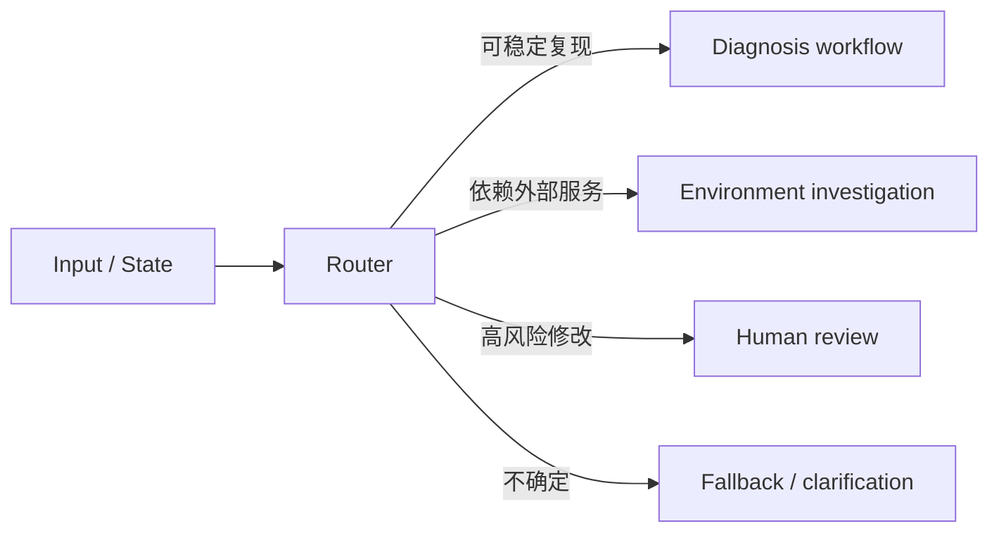
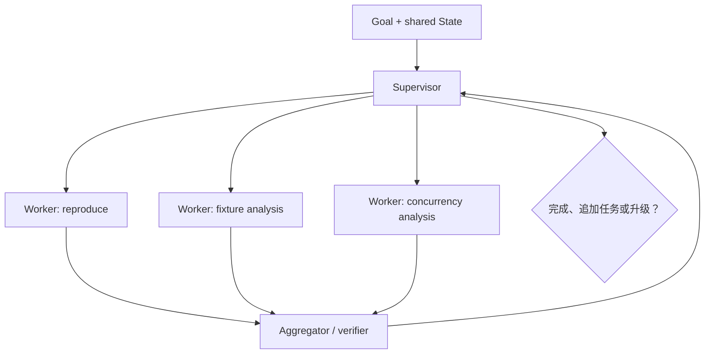
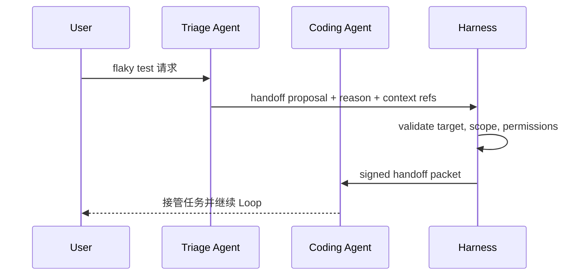

# 协同模式：Router、Supervisor、Worker 与 Handoff

## 多 Agent 首先是责任分配问题

把同一个模型实例复制三份，不会自动获得更好的协作。一个协同系统至少要定义：

- 谁拥有总目标和最终停止权；
- 每个 worker 收到什么任务契约、权限和预算；
- 状态是共享、复制还是消息传递；
- 结果怎样合并，冲突由谁解决；
- 失败、取消、审批和 handoff 怎样传播；
- 怎样阻止 Agent 互相转交形成循环。

协同模式改变的是 Loop 的拓扑和 owner，不只是 prompt 中的角色名。

## Router：先分类，再进入不同 Loop

Router 根据输入或当前 State 选择下游处理路径：



### 输入和输出

```yaml
route_decision:
  route: diagnosis_workflow
  confidence: 0.82
  evidence_refs: [obs-001]
  alternatives:
    - route: environment_investigation
      confidence: 0.15
  fallback: request_clarification
```

### 工程边界

- 能用确定性规则路由时，不必用 LLM；
- 错路由可能造成 zero recall：正确工具和知识根本没进入后续 Context；
- 保留 fallback、多标签或二次校验；
- 记录 route、置信度、模型/规则版本和最终结果，才能评估路由质量。

Router 通常不拥有完整任务，它只做“把任务交给谁/哪条流程”的一次决策。

## Worker：拿到窄契约，返回可合并结果

一个好 worker 应是窄能力单元：

```yaml
worker_task:
  task_id: inspect-fixture-lifecycle
  parent_run_id: flaky-payments-42
  objective: 找出 fake clock fixture 的创建、共享和清理位置
  inputs:
    artifact_refs: [repo-snapshot-abc123]
  allowed_tools: [search_code, read_file]
  forbidden_tools: [write_file, shell, network]
  output_schema: evidence_bundle_v1
  deadline_seconds: 90
```

worker 返回 observation/evidence bundle，而不是直接修改 parent State。Supervisor 或 Reducer 验证后再合并，避免并行 worker 互相覆盖。

## Supervisor–Worker：动态拆解和汇总

Supervisor 持有总目标，根据当前信息动态产生 worker task，收集结果并决定下一步：



这对应 Anthropic 工程文章所说的 orchestrator-workers：子任务的数量和类型由 orchestrator 在运行时决定，而不是预先写死。

### 共享 State 的两种方式

| 方式 | 优点 | 风险 | 默认建议 |
|---|---|---|---|
| Worker 直接共享可写 State | 协作即时 | 并发冲突、越权、难审计 | 不作为默认 |
| Worker 只读快照 + 返回结果 | 合并点清晰、容易重放 | 结果可能基于旧版本 | 推荐，合并时做版本检查 |

### Supervisor 也需要 Harness

Supervisor 不能无限创建 worker。需要：最大 worker 数、每个 worker 预算、总 deadline、去重、循环检测、失败传播和最终 stop reason。

## Handoff：转移当前控制权

Handoff 与“把某个 Agent 当工具调用”不同：

- **Agent as tool**：调用者保留控制权，子 Agent 返回结果；
- **Handoff**：当前会话或任务 owner 转给另一个 Agent，接收者负责后续交互与停止。



### Handoff packet

```yaml
handoff:
  from: triage-agent
  to: coding-agent
  run_id: flaky-payments-42
  objective: 修复已定位的 shared clock 泄漏
  state_version: 5
  evidence_refs: [obs-004, code-span-017]
  permissions: [read_repo, run_targeted_test]
  pending_questions: []
  expires_at: 2026-07-23T11:00:00+08:00
```

不能只转发一段聊天摘要：接收者需要目标、可信 State 版本、证据引用、权限、预算和未解决问题。接收者必须显式接受或拒绝，Harness 记录 owner 变化。

## flaky-test 场景的最小协作设计

推荐先从一个 Supervisor + 三个只读 worker 开始：

1. **Reproduction Worker**：运行固定测试矩阵，返回失败分布；
2. **Fixture Worker**：只读搜索 fixture 生命周期；
3. **Concurrency Worker**：只读分析共享状态和调用图；
4. **Supervisor**：合并证据，决定是否授权 Patch Worker；
5. **Patch Worker**：仅在人工/规则门后获得写权限；
6. **Review Worker**：只读检查 diff、测试和约束，不直接批准高风险动作。

读 worker 与写 worker 分离，能让最小权限更清晰。不要一开始给所有角色完整 shell 和网络权限。

## 冲突、失败和取消怎样传播

| 事件 | Parent/Supervisor 行为 |
|---|---|
| Worker 超时 | 标记 task `retryable_error`，按预算重试或分配替代 worker |
| Worker 返回旧 State 版本 | 保留结果为候选，重新验证证据是否仍适用 |
| 两个 worker 结论冲突 | 创建显式 conflict item，要求额外 verifier，而不是投票即真相 |
| 用户取消 | 向所有子 run 传播 cancellation token，等待工具安全终止 |
| Worker 产生未知副作用 | 暂停 parent，先 reconcile，不能继续聚合 |
| Handoff 目标拒绝 | owner 不改变，回到当前 Agent 的 fallback |

## 什么时候不要多 Agent

- 子任务可以由一个清晰的确定性流程完成；
- 多个角色共享同一工具和 Context，没有真实专业边界；
- 结果无法独立验证，只能让另一个模型“感觉一下”；
- 合并成本大于并行收益；
- 任务风险高但权限和审计尚未设计。

多 Agent 会增加消息、状态、失败面和 Token；只有在分工、并行或能力隔离能被评测证明有价值时才升级。

## 框架映射，不把 API 当定义

- OpenAI Agents SDK 当前公开支持 handoffs 和 agents-as-tools；选择哪种方式应回到“谁保留控制权”。
- CrewAI 的 Roles/Tasks/Crews 适合表达角色化协作，Flows 提供更确定的控制面；详见 [[loop-engineering/08-skills-and-capability-loading|Skills 与 CrewAI 映射]]。
- LangGraph 可以用节点/子图和 checkpoint 表达 Supervisor/Worker，但 State owner、权限和合并规则仍需应用定义。

> [!success] 自测
> 如果一个 worker 能直接修改 shared State、创建无限子任务并把任务 handoff 给自己，系统还没有协同 contract，只是多个自主循环叠在一起。

下一篇决定哪些路径应由代码固定，哪些才交给模型动态选择：[[loop-engineering/07-workflow-vs-autonomy|Deterministic Workflow vs Autonomous Agent]]。
