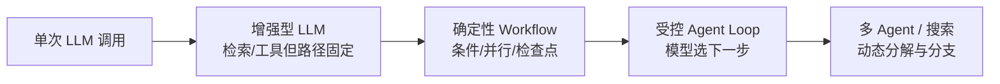
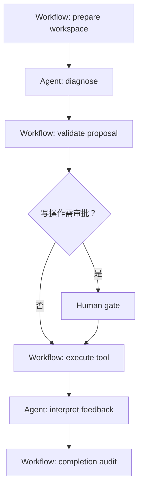
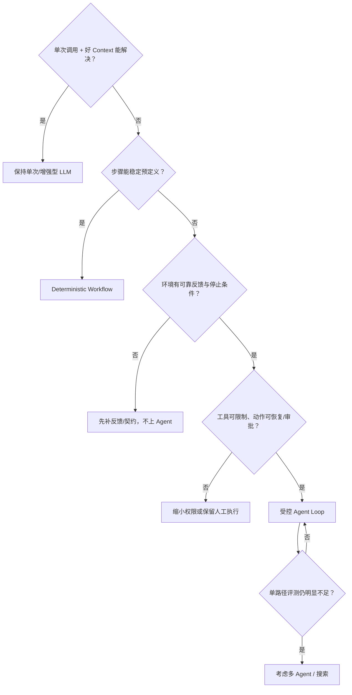

# Deterministic Workflow 与 Autonomous Agent：如何选择自主性边界

## 问题不是“要不要用 Agent”，而是“哪一步需要模型决定”

Anthropic 的 [Building effective agents](https://www.anthropic.com/engineering/building-effective-agents) 把 agentic systems 区分为：

- **Workflow**：LLM 和工具沿预先写好的代码路径运行；
- **Agent**：模型根据环境反馈动态决定步骤和工具。

两者可以组合。一个生产系统常常是“确定性外壳 + 局部自主节点”，而不是全部固定或全部开放。

## 自主性阶梯



越往右，灵活性越高，同时状态空间、成本、评测和安全难度也越高。升级应由评测中的具体失败触发。

## 决策矩阵

| 问题 | 倾向 Workflow | 倾向 Autonomous Agent |
|---|---|---|
| 步骤能否提前列全？ | 能，分支稳定 | 不能，运行时才知道 |
| 输入差异 | 类型有限、可分类 | 开放、长尾、需要探索 |
| 外部反馈 | 只决定少数条件分支 | 每次反馈都会改变策略 |
| 成功标准 | 明确且程序可验证 | 可定义，但达到路径不确定 |
| 副作用风险 | 高或不可逆 | 低、可隔离、可审批 |
| 错误成本 | 高，需要可预测路径 | 可承受试错并有恢复 |
| 延迟/成本预算 | 严格 | 允许多轮与搜索 |
| 可观测性成熟度 | 基础也可运行 | 必须能看轨迹、状态和工具 |

如果右侧条件不成立，采用 Agent 往往只会把确定性业务逻辑变成昂贵、难调试的自然语言控制流。

## 用 flaky-test 场景划边界

### 适合固定为 Workflow 的部分

```text
创建隔离 workspace
→ 检查 branch/base commit
→ 运行白名单测试命令
→ 收集 exit code 与 artifact
→ 校验 diff 允许路径
→ 需要写入时请求审批
→ 归档 trace 与 checkpoint
```

这些步骤涉及权限、事务和审计，代码能准确表达，不应交给模型自由决定。

### 适合交给 Agent 的部分

- 在多份日志和代码之间形成根因假设；
- 根据新 observation 决定下一份需要读取的文件；
- 当初始假设失败时重排诊断步骤；
- 解释不同补丁候选的权衡；
- 在已授权工具集合中选择下一次只读检查。

### 混合控制流



## 五种常见 Workflow 模式

Anthropic 的工程文章总结了五类可组合模式；它们不要求整个系统成为自主 Agent：

| 模式 | 控制流 | 适用条件 | flaky-test 例子 |
|---|---|---|---|
| Prompt chaining | 固定顺序 | 子步骤稳定、前后依赖清楚 | 先抽取日志，再生成诊断摘要 |
| Routing | 分类后走不同路径 | 输入类别稳定 | 单测 flaky / 环境故障 / 依赖故障 |
| Parallelization | 固定并行或投票 | 子任务独立 | 同时分析 fixture、并发和时间分布 |
| Orchestrator-workers | 动态生成子任务 | 子任务数量运行时才知道 | Supervisor 决定要读哪些模块 |
| Evaluator-optimizer | 生成—评估—修订 | rubric 清晰且反馈有效 | 生成补丁，review 后修订 |

前 3 种通常更确定；后 2 种包含更多模型动态决策，但仍可放在 Harness 中限制。

## 把“自主性”拆成多个旋钮

不要只用一个 `autonomous=true`。分别决定：

```yaml
autonomy_policy:
  may_choose_next_tool: true
  may_create_plan_items: true
  may_replan_completed_items: false
  may_spawn_workers: false
  may_write_files: with_approval
  may_access_network: false
  may_change_goal: false
  may_decide_completion: propose_only
```

模型可以在窄范围内自主，而目标、权限和最终完成仍由确定性 owner 管理。

## 选择流程



## 从 Workflow 升级到 Agent 的证据

至少准备同一评测集的对照：

- 目标成功率提升多少；
- 工具调用数、Token、费用和延迟增加多少；
- 轨迹违规、重复动作和人工升级率怎样变化；
- 对长尾输入的覆盖是否真的改善；
- 故障和恢复是否仍可解释。

如果质量只提升 1%，而成本和错误面翻倍，保持 Workflow 是更好的工程选择。

## 从 Agent 降级回 Workflow

生产轨迹会暴露稳定模式。例如 90% 的任务都走同一条路径，可以把这部分固化：

```text
观察 Agent trace
→ 找到重复且稳定的决策
→ 写成确定性节点/规则
→ 保留 Agent 只处理长尾
→ 用同一评测集比较
```

这不是“退步”，而是把已经学到的控制流变成更便宜、可预测的系统。

## 风险与可逆性决定最后边界

| 动作 | 默认 owner | 原因 |
|---|---|---|
| 读取允许路径文件 | Agent 可选择，Harness 执行 | 低风险、可审计 |
| 运行白名单测试 | Agent 可选择，Harness 限时 | 低副作用但有资源成本 |
| 修改工作区文件 | Agent 提议，policy/人类批准 | 需要范围检查和 checkpoint |
| 合并主分支、部署、转账、发送外部消息 | 确定性 Workflow + 人工/强策略 | 高风险或不可逆 |
| 宣布任务完成 | Agent 提议，completion auditor 决定 | 需要核对所有成功标准 |

> [!important] 自主性不是能力包的属性
> 给 Agent 加载更多 Skills 或工具，只增加“可能做什么”；真正的自主性由谁决定下一步、谁能提交 State 和副作用来定义。

下一篇继续拆开“能力”和“控制权”：[[loop-engineering/08-skills-and-capability-loading|Anthropic Skills 与 CrewAI Tasks/Roles]]。
