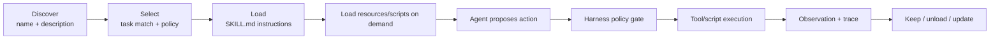
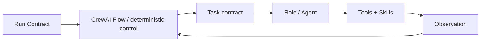

# Skills 与能力加载：Anthropic Skills、CrewAI Tasks 和 Roles 怎样进入 Loop

## Skill 解决的是“怎样做”，不是“是否有权做”

一个通用 Agent 不可能把所有领域说明、脚本、模板和资源永远塞进 Context。Skill 把某类任务的操作知识打包，让 Harness 在需要时发现、加载和执行。

但加载 Skill 不会自动赋予权限：

```text
Skill：教模型怎样生成安全的数据库迁移计划
Tool：真正读取 schema 或执行 migration 的接口
Policy：当前 run 是否允许访问该数据库、是否允许写入
State：已经完成哪些步骤、审批是否通过
Harness：决定 Skill 和 Tool 何时可见、动作是否执行
```

把 Skill 当作“超级 prompt + 全部工具权限”，会绕过 Loop 的控制边界。

## Anthropic Skills 的公开结构

Anthropic 官方 [`anthropics/skills`](https://github.com/anthropics/skills) 仓库将 Skills 描述为由 instructions、scripts 和 resources 组成的目录，由 Claude 动态加载以提高特定任务的重复执行能力。每个 Skill 以 `SKILL.md` 保存元数据和说明。

[Agent Skills 规范](https://agentskills.io/specification) 当前要求 `name`、`description`，并定义 `license`、`compatibility`、`metadata` 等可选字段；`allowed-tools` 被标注为实验性字段。API 和宿主产品可以有额外约束，因此教程依赖“自包含目录 + 可发现描述 + 按需加载”这一稳定语义，而不假设所有宿主行为完全一致。

### 最小 Skill

```markdown
---
name: flaky-test-diagnosis
description: Diagnose intermittently failing tests by reproducing failures,
  isolating shared state, and requiring repeated verification. Use when a
  test passes and fails across identical source revisions.
compatibility: Requires read-only repository access and an approved test runner.
metadata:
  version: "1.0.0"
---

# Flaky Test Diagnosis

1. Record the source revision and test command before reproducing.
2. Run enough trials to estimate whether the failure is intermittent.
3. Separate timing, randomness, shared state, order dependence, and external I/O.
4. Link every root-cause claim to a test or code observation.
5. Do not apply a patch until the run contract permits writes.
```

这里的说明影响模型怎样完成任务；真正的 `read_file`、`run_test`、`apply_patch` 仍来自宿主 Harness 的工具注册和授权。

## Skill 的生命周期



### Discover

发现阶段只需要最小元数据。若把所有 Skill 正文预加载，Context 仍会膨胀，也会增加指令冲突。

### Select

匹配不仅看语义相似度，还要检查：

- 当前任务是否在 Skill 的适用范围；
- Skill 版本、来源和完整性是否可信；
- 宿主环境是否满足 compatibility；
- 其脚本/资源是否需要当前 run 没有的权限；
- 多个 Skill 冲突时谁优先。

### Load

先加载 `SKILL.md` 的完整规则，再按其引用读取需要的资源或脚本。不要只截取前几十行，因为关键安全边界可能在后面。

### Execute

Skill 中的脚本依然通过 Sandbox/Tool Runtime 执行。Harness 记录脚本版本、输入、输出、权限和退出状态。

### Observe / Evict

工具结果进入正常 observation 管线；任务结束或 Skill 不再相关时，从 active Context 中移除，但 trace 保留其版本和使用记录。

## Skill State 应保存什么

```yaml
active_skill:
  id: flaky-test-diagnosis
  version: 1.0.0
  source: org-signed-registry
  content_hash: sha256:...
  loaded_at_step: 3
  reason: 当前测试在相同 revision 下出现间歇失败
  resources_loaded:
    - references/failure-taxonomy.md
  permissions_requested:
    - read_repo
    - run_approved_tests
  permissions_granted:
    - read_repo
  status: active
```

状态保存“加载了哪个版本、为什么、用了什么”，而不是把整个 Skill 正文复制进业务 State。

## Tool、Skill、Role、Task、Workflow 的区别

| 概念 | 它定义什么 | 是否直接产生副作用 | 谁控制 |
|---|---|---|---|
| Tool | 可执行能力与输入输出契约 | 可能 | Tool Runtime + Policy |
| Skill | 可复用操作知识、资源、脚本和触发说明 | 说明本身不会；脚本可能 | Skill loader + Harness |
| Role | 某个 Agent 的职责、目标和行为边界 | 不直接 | Orchestrator / Agent config |
| Task | 一次要交付的目标、输入、依赖和输出 schema | 经执行后可能 | Workflow/Supervisor |
| Workflow/Flow | 节点、路由、状态与控制流 | 通过节点产生 | Runtime |

## CrewAI：Role、Task、Crew 与 Flow

CrewAI 官方资料当前区分：

- **Agent / Role**：角色、目标、背景、工具、模型、memory、guardrail 等配置；
- **Task**：描述、依赖、预期输出、结构化输出和 human review；
- **Crew**：角色化 Agent 的协作单元，偏向自主协作；
- **Flow**：事件驱动、状态明确的控制面，可组合普通代码、单次 LLM 调用和 Crews。

把它们映射回本系列：



### 一个角色不等于一项任务

“测试专家”是 Role；“在 revision `abc123` 上运行 20 次定向测试并返回失败分布”是 Task。把目标、输入、输出和完成条件全塞进 role backstory，会让复用和评测困难。

### Crew 与 Flow 的选择

- 子任务和控制路径需要模型动态协作：用 Crew 风格；
- 业务步骤、安全门和状态转换必须可预测：用 Flow/Workflow；
- 常见生产组合：Flow 控制外壳，在某个低风险节点调用 Crew。

## Skill 怎样服务 Goal 和 Loop

```text
Goal 定义完成证明
→ Harness 发现当前步骤缺少某类操作知识
→ 根据 description 选择 Skill
→ Skill 提供步骤、模板、资源和脚本说明
→ Agent 基于 Skill 产生 ActionProposal
→ Harness 仍按 Run Contract 授权工具
→ Observation 更新 State
→ 评测记录该 Skill 版本是否提高成功率/成本
```

因此，Skill 的价值应通过任务结果和轨迹评测证明，而不是安装数量。

## 安全与供应链边界

Skill 可能包含不可信指令或脚本。生产宿主至少应检查：

- 来源、签名/审核、版本锁定和内容 hash；
- 引用文件是否越过 Skill 目录或读取敏感路径；
- 脚本是否需要网络、shell、写文件或密钥；
- 更新后是否重新评测，是否能回滚到旧版本；
- Skill 文本中的工具请求是否仍经过 policy gate；
- 多租户环境中是否隔离私有 Skill 和资源。

> [!warning] “官方示例”不等于生产保证
> Anthropic 官方 Skills 仓库明确说明其中许多实现用于演示和教育，需要在自己的环境中充分测试。教程只采用结构与加载思想，不把示例行为当 SLA。

## 设计检查表

- [ ] `description` 同时说明“做什么”和“何时使用”，能支持发现而不过度触发。
- [ ] Skill 只包含一组内聚能力，不成为所有任务的万能手册。
- [ ] 脚本和资源按需加载，版本/hash 可追踪。
- [ ] 权限由 Harness 授予，不由 Skill 自己声明即生效。
- [ ] Role 与 Task 分开，Task 有结构化输出和完成条件。
- [ ] Flow/Workflow 持有高风险控制流，Crew/Agent 只处理需要动态判断的部分。
- [ ] Skill 的质量通过离线数据集、轨迹和成本评测。

下一篇处理能力真正执行后会出现的错误、注入、崩溃和回滚：[[loop-engineering/09-reliability-security-recovery|可靠性、安全与恢复]]。
