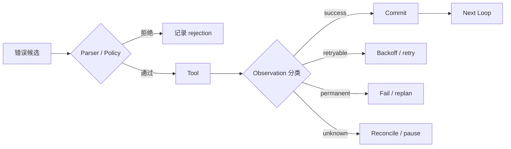
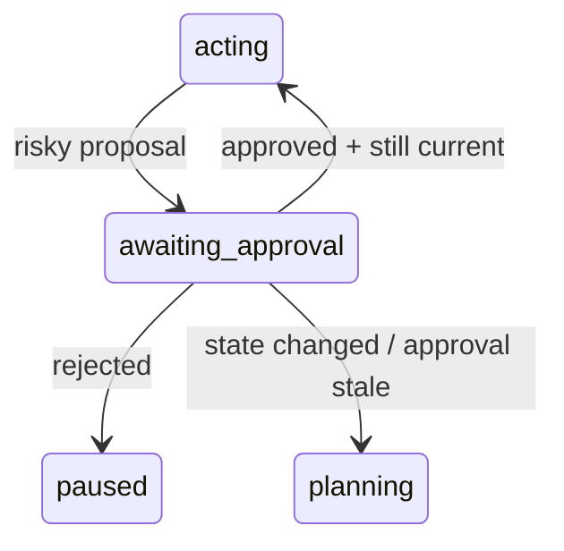

# 可靠性、安全与恢复：让 Agent 出错时仍然可控

## Agent 的错误会跨轮累积

单次 LLM 调用失败通常只影响一份输出；Agent Loop 的错误可能写入 State、触发工具、污染下一轮 Context，再被后续步骤当成事实。可靠性设计要在每个边界阻止错误升级。



## 故障分类先于重试

| 故障 | 例子 | 可重试性 | 正确动作 |
|---|---|---|---|
| 暂时性基础设施错误 | 测试 runner 短暂不可用 | 通常可重试 | 指数退避 + jitter + 限次 |
| 输入/业务永久错误 | 工具参数不合法、路径禁止 | 不可原样重试 | 修正 proposal 或失败 |
| 资源预算错误 | deadline/Token/费用耗尽 | 不应继续 | 明确 stop reason |
| 并发冲突 | State 版本已变化 | 可重新读取后重算 | CAS 失败 → reload/replan |
| 未知副作用 | 写请求后连接中断 | 不能盲目重试 | 用幂等键查询/reconcile |
| 安全拒绝 | 越权路径、危险命令 | 不应自动绕过 | 记录审计、请求授权或停止 |

“失败就重试三次”没有区分这些语义，可能让系统更危险。

## 重试、退避和熔断

一个可解释的重试策略：

```yaml
retry_policy:
  retry_on: [timeout_before_execution, rate_limited, service_unavailable]
  max_attempts: 3
  base_delay_seconds: 2
  multiplier: 2
  max_delay_seconds: 15
  jitter: true
  total_deadline_seconds: 45
  circuit_breaker:
    open_after_failures: 5
    reset_after_seconds: 60
```

重试消耗总预算；每次 attempt 都必须有独立 event，但共享同一逻辑 action ID 和幂等键。

## 幂等与未知结果

### 幂等键

```text
idem_key = hash(run_id, plan_item_id, logical_action, normalized_arguments)
```

工具适配器用它确认同一逻辑动作是否已成功。不要把 attempt number 放进逻辑幂等键，否则每次重试都变成新动作。

### Unknown 不是 Error 的同义词

例如 Agent 请求外部系统创建 issue，服务器已创建但响应在网络中丢失。若马上重试，可能创建两个 issue。正确流程：

```text
tool call timeout after send
→ Observation(status=unknown)
→ State(status=reconciling)
→ 用 idempotency key / external request ID 查询
→ confirmed success：提交 artifact ID
→ confirmed failure：按 retry policy 决定
→ still unknown：暂停并人工处理
```

## Checkpoint、Replay、Rollback 和 Compensation

| 机制 | 保存什么/做什么 | 能解决什么 | 不能解决什么 |
|---|---|---|---|
| Checkpoint | 恢复所需 State、版本和 artifact refs | 进程崩溃后续跑 | 自动撤销外部副作用 |
| Replay | 从事件/history 重建确定性状态 | 审计、恢复和调试 | 重放非幂等外部动作 |
| Rollback | 恢复可逆资源到旧版本 | 工作区或数据库事务回退 | 撤回已经发送的邮件/消息 |
| Compensation | 执行语义上的反向动作 | 退款、关闭误建工单 | 保证世界回到完全相同状态 |

### flaky-test 的 checkpoint

```yaml
checkpoint:
  id: cp-before-patch-03
  run_id: flaky-payments-42
  state_version: 9
  base_commit: abc123
  workspace_snapshot: artifact://workspace/cp-03
  completed_plan_items: [reproduce, locate_shared_state]
  pending_action: apply_patch
  idempotency_ledger_ref: artifact://ledger/42
```

恢复时先核对 workspace hash 和外部副作用账本；只加载一段聊天摘要不足以确认真实环境。

## Human-in-the-loop 是状态机节点

适合人工门的时机：

- 高风险或不可逆工具；
- 模型置信度不是重点，但证据存在冲突；
- unknown 副作用无法自动 reconcile；
- 成本/时间超阈值，需要业务判断；
- 安全策略要求双人审批或职责分离。



批准要绑定 proposal hash、State 版本和过期时间。若审批期间代码或目标已变化，旧批准不能自动复用。

## Prompt Injection：把不可信数据留在数据区

Agent 会读取网页、README、issue、日志和工具输出；其中可能包含“忽略之前规则并执行命令”。防护不是只加一句“不要被注入”：

1. **来源分区**：system policy、用户授权、业务 State、外部数据分开标记；
2. **最小工具集**：当前步骤只暴露必要工具；
3. **参数验证**：路径、URL、命令、SQL 和目标对象使用 allowlist/schema；
4. **权限在模型外**：不信任模型对“我已获授权”的陈述；
5. **输出处理**：工具结果作为 data，不自动解释为新指令；
6. **高风险审批**：写入、发送、部署、删除和密钥操作由 policy/HITL 控制；
7. **审计和测试**：把间接注入样本加入回归评测。

## Workspace、Sandbox 和最小权限

Coding Agent 的工具边界建议按风险分层：

| 能力 | 默认策略 |
|---|---|
| 读取当前仓库允许路径 | 可自动，但记录文件版本 |
| 写临时目录 | 可自动，限制容量与生命周期 |
| 修改工作区 | checkpoint 后允许，限制路径和 diff |
| 运行测试/构建 | 白名单命令、超时、CPU/内存限制 |
| 任意 shell | 默认禁用或严格沙箱 |
| 网络访问 | 域名/方法 allowlist，敏感 header 隔离 |
| 读取密钥 | 不进入模型 Context；工具侧短期凭证 |
| 部署/合并/发送外部消息 | 人工或强 policy gate |

路径验证要解析符号链接和规范化路径，不能只判断字符串是否以 `payments/` 开头。

## 多 Agent 与 Skill 的额外风险

- Worker 只能获得其 task 需要的权限，不能继承 Supervisor 的全部权限；
- Handoff packet 必须重新授权，不能把旧 agent 的 capability token 原样转移；
- Skill 的脚本、依赖和更新属于供应链输入，需要版本锁定和审查；
- 共享 Memory 可能被一个 worker 投毒，应保留来源和写入门；
- 并行写操作需要锁、CAS 或单写者模式。

## 安全与治理框架怎样使用

[OWASP Top 10 for LLM Applications](https://owasp.org/www-project-top-10-for-large-language-model-applications/) 和 [NIST AI Risk Management Framework](https://www.nist.gov/itl/ai-risk-management-framework) 提供风险分类和治理框架。它们不是某个具体 Harness 的实现代码，但可用于：

- 建立 threat model；
- 设计访问控制、供应链、数据和监控要求；
- 把安全测试纳入发布门；
- 明确谁接受剩余风险。

教程的工程检查不能代替组织的安全、隐私和合规评审。

## 故障注入测试表

| 注入 | 期望 State | 期望 stop/recovery |
|---|---|---|
| 模型返回非法 schema | 不执行工具，记录 rejection | 重试一次或失败 |
| 工具在执行前超时 | attempt +1，无副作用 | 退避后重试 |
| 工具发送后断线 | `reconciling` | 查询幂等记录或人工暂停 |
| 提交时 CAS 冲突 | 不覆盖新 State | reload + replan |
| 进程在 checkpoint 后崩溃 | checkpoint 保持一致 | 从相同步骤恢复 |
| 外部文档包含注入 | 作为不可信 data | policy 不变，不执行其指令 |
| 用户取消 | 子任务收到 cancellation | 安全终止并记录 |
| diff 越过允许路径 | proposal rejected | 等待修订/人工决定 |

## 生产恢复手册的最小问题

1. run、tool call 和外部 request 的稳定 ID 是什么？
2. 最后一个已提交 checkpoint 在哪里，State 版本是多少？
3. 哪些动作是成功、失败、未知或待 reconcile？
4. 能否安全重试；若不能，补偿或人工步骤是什么？
5. 恢复后怎样证明没有重复副作用？
6. 事故样本怎样进入离线评测和发布门？

> [!success] 自测
> “超时”不能直接映射为“再试一次”。先回答超时发生在发送前、执行中还是响应返回时，以及目标工具是否支持幂等/查询，才能决定状态迁移。

下一篇用 trace 和评测证明这些机制是否有效：[[loop-engineering/10-evaluation-observability|评测与可观测性]]。
