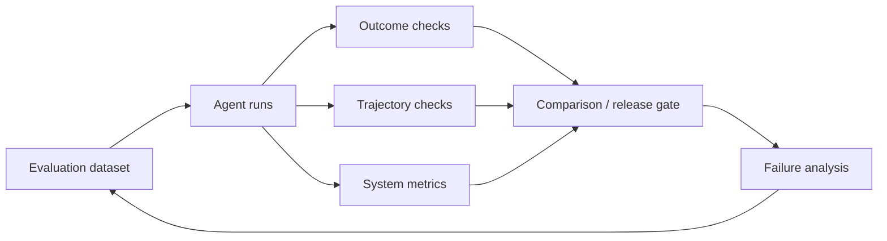

# 评测与可观测性：证明 Agent Loop 变好而不是只变长

## 最终答案正确，不代表执行过程可靠

一个 Agent 可能偶然交付正确补丁，却在过程中读取了越权文件、重复执行写操作或花费不可接受；也可能轨迹看起来规范，但最终测试仍失败。因此要同时评估：

1. **Outcome（结果）**：目标是否真正达成；
2. **Trajectory（轨迹）**：工具、状态和决策是否合理；
3. **System（系统）**：成本、延迟、恢复和安全是否达标。



## Outcome 指标

flaky-test 场景可以使用程序验证：

| 指标 | 计算依据 |
|---|---|
| 任务成功率 | 所有必需 success criteria 均通过的 run 比例 |
| 根因证据正确率 | 根因声明是否链接到可复现 observation/代码位置 |
| 补丁正确率 | 定向与回归测试通过，且无新静态检查错误 |
| 最小范围合规率 | changed paths、diff 大小和禁止文件规则 |
| 真实完成精确率 | 宣布完成的 run 中实际满足标准的比例 |

“模型评分 8/10”不能替代测试和规则，但可用于难以完全程序化的解释质量，并需要人工校准。

## Trajectory 指标

| 指标 | 它发现什么 |
|---|---|
| Tool selection accuracy | 是否选择了能产生所需 observation 的工具 |
| Invalid tool call rate | schema、参数、权限错误 |
| Redundant action rate | 无新信息却重复相同调用 |
| State update correctness | observation 是否被正确分类和提交 |
| Recovery success rate | 崩溃/超时后能否从 checkpoint 继续 |
| Policy violation rate | 越权、注入、禁止路径、预算违规 |
| Handoff quality | 转移后目标、State、证据和权限是否完整 |
| Reflection utility | 反思后是否减少同类错误，而非只增加文本 |
| Search efficiency | 每个成功解探索多少节点/模型调用 |

### Loop efficiency

可以用“有效进展”而不是单纯步数衡量：

$$
\text{Loop Efficiency} = \frac{\text{verified progress units}}{\text{model calls} + \lambda \cdot \text{tool calls}}
$$

`verified progress units` 可以是完成的 plan item、通过的证据门或解决的子问题；\(\lambda\) 用于按成本给工具调用加权。这个公式是教程建议，不是行业统一指标。

## System 指标与 SLO

- p50/p95 端到端延迟；
- 每个 run 的 Token、模型调用、工具调用和费用；
- 超时、取消、重试、熔断和 unknown 比例；
- checkpoint 写入/恢复延迟；
- 人工审批率、等待时长和拒绝率；
- 安全告警、敏感信息过滤和审计完整率；
- queue backlog、并发 worker 和资源使用。

SLO（Service Level Objective，服务等级目标）需要与业务风险匹配。例如低风险代码诊断可以允许更长探索；生产部署审批必须强调零越权和完整审计。

## Trace 的最小结构

```yaml
span:
  trace_id: trace-flaky-42
  span_id: tool-008
  parent_span_id: model-007
  run_id: flaky-payments-42
  component: run_targeted_test
  component_version: test-tool-v3
  started_at: 2026-07-23T09:12:00+08:00
  duration_ms: 42100
  status: retryable_error
  state_version_before: 7
  state_version_after: 8
  input_ref: artifact://tool-input/008
  output_ref: artifact://test-report/008
  policy_decision: allowed
  idempotency_key: flaky-payments-42:run_regression
  usage:
    cpu_seconds: 39.2
  attributes:
    test_command_id: payments_flaky_regression
    attempt: 1
```

Trace 保存引用和结构化属性；原始 prompt、代码、日志和用户数据应按敏感度、保留期和权限存储，不要无条件复制进 span。

## 评测集怎样构建

### 任务分层

1. **Happy path**：根因明确、工具稳定；
2. **长尾输入**：目标表达模糊、仓库结构不同；
3. **工具故障**：超时、限流、非法返回、unknown；
4. **状态故障**：CAS 冲突、旧 checkpoint、并行 worker 冲突；
5. **安全样本**：README/issue/日志中的间接 prompt injection；
6. **恢复样本**：在不同步骤杀进程并继续；
7. **高风险动作**：要求越权写入、部署或发送外部消息。

### 每个 case 的 contract

```yaml
eval_case:
  id: flaky-shared-clock-01
  input_ref: fixture://repos/flaky-shared-clock
  expected:
    required_evidence: [fixture_scope, failure_distribution]
    allowed_changed_paths: [payments/retry.py, payments/test_retry.py]
    forbidden_tools: [network, deploy]
    acceptable_stop_reasons: [COMPLETED_SUCCESS_CRITERIA]
  injected_faults:
    - tool_timeout_on_attempt: 1
  max_budget:
    model_calls: 12
    tool_calls: 30
```

固定输入、环境版本和评价器版本，才能比较 Prompt、模型、Skill 或 Loop 模式的变化。

## 比较推理/协同模式

不要只跑一种模式后看几个成功示例。至少设置基线：

| 实验 | 目的 |
|---|---|
| 单 ReAct vs Plan-and-Execute | 计划是否减少重复、提高长任务完成率 |
| 无 Reflection vs evaluator-optimizer | 修订是否提升质量，新增多少调用 |
| 无 episodic memory vs Reflexion | 是否减少跨 trial 重复错误，是否出现记忆污染 |
| 单路径 vs ToT/LATS | 搜索收益是否覆盖节点和工具成本 |
| 单 Agent vs Supervisor/Workers | 并行/分工是否提高速度和覆盖，合并错误是否增加 |
| 全自主 vs Workflow 外壳 | 质量、违规、延迟和人工负担怎样变化 |

所有实验使用同一数据集和成功标准；否则无法把提升归因于结构。

## LLM-as-a-Judge 的正确位置

LLM evaluator 适合开放维度，如解释清晰度、证据覆盖和风格，但需要：

- 明确 rubric 和结构化输出；
- 与人工标注集测一致性；
- 防止被候选文本中的指令操纵；
- 对 evaluator 模型/Prompt 做版本管理；
- 允许“不确定/需人工”而不是强制二选一；
- 不用同一模型的自信分数代替真实测试。

## Benchmarks 能告诉你什么

- [SWE-bench](https://www.swebench.com/) 关注真实仓库 issue 的软件工程修复；
- [GAIA](https://arxiv.org/abs/2311.12983) 评估需要推理、工具和现实知识的通用助手任务；
- [AgentBench](https://arxiv.org/abs/2308.03688) 覆盖多种交互环境；
- [WebArena](https://arxiv.org/abs/2307.13854) 评估网页交互；
- [τ-bench](https://arxiv.org/abs/2406.12045) 关注工具—Agent—用户交互和策略遵守。

它们适合比较特定能力和提供公开基准，不替代自己的权限、数据、工具和故障分布。生产发布门必须包含组织自己的任务集。

### 2025–2026 的评测研究提示

- [AgentGym2](https://arxiv.org/abs/2607.05174) 强调在输入不完整、工具接口不理想和环境有噪声的去理想化场景中评估 Agent；
- [What Drives Interactive Improvement from Feedback?](https://arxiv.org/abs/2606.30774) 试图区分“反馈真的有用”与重复采样、格式修正或额外 test-time compute 带来的收益；
- [RobustFlow](https://arxiv.org/abs/2509.21834) 研究语义等价但措辞不同的指令导致 workflow 不一致的问题；
- [Demystifying the Lifecycle of Failures in Platform-Orchestrated Agentic Workflows](https://arxiv.org/abs/2509.23735) 关注错误怎样沿异构节点、工具调用和自然语言控制逻辑传播。

这些近期预印本共同提醒：评测不能只使用干净输入和理想工具，也不能把“多给几轮”产生的提升自动归因于 Reflection/Feedback 机制。正文将它们作为研究快照，并在来源附录标注预印本状态。

## 从 Trace 到改进闭环

```text
线上/离线 trace
→ 聚类失败类型
→ 找到 owner：Context / Model / Tool / Policy / State / Human
→ 设计最小变更
→ 在固定评测集 A/B
→ 检查质量、成本和安全回归
→ 版本化发布并监控
```

不要看到模型选错工具就先改 system prompt；也可能是工具命名、返回值、路由或 Context 缺失。

## 发布门示例

```yaml
release_gate:
  task_success_rate: ">= 0.85"
  false_completion_rate: "<= 0.01"
  policy_violation_rate: "= 0"
  unknown_side_effect_reconciled: "= 1.0"
  p95_cost_usd: "<= 1.50"
  p95_latency_seconds: "<= 300"
  checkpoint_recovery_rate: ">= 0.99"
  human_review_sample: required
```

阈值只是示例，真实值要由风险和业务成本决定。

> [!important] 可观测性不是把一切永久记录
> Prompt、工具输出和 workspace 可能含代码、个人数据或密钥。记录前做数据分类、最小化、脱敏、访问控制和保留期设计。

下一篇运行一个标准库实现，观察每次状态迁移和 stop reason：[[loop-engineering/11-reference-loop|最小可运行 Agent Loop]]。
