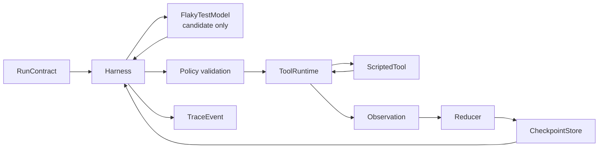

# 最小可运行 Agent Loop：用 Python 看见状态、工具、反馈和停止

> [!abstract] 学习终点
> 运行本章代码后，你应能从 trace 中指出：模型在哪里提出候选，Harness 在哪里检查权限，工具结果怎样变成 observation，State 如何用 CAS 提交，以及审批、unknown、预算和崩溃恢复为什么是不同的停止路径。

## 文件与运行方式

- [[loop-engineering/reference_loop.py|reference_loop.py]]：标准库实现；
- [[loop-engineering/test_reference_loop.py|test_reference_loop.py]]：7 个故障与恢复测试。

从仓库根目录运行：

```bash
python3 loop-engineering/reference_loop.py
python3 -m unittest -v loop-engineering/test_reference_loop.py
```

或进入目录后运行：

```bash
cd loop-engineering
python3 reference_loop.py
python3 -m unittest -v test_reference_loop.py
```

不需要 API key、第三方包或真实仓库。模型、测试 runner 和补丁工具都是确定性 fake；这样可以把注意力放在 Loop contract，而不是供应商 SDK。

## 参考实现的边界图



对应代码中的核心接口：

| 类/接口 | 职责 | 不负责什么 |
|---|---|---|
| `RunContract` | 工具、路径、审批、预算和回归阈值 | 不保存当前进度 |
| `RunState` | 当前版本、步骤、finding、observation 和 stop reason | 不自行执行动作 |
| `ModelAdapter` | 根据 State 生成 `ActionProposal` | 不授权、不执行、不提交 |
| `ToolRuntime` | 调用注册工具并维护幂等账本 | 不决定业务完成 |
| `CheckpointStore` | 加载与 CAS 提交 State | 不保存所有大 artifact |
| `Harness` | 控制 Loop、policy、执行、reduce、stop | 不代替领域工具和真实 verifier |

## Happy path 怎样运行

`FlakyTestModel` 按已完成步骤提出候选：

```text
run_baseline
→ inspect_fixture
→ apply_patch
→ run_regression
→ finish proposal
```

每一步仍要经过 Harness：

1. 读取 checkpoint；
2. 检查步数、模型调用和工具调用预算；
3. 模型返回带 `state_version` 的候选；
4. 检查工具、路径、审批和版本；
5. 生成稳定幂等键并执行；
6. 把结果分类为 observation；
7. Reducer 更新 finding、完成步骤或错误状态；
8. `compare_and_commit` 把版本加一；
9. 模型请求 `finish` 后，Harness 独立运行 completion audit。

### 最终成功条件

代码中的 `_success_criteria_met()` 要求：

- 基线确实出现过失败；
- fixture scope 与根因假设一致；
- patch 有 artifact ID；
- 回归运行次数达到 contract 阈值；
- 回归失败数为 0；
- changed paths 非空且全部在允许范围。

因此 `finish` 只是候选。缺少任一项会得到 `FAILED_PREMATURE_FINISH`，不会把模型的完成声明直接当成事实。

## 为什么 proposal 带 State version

```python
ActionProposal(
    action_id="apply-minimal-patch",
    state_version=state.version,
    tool="apply_patch",
    arguments={"paths": ["payments/retry.py"]},
    reason="Apply the smallest patch supported by evidence.",
)
```

如果另一个 worker 或用户在模型生成后更新了 State，旧 proposal 会被拒绝。这个检查避免“基于旧目标/旧文件版本的动作”覆盖新事实。

## 权限门怎样阻止写操作

`RunContract.approval_required_for` 默认包含 `apply_patch`。若 Harness 没有收到批准：

```text
proposal(apply_patch)
→ ApprovalRequired
→ State.status = paused
→ pending_approval = apply_patch
→ stop_reason = paused_for_human
→ tool execution_count 仍为 0
```

测试 `test_missing_approval_pauses_before_write_tool_executes` 验证了“先暂停、后执行”，而不是执行后再通知人。

## 结果分类与恢复路径

### Retryable error

`ScriptedTool` 可以先返回 `RETRYABLE_ERROR`，下一次再成功。Harness 增加 retry count；超过 `max_retries_per_action` 才停止。可重试结果不写入幂等成功账本，因为 fake tool 声明没有提交持久副作用。

### Unknown result

`UNKNOWN` 会被写入幂等账本并暂停为 `PAUSED_UNKNOWN_SIDE_EFFECT`。这阻止重启后盲目再次执行逻辑动作。生产实现应调用查询/reconcile API 确认结果。

### CAS conflict

测试 `ConflictOnceStore` 在工具成功后模拟另一个执行者抢先提交：

```text
tool success
→ CAS conflict，当前 observation 尚未进入 State
→ Harness reload + replan
→ 得到同一 action_id / idempotency key
→ ToolRuntime 返回 ledger 中的 replayed result
→ 新 observation 提交成功
```

真实工具若没有幂等支持，CAS 重试仍可能重复副作用；参考实现通过 ledger 展示需要的语义，而不是声称内存字典足以生产使用。

## 7 个测试分别证明什么

| 测试 | 证明的 invariant |
|---|---|
| happy path | 只有完成审计通过才成功 |
| missing approval | 未批准的写工具不会执行 |
| retryable failure | 可重试错误有限重试并保留 observation |
| unknown side effect | 未知结果进入 reconcile/pause，不盲重试 |
| budget exhaustion | 预算停止不能冒充成功 |
| restart from checkpoint | 新 Harness 从已提交 State 继续，不重复已完成工具 |
| CAS conflict | 并发冲突后重载，并用幂等账本复用结果 |

## 教学实现刻意省略了什么

| 省略项 | 生产替换 |
|---|---|
| 内存 StateStore | PostgreSQL、框架 checkpointer 或 durable workflow history |
| 内存幂等 ledger | 与外部 API/数据库事务绑定的持久幂等记录 |
| Fake model | 带结构化输出/schema 的模型适配器 |
| ScriptedTool | 沙箱、MCP/函数工具、认证、超时、取消和 artifact 存储 |
| 固定计划 | Planner/Replanner 或受控图节点 |
| 内存 trace | OpenTelemetry/观测平台，带脱敏和保留策略 |
| 单进程 | 队列、worker lease、取消传播和并发控制 |

关于 StateStore 和恢复的完整讨论见 [[memory-and-state/10-reference-implementation|Memory 与 State 参考实现]]；本章只演示 Harness 怎样调用这些接口。

## 三个升级练习

### 练习一：恢复人工审批

添加 `resume_with_approval(run_id, proposal_hash)`：核对 pending approval、State 版本和过期时间，再把状态从 `paused` 恢复为 `running`。不要只把工具名加入集合后从头重跑。

### 练习二：加入 rollback tool

在 `apply_patch` 后保存 workspace snapshot；若 post-validation 发现 changed path 越界，调用受控 rollback，并把“尝试过越权写入”和“已回退”都保留为事件。

### 练习三：替换 Planner

让模型输出结构化 plan items，但保留 `_validate`、`ToolRuntime`、Reducer、CAS 和 completion audit。比较固定模型与 Planner 的成功率、调用数和重复动作。

> [!important] 替换模型不应绕过 Harness
> 接入任何 SDK 时，都先把它适配到 `ModelAdapter.propose()`。如果 SDK 同时自带工具执行、session 或 handoff，要明确哪一层拥有最终 State 和权限，避免两个 runtime 同时控制 Loop。

最后回到 [[loop-engineering/00-overview|总览]] 的六个完成问题，并在 [[loop-engineering/99-sources|资料与来源]] 中核对哪些设计来自论文、官方文档或本教程的工程推导。
