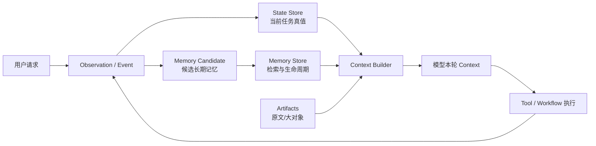

# Agent Memory 与 State 管理：让 Agent 记得对、做得完、断了还能继续

> [!abstract] 学习终点
> 读完本系列，你应该能从一次真实 Agent 请求出发，说明信息如何在 context、state、memory、artifact 和 storage 之间流动；能为一个可恢复的 Agent 设计数据模型、读写路径、并发与恢复策略；能解释 LangGraph、OpenAI Agents SDK、Google ADK、Mem0、Zep、Letta 和 Temporal 等方案分别解决哪一层问题。

## 先从一个“记住了，却做错了”的 Agent 开始

我们贯穿使用一个研究 Agent。用户给它一个长任务：

> 收集三家供应商的最新价格和可靠性资料，比较后生成报告。记住我偏好的表格风格；不要发送任何邮件；如果执行中断，从上次已验证的步骤继续。

任务可能持续数小时，期间会发生：

- 用户在第二轮把“按美元”改成“按人民币”；
- Agent 查到一份旧价格表，又检索到当前版本；
- 两个只读检索 worker 并行返回结果；
- 报告生成到一半进程崩溃；
- 一次供应商 API 超时，实际结果未知；
- 用户新开一个 conversation，但仍希望沿用已确认的写作偏好。

如果只把每轮消息追加到 prompt，会出现三个看似矛盾的结果：它记得了很多，却把旧价格当当前价格；它知道要生成报告，却不知道已经完成了哪些步骤；它在重启后重新发送了一个可能已经成功的外部请求。

问题不是“模型的记忆容量不够”这么简单，而是系统没有区分不同类型的信息，也没有规定谁有权写回。

## 四层地图：同一个“记住”其实是四件事

| 层 | 人话问题 | 研究 Agent 例子 | 是否是权威事实 |
|---|---|---|---|
| **Context** | 这一次模型调用实际看到了什么？ | 当前问题、选中的价格片段、下一步动作 | 只是本轮输入视图 |
| **State** | 当前任务做到哪里、什么现在为真？ | `current_step=compare_prices`、已验证供应商 A | 是，必须由程序校验和提交 |
| **Memory** | 未来任务值得再次取用什么？ | 用户确认的报告格式、项目长期采购规则 | 取决于来源、scope 和时效 |
| **Artifact / Event** | 发生过什么、原文在哪里？ | API 响应、测试报告、旧价格表、事件日志 | 是审计/回查依据，不等于当前值 |

这些层可以共用 PostgreSQL、Redis 或对象存储，但**不能共用语义**。把 state 当成向量记忆，会失去版本和事务；把所有 memory 当成当前指令，会把旧偏好提升成权限；把完整 event log 每轮塞给模型，会浪费窗口并放大冲突。



## 主线的因果链

```text
单次调用只能看到有限 context
→ 多轮与长任务会丢失目标、约束和进度
→ 把当前任务的可验证事实建模为 State
→ 把跨任务、可复用但可能过期的信息建模为 Memory
→ 用 Event / Artifact 保存发生过的原始依据
→ 每轮只投影必要信息进入 Context
→ 执行后验证 observation，再原子提交 State 和副作用记录
→ 崩溃时从 checkpoint 或 event 重建，而不是让模型猜“上次做到哪儿”
```

## 这套系列和仓库已有内容怎样分工

本系列假设你已经知道：

- [[context-engineering/00-overview|Context Engineering]]：Context 是一次调用可见的信息；
- [[context-engineering/11-memory-engineering|Memory Engineering]]：memory 的来源、scope、provenance、写入门槛与遗忘；
- [[context-engineering/14-planning-context|Planning Context]]：目标、步骤、checkpoint 和完成审计；
- [[context-engineering/12-retrieval-engineering|Retrieval Engineering]]：检索候选如何进入 Context。

已有文章解决“概念和上下文管线为什么这样设计”；本系列继续解决“这些边界在生产系统中怎样落成 schema、事务、索引、恢复和运维”。如果你尚未读过前置内容，可以先读 [[context-engineering/11-memory-engineering|Memory Engineering]] 和 [[context-engineering/14-planning-context|Planning Context]]，再回到这里。

## 推荐阅读顺序

| 顺序 | 笔记 | 读完应能回答 |
|---:|---|---|
| 1 | [[memory-and-state/01-boundaries|边界与术语]] | memory、state、session、thread、checkpoint 到底分别是什么？ |
| 2 | [[memory-and-state/02-state-model|State 数据模型]] | 如何表示当前任务、事件、快照、步骤和恢复点？ |
| 3 | [[memory-and-state/03-memory-model|Memory 数据模型]] | 什么值得跨任务保存，怎样写入、检索、冲突和遗忘？ |
| 4 | [[memory-and-state/04-turn-pipeline|一次 Agent Turn 的读写管线]] | 一次请求怎样读 state/memory、执行工具并安全写回？ |
| 5 | [[memory-and-state/05-storage-architecture|存储与索引架构]] | PostgreSQL、Redis、向量库、对象存储分别放什么？ |
| 6 | [[memory-and-state/06-consistency-recovery|一致性、并发与恢复]] | 重试、崩溃、并行 worker 和外部副作用怎样不出错？ |
| 7 | [[memory-and-state/07-framework-map|主流框架映射]] | 各框架的 API 对应哪些稳定原语，怎样选？ |
| 8 | [[memory-and-state/08-security-governance|安全与治理]] | 如何防止串租户、记忆投毒、泄露和删除不完整？ |
| 9 | [[memory-and-state/09-evaluation-observability|评测与可观测性]] | 如何证明 memory/state 真正提高了成功率？ |
| 10 | [[memory-and-state/10-reference-implementation|最小参考实现]] | 如何用 SQL 和 Python 把关键接口串起来？ |
| 11 | [[memory-and-state/11-production-playbook|生产落地手册]] | 从 MVP（Minimum Viable Product，最小可行版本）到生产，每一步先解决什么？ |

## 先记住三条不能妥协的规则

> [!important] 规则一：模型不是事实数据库
> 模型可以提出候选状态更新、memory candidate 或下一步动作；程序必须验证来源、版本、权限、schema 和真实副作用，才能写回权威 State。

> [!important] 规则二：向量相似度不是事实有效性
> 向量索引适合找候选，不适合决定余额、权限、当前订单状态或任务是否完成。检索结果必须带 scope、时间、来源和冲突检查。

> [!important] 规则三：恢复不是重新提问模型
> 恢复需要稳定的 task ID、state version、checkpoint、artifact 引用和幂等记录。让模型“回忆上次做了什么”不能替代这些接口。

## 一个贯穿到最后的完成标准

当研究 Agent 最终交付报告时，系统应能回答：

1. 当前目标和用户最新约束是什么，来源是哪条事件？
2. 哪些供应商数据在当前版本和权限范围内被验证过？
3. 哪些步骤已经提交，哪些只是模型提出但未验证？
4. 如果进程在某个工具调用后崩溃，重启会从哪里继续，怎样避免重复副作用？
5. 报告中的用户偏好来自哪条长期 memory，是否仍在有效期内？

后续每一篇都只是在回答其中一个问题。读完后，回到这里检查自己是否能画出完整数据流，而不只是记住几个框架名词。

> [!success] 自测
> “用户偏好使用 Markdown 表格”应放在哪里？“本次任务已完成供应商 A 抓取”应放在哪里？“供应商 API 返回的原始 JSON”应放在哪里？如果你的答案分别涉及带 scope 的 Memory、当前 Task State、Artifact/Event，就可以进入下一篇。

下一篇先把最容易混淆的词拆开：[[memory-and-state/01-boundaries|边界与术语：Context、Memory、State 不是一回事]]。
