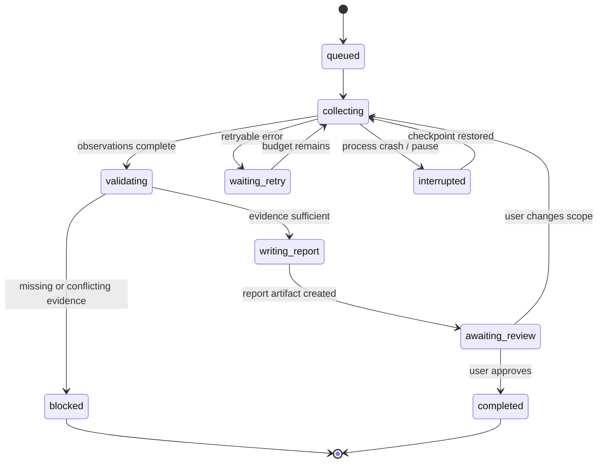

# State 数据模型：Event Log、Snapshot 与 Checkpoint

> [!abstract] 本篇学习终点
> 从研究 Agent 的一次抓取任务出发，设计一套能审计、并发更新和崩溃恢复的 State：知道为什么要同时保留 Event Log、Current Snapshot、Checkpoint 和 Artifact Reference，并能写出状态转换的不变量和恢复流程。

## State 不是一团可变 JSON

最初的原型往往这样写：

```python
state = {
    "step": "fetch_vendor_a",
    "done": ["create_report"],
    "last_result": "timeout",
}
```

它很快暴露问题：谁在什么时候写了 `done`？`last_result` 对应哪个代码版本？重试时是否已经产生副作用？如果两个 worker 同时修改，后写入的对象会不会抹掉另一条进度？

要回答这些问题，State 至少要有三种表示：

1. **Event Log**：不可变地记录每次观察和提交；
2. **Current Snapshot**：从事件物化出的快速读取视图；
3. **Checkpoint**：为中断恢复整理的最小接口，包含下一步和必要引用。

大对象（原始响应、日志、报告、diff）放在 Artifact Store，只在 State 中保存引用。

## 先定义一个可执行状态机

研究任务可以抽象为：



状态机不是为了限制模型的语言能力，而是为了让程序知道哪些转换合法。例如 `completed → collecting` 不能由普通模型输出触发，必须有用户重新打开任务或显式补充输入；`writing_report → completed` 必须有报告 artifact、质量检查和批准证据。

## Event：把“发生过什么”写成事实

一个事件要能独立解释，不依赖某个易变的自然语言摘要：

```yaml
event:
  id: evt_01J9...
  task_id: research-43
  run_id: run-7
  sequence: 38
  type: tool_observation
  actor: vendor_fetcher
  step: fetch_vendor_a
  status: retryable_error
  error:
    code: UPSTREAM_TIMEOUT
    attempts: 1
  input_ref: artifact://request-91
  output_ref: null
  observed_at: 2026-07-23T10:12:18Z
  source_version: vendor-api@2026-07-23
```

事件的 `status=retryable_error` 不能被压缩成“供应商没有数据”。它表达的是“这次观察没有得到确定结果”。如果稍后查询确认写入已经发生，新增一个 `external_state_verified` 事件，而不是修改旧事件。

## Snapshot：为当前读取物化一份视图

事件日志适合审计和重放，但每轮都从头扫描会慢。系统可以在事务中维护当前快照：

```yaml
snapshot:
  task_id: research-43
  version: 12
  status: collecting
  current_step: fetch_vendor_a
  completed_steps:
    - create_task
    - fetch_vendor_b
  pending_steps:
    - fetch_vendor_a
    - fetch_vendor_c
  unknowns:
    - vendor_a_request_outcome
  evidence_refs:
    - artifact://vendor-b-response-4
  authorization:
    send_email: false
  budgets:
    attempts_remaining: 2
    deadline: 2026-07-23T12:00:00Z
  last_event_id: evt_01J9...
```

`version` 是乐观并发控制的依据。worker 读取版本 12 后提交时，只有数据库里的版本仍为 12 才能写成 13；否则说明有人先更新，当前 candidate 必须重新基于新快照计算。

## Checkpoint：让下一次执行知道怎样继续

Checkpoint 不是所有事件的备份，而是恢复接口：

```yaml
checkpoint:
  task_id: research-43
  state_version: 12
  current_step: fetch_vendor_a
  completed_steps: [create_task, fetch_vendor_b]
  next_action:
    kind: query_external_status
    idempotency_key: research-43:fetch_vendor_a:v2
    rationale: 上次 timeout，先确认 unknown outcome
  evidence_refs:
    - artifact://vendor-b-response-4
  last_error:
    code: UPSTREAM_TIMEOUT
    attempts: 1
    changed_strategy: true
  workspace_or_runtime_ref: snapshot://runtime-88
  authorization:
    send_email: false
```

恢复时重新验证 `task_id`、`state_version`、授权、当前代码/配置和外部服务。Checkpoint 中保存的“当前步骤”不是对现实的冻结；它只是告诉系统从哪个接口开始重新观察。

## Artifact Reference：不要把大对象塞进 State

原始 JSON、PDF、完整日志和生成报告应放在对象存储或 artifact 服务中：

```yaml
artifact:
  id: artifact://vendor-a-response-17
  media_type: application/json
  sha256: ...
  source: vendor-api
  observed_at: 2026-07-23T10:14:03Z
  task_scope: research-43
  sensitivity: internal
  retention_until: 2026-10-23T00:00:00Z
```

State 只引用 `artifact_id` 和需要的 evidence span。这样可以控制 token、支持按权限重新读取，也能在删除请求时追踪派生索引和摘要。

## 一次合法状态转换

把“模型建议”变成“State 事实”要经过程序边界：

```text
读取 snapshot(version=12)
→ 选择本轮 step 与 Context
→ 模型提出 candidate_update
→ 校验 schema、evidence refs、权限和不变量
→ 执行工具并获取真实 observation
→ 在同一事务中 append Event + 更新 Snapshot(version=13)
→ 生成新的 Checkpoint / trace
```

一个简化的不变量集合：

- `completed_steps` 中的每项都有成功 observation 或批准的 artifact 引用；
- `current_step` 不得同时出现在 `completed_steps` 和 `pending_steps`；
- `status=completed` 时所有 success criteria 都有 evidence；
- 高风险副作用必须有匹配的 authorization event；
- 每个外部写入都有 idempotency key 和最终状态核对记录；
- State 的 `last_event_id` 必须指向同一事务刚写入的事件。

不变量应由代码和数据库约束检查，而不是只写在 prompt 里。

## 崩溃恢复：三种失败位置

### 1. 工具调用前崩溃

Checkpoint 仍指向 `fetch_vendor_a`。恢复时可以安全发起调用，但要重新检查预算和授权。

### 2. 工具调用中超时

结果是 unknown，不是失败或成功。恢复动作应先用 idempotency key 查询外部状态；如果供应商不支持查询，进入人工复核或补偿流程。

### 3. 工具成功后、State 提交前崩溃

这是最危险的窗口。恢复时不能盲目重发。应：

1. 用幂等键查询外部系统；
2. 找到已完成结果就追加 `external_state_verified` 事件；
3. 没有结果且接口保证幂等时才重试；
4. 无法确定时停在 `blocked/needs_review`，而不是猜。

## Event Log、Snapshot 与 Event Sourcing 的边界

Event Sourcing 指把事件作为主要事实来源、从事件重建状态；Snapshot 是加速重建的物化点。普通 Agent 不一定要完整采用 Event Sourcing：

- 低风险聊天可以只保留 session items + 定期 snapshot；
- 需要审计、回放和高价值副作用的任务，才值得追加不可变事件和重放逻辑；
- 无论采用哪种程度，都应保留足够的来源、版本、状态转换和幂等信息。

Temporal 的 Event History、LangGraph 的 checkpoint、数据库的 append-only event table 都是不同实现，但共同目标是让执行从外部可验证记录恢复，而不是依赖模型回忆。

## 并行 worker 的 State 合并

两个只读 worker 可以同时抓取供应商 B、C，但不能同时覆盖同一个 `completed_steps` 数组。可选策略：

- 每个 worker 写独立 child run/event，父任务在汇总步骤按 evidence refs 合并；
- 对集合使用追加事件，再由 reducer（确定性的合并函数）生成 snapshot；
- 对同一字段使用 compare-and-set，冲突时重新读取并让模型解释，而不是 last-write-wins 静默覆盖。

并行不是“多开几个模型”这么简单；它要求输入、输出、权限和合并契约都隔离。

> [!tip] 什么时候用 workflow engine
> 如果任务需要跨小时/天等待、定时器、人工批准、重试和大量副作用，Temporal 等 durable execution 平台可以承担事件历史、重放和任务队列。若只是短对话的消息连续性，数据库 session 或框架 checkpointer 通常更简单。

## 与已有 Planning Context 的关系

[[context-engineering/14-planning-context|Planning Context]] 已解释 objective/outcome/phase/step/checkpoint 的认知结构；本篇补的是存储和一致性：版本、事件、artifact、事务、幂等和恢复窗口。下一篇转向另一个问题：哪些信息不属于当前 State，却值得跨任务保存。

> [!success] 自测
> 一个外部“创建订单”请求返回 timeout。你会把 State 标成 `failed`、`completed` 还是 `unknown`？恢复时第一步查什么？如果答案是记录 unknown event、用 idempotency key 查询真实状态，并在确认后再提交 snapshot，说明你已经在用 State 思维。

下一篇：[[memory-and-state/03-memory-model|Memory 数据模型：什么值得留下，怎样遗忘]]。
