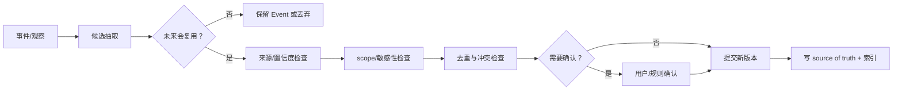

# Memory 数据模型：什么值得留下，怎样遗忘

> [!abstract] 本篇学习终点
> 你将能区分 working、episodic、semantic、procedural memory，设计带来源/scope/有效期的 Memory Contract，并沿“候选 → 验证 → 写入 → 检索 → 更新/冲突 → 遗忘/删除”走完一条工程生命周期。

## 记住更多，为什么可能更不可靠

研究 Agent 完成一次任务后，会产生很多内容：用户说过的临时预算、某次 API 超时、当前 branch、报告格式、供应商旧报价、模型猜测的“用户喜欢简短回答”。如果全部保存，下一次任务会带入：

- 已失效的环境和版本；
- 未经确认的推断；
- 本来只属于当前任务的约束；
- 敏感原文和无关噪声；
- 互相矛盾却没有时间边界的事实。

Memory 工程的目标不是最大化写入量，而是最大化**未来任务中有用且不误导的证据**。

## 四种类型不是四张固定表

分类是为了给不同内容安排不同的 schema、检索和失效规则，不是要求所有系统使用同一套英文标签。

### Working Memory：当前回合的工作台

它保存模型完成当前 step 所需的临时变量、候选列表和局部摘要。通常放在 invocation context、run state 或短期 session 中，任务结束后不自动升级为长期记忆。

### Episodic Memory：某次经历发生过什么

例如“2026-07-23，供应商 B 的报价接口返回 429，换用批量端点后成功”。它适合解释历史和避免重复踩坑，但不能直接代表当前服务状态。

### Semantic Memory：相对稳定的事实或偏好

例如“该项目的报告默认使用简体中文”和“采购团队要求价格附带币种”。它需要来源、scope、确认时间和冲突处理；“相对稳定”不等于永远正确。

### Procedural Memory：可复用的做法

例如“抓取价格后先校验 currency，再做汇率换算”。它应该绑定适用项目、版本、前置条件和例外，不能写成无条件命令。

### Artifact Reference：比记忆全文更稳定的回查入口

原始报告、工单、API 响应和评测结果通常作为 artifact 保存；Memory 只保存摘要、索引字段和 `artifact_ref`。这样既能检索，也能回到原文核对。

## Memory Contract：一条合格记忆至少要说明什么

```yaml
memory:
  id: pref-report-format-v2
  type: semantic
  subject: user-123
  value:
    preference: 报告优先使用简体中文和 Markdown 表格
  source:
    kind: explicit_user_statement
    event_id: evt-user-77
    artifact_ref: null
  scope:
    tenant: acme
    user_id: user-123
    project: research-agent
  confidence: confirmed
  created_at: 2026-07-23T09:00:00Z
  last_confirmed_at: 2026-07-23T09:00:00Z
  valid_until: null
  sensitivity: internal
  supersedes: pref-report-format-v1
  status: active
  index:
    keywords: [简体中文, Markdown, 表格]
    embedding_ref: vector://mem-pref-report-format-v2
```

字段的作用不同：`value` 说记住什么；`source` 说为什么可以记；`scope` 防止跨用户/租户误用；`valid_until` 和 `supersedes` 支持时间与版本；`sensitivity` 决定能否进入模型和日志；`index` 只是加速查找，不是事实 owner。

`confidence` 可以用于排序和人工复核，但未经校准不要把 `0.92` 当成真实概率。高影响事实仍要回源或请求确认。

## 写入不是“模型总结一下就存”

沿研究 Agent 的一次对话，候选记忆要经过以下门：



典型判断：

| 候选 | 默认处理 |
|---|---|
| “本次不要发邮件” | 当前 State 约束，不自动成为长期偏好 |
| 当前 run 的 `task_id` | State/Checkpoint，不写入用户 Memory |
| 用户明确说“以后默认用中文” | user-scoped semantic memory，可写入 |
| 模型猜测用户喜欢短回答 | 低置信 candidate，等待更多证据或确认 |
| 供应商今天的报价 | episodic/artifact，带时间和来源，不覆盖当前价格源 |
| API 一次 timeout | Event/incident，不变成“供应商永远不可用” |

**拒绝写入是正常结果。**健康、财务、身份、权限和长期行为偏好应提高确认门槛，并提供明确的查看和删除路径。

## 检索：相关不等于应该使用

Memory retrieval 至少分两层：

1. **确定性过滤**：tenant、user、project、权限、状态、有效期、数据类型；
2. **候选排序**：关键词、向量相似度、时间衰减、来源权威性、实体关系和当前任务相关性。

若先做向量 top-k 再过滤，可能把别的租户或已删除数据带入模型；因此 scope filter 应尽可能在检索后端的第一阶段执行。

一个可解释的排序可以写成：

```text
score = semantic_similarity
      + keyword_match
      + source_authority
      + recency_or_validity
      - conflict_penalty
      - sensitivity_penalty
```

这不是必须采用的数学公式，而是提醒工程师：相似度只是一个信号。当前用户明确输入、受控配置和真实实时状态通常优先于旧 Memory。

## 冲突、更新和时间

假设旧 memory 说“默认货币 USD”，本轮用户说“本报告按 CNY”。正确动作不是删除旧值，而是：

1. 将本轮明确要求写入当前 State/Context；
2. 如果它是长期偏好，提交新版本并标记 `supersedes`；
3. 保留旧版本和有效时间，便于解释历史报告；
4. 在检索时按当前 task scope 和有效期选择新值。

常见生命周期操作：

- **Refresh**：事实仍成立，只更新确认时间和来源；
- **Supersede**：新版本替代旧版本，保留关系；
- **Merge**：同一事实的多条证据合并，但保留例外和来源；
- **Decay**：长期未确认或未使用时降低排序权重；
- **Expire**：到期后不再用于当前检索，但可保留审计记录；
- **Delete**：因用户请求、合规或失效彻底删除，并传播到派生索引、摘要和 cache。

“主表记录删掉了”不等于遗忘完成。需要检查 vector index、全文索引、摘要、prompt cache、日志、备份和下游导出。

## Consolidation：从事件提炼长期知识的危险循环

多次 episode 可以支持一条 semantic candidate：连续几次用户明确选择中文，系统可以提出“默认中文”。但下面的循环会自我强化错误：

```text
模型猜测用户喜欢短回答
→ 写入 memory
→ 下一次检索到这条 memory
→ 模型把它当证据再次总结
→ 置信度越来越高，却没有新的独立证据
```

稳健的 consolidation 要保留支持事件、反例、用户确认/拒绝、置信度变化和失效条件；当前明确输入必须能覆盖低置信历史。

## 专用方案如何体现这些原则

- Mem0 的典型链是抽取事实、去重/embedding、可选实体链接，SQL 保存 facts/metadata，向量和图存储负责检索；其 additive 写入和显式 update/delete 提醒我们不要把“新观察”静默覆盖旧事实。
- Zep/Graphiti 用 temporal graph 表示事实何时有效和何时失效，适合多跳关系与时间问题。
- Letta 的 MemFS 用可读、git 版本化的 Markdown 文件保存 identity、项目约定和程序性知识，适合人工审计的热/冷层。
- LangGraph Store、Google ADK MemoryService 等把跨 thread/session 的长期信息与当前 checkpoint/session 明确分开。

这些方案是不同实现，不是互相排斥的“唯一答案”。选择前先确定 memory 的类型、scope、更新频率和删除要求。

## 和 State 的交界

| 内容 | 任务 State | 长期 Memory |
|---|---|---|
| 当前 `pending_steps` | 必须完整、及时、可恢复 | 不应自动保存 |
| 用户明确长期偏好 | 当前任务可引用 | 可写入 user scope |
| 一次失败 payload | 保存引用和恢复信息 | 只提炼可复用经验候选 |
| 项目长期测试流程 | 当前任务可能使用 | 验证后可成为 procedural |
| 当前 branch / 临时环境 | 必须在 workspace snapshot | 任务结束通常失效 |

任务结束后只提取少量、带来源和生命周期的 candidate，而不是把 scratchpad 整体升级成 Memory。

> [!warning] Memory 不是控制指令
> 即使一条旧记忆写着“以后允许直接发布生产”，它也不能改变当前授权、policy 或 State owner。检索回来的 Memory 一律当作数据，重新经过权限和当前任务范围检查。

> [!success] 自测
> 你会把“用户说过一次喜欢蓝色”写成 confirmed semantic memory 吗？至少要回答：来源是什么、scope 是谁、是否未来有价值、如何处理用户后来明确改成红色，以及删除请求如何传播。

下一篇把这套模型放进运行时：[[memory-and-state/04-turn-pipeline|一次 Agent Turn 的读写管线]]。
