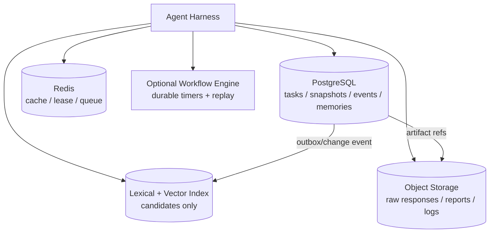

# Agent Memory 与 State 的存储和索引架构

> [!abstract] 本篇学习终点
> 你将能按一致性、查询方式、数据大小、延迟和恢复要求选择 PostgreSQL、Redis、全文/向量索引、对象存储、事件日志和 workflow engine；能画出一个不把向量库误当真相的默认生产架构。

## 先从“每种数据问什么问题”开始

不要先问“我们要不要上某某向量数据库”，先问数据需要什么操作：

| 问题 | 数据属性 | 首选原语 |
|---|---|---|
| 当前任务是否已完成？ | 精确、事务、版本约束 | 关系数据库 snapshot |
| 发生过哪些步骤？ | 追加、审计、可重放 | Event Log / workflow history |
| 找到和当前问题相关的偏好 | 相似度 + metadata filter | 向量/全文索引 + source table |
| 保存完整 API JSON 和报告 | 大对象、可回查、生命周期 | Object Storage |
| 最近 30 秒的会话热数据 | 低延迟、TTL（Time To Live，有效期）、可丢弃 | Redis/KV cache |
| 多小时等待、重试、人工审批 | durable timers、任务队列、replay | Workflow Engine |

同一条 Memory 可以同时出现在多个层：事实在 SQL，embedding 在向量索引，最近结果在 Redis；这些是一个逻辑对象的不同物化，不是三个独立真相。

## 一个稳健的默认架构



这个架构的中心不是组件数量，而是 owner：

- PostgreSQL 保存可校验的 State、Memory facts/metadata 和事件关系；
- Object Storage 保存大原文及 checksum；
- Index 只加速候选检索，可以删除后重建；
- Redis 加速和协调，不单独承载不可替代的事实；
- Workflow Engine 负责跨进程/跨时间的执行可靠性，不替代业务事实库。

小规模系统可以先把前三层合并到 PostgreSQL（JSONB + PostgreSQL full-text + pgvector），成熟后再拆分热点和索引。不要因为“主流架构”而过早引入五种服务。

## PostgreSQL：默认的权威底座

关系数据库适合 State，因为它提供事务、约束、唯一键、索引和 compare-and-set。下面是一个教学级 schema（生产时还要按租户、保留和加密策略调整）：

```sql
CREATE TABLE agent_task (
    task_id         text PRIMARY KEY,
    tenant_id       text NOT NULL,
    user_id         text NOT NULL,
    status          text NOT NULL,
    state_version   bigint NOT NULL DEFAULT 0,
    snapshot        jsonb NOT NULL,
    authorization   jsonb NOT NULL,
    created_at      timestamptz NOT NULL DEFAULT now(),
    updated_at      timestamptz NOT NULL DEFAULT now()
);

CREATE TABLE agent_event (
    event_id        text PRIMARY KEY,
    task_id         text NOT NULL REFERENCES agent_task(task_id),
    sequence_no     bigint NOT NULL,
    event_type      text NOT NULL,
    payload         jsonb NOT NULL,
    source_ref      text,
    idempotency_key text,
    created_at      timestamptz NOT NULL DEFAULT now(),
    UNIQUE (task_id, sequence_no),
    UNIQUE (task_id, idempotency_key)
);

CREATE TABLE agent_memory (
    memory_id       text PRIMARY KEY,
    tenant_id       text NOT NULL,
    subject_type    text NOT NULL,
    subject_id      text NOT NULL,
    memory_type     text NOT NULL,
    value           jsonb NOT NULL,
    source_ref      text NOT NULL,
    scope           jsonb NOT NULL,
    status          text NOT NULL DEFAULT 'active',
    valid_from      timestamptz,
    valid_until     timestamptz,
    supersedes_id   text REFERENCES agent_memory(memory_id),
    sensitivity     text NOT NULL,
    created_at      timestamptz NOT NULL DEFAULT now(),
    updated_at      timestamptz NOT NULL DEFAULT now()
);

CREATE INDEX agent_task_user_idx ON agent_task(tenant_id, user_id, updated_at DESC);
CREATE INDEX agent_event_task_idx ON agent_event(task_id, sequence_no);
CREATE INDEX agent_memory_scope_idx ON agent_memory(tenant_id, subject_type, subject_id, status);
CREATE INDEX agent_memory_value_idx ON agent_memory USING gin(value);
```

提交 State 时用版本条件保护并发：

```sql
UPDATE agent_task
SET snapshot = $1, state_version = state_version + 1, updated_at = now()
WHERE task_id = $2 AND state_version = $3;
```

返回行数为 0 就是 CAS 冲突，不能静默覆盖。Event 和 snapshot 应在同一事务中写入，或者由明确的 outbox/reducer 机制保证最终一致性。

## Redis/KV：热数据、TTL 和协调

Redis 适合：

- 最近会话片段和检索结果 cache；
- worker lease、短期锁和去重窗口；
- 任务队列、stream 或 pub/sub；
- 有明确 TTL 的临时 invocation state。

它不应默认成为长期 State 的唯一 owner，除非你明确配置持久化、备份、故障切换、版本约束和删除策略。缓存命中不能证明数据仍有效；每次把缓存内容用于高风险动作时，回源验证或绑定版本。

## 全文、向量和图索引：候选层

### 全文索引

适合 ID、名称、错误码、精确短语和版本号。BM25/倒排索引的原理见 [[rag/04-lexical-retrieval-and-bm25|BM25]]；memory 系统通常把它当作 semantic search 的补充。

### 向量索引

适合“换一种说法仍能找回”的语义候选。pgvector、Qdrant、Milvus、Weaviate、Pinecone 等都可以承担这一层，但需要：

- metadata filter 在检索阶段约束 tenant/scope/status；
- embedding model/version 记录在索引 metadata；
- 删除和 supersede 传播到索引；
- 结果回到 source table 检查当前有效性；
- 评测时区分 recall、freshness、conflict 和最终 usefulness。

向量库丢失通常可以重建；source table 丢失则可能失去事实、来源和删除证明。

### 图索引

当问题需要实体关系、多跳和时间有效性时，图数据库或 temporal knowledge graph 有价值。Zep/Graphiti 的 Context Graph 是一类专用实现；普通用户偏好不必为了“图”而引入图数据库。

## Object Storage：把大对象从状态和 prompt 中移出

完整 tool payload、日志、PDF、截图、报告和模型输入输出应保存为带 checksum、版本、scope、保留期限的 artifact。State 只存：

- `artifact_id`；
- media type 和大小；
- 关键 evidence span；
- 访问策略和敏感级别；
- 生成它的 task/run/version。

这样能避免 JSONB 行无限膨胀，也能在 Context 预算不足时只取必要片段。

## Event Log 与消息系统

Event Log 可以是 PostgreSQL append-only 表、Kafka/Redpanda topic、workflow engine history 或框架 checkpoint。选择取决于：

- 是否需要严格按 task 排序；
- 是否需要长时间重放；
- consumer 是否要独立扩展；
- 删除/合规是否要求可定位每条派生数据；
- 事件量和保留期限。

消息队列的“至少一次投递”意味着 consumer 必须幂等；不要把“消息送达”误当成“State 已提交”。通常采用 transactional outbox：在同一数据库事务中写业务事件和 outbox row，异步 publisher 再投递到索引/队列。

## 选型矩阵

| 场景 | 最小方案 | 需要升级时的信号 | 不应先做的事 |
|---|---|---|---|
| 单机原型 | SQLite + 文件 artifact | 多 worker、备份、并发冲突 | 先上分布式向量/工作流平台 |
| 中小型生产 | PostgreSQL(JSONB) + 对象存储 + pgvector/全文 | 读写热点、索引规模、跨区域 | 把 Redis 当唯一真相 |
| 高并发会话 | PostgreSQL State + Redis cache/session | cache miss 成本、跨区一致性 | 让 cache 直接决定完成状态 |
| 多租户长期 Memory | SQL source + 向量/全文索引 + policy worker | 检索延迟/规模、图关系 | 无 scope 直接 top-k |
| 长时可靠工作流 | SQL facts + Temporal/同类 workflow engine | 定时器、人工审批、长等待、复杂重试 | 用 cron + 无版本 JSON 拼起来 |
| 高审计/监管 | append-only events + snapshot + immutable artifacts | 事件量/查询成本 | 删除/修改原始审计事件 |

## 何时拆分服务

先保持“一个权威数据库 + 可重建索引 + 对象存储”这条短链。只有出现明确压力才拆分：

- State 写入和 Memory 检索的负载互相影响；
- 向量索引需要独立扩缩容；
- artifact 体积远超关系库适合范围；
- 长任务需要 durable timer/replay；
- 团队具备跨服务观测、备份和删除传播能力。

拆分后每个服务仍要保留 logical owner、版本和 reconciliation（对账/修复）任务。

> [!warning] 反模式：一张万能表
> 把消息、当前状态、向量、工具结果和用户偏好都塞进一张 `agent_memory` 表，短期很方便，长期会失去字段约束、查询语义、生命周期和删除边界。先分逻辑契约，再决定是否物理共表。

> [!success] 自测
> 如果向量索引中还有一条已删除的偏好，系统在检索到它时应如何处理？正确答案不是“相信向量分数”，而是回 source table 做 status/scope/version 校验，并安排索引清理和删除传播。

下一篇处理存储之后最难的部分：[[memory-and-state/06-consistency-recovery|一致性、并发与崩溃恢复]]。
