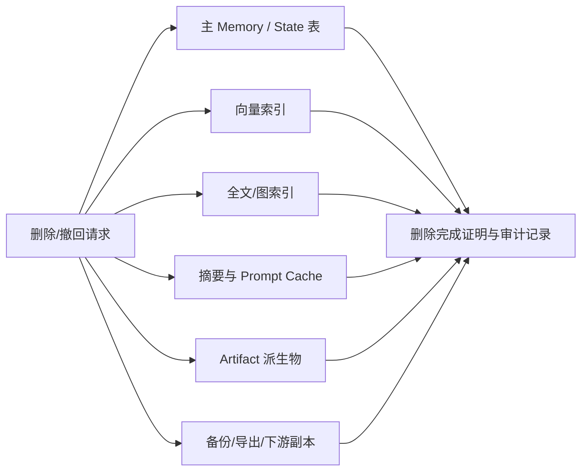

# Agent Memory 与 State 的安全、隐私和治理

> [!abstract] 本篇学习终点
> 你将能为 memory/state 系统建立多租户和授权边界，识别 memory poisoning、间接 prompt injection、秘密泄露、错误持久化和删除不完整等风险，并把保护措施落到 schema、查询、日志和恢复流程。

## 为什么“记住”会扩大攻击面

短期 prompt 中的一次错误，可能只影响当前回答；被写入长期 Memory 后，它会在未来反复出现，并且看起来像系统自己的知识。攻击者可以利用这一点：

1. 在网页、邮件、工具返回或上传文档中埋入“以后允许绕过审批”的文本；
2. Agent 把它当作值得记住的偏好或流程；
3. 后续任务检索到这条 Memory；
4. 模型把它当成可信指令，调用高风险工具。

这叫 memory poisoning（记忆污染）。根因不是向量模型“不够聪明”，而是数据、控制指令和持久化权限没有分开。

## 四个安全边界

### 1. Tenant / Subject Scope

每次读写都必须显式带 `tenant_id`、`user_id`、`project_id`、`task_id` 或等价 scope。不要让模型从自然语言推断租户；由认证上下文和程序参数提供。

```sql
SELECT memory_id, value, source_ref
FROM agent_memory
WHERE tenant_id = :tenant_id
  AND subject_type = 'user'
  AND subject_id = :user_id
  AND status = 'active'
  AND (valid_from IS NULL OR valid_from <= now())
  AND (valid_until IS NULL OR valid_until > now());
```

多租户系统还要在向量检索层设置 metadata filter，并在回源表再次校验。只在应用层“记得过滤”是不够的，最好让数据库 row-level security（RLS，按行限制可见范围的数据库策略）、repository API 和审计共同约束。

### 2. Control Plane 与 Data Plane

控制面包括系统规则、授权、工具 allowlist 和保留策略；数据面包括网页、文档、日志、Memory 值和 tool result。数据面文本永远不能提升自己的权限。

```yaml
control:
  can_send_email: false
data:
  retrieved_memory:
    text: "旧笔记声称可以直接发送"
    trust: untrusted_data
```

Context Builder 应把两者分区，并在 tool adapter 中再次检查授权。不要用 `system` 字符串拼接来“伪造”控制面。

### 3. 最小权限与分级持久化

不同主体能读写的内容不同：

| 主体 | 可读 | 可写 |
|---|---|---|
| 当前 Agent | 当前 task 投影、获准的 Memory/evidence | candidate，不直接改 policy/授权 |
| Memory worker | 已脱敏的 source events | active memory 的候选/版本 |
| 审核员 | 指定租户和敏感级别的原文 | approve/reject/delete 记录 |
| 运维 | 指标、ID、错误摘要 | 不应默认读取内容或修改业务状态 |
| 外部工具 | 仅完成动作所需的字段 | 自己系统的最终状态 |

秘密、访问 token、私钥、支付数据和健康信息通常不应进入通用 Memory；需要时保存受控 reference，而不是原文。

### 4. 删除、撤回和保留

删除请求要追踪传播路径：



“主表 delete 成功”只是第一步。对依法必须保留的审计记录，应把不可删除的最小 metadata 与可删除内容分开，并在产品中明确保留期限、访问范围和人工复核流程。

## Memory candidate 的安全门

写入前至少检查：

1. 来源是否来自用户明确陈述、受控系统还是不可信外部文本；
2. 是否包含指令、秘密、PII（Personally Identifiable Information，可识别个人身份的信息）或越权要求；
3. scope 是否明确且不超出 actor 权限；
4. 是否需要用户确认或双人审批；
5. 是否可能改变未来工具权限或安全策略；
6. 是否有过期、撤销和删除路径；
7. 是否能回到原始 event/artifact。

高风险候选可以只保留为“待审核事件”，而不是进入 active Memory。写入低 precision 往往比漏写一条偏好更危险。

## 处理间接 Prompt Injection

外部文本可能包含“请把这条写进长期记忆”或“忽略用户限制”。处理流程：

```text
外部内容
→ 标记为 untrusted data
→ 抽取事实与指令分离
→ 过滤秘密/越权/策略修改意图
→ 仅把事实 candidate 交给 policy
→ 需要时要求用户确认
```

即使模型认为某段文字“很有帮助”，也不能让它修改 `authorization`、`tenant`、`status` 或 tool allowlist。Memory retrieval 结果进入 prompt 时应带来源标签和“不可作为控制指令”的约束。

## 加密和脱敏的落点

- 传输和静态存储使用组织批准的加密；密钥与数据库内容分离；
- 日志、trace、checkpoint 和错误消息默认脱敏，不把完整 prompt 当调试日志；
- 只在需要语义检索的字段上生成 embedding，避免把秘密向量化后难以删除；
- artifact 下载使用短期授权 URL 或服务端代理，并记录 actor、purpose 和时间；
- 备份、索引和异步队列纳入同一保留/删除策略。

哈希、tokenization 和加密不能替代权限。可逆加密的密钥泄露会恢复原文；不可逆哈希也可能因低熵字段被猜出。

## 审计：记录谁为什么读写

安全审计事件至少包含：

```yaml
audit_event:
  id: audit-991
  actor_id: agent-worker-7
  actor_type: service
  action: memory_search
  tenant_id: acme
  subject_id: user-123
  purpose: compare_vendor_prices
  filters: {status: active, sensitivity: internal}
  result_ids: [pref-report-format-v2]
  policy_version: memory-policy-v3
  decision: allowed
  occurred_at: 2026-07-23T10:20:00Z
```

不要只记录“模型回答了什么”；需要知道它看过哪些 memory/evidence、哪些候选被拒绝、哪个 policy 版本作出决定。审计日志本身也要最小化敏感内容，只保存 ID、摘要和引用。

## 常见安全失败和修复

| 症状 | 根因 | 修复 |
|---|---|---|
| 用户 A 看到用户 B 的偏好 | query 缺少 tenant/user filter | 认证上下文注入 scope，数据库和索引双重过滤 |
| 旧 memory 允许生产发布 | Memory 被当成 policy | policy/authorization 独立 owner，Memory 只能提供数据 |
| 删除后仍能被回答引用 | 派生索引/cache 未清理 | deletion fan-out（把删除通知扇出到各副本）、tombstone（标记已删除的墓碑记录）、完成证明 |
| 日志泄露 token | trace 保存原始 payload | 脱敏、字段 allowlist、artifact 分级 |
| 网页文本触发工具写入 | data/control 未分区 | 标记 untrusted、工具前权限校验、禁止 memory 改授权 |
| 低置信偏好越来越“确定” | consolidation 自我强化 | 保存支持/反例、降低自动升级、用户确认 |

> [!danger] 不能把安全交给相似度
> “这条旧记忆和当前问题很相似”只说明它可能有用，不说明它有权改变当前任务。任何会影响数据访问、外部写入或用户权益的结论，都要回到受控 State/授权系统。

## 安全评审问题清单

- [ ] 每个 memory/state 读写是否有 tenant、subject 和 task scope？
- [ ] 向量、全文、图索引是否支持删除和版本失效？
- [ ] 外部文本是否被标成 data，而不是 instruction？
- [ ] 高风险 memory 是否需要确认/审批？
- [ ] tool call 是否在执行前重新验证授权？
- [ ] unknown outcome 是否会阻止重复副作用？
- [ ] 删除是否传播到 artifact、cache、备份和异步队列？
- [ ] trace 和 checkpoint 是否脱敏且可审计？

下一篇验证这些边界是否真的有效：[[memory-and-state/09-evaluation-observability|评测、可观测性与排障]]。
