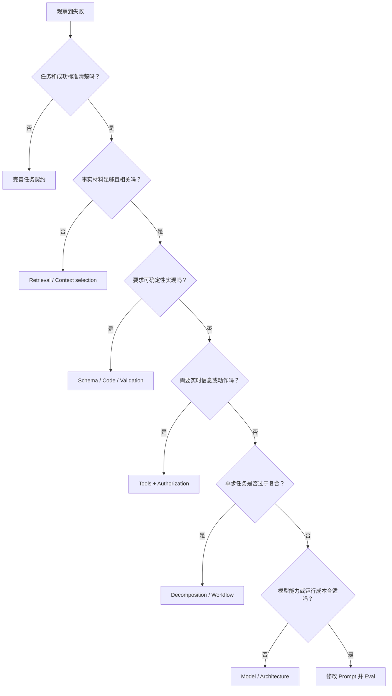

# 选择正确的工程杠杆

> [!important] 一句话核心
> 只有失败确实受 prompt 控制时才改 prompt；缺事实、缺能力、缺确定性或缺运行机制的问题，应交给对应系统层。

## 为什么先诊断失败层

很多“prompt 不好用”其实不是表达问题：

- 模型没有完成任务所需的事实。
- 输入材料太多、重复或相互冲突。
- 系统要求严格字段，却没有 schema 校验。
- 任务需要计算、实时数据或外部动作，却没有工具。
- 多轮执行丢失状态或授权范围。
- 模型能力、成本或延迟与任务不匹配。

继续扩写 prompt 只会隐藏根因，使系统更脆弱。

## 决策路径

## 八个失败层

### 1. 契约层

**症状**：不同人对“正确结果”理解不同；规则冲突；缺少未知值行为。

**机制**：先完善 [[01-task-contract|任务契约]]。

**不要做**：在不清楚目标时追加更多角色、语气和示例。

### 2. Prompt 层

**症状**：动作含糊、术语未定义、输入边界不清、输出语义缺失。

**机制**：修改具体指令、材料边界、示例或未知值规则，保持 [[02-minimum-effective-prompt|最小干预]]。

**完成判断**：改动能对应一个可复现失败，并通过同条件 eval。

### 3. Context / Retrieval 层

**症状**：无依据断言、遗漏关键材料、被大量无关内容干扰、来源无法追溯。

**机制**：检索、筛选、去重、保留来源和冲突证据。材料不足时返回缺失信息。

**不要做**：只添加“不要幻觉”“仔细阅读所有内容”。

详见 [[10-context-and-instruction-architecture|上下文与指令架构]]。

### 4. Schema / Code 层

**症状**：JSON 解析失败、字段遗漏、枚举越界、精确计数或排序错误。

**机制**：原生 Structured Outputs、JSON Schema、类型模型、解析器和确定性后处理。

**不要做**：用更多自然语言模拟程序保证。

详见 [[11-structured-output-and-determinism|结构化输出与确定性保证]]。

### 5. Tool 层

**症状**：实时数据过期、算术错误、声称执行但没有外部结果、工具参数缺失。

**机制**：提供边界清晰的 tool，定义何时必须调用、参数来源、授权、失败和停止条件。

详见 [[12-tools-state-and-authorization|工具、状态与授权边界]]。

### 6. State / Workflow 层

**症状**：长任务重复步骤、忘记决策、上下文压缩后无法恢复、单步 prompt 漏掉复合流程。

**机制**：持久化最小任务状态；必要时使用 routing、chaining 或并行汇总。

详见 [[13-decomposition-and-agent-workflows|任务拆解与 Agent 工作流]]。

### 7. Model / Runtime 层

**症状**：能力不足、延迟或成本过高、模型版本升级后回归、模型专属提示失效。

**机制**：比较模型、固定版本和运行参数，使用 eval 验证迁移。

**不要做**：用更长 prompt 掩盖模型与任务不匹配。

### 8. Evaluation 层

**症状**：团队只凭几个演示样例争论；每次同时修改模型、prompt 和参数；无法复现结果。

**机制**：固定测试集和运行条件，保存 baseline，每轮只改变一个主要变量。

详见 [[14-evaluation-and-iteration|Prompt 评估与迭代]]。

## 诊断已有 Prompt

最小诊断材料包括：

- 当前完整 prompt 与消息角色。
- 目标模型、API、tools 和 schema。
- 代表性输入。
- 实际错误输出与期望差异。
- 失败出现的条件、频率和影响。
- 当前运行参数与相关上下文。

没有失败样例时，只能提出假设，不能声称某种改写会改善质量。

## 示例：发票抽取失败

假设系统出现四类错误：

1. `currency` 经常缺失。
2. 总金额计算错误。
3. 输出偶尔不是合法 JSON。
4. 图片模糊时模型编造数字。

对应处理分别是：

| 失败 | 正确杠杆 |
|---|---|
| 字段缺失 | Schema 必填项 + 明确未知值 |
| 总金额计算 | 代码计算与校验 |
| JSON 非法 | Structured Outputs / 解析失败路径 |
| 模糊内容猜测 | Prompt 中的证据边界 + `unknown` + 人工复核 |

这不是“写一个更强的发票 prompt”可以统一解决的问题。

## 诊断检查表

- [ ] 失败可以用样例复现。
- [ ] 已区分语义错误、事实缺失、结构错误和运行错误。
- [ ] 解决机制直接作用于根因。
- [ ] 没有用 prompt 承担确定性程序职责。
- [ ] 没有用更换模型回避未定义的任务契约。
- [ ] 改动范围足够小，可以通过 eval 归因。
- [ ] 失败恢复和停止条件已定义。

## 常见误区

> [!warning] “Prompt engineering”不等于“所有问题都改 prompt”
> 成熟的提示词工程首先会把问题移出 prompt：事实交给 retrieval，确定性交给程序，动作交给 tool，长期状态交给存储，质量判断交给 eval。

- **把 schema 通过率当成事实正确率**：结构正确与内容正确是两个指标。
- **把 tool 返回值当成可信指令**：tool 结果仍是需要验证的输入。
- **一次修改多个层**：无法确定效果来自 prompt、模型还是参数。
- **看到长任务就 chaining**：拆分会增加接口和失败点，只有单步不可靠时才值得。

## 相关笔记

- [[00-overview|提示词工程总览]]
- [[01-task-contract|任务契约]]
- [[02-minimum-effective-prompt|最小有效 Prompt]]
- [[11-structured-output-and-determinism|结构化输出与确定性保证]]
- [[14-evaluation-and-iteration|Prompt 评估与迭代]]

