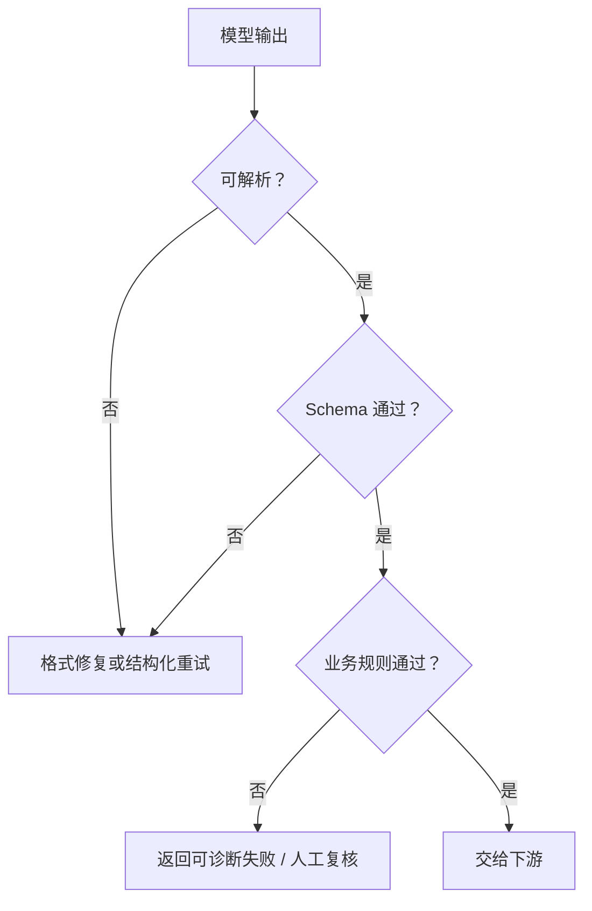

# 结构化输出与确定性保证

> [!important] 一句话核心
> 模型负责理解和语义判断，schema 与代码负责类型、解析和确定性规则；“请输出 JSON”不能替代接口保证。

## 三层正确性

结构化 LLM 输出至少包含三种独立质量：

1. **语法正确**：结果能够被解析。
2. **结构正确**：字段、类型、枚举和必填项符合 schema。
3. **语义正确**：字段值与输入和业务定义一致。

Schema 可以显著改善前两层，但不能自动保证第三层。语义仍需任务规则、证据和 eval。

## 机制选择顺序

需要程序消费结果时，依次选择：

1. API 原生 Structured Outputs 或 JSON Schema。
2. 官方 SDK 支持的类型模型。
3. 只有前两者不可用时，才在 prompt 中完整声明字段和格式，并在程序侧解析与校验。

不要把 JSON mode 与完整 schema 保证混为一谈；具体能力以当前供应商文档为准，见 [[99-provider-guidance-and-sources|官方指南]]。

## 设计输出契约

### 结构层

定义：

- 字段和嵌套关系。
- 类型与必填项。
- 枚举和允许值。
- 空值策略。
- 是否允许额外字段。

### 语义层

定义：

- 每个字段代表什么。
- 判断边界和优先级。
- 事实从哪里获得。
- 信息不足时返回什么。
- 多个来源冲突时怎么办。

Prompt 主要负责语义层；schema 主要负责结构层。两者必须一致。

## 未知值是接口设计问题

如果字段必填但任务禁止猜测，需要事先选择一种表示：

- `null`
- 明确枚举，如 `unknown` 或 `needs_review`
- 独立状态字段
- `missing_information` 列表
- 直接返回结构化错误

> [!warning] 不要发明隐藏默认值
> Schema 不允许空值、业务又禁止猜测时，契约本身存在冲突。应修改 schema 或业务策略，而不是让模型“尽力填写”。

## 确定性后处理

适合交给程序的工作：

- 解析与 schema 校验。
- 排序、去重、精确计数。
- 日期、金额和单位规范化。
- 跨字段一致性检查。
- 业务规则和权限校验。
- 安全删除允许移除的包装文本或空白。

后处理不得在没有证据的情况下更改事实语义。例如，可以把 `USD 1,200.00` 规范化为结构化金额，但不能猜测缺失币种。

## 失败恢复



格式修复只应修复格式。如果原始内容语义不确定，不要让“修复器”重新生成一套看似合法的事实。

## 示例：分类接口

```json
{
  "category": "billing | technical | cancellation | needs_review",
  "confidence": 0.0,
  "evidence": ["input span"],
  "missing_information": []
}
```

这份示意还不够成为真实 schema，但它表达了四类职责：

- `category`：业务枚举。
- `confidence`：模型判断结果，不应被当作经过校准的概率，除非另有验证。
- `evidence`：语义可追溯性。
- `missing_information`：未知值路径。

下游程序还应校验枚举、字段类型和允许范围，并决定 `needs_review` 是否进入人工队列。

## Structured Outputs 与 Tool Calling

两者都使用 schema，但目的不同：

- Structured Outputs 约束模型返回给应用的数据形状。
- Tool calling 让模型提出调用某个外部能力及其参数。

Tool 参数通过 schema 不代表动作已经授权或执行成功。执行前仍需业务校验、权限判断，执行后仍需检查真实结果。详见 [[12-tools-state-and-authorization|工具、状态与授权边界]]。

## 评估指标

至少分开测量：

- 解析成功率。
- Schema 通过率。
- 字段完整率。
- 字段级语义准确率。
- 未知值处理正确率。
- 业务规则通过率。
- 修复或重试率。

只报告“JSON 成功率”会掩盖语义错误。详见 [[14-evaluation-and-iteration|Prompt 评估与迭代]]。

## 常见误区

- **只说“返回合法 JSON”**：缺少程序级约束和失败路径。
- **在 prompt 中重复完整 schema**：造成双重来源和版本漂移；只保留模型需要理解的字段语义。
- **用重试掩盖契约冲突**：同一冲突 prompt 重跑不会稳定解决问题。
- **结构通过即自动执行**：高风险动作还需授权与业务校验。
- **后处理改写事实**：把确定性转换变成了第二次生成。

## 检查表

- [ ] 语法、结构和语义正确性分别定义。
- [ ] 优先使用 API 原生 schema 能力。
- [ ] 字段语义、未知值和冲突行为明确。
- [ ] Schema 与 prompt 没有相互矛盾。
- [ ] 确定性规则由代码执行。
- [ ] 格式修复不会改变事实。
- [ ] Tool 参数在执行前进行授权和业务校验。
- [ ] 解析、结构和语义指标分开评估。

## 相关笔记

- [[01-task-contract|任务契约]]
- [[03-choose-the-right-lever|选择正确的工程杠杆]]
- [[12-tools-state-and-authorization|工具、状态与授权边界]]
- [[14-evaluation-and-iteration|Prompt 评估与迭代]]

